> **-e*I*34- (Vol. 6 No. 5) October 2007, is published and © 2007 by Earl Kemp. All rights reserved. It is produced and distributed bi-monthly through [efanzines.com](https://efanzines.com/) by Bill Burns in an e-edition only.**

**“Take the Elevator,”** by Steve Stiles

## Contents – *eI34 – October* 2007

**Cover: “Take the Elevator,”** by Steve Stiles

**[…Return to sender, address unknown….24 [*eI* letter column]](#return)**, by  Earl Kemp

[**Can You Turn It Down Please?**](#down), by Graham Charnock

[**Nelson Bond: “Payment in Fee Simple,”**](#bond) by Curt Phillips

[**Psychic Block**](#block), by Marion Zimmer Bradley

[**Introduction to Interview: Algis Budrys**](#intro), by Earl Kemp

[**Interview: Algis Budrys**](#budrys), by Mark Berry

---

> True terror is to wake up one morning and discover your high school class is running the country.  

 --Kurt Vonnegut

---

**THIS ISSUE OF** *eI* is in memory of Peggy Crawford, Les Flood, Joe L. Hensley, and Madeleine L’Engle.

---

**What’s New…?** There are two things that I need to call your attention to with this issue of *eI,* both of them are very new and both of them, somehow, involve me.

The first is *Everything You Know About God Is Wrong*. A fat  new anthology edited by Russ Kick and published by The Disinformation Company  Ltd. My contribution to the collection is “Jungle Drums For the Evil I,” all  about my experiences in Rio with Macumba, or Black Catholicism. It is available  from [www.disinfo.com](http://www.disinfo.com/).

It is a second volume in Kick’s megabook series following *Everything  You Know About Sex Is Wrong*, where I was also featured.

The second thing is to announce that Alexei Panshin and Josh  Wachtel have produced another excellent album for Radio Free Earth called *Available  Light*. There are sixteen wonderful audience-pleasing tunes on this CD and  it is highly recommended. It is available from [www.radiofreeearth.com](http://www.radiofreeearth.com/) so go get  it!  

 --Earl Kemp

---

As always, everything in this issue of *eI* beneath my byline  is part of my in-progress rough-draft memoirs. As such, I would appreciate any  corrections, revisions, extensions, anecdotes, photographs, jpegs, or what have  you sent to me at [earlkemp@citlink.net](mailto:earlkemp@citlink.net) and thank you in advance for all your help.

Bill Burns is *jefe* around here. If it wasn’t for him,  nothing would get done. He inspires activity. He deserves some really great  rewards. It is a privilege and a pleasure to have him working with me to make *eI* whatever it is.

Other than Bill Burns, Dave Locke, and Robert Lichtman, these are  the people who made this issue of *eI* possible: Mark Berry, Marion Zimmer  Bradley, Ajay Budrys, Graham Charnock, Richard E. Geis, Ed Gorman, Jim Linwood,  Joseph T. Major, Michael Moorcock, Alexei Panshin, and Curt Phillips.

**ARTWORK:**This  issue of *eI* features artwork by   Steve Stiles, and recycled artwork by Harry Bell and William Rotsler.

---

> When writers crack up, when they really end up in the nut house, is when they can't do it any more.
 
 

 --Kurt Vonnegut

---

## …Return to sender, address unknown…. 24 {#return}

By Earl Kemp

We get letters. Some parts of  some of them are printable. Your letter of comment is most wanted via email to [earlkemp@citlink.net](mailto:earlkemp@citlink.net) or by snail mail to  P.O. Box 6642, Kingman, AZ 86402-6642 and thank you.

Also, please note, I observe  DNQs and make arbitrary and capricious deletions from these letters in order to  remain on topic.

This is the  official Letter Column of *eI,* and following are a few quotes from a few  of those letters concerning the last issue of *eI.* All this in an effort  to get you to write letters of comment to *eI*so you can look for them  when they appear here.

**Thursday August  2, 2007:**

Very sly of you  to switch the captions on the pictures of Bob Bloch and Walter Matthau,  but not much of a service to 21st-century fans who barely know who Bloch was,  let alone what he looked like.   You are a guardian of our history,  you know -- a true timebinder.  You ought not to be capricious with it.

--Robert Silverberg

**Friday August 3,  2007:**

[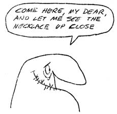](https://efanzines.com/EK/eI34/Rotsler1.jpg)

Thanks for your response, and for "capturing many of  Bob's writings for posterity".  I'm happy to share that No. 1 fan  spot with you.

I'm sorry to say that I don't specifically remember you from  my childhood, but there were many people who visited when I was young, and my  Dad was delighted to spend time with fans, most of whom became friends, and I'm  sure you are among them.

I did, indeed, click on the *eI* links and enjoyed them  immensely and shall print out hard copies for my own enjoyment.

Thank you so much for thinking of me.  I miss my Dad  daily; he was a wonderful father, a wonderful person, and more than a parent, a  friend to me, as well.

--Sally Bloch Francy

**Sunday August 12, 2007:**

All this entertaining pique about Shasta reminds me of one of the minor--perhaps I should say infinitesimal--mysteries of '50s SF that has tugged at my consciousness in idle moments for the past several decades.  How is it that Raymond F. Jones' *This Island Earth* turned into a widely distributed and reasonably well-received motion picture, never had a paperback edition back then?  (First pb was only a few years ago, from Forrest J Ackerman.)  You'd think that somebody would have rushed to cash in with a movie tie-in edition.  Was Shasta asleep at the switch?  Or did they have no stake in the rights at that point and just didn't care?  (In which case Jones and/or his agent must have been asleep.)

--John Boston

[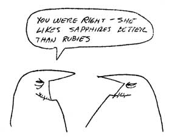](https://efanzines.com/EK/eI34/Rotsler2.jpg)

**Monday August 13, 2007:**

It's an interesting question, and my guess is that the whole market for movie tie-in books hadn't really developed back then, other than maybe for really major Hollywood movies, which sf/horror films weren't back then (how times change).
  
 To take an example, I never knew until the *SF Encyclopedia* was being compiled in 1977 that *Destination Moon*was allegedly somewhat based on *Rocketship Galileo*…maybe not very closely based, but at least as closely based as the Bourne movies are based on the Robert Ludlum novels (to take a contemporary example).
  
 Nor am I aware of contemporary tie-in paperbacks of, for example, *The Shrinking Man*or *Invasion of the bodysnatchers.*It was obvious, of course, that Penguin's editions of the *Quatermass*scripts were based on the TV series/movies, but I don't remember anything on the covers to illustrate the fact.  Maybe *2001*was the first genuine major sf tie-in (in terms of sales numbers), but even with *2001* or *Fantastic Voyage* it was more a question of creating a novel which would in some way validate the movie, and if *2001* had been published by Gollancz as originally intended it would have had a nice plain yellow jacket (I used to have a copy of this, as it had been proofed up before the publication plan went belly-up; I think George Locke has it now).
  
 And as for lesser, or lower-budget movies, well, you'll remember the Vargo Statten *Creature From the Black Lagoon,* or the appearance of *20 Million Miles to Earth* as a one-off digest magazine companion to *Amazing Stories*.

--Malcolm Edwards
  
 #

*eI* turns thirty-three, much like I will in a couple  of months. I’m not having a party until I turn 33-1/3, since that’s a much  cooler age.

Again we  open with the man Steve Stiles and a wonderful cartoon. I’ve been enjoying his  stuff of late. Someday he’ll win that Best Fan Artist Hugo, there’s no  question. When? No idea, but it’ll happen.

I have  some friends who love Victor Banis’ stuff who will be getting *Longhorns* as a very nice birthday gift soon. I let them borrow *Spine Intact, Some Creases* and they loved it. I’ve already let her know so she can buy it herself. I’ve  already gotten her a present! 

 Charles  Nuetzel’s story of his Dad was good readin’ indeed. There aren’t a lot of  photos of the old painted posters that he mentioned his Dad doing. I know there  are a few, and the technique of painting posters for each theatre is still done  in many of the Mexican theatres both in Mexico and the US. I wish I’d know  because when I was going through old stuff from the Fox theatre in San Jose (now  called the California) I know there were a bunch of old hand-painted ones from  the late 1930s and early 40s before the standard printed ones became popular. I  bet I’ve seen those California Missions pamphlets that Charles’ Dad did art  for. You see them all the time at Antique Dealers and Flea Markets. They go for  a decent price. It does seem odd to have a father who would push singing as the  fall-back position. Ray Bradbury is a guy who changes people’s lives regularly,  from what I understand. A guy I ran into while picking up a robot for the  museum once told me the story of how Ray managed to turn him on to the writing  of a fellow named Asimov and that led the guy to reading every Asimov book he  could get, becoming interested in robotics and eventually founding a company.  Ray never knew anything about it, from what I understand, but it was all his  doing. I should probably buy *Pocketbook Writer* when money is back into  the flow of things.

[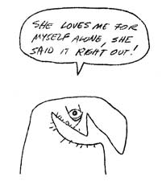](https://efanzines.com/EK/eI34/Rotsler3.jpg)

I swear  I’ve read that Bloch piece somewhere before. But I’m fairly certain that *Ciln* was never in my Dad’s collection. It’s funny that Bloch’s best point is the one  about older recruits to fandom. The strange thing is we’re seeing it change and  now it’s almost all older recruits to SF fandom unless they’re 2nd  (or sometimes 3rd) generation fans. I came back in 2000 and I  immediately recognized that I wasn’t a kid anymore, that there were things I  could do in fandom now that I hadn’t been able to afford when I was younger.  But I still remembered what it was like to be 15 and loafing in the halls with  my miscreant friends (with whom I still sometimes loaf in the halls with at  present-day cons) and I try and be good to those kids. Show ‘em a little  respect. You gotta keep these kids thinkin’ straight. I totally agree with  Bloch’s main point: that you should come to fandom looking for nice people and  a good time and everything you put in you get back. Fandom’s been very very  good to me and I try to give back as much as I can.

The Bob  Toomey article had me until the part where he claimed that Sid Coleman walked  out of the fight scene in *Hard Boiled*. That’s just too unbelievable.  There’s no way that ever could have happened. Keep tryin’ Bob! You’ll never  fool me! I do have to say that Sid can pull off a white suit, though.

You  mention *This Island Earth*. I know there are purists who will say  otherwise, but the only good thing about *This Island Earth* was the MST3K  version of the film. It was truly awful. The first time I saw it was the  regular film and to this day I have no idea what was going on. I read the Jones  book a few years ago and it’s decent. Not great, but good enough. 

 The  Shasta stuff is just great. I’d heard that Farmer story once or twice  (including hearing Phil tell it on tape from 1968) but I had no connection to  the fact that it was Shasta that had been the group that scrod him. I really  wanna find a copy of *Slaves of Sleep* now. I’d never seen that cover  before and it’s just amazing! I’ve read maybe half a dozen of the books on the  list. Good stuff one and all. 

 A great  issue as always.

--Chris  Garcia

**Sunday August 19, 2007:**

Good issue, especially the Shasta coverage, which cast me back  into the teenage years, when I longed to fondle the hardcovers and could even  find some in libraries. I showed my moral stature by not stealing them. Yet  those legends, Korshak etc, linger in memory. So I moved on to fondling girls.

[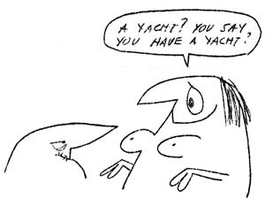](https://efanzines.com/EK/eI34/Rotsler4.jpg)

Toomey on Coleman is insightful. "A fellow of infinite jest, of  course," puts it well. The Hobbes quote is ’Nasty, brutish, and short,'  not 'mean' -- which makes the joke even better. The first time I heard that  kicker, "With these words, Thomas Hobbes described (a) Life and the lot of  mankind, (b) Harlan Ellison, (c) Sex with Harlan Ellison.” I like to died. 

  

 Sid has a wit comparable to Willis, but alas, wrote little. You'd do the world  a favor if you'd root out the half dozen or so review columns he wrote for *F&SF* and reprinted them. They still are the best commentary on the late 1960s &  early 70s sf field, and wittily to the point.  

  

   Looking forward to the new issue. Alas,  I'll miss you at the LA paperback day again, as I'll be diving in the  Galapagos. But! -- I'll then go to Costa Rica and see Gregg Calkins after all  these decades.

--Gregory  Benford

**Sunday August 26, 2007:**

It is time for me to tackle *eI 33*.  Wish me luck…

Straight to the lettercol. Ah,  there’s that Garcia guy again. Doesn’t he have any work to do? I like Ray  Nelson’s artwork, too and wish I could see more of it. Hey, Chris, you want to  try and get a hold of Matt Groening and see if he was indeed a fan? Would be  neat if he was, and if so might explain a lot about The Simpsons…

Greetings to John Purcell, you  unworthy newbie, you… Nope, that’s me, at 30 years in fandom this December.  Don’t hold it in, John, tell us how you really feel…  

 And, hello to Robert Lichtman…a  fanzine column in a promag would definitely be an addition, and help dispel how  some pros and readers feel about fandom. There’s got to be someone out there  who might like your column, and I’d like to see it.

We write to express ourselves, and  take part in this fanzine thing. We want to participate in a conversation,  preferably a cordial one, but we take what we get. For those of us who do,  there are varying amounts of ego, from those who enjoy the discourse of ideas  and opinions, even conflicting ones, and those who are determined to shout  others down and insult those they disagree with. We tolerate all kinds here.  Just read Robert Bloch’s essay, and fannish life will be easier for all. And,  we’re going to Las Vegas, too.

[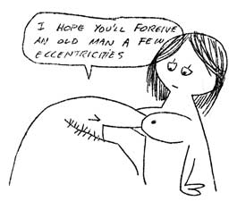](https://efanzines.com/EK/eI34/Rotsler5.jpg)

Wonderful essay of a life in SF from  Charles Nuetzel. I can even see from here those were heady days, and similarly,  I yearn for a publishing group that I can excel in. My resumes are out there.  If I could get involved they way Charles’ father was, I’d be very pleased  indeed. In Canada, there are only two specialty SF publishing houses, both are  in Alberta, and they recently merged. It looks like the management of the  national Aurora Awards will be heading out west, too, so the heart of SF in  Canada is out there, too. Won’t be the first time it’s happened, either,  because fandom is frankly failing in the east. Not enough literacy, and too  much actor worship, IMHO.

Yes, I knew Judith Merril, and she  ranted at me, and I ranted back. That’s how I got some respect out of her.  Because Judith spent her remaining days in Toronto, and because I never had the  best relation with her, I’m probably one of the few locals who wouldn’t have  much good to say about her. She’s an SF icon around here.  

 Many thanks to Terry Kemp for his  hard slogwork into research these marvelous books, and great cover scans, too.

All those pages, and this is all the  loc I can generate. Much of what’s inside is outside of my generation, but boy,  it’s great to read about it, and great to look at, and that’s the whole point.  There may never be a definitive history of science fiction as a whole, but *eI* assembled is pretty close, and thanks to you, Earl, for all of it. I look  forward to the next installment, and perhaps I’ll have more to say next time.  (Another entry for the WAHF columns, I suppose…)

--Lloyd  Penney.

**Sunday September 9, 2007:**

Since you are such a fan of Yma's [see “Secrets of the Indas,” and “Voice of the Inner World” *[eI6,](https://efanzines.com/EK/eI6/index.htm)*[January 2003](https://efanzines.com/EK/eI6/index.htm)] I just wanted to be sure to let you know that my book "Yma Sumac - The Art Behind the Legend" should be released sometime late fall or early winter by YBK publishers here in New York.  I am in the midst of final proofings now and, without knowing anything about how this kind of thing works I suspect it might be out around December or January. I am very pleased since I was able to locate some un-released photographs which I think will add a lot to the book. I will make sure I let you know when it is ready.
  
 Thanks so much for your exposure on the ezine.  I really appreciate that.

--Nick Limansky

**Sunday September 16, 2007:**

Oh,  Lordy, Earl, you always produce just a wonderful, wonderful issue every other  month. It makes me both envious and appreciative of you. And, as always, *eI* provokes some commentary.

F'rinstance,  the lengthy Charles Nuetzel excerpt was both fascinating and touching. Charles  was blessed to have a father who was a gifted artist who understood that inner  passion which drives people to excel in something. It was also kind of funny in  a sweet, fatherly way that his dad used to say, "Great! You can sing *and* write!" in a way supporting both Charles' and his own dreams of success.  This article also reminded me of how my dad supported my dream of being  a songwriter.  He was not a creative person, but he understood  this "inner passion" thing well; in fact, dad always told me that I  could do whatever I wanted if I ever really put my mind and heart into it. That  bit of advice still lurks within me. Even though I have long given up on a  career in music, this teaching career deal I now have going was another  passion: my back-up plan, you could say. Dad respected that, even though he may  have sadly wagged his head at some of my decisions along the way. Still, a guy  could not have had a better father. It certainly seems as though Charles  Nuetzel feels the same way about his dad. Again, this was a wonderful selection  to lead off your latest issue with. Great material.

I  also must thank you for reprinting that Bob Bloch article from *Ciln #5*.  This is one of the best summations of how a fan acts like a fan within certain  spheres within the group. I really love the way Bloch stated that Fandom is a  Way of Life but ignores talking about the Facts of Life. How true. When a  neofan of any age runs into that, he or she could either adapt, learn and join  the group, or - more likely - run away screaming into the night. But I tell ya,  this quote says it all:

*Fandom  is a place where I’ve met some nice people and had a lot of fun. To me, that’s  all it should be. For any little bit I’ve ever contributed, I’ve always  received at least threefold in return of pleasure and entertainment.*

[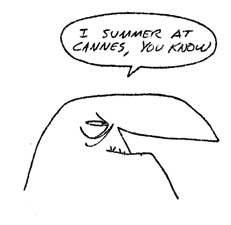](https://efanzines.com/EK/eI34/Rotsler6.jpg)

That  is so very, very true. The older I get and stay involved with this bunch of  crazy loonies in fandom, the more I enjoy it. One only gets out of life what  one puts into it, and fandom is no different.

This piece also  reminds me of the only time I met Bob Bloch: ByobCon V in Kansas City, July of  1975. The little bit that I talked with him left a life-long impression on me;  he was a genuinely nice man with that same damned eye-twinkly look of constant  amusement that I saw in Bob Tucker's eyes. Those two were quite the pair that  weekend, and ByobCon V still remains as one of my favorite conventions of all  time.

The articles by   Bob Toomey and Greg Benford were great, too. What was really neat  was the way you have these arranged. First, here's Toomey writing about Sid  Coleman. Then we have Benford writing about Toomey. Too bad there's nothing by  Coleman writing about Benford; that would have the ultimate plan. Even  so, a very nice positioning of articles, and both quite enjoyable. I have  nothing else to add here about them, but I just had to tell you that I liked  the way you set them up.

Of  course, the Anthem/Shasta books article was fantastic, and those cover scans  simply made me drool all over the computer keyboard. (Do you know how difficult  it is to wipe spittle out from in-between the keys? Damned hard, I tell you,  Earl. *Damned*hard.) The way the cover-scans gave the whole picture was  truly awesome. How I loved the work of Hannes Bok. What a talent! Many  thanks again for fascinating book natter. This is just great stuff for the  bibliophiles in all of us.

Thanks  for the zine, Earl. I may have to un-newbie you at the next Corflu. Take care.

--John Purcell

---

> Some critics take issue with me because I make my points and discuss my ideas with jokes, rather than with oceanic tragedy. -- Kurt Vonnegut, 9/18/02, McSweeney's

---

## Can You Turn It Down Please? {#down}

By Graham  Charnock

During my early  formative years as a musician there was no bigger influence than the  Bellyflops, a group Mike Moorcock put together for the 1965 sf Worldcon. I even  played with the core members of the band at an impromptu session set up by  Charles Platt at his place in Portobello Road, with Mike, Pervy Pete Taylor  (saxophone), Charles (dulcimer), and Mike Harrison. I think Lang was there too,  probably playing a swanee whistle. Should anyone doubt this I have a tape with  Mike giving a spirited rendition of ‘Be Bop a Lula’ and an improvised number by  Charles dedicated to his cat called, ‘Stop Biting All the Wires!’ Hey maybe I  was a member of the Bellyflops, after all, but they didn’t tell me at the time.

The Bellyflops in 1965 (left to right): Michael Moorcock,  Charles Platt (below), Roger Morris, Pete Taylor (with lantern), Bob Sellars,  and Langdon Jones.

The abiding  musical guru in our household when I was growing up was our lodger, called  Robert. He was a swarthy Mediterranean type who held down a job as a Chauffeur.  In his heyday he was chauffeur to the Maharani of Baroda and would frequently  park his limousine outside our end of terrace house in Alperton, which gave our  neighbours an entirely erroneous nature of our social standing, I’m sure.

Robert played the  harmonica, and I don’t mean the mouth organ, he had a Hohner 64 Chromatica  model which he wielded with the panache of Larry Adler, and which he later  bequeathed to me but which I can’t play for toffee.

He moved out, but  would come back to visit regularly and when he did my brother and I competed  for his musical attention. My brother had a Vox solid body modelled on a  Stratocaster, but considerably more clunky because it was built in the UK. He  also had an old nylon acoustic which I pinched and taught myself to play on.  One day, in the back room at 1 Eden Close, we both auditioned for Robert.

John played a  single string style Shadows instrumental piece on his Vox, whilst I had just  learnt a very rudimentary style of claw-picking. Robert proclaimed I would  always be a better musician than my brother because I took a more holistic view  of music, which I think meant that I could use more than one finger at once.  This, I think, accounted for why my brother hated me for the rest of his life,  although we have recently reached some kind of rapprochement.

Based on Robert’s  encouragement I went on to buy a Harmony Sovereign guitar, made in Sweden. It  was an acoustic model but unusually had a cambered fretboard, the like of which  were only normally found on electric models.   My mate Peter at school bought one too, and we had dreams of forming a  duo, and even recorded a few rudimentary tracks, but I fear the attraction of  girls soon superseded the attraction of the guitar in Peter’s life, so I was  forced to strum on my own for several years. After a while I thought I had  better get serious about music and bought a Gretsch acoustic at Macari’s in  Charing Court Road. I think it cost about £200. Today you could add x 10 to  that.

[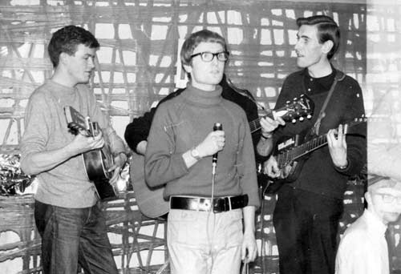](https://efanzines.com/EK/eI34/band.jpg)

This was a pretend band put together by Chris Priest for a  film class he was involved in. I am thankfully obscured behind Dicky Howett but  that is my left hand and my Harmony Sovereign. Other guitarist was a flatmate.

I went  shambolically through several jobs in my youth and ultimately ended up in the  Willesden County Court, where I met and later shagged and married a lovely lady  in hot pants (I forget her name for the moment). I also met but didn’t shag, a  bloke called Herbert North, who was a tall, gangly geek type with horn-rimmed  glasses. It didn’t take long to figure out the horn rimmed connection – he was  the world’s number one Hank Marvin Fan. Furthermore he had every guitar that  Hank had ever played, from a Baldwin Burns Bison to Fender Strats, and could  obviously play them, because he performed in a jobbing dance band playing  around West London.

Pat and I went to a few gigs and they were an  entertaining band, although without any presumptions or aspirations about their  talent whatsoever

Then the rhythm  guitarist, Dave Winkworth, left the band, and Bert, because he knew I had a  guitar and could play it, asked me to join the band. I wasn’t likely to say no,  so the first thing I did was equip myself properly and buy a Telecaster and a  Vox AC 30 amp. Thus equipped I jumped head first into a regime of rehearsal,  working up to our first gig together.

Bert’s father  worked at the Fuller’s Brewery in Chiswick, and the family had a sort of grubby  bonded flat attached to the factory. We would practice in the kitchen, which  smelt of gas and greens. His mother and father were at the end of their  viability both as workers (his father spent most of his time with a gouty leg  propped up on the table) and useful members of society, but were affable if  terminally diseased folk. Bert was a well-paid employee at the County Court,  and I think most of his income went into supporting them in the squalor they  had come to love. Bert also had an ‘N’ model railway layout in the living room  they all shared and probably slept in. Yes, he was that kind of Bert.

The drummer at  this time was John Gillespie, who worked for a car dealership, and the Bass  player was Bob Edwards, who, you guessed it, was also employed in the brewery,  in the accounts department.

After a few  desultory rehearsals I had learnt enough numbers to gig out with them. The  repertoire relied heavily on Shadows numbers, and standard dance numbers, in  4/4, ¾ and Latin American  formats,  samba, cha cha, etc. None of it was very taxing and most of it went down well  with the social-club type audience we were playing to who just wanted a  soundtrack to dance to. Of course we would throw in novelty numbers. And  because the others were retiring violets it largely fell to me to engage the  punters in patter and announcements, as well as spot-prize numbers, where we  would stop the action and give prizes to the first person up to the mike who  had plastic teeth (a comb), a moustache, or an endorsement on his driving  license, etc, etc. If nothing else it gave me an ability to unselfconsciously  hold a microphone and natter inconsequentially to an audience.

Occasionally I  would get pissed off with this role and go all surrealist and existential,  gabbling and asking meaningless questions and making meaningless announcements  all to the bafflement of the band as well as the audience. The audience  probably thought I was drunk, but the band realized I wasn’t and were thus far  more worried.

Bert was the main  vocalist who sang in a not unattractive Cliff Richard style (obviously) and Bob  did effective harmonies on some numbers. I was allowed a few vocals, notably  ‘Johnny B. Goode’ and the whistling solo in ‘Singing the Blues.’ Once Bert had  a throat infection and couldn’t sing, so Bob handled most of the vocals, but I  remember I essayed a try on a Four Seasons number. Afterward a woman waddled up  out of the audience and said: ‘You’re a lovely bloke, but you can’t sing for  crap.’ I couldn’t argue with her.

Pat and I were  living in Acton at this time, not too far removed from the West London circuit  we were playing and I went on doing it far longer than I should have.  Originally Bert would drive me and my gear to gigs (I remember horrendous  drives in fog down on motorways to Guildford) but eventually I got my own  transport and became independent in this respect. Meant I couldn’t drink at  gigs but this never bothered me. The music was drug enough, bland as it was.

[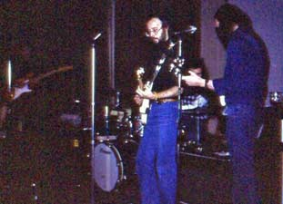](https://efanzines.com/EK/eI34/GrahamCharnock&TheBurlingtons.jpg)

Graham Charnock and the Burlingtons. Photo courtesy Jim  Linwood Collection

At this remove of time the gigs all blur together although my appoint diaries  at the time show we were playing at least once or twice a week for about five  years. Venues ranged from pubs and halls and scout huts (yes) hired for private  parties, to Social and ‘Working Mens’ clubs, and ex-servicemen’s clubs. As I  say few specific gigs stick in the mind except for one where the organizer had  failed to advertise and sell any tickets, and only two people turned up, namely  the organizer and his wife. We doggedly went into our act, treating it as a  rehearsal, but when it because obvious no one else was going to turn up, the  organizer paid us off and let us go. But most of the time we had good and  enthusiastic audiences, the only on-going drawback being the frequency with  which we were CYTED (Can You Turn It Down) for being too loud. Some clubs even  had sound-level monitors in the form of a traffic light type indicator which  would flash at you if the decibels were raised above the sound of a pin  dropping, and even automatically cut off the power if you persisted is such  wilfully anti-social behaviour. Needless to say heavy metal axe solos were not  our forte under these conditions.

For the rest of  the group the money was an important supplement to their incomes, but it was  never important to me, not that I earned a lot, and certainly not as much as  Bert who was working his way up through the echelons of the Civil Service at  this time, but I had dreams we could improve our performance and actually  produce something musically more original and worthwhile, but it took me long  decades to realize I was sailing against the wind in this respect.

When I fell in  with Moorcock and did *New Worlds Fair*, I was still playing with the  Burlingtons and invited Bert to the Pye recording studios to overdub some  guitar solos on my songs, because I did believe he had a good sub-Marvin  melodic style which would suit my songs. It was an embarrassing experience.  Most of our time was spent sitting around the studio smoking dope rather than  recording, and Bert obviously disapproved, and rapidly grew tired of waving away  offered spliffs. When he was called upon to perform he didn’t pull any sparks  out of the bag as I thought he might have. I think he was intimidated by the  whole affair. And in the end his contributions were cut from the final mix by  Steve Gilmore, without any consultation with me.

At about the same  time Mike started hanging out with neighbours Hawkwind who lived in the  Rachmanite tenements of Notting Hill at that time. At first we formed a sort of  fan posse following them about to local gigs. One time, because I wore a black  vinyl jacket and was uncharacteristically skinny, Mike mischievously introduced  me to them as Nick Kent, an influential and charismatic NME journalist as the  time. This was when we were travelling with them to one of their own gigs in  Kings Cross…on the tube train. Unfortunately I failed to capitalize on the  experience by scoring dope or groupies or anything at all really. Later Mike  would parlay his acquaintance up to the point where he was performing with them  on a ad hoc basis as ranter, whilst Robert Calvert was otherwise indisposed.  And that was what eventually led, through Doug Smith, their manager, to the *New  Worlds Fair* album.

[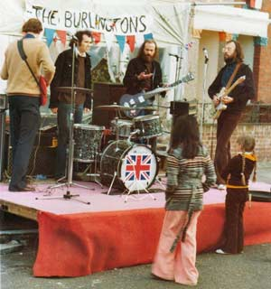](https://efanzines.com/EK/eI34/streetparty2.jpg)

This is a street party for the Queen's silver anniversary.

Meanwhile back in  the real world I was about to join a real band that actually played live,  although not very well.

The Burlingtons  with Bert did a couple of conventions, but after a while Bert, whose parents  had now died, found true love and sex and got married and decided to hang up  his guitars and his Hank Marvin spectacles.

The rest of us  formed a group called Eric and the Maggots, after enlisting a very talented  guitarist/singer called Brian Reeves, who was more of an Eric Clapton than a  Hank Marvin. We did a convention under that name as well, I believe. By this  time Bob Edwards’ brother Mike had replaced John Gillespie who had terminally  retired after having had his drum kit stolen when he parked his car outside a  QPR match. Eric was a much tighter and more inspirational band and more eclectic  in its material, but it only lasted a year, before Brian went off to try and  earn some real money in the real world. One notable gig was when we played an  ex-serviceman’s club (picture of the Queen on the wall, and all) and Brian  invited a Pakistani friend of his to come along as a guest. The coolness which  greeted us as we walked through the door was palpable. Talk about black man at  the Hammersmith Palais.

After the Maggots  broke up, Bob and Mike Edwards reformed and joined forces with a rival local  group called Quadrant, and last year Bob Edwards phoned me with an invitation  for their 30th Anniversary gig (stretching it across a group or two)  in Guildford. I was enthusiastic on the phone, especially when I learnt Bert  would be invited to play along, but less than enthusiastic when I realized I  myself wasn’t being invited to play along. Furthermore Bob warned me not to  mention his brother Mike, the Maggots’ drummer, who had died in the interim,  apparently of a heart attack, although I suspected, knowing him, a large amount  of alcohol had also been involved. So I didn’t go. Thomas Wolfe was right, You  Can Never Go Home.

Twang Twang.

[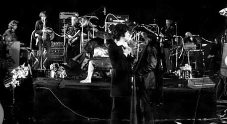](https://efanzines.com/EK/eI34/final_programme.jpg)

---

> Did you ever admire an empty-headed writer for his or her mastery of the language?  No.
 --Kurt Vonnegut, *Palm Sunday*, essay on 'style'

---

## Nelson Bond: “Payment in Fee Simple”* {#bond}

By Curt Phillips

He hated being called a science fiction  writer. "If I need such a label," he would say, "the only  accurate one would be that I am a fantasy writer." And by fantasy he meant  the genteel comedies of style and manners such as those written by Donne Byrne  (*Msser. Marco Polo* was his favorite) or James Branch Cabell, a fellow  Virginian whose work provided a lifetime of study and enjoyment. He wrote for  the stage, the screen, and the airwaves; for books and magazines both pulp and  slick.  He was a writer that other writers spoke of in tones of  admiration, envy, and respect.  And until he was invited to be a guest of  honor at a certain Pulpcon years ago, he was convinced that he’d been all but  forgotten by his readers.  Let me tell you a little something about a fine  writer and a friend of mine; Nelson Bond.

I met Nelson at the first science fiction  convention I ever attended; Rovacon, a 1976 convention held in Nelson's  hometown of Roanoke, VA and hosted by the local SF club which -- with his  permission -- had been named the Nelson Bond Society. I soon joined that club  and began a 30-year friendship with one of the most fascinating writers and  bookmen I've ever known. Nelson enjoyed meeting and talking with people who  shared his love of books and the well written word, and he and wife Betty often  hosted small groups of visiting fans and friends in their home. Nelson was very  agreeable to answering questions about his own work in the pulp magazines, and  his scriptwriting work for radio and early television, but I think he most  enjoyed discussing the books and writers that he'd known and enjoyed himself.  He had a trove of stories about the business of writing and the people involved  in the field during his heyday. He once told me of attending the very first  1939 World SF convention in New York and being approached by an excited young  man who wanted writing advice. "Mr. Bond," the young man said.  "I've just sold my first story! What should I do next?"

Bond looked the fellow in the eye and said,  "I'll bet you've got a desk full of rejected stories at home, haven't  you?"

"I sure do!" replied the  youngster, "and I've already picked out six to rewrite and.…"

"Stop right there," said Bond.  "Here's the best advice I can give you right now. Go home, take out all  those old manuscripts and burn them. Then sit down at your desk, put a fresh  piece of paper in your typewriter, and start fresh. All those old stories  belong to the past when you were just trying to be a writer. Now you *are* a  writer. Don't go back." The young man thanked him and took his advice. His  name was Isaac Asimov and decades later he acknowledged Bond's advice in his  autobiography.

Nelson Bond was born on November 23, 1908,  grew up in Philadelphia, and attended Marshall University in West Virginia from  1932 to ’34 where he met a fellow student named Betty Folsom. They married in  1934 and later settled in Roanoke, VA. Bond began his writing career in the  depths of the Great Depression writing travel commentaries in the employ of the  government of Nova Scotia with the aim of encouraging Nova Scotian localities  as tourist destinations. He soon moved on to writing short fiction pieces for  the McClure Newspaper Syndicate and quickly learned that the most reliable  market for short fiction in those days were the pulp magazines.

His first pulp story, “The Making of Sailor  Jack,” appeared in the Sept. 1935 issue of *Top-Notch* and earned Bond the  then tidy sum of $50.  Several more stories appeared in the next two years  in various newspaper and small press outlets until Bond cracked a major slick  market with “The Battle of Blue Trout Basin” in *Esquire* for May  1937.  Later that same year one of his most famous stories appeared in the  November 1937 *Scribner’s;* “Mr. Mergenthwirker’s Lobblies.”  Due to  a misunderstanding with the publisher, Bond retained full rights to the story –  an unusual circumstance for the time which soon proved to be extremely  lucrative for the author with subsequent sales of the story to television, to  radio for a full series (which Bond largely wrote), and many reprintings in  various anthologies. Bond’s stories also appeared in *Argosy, Astounding  Stories, Planet Stories, Five Novels Monthly, Detective Fiction Weekly, Poplar  Detective, Ten Detective Aces, Amazing Stories, Fantastic Adventures, Weird  Tales, Unknown Worlds,* and many others.

Nelson Bond at home, 1990.

About this time, Bond began branching out  into writing for the sports pulps.  In fact, he was probably better known  as a writer of sports fiction in the ’30s and early ’40s than for anything  else. His files indicate he sold more sports stories than SF and placed them in  most of the specialized sports pulps of that time, on occasion using the names  “Ralph Powers,” “Cliff Campbell,” “Don Newell,” and “Cliff Howe” when he had  more than one story in a particular issue.  (He also had one story appear  in the Fall 1938 *All-American Football Magazine* as by “Lee Bond,” but  this was just a mistake on the editor’s part.  There was another sports  writer in those days by that name and the editor confused the two.  Bond’s  only other pseudonyms in the pulps were “Hubert Mavity” in the February 1939 *Dynamic  Science Stories*, and “George Danzell” in the Winter 1940 *Planet Stories,* each time again due to there being two Bond stories in those issues.) Bond  wrote about baseball, football, basketball, boxing, and almost any other sport  you can think of. He once related that he wrote his first ice hockey story  without knowing anything about how the game was actually played. A few months  later he chanced to attend his first hockey game and was delighted to see that  the game proceeded very much as he'd anticipated in his story! While writing a  series of space adventures for *Thrilling Wonder Stories* he became great  friends with Manly Wade Wellman and the two writers began writing a series of  "inside jokes" to each other in their stories never anticipating that  readers would eventually decide that the two were working in a "shared  universe" of SF because of those jokes. Nelson developed a strong  relationship with Donald Kennicott, the longtime editor of *Blue Book*,  and soon made that magazine his market of choice. For one thing, *Blue Book* paid better than other fiction magazines, and for another, Kennicott  occasionally sent Bond a letter which read “I like your latest story very much  indeed, but the editor of our sister magazine *Redbook* likes it too and  he can pay you more than I can, so I’ve taken the liberty of giving that story  to him.  When can you send me another Nelson Bond story?”   *Blue  Book* eventually declared Bond to be their most popular and most requested  writer.

Bond became involved in writing scripts for  radio and wrote for some of the better shows of the day including *Suspense,  Mollé Mystery Theater, Dr. Christian, Grand Marque, Escape, X Minus One,* and several others. One script that he adapted from his own *Blue Book*story  called "The Ring of Iscariot" was broadcast on the popular dramatic  series *Dr. Christian*and won a special $1,000 prize as the best show of  the season. (A script written by Nelson’s wife Betty won the third place award  that same year.) He wrote an entire series about a "plucky girl  reporter" called *Hot Copy* for ABC, and was soon called out to  Hollywood to write for some of the earliest TV series. He produced several  excellent scripts for early anthology shows, usually turning out scripts with a  fantasy element.  One of the benefits of attending those long ago Roanoke  SF conventions was the chance to see several of Bond’s early teleplays as he’d  saved some of them on 16mm film.  Bond also wrote the first TV show ever  to be broadcast on a network.  True, the network was the old DuMont  network and at the time (1947) it only had three stations, but the script  secured Bond’s place in early television history.

Bond was successful as a TV and radio  scriptwriter but grew to dislike the Hollywood way of doing business and  returned home to Virginia to concentrate on writing the kind of stories he  liked best. He began turning a lifelong love of fine books into a hobby of book  scouting and bookselling and eventually set up business as an antiquarian  bookseller. He developed an international reputation as a specialist in fantasy  fiction and regional books and his catalogs with their detailed and loving book  descriptions are themselves sought after collectibles in the old book trade. He  continued to write well into the '50s but after Donald Kennicott resigned as  editor of *Blue Book*, Bond began to loose interest in dealing with the  business concerns of a changing writing market and by 1958 his active writing  career was over. He opened a public relations firm in Roanoke with considerable  success and involved himself in regional theater on the stage and local radio  while maintaining his interest in selling rare books. He was a renowned  philatelist and wrote *The Postal Stationery of Canada* (1953), a book  that remains to this day the definitive work on the subject.

In the early '70s a group of Roanoke area  SF fans approached Bond to ask that he allow them to call their club the Nelson  Bond Society. He agreed and served as a gracious mentor to those young fans for  the rest of his life. A few NBS alumni went on to become published poets and  writers, and at least one, Bud Webster, fulfilled the ambitions of the entire  club and became a professional SF writer himself to Nelson's considerable  satisfaction.

In 1974 one of those club members wrote a  letter to Harlan Ellison suggesting that it would be a fine thing if Harlan  could persuade Bond to write a story for the *Last Dangerous Visions* anthology. Harlan thought so too and the story was written; eventually seeing  publication in the Roger Zelazny anthology *Wheel of Fortune*. Bond was  always diligent in crediting Ellison for stirring him to write again, but  resisted suggestions that he return to full-time writing, saying that the  business and the tastes of the readers had changed too much for him to become  involved in professional writing again. He did produce one further story in  1999 at the request of the editor of *Asimov’s Science Fiction,* and later  told me that he thought it fitting to write his last story for the magazine  that bore Asimov's name due to his long-ago encounter with that “promising  young writer.”

[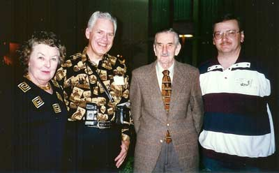](https://efanzines.com/EK/eI34/scan0007.jpg)

Betty Bond, Paul Dellinger, Nelson Bond,  and Curt Phillips at Pulpcon, 1996.

After years of being urged to do so (by  Rusty Hevelin, myself, and others), Bond finally agreed to make a rare  convention appearance at the 1996 Pulpcon “B” in Ashville, NC as a guest of  honor along with fellow reclusive pulp writer Talmadge Powell. When I spoke  with Nelson on the phone a few weeks prior to the convention he expressed  serious concern about what he was to say and do at that convention.

“After all, Curt,” he protested.  “I  haven’t published anything in a magazine for 40 years.  Besides you and  Rusty Hevelin, is anyone there even going to know my name?”  I assured him  that he had nothing to worry about, but I knew that he was only taking my  assurances on faith.  I, on the other hand, knew very well that pulp  fandom certainly did remember the name of Nelson Bond and were only awaiting  the chance to tell him so in person.  And as soon as he and Betty arrived  at the convention hotel in Ashville they were surrounded by fans and well  wishers and at every appearance Nelson received standing ovations and numerous  requests for autographs. I stood back and enjoyed watching Nelson meeting his  fans throughout that weekend and I was delighted to see the glow on his face as  he finally put away all thoughts of having been forgotten by his readers.

[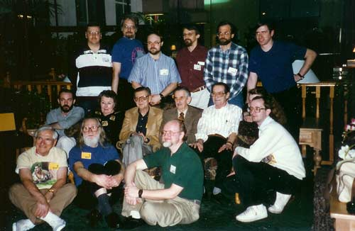](https://efanzines.com/EK/eI34/scan.jpg)

Pulp Era Amateur Press Society members at Pulpcon 1996  

                with GOH's Talmadge Powell and Nelson Bond.

Nelson Bond came home that weekend in Ashville;  and he finally knew that he’d earned a permanent place in our hearts. During a  lively and entertaining guest-of-honor speech he thanked his fans for  remembering and appreciating his stories after so many years. As he spoke that  afternoon I turned to Betty who was sitting next to me and remarked that Nelson  was making a terrific hit with the audience.  Without missing a beat,  Betty just smiled proudly and replied, “he always does.”

Nelson Bond was named Author Emeritus by  the Science Fiction Writers of America in 1998, and received the First Fandom  award in 1992. In 2003, Bond donated his papers to the Marshall University  library in Morgantown, WV, which – as a tribute – plans to build a replica of  his home office where he wrote many of his stories. Bond died on November 4,  2006 “of complications from heart problems” and is survived by wife Betty, sons  Kit and Lynn, and several grandchildren and great-grandchildren.

Nelson Bond isn't a well known writer in  the world of science fiction and fantasy today, at least not to the casual  reader but he has an impressive body of work, the best of which will, I think,  stand the test of time rather well. There will always be readers who seek out  the rare stories of style and substance, and they will find the best of Nelson  Bond's stories waiting for them.

A very selective suggested reading list -  first printings only:

[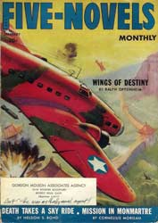](https://efanzines.com/EK/eI34/FNM-1-43.jpg)

“Mr. Mergenthwirker’s Lobblies,” *Scribner’s  Magazine*, November 1937

“The Voice from the Curious Cube,” *Top-Notch*,  March, 1937

“Magic City,” *Astounding Science Fiction*,  February 1941

“Take My Drum to England,” *Unknown,* August 1941

“The Bookshop,” *Blue Book*, October  1941

“The Ghost of Lancelot Biggs,” *Weird  Tales*, January 1942

“The Ring of Iscariot,” *Blue Book*,  June 1943

“Conqueror’s Isle,” *Blue Book*, June  1946

“The Song,” *Blue Book*, April 1949

“Vital Factor,” *Esquire,* August  1951

*Nightmares & Daydreams* – Arkham House, 1968

*The Far Side of Nowhere* – Arkham House, 2002

*Other Worlds Than Ours*  – Arkham House, 2005

*Probability Zero* -- Arkham House, (forthcoming)

- - -  

 *This article appeared in substantially the  same form in *The Pulpster* 16, a publication of Pulpcon edited by Tony  Davis.

---

> The First Amendment reads more like a dream than a law, and no other nation, so far as I know, has been crazy enough to include such a dream among its fundamental legal documents.  

 --Kurt Vonnegut

---

## Psychic Block* {#block}

By Marion Zimmer Bradley

Marion Zimmer Bradley

In the silence of a starred night, a little  world rolled onward and onward, in a silent orbit from nowhere to nowhere….

Sun broke over the world. Through a million  little windows broke a shimmering, diamond, neon sparkle of yellow. Alarm  clocks shrilled. The straps of cradles were unfastened. Mr. Jones and Mr. Smith  and Mr. Burton floated out of beds in adjacent apartments, to shut off  identically chiming alarms, while their wives drifted across weightless floors  to where babies slept in cushioned cradles.

A brighter sparkle in the windows.  Families, crowded in breakfast nooks, smile, snap, quarrel, show affection, and  irritation.

“Pour me some more coffee,” grunts Mr.  Burton, and wife Jane squeezes the nutrient solution from a capsule.

“Toast’s a little burned,” he mumbles,  biting into a pill. A bell screams somewhere. Children, drifting in weightless  corridors, clutch at the handholds on the wall.

“Come on, come on, Peggy! We’ll be late for  school!”

Two little girls strap themselves into  adjacent chairs in the great schoolroom. The neon sparkle gleams through a  panel they call window. Teacher, floating up and down the length of the room,  indicates with a long stylus a misspelled work on a child’s slate, or retrieves  a wandering pencil.

“How often have I told you to keep your  pencils under the elastic strap when you aren’t writing?” she reproves. The  children drowse, listen, drone their alphabet through the long sleepy morning.

Mr. Jones, Mr. Smith, Mr. Burton crowd with  men from the next block into a whining elevator.

“Subway’s sure crowded this morning!”

A damp moisture blown from the hydroponics  gardens wafts across their faces. Mr. Smith sniffs disapprovingly. “Smells like  rain. The weather isn’t what it was when I was a boy!”

Jane Burton, Helen Foster, Nancy Smith,  gather wisps of nylon together and swish through detergent solution. Helen  shoves at a pair of toddlers. “Run out in the garden, get some sunshine!” They  turn clumsy little somersaults in mid-air.

Outside under the little green-glass dome,  a filtered golden light, rich with ultra-violet, warm with infrared, glows  under the green tiling. Children root like noisy pigs in the fuzzy surface. One  little boy learns a new word.

“Grass,” he lisps, and Nancy Smith floats  across the little dome to hug him. A small plastic fence divides the dome,  Nancy leans across the fence, anchoring herself with one hand, to chat with  Jane while she pegs up clothes on a curiously angled line. “Isn’t this a lovely  day?”

“Never saw such weather,” Jane assents. A  small dress floats out of reach; Jane drifts up casually to retrieve it.

The day goes buy, busy with bustle, quiet  with domestic business. Down in air-conditioned offices, men run typewriters,  huge calculating machines, work in hydroponics gardens, prepare food and  garments from vast vats and storerooms. Gradually the filtered glow dims,  darkens. Crowded elevators carry the men homeward. They chew gum, push, crowd,  read small magazines which they can hold between two fingers.

Children, noisy, dirty, tired, drift slowly  home, clutching at handholds. Supper is sipped from globes, prayers read,  lisped by children too sleepy to hold to the floor. Magnetic shoes are  discarded by tired father-feet. Mr. Smith drifts upward, lies on the ceiling to  watch his favorite video. Jane and Helen and Nancy fasten gravity straps across  foam-rubber cradles.

“Now Mommy’s tucked you in. Go to sleep,  darling.”

[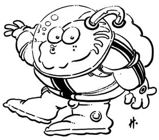](https://efanzines.com/EK/eI34/fish.jpg)

“Wanna drink water,” lisps a fractious  baby, and Helen holds down the globe. Baby sucks; drops off to sleep. The  Burtons, Jane and Larry, slip quietly out of the apartment, leaving the  children strapped in their cradles. They drift through corridors into a great  open dome. Above them rises vast, glassed-in nothingness, shot by millions of  unfamiliar stars. The tiny glow of cigarettes in the dark show where wives,  husbands, lovers watch the starlight.

“It’s strange,” Jane whispers, “the stars  are always there, and yet the stars are different every night. It’s almost as  if the world were moving!”

Larry murmurs, frowning a little, “Yes,  strange… I seem to remember that long ago, sometime, things were different. I  wonder what it would be like if we couldn’t float, if we just had to walk. If  when we put the children to bed, they’d stay in bed without floating out?”

Jane shudders. “You’re getting morbid.” She  looks up at the ever-changing stars and suddenly grips her husband’s arm.  “Larry—I keep thinking of one word. *Earth*. What’s—Earth?”

He scowls; slips his arm around her waist. “It’s  the world we live on, honey.” The scowl slips off his face, to give way to a  dreamy memory. “I wonder. I don’t know—I think I knew, long ago, but there was  a world—“

Silence. Jane glances up at the mutating  stars; smiles in the darkness. “Come on, honey. It’s late. The stars will be  there tomorrow night.”

“But they will be different stars—“

“What’s the difference?” Woman and mother,  Jane has a wise smile, “They’re stars. We’re here.”

One by one, couples and singly, they float  down corridors to silent rooms; tiptoe in the darkness to beds, strap the  rubber straps with an automatic gesture. Eyes close. In the faint, faint light  of the ever-changing stars, a thousand people breathe in their sleep. Somewhere  a baby wails. A woman dreams and sobs in her sleep.

The ship sleeps.

Far up on the bridge the light is harsh and  never darkened. The co-pilot of the evening watch turns to the navigator.

“God, it’s monotonous, isn’t it?”

The navigator nods. “Yeah, but suppose you  were down in the passenger decks?”

The co-pilot frowns.

“Sometimes I wonder what they think about  it all?”

The *Centaurus I* plunges on and on  through a world of a billion changing stars.

- - -  

 *Reprinted from *Ciln 5* with the  permission of Ed Gorman.

---

> Q: "What targets would you consider fair game for a satirist today?"  A: "Assholes."  

 --Kurt Vonnegut, 1/27/03, "In These Times"

---

## Introduction to Interview: Algis Budrys {#intro}

This is quite a long article in its original appearance in *Science Fiction  Review*. Mark Berry conducted his interview in the spring of 1984 while  driving his Dodge Colt from Detroit, Michigan to Evanston, Illinois with Algis  Budrys as his passenger. It was a tape-recorded interview and the published  text made from a translation of those verbal recordings.

[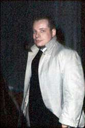](https://efanzines.com/EK/eI34/AJ-Budrys.jpg)

Algis Budrys at Blake Pharmaceuticals in  Evanston, Illinois in 1961.

As I said, it is quite a long article. It  begins with Berry’s description of Algis Budrys (as Berry knew him to be, and  that’s an important distinction) and moves directly into a prolonged  question-and-answer session that must have taken several hours to complete.

Conspicuously absent from the interview are  some extremely important periods of Budrys’ life that Berry was apparently  unaware of. They are:

- Budrys’       period as The King of Pornography when working side by side with Harlan       Ellison and yours truly at William Hamling’s Porno Factory, Blake       Pharmaceuticals, in Evanston, Illinois.
- Budrys’       short tenure at Playboy Press in Chicago, Illinois.
- Budrys’       decades-long tenure at Lafayette Ronald Hubbard’s complex in Los Angeles,       California and the embarrassment and humiliation he endured while employed       by Dianetics, Bridge Publications, and the “church and religion”—two       spontaneous loud raspberries—of Scientology (sic).

But none of those concern us here.

What does is the frequently devoutly  worshipped tangential human being and total control freak named Robert Anson  Heinlein.

On the occasion of this, the Centennial of  Heinlein’s birth, when many people are celebrating that immaculate event, it  becomes my duty to speak for The Legion of the Disremembered, the countless  number of once-devoted Heinlein acolytes who in some small manner failed to  kiss the master’s rusty ass one time too many and became instantly  “disremembered.” Totally dropped from Heinlein’s knowledge and thoughts—*sure,  that’ll be the day*—from his records, from his files, from his celestial  existence.

For those who knew him closely and  personally and far too well to disremember him in turn, we all now observe one  minute of silence out of respect for the petty little man hiding behind the  Ozma curtain.

<tick, tock, tick tock>

and one final middle finger salute.

---

And now we pick up the pertinent text  directly from *Science Fiction Review*.

–Earl Kemp

[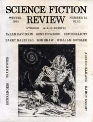](https://efanzines.com/EK/eI34/SFR53-Win1984.jpg)

## Interview: Algis Budrys* {#budrys}

Conducted by Mark Berry

**Mark Berry:** As the interview wound down we found ourselves halfway between Detroit and  Chicago, still three hours away. I mentioned to A.J. That I had at least one  hour of blank tape left and he suggested that he tell how he got started as a  book reviewer. Whether he did this for posterity or to take his attention away  from y my driving I’m not sure. (I used to be a paramedic and tend to drive  like my little car has flashing red lights and a siren. For some reason this  seems to discomfort my passengers.)

Whatever the reason, A.J. related the  following. It is a piece of sf history and I’m sure you’ll enjoy it.

**Algis Budrys:** This is a story which I guess now can be told.

I had been doing some book reviewing. For  instance, my first book review appeared in *Astounding* in the middle  l950s. It was a review of an anthology of Ivan Yeffremov’s Russian science  fiction stories. The book had been imported into this country by somebody that  John Campbell knew. He gave me the book to review and I did a little thing and  it was a filler at the bottom of a page somewhere. I can’t retrieve it; it’s  not listed in the index. I can’t find out what issue it was in. I still have  the book. And I did that because John wanted a review of that book. I was  heavily influenced by Damon Knight and his magazine reviews and after the first  Milford Science Fiction Conference in Milford, back in the middle l950s, Damon  and Lester del Rey and Jim Blish and I put together a magazine called *SF  Forum* which survives today as a publication of SFWA. The Forum in those  days was co-edited by Lester and Damon as a magazine of reviews. What we did  was review every story in every issue of every science fiction magazine, for  the improvement of the breed and the clarification of the situation. It took  hardly any time at all before we had alienated everybody we knew. And we fell  to bickering among ourselves; we said some amazingly stupid things in print, as  a matter of fact. The *SF Forum* contains a long essay by Jim Blish on  Robert Heinlein, of all people. It has to do with *The Door Into Summer* and builds up this elaborate thesis about Heinlein’s methods and the reason *The  Door Into Summer* is written the way it is and points out that this is the  first time that Heinlein has paid attention to one of science fiction’s major  themes, tine travel. Now, Jim had apparently forgotten a little story called  "By His Bootstraps." So I don’t blame Heinlein for feeling that there  was something wrong with the whole concept of criticizing science fiction in  this manner. I don t think Heinlein ever wrote in and did anything about that  although Heinlein is a person who does not suffer slings and arrows mutely. But  he’s a gentleman, he’s always been a gentleman, and he does it in a  characteristic way.

[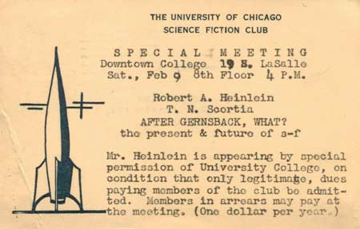](https://efanzines.com/EK/eI34/2-9-57.jpg)

Announcement postcard dated February 9,  1957.

What happened, some years later, was Fred  Pohl, of course being very well aware of *SF Forum*, was very well aware  of the fact that I worked on it. Some years later Fred becomes the editor of *Galaxy* and his book reviewer, a fellow named Floyd C. Gale, who was Horace Gold’s  brother in law, and he had inherited Floyd from Horace.

And Floyd Gale, who was a very bright and  conscientious guy, had been assigned the mission by Horace of reviewing as many  books as possible and never saying anything that would make anybody mad because  the purpose of the review column was to generate advertising from book  publishers. So Floyd has this real quickie buyer’s guide. He covered 33 titles  in a column and the column would be about two pages long.

So in comes the new Heinlein novel, the  major Heinlein novel, the Heinlein novel everybody had been waiting for. It’s  called *Stranger in a Strange Land*. I do not know what process of  rationality Fred went through but he got a hold of me and said, "Look,  there’s this new Heinlein novel. I would like you to review it. I need about  2,000 words worth of review and I’ll give you 75 bucks for it and I want you to  review this book.” So I read the book. The first half of it was without doubt  the finest modern science fiction novel ever written. I’m sitting there, the  author of *Rogue Moon*, the finest, quintessential science fiction novel  ever written up to that tine and the guy has me beat all hollow. He has reached  into the very heart of speculative fiction. He has dressed it up with the  science fiction trappings. He is proceeding full steam ahead with a  masterpiece; the definitive sf novel. Halfway through it I’m foaming at the mouth;  it is so beautiful, so lovely. I turn the page and it is as if someone had  taken a bucket of some cold, glutinous substance and poured it over my head.  The back half of *Stranger in a Strange Land* is as bad as any Jack  Woodford novel ever written.

Jack Woodford was a culture hero of the  l930s, writing soft-core porn novels which contained no believable characters  in no believable situations, mouthing lines that had been forced into them by  the author who had absolutely no conception of how fiction is to be written. A  self-taught, ham-handed practitioner who was able to sell stuff only because  every college boy in the world thrilled to it.

And here is Robert Anson Heinlein doing  exactly the same fucking thing. It wasn’t that he was pushing this particular  religion, it wasn’t that he was pushing this particular view of reincarnation.  I was kind of taken by that. I don t mind that the man says something which, if  he walked up to you on the street and tried to hand you a pamphlet about it and  sign you up, you’d tell him to get lost. A novel is the place for that kind of  thing. And, as a matter of fact, what he had to say about Michael Valentine  Smith and his inevitable doom and the nature of the world strikes me as very  valid social observation. It taught me a great many things about charismatic  religion. I've no quarrel with that. And I admire him for having organized all  that in his mind and having been able to expound it in a coherent manner.

[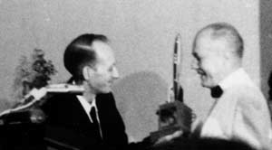](https://efanzines.com/EK/eI34/heinlein1close.jpg)

Earl Kemp presenting Robert Heinlein the  Hugo for *Stranger in a Strange Land*. ChiCon III photo dated September  1962.

What I do mind is the fact that he threw  out the window all of his skills that he had developed in characterization and  dialogue writing, all of the techniques that he had worked up, and he had  started maneuvering his characters baldly and boldly and creating a polemic. He  had broken his bargain, he was no longer being an entertainer. He was being a  didacticist. And he was resorting to scenes like the one in which everybody  says, "Poor dear Marge, she’s fifty years old, she’s sure that she’s past  it all. Let’s all climb into bed at once and reassure her." Come on! This  is masturbatory fiction. This is not the creation of anything like what Robert  Heinlein had taught us to write like.

I said things like that in my review. Not  as vehemently, bit I said them. I felt I owed it to the readers. I felt I owed  it to Heinlein. I felt I owed it to myself. I felt I owed it to speculative  fiction. And I turned it in. And Fred liked it, he admired it as a review. I  think he was pleasantly surprised at how well I had read the book and organized  my thinking. I really do. I think that.

As the editor of *Galaxy,* a man who  was therefore about to destroy the possibility that Robert A. Heinlein would  ever sell him another story, he was in another boat entirely.

I’m not clear now on exactly what it was he  did. I don't know whether he sent Heinlein a copy of the review or whether he  wrote him a letter and described it to him or whether he simply wrote him a  letter and said, "Bob, I think you ought to know that Algis Budrys has  written an unfavorable review of *Stranger in a Strange Land* and I’m  thinking of running it in the magazine." And Heinlein wrote back, and as  Fred has described the letter to me, if I can recall it now, mere or less  exactly…despite the fact that Heinlein and I had net at Seattle, and had spent  two days admiring each other, spent a lot of time together at the Seattle  Worldcon. And despite the fact that Heinlein had declared to me that I was  robbed on the Hugo balloting, Heinlein proposed the theory that because I was a  foreigner I hadn’t really understood the English language in the book. That, if  I recall, is something like what he said.

Besides proposing that because I had this  foreign name and therefore might be clumsy with the English language, besides  proposing that I hadn’t been able to understand the prose of his book, he said  to Fred, "I would not for a minute attempt to censor this man’s right to  say whatever he wants to say. It’s his opinion and he’s entitled to it and  you’re entitled to publish it in your magazine. You paid him to do it, he did  it, and you’re entitled to publish it. However, I am a subscriber and would it  be possible to omit from my subscription the issue in which that review  appears?" And that was all he said.

[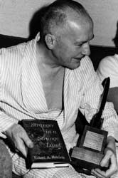](https://efanzines.com/EK/eI34/heinlein.jpg)

Robert Heinlein showing off his Hugo and  his *Stranger in a Strange Land*. ChiCon III photo dated September 1962.

Well, Fred didn't run the review. I don’t  blame him. It’s tough enough keeping a science fiction magazine going. At any  time. You never get any advertising to support it; you do it entirely on the  basis of selling to the readers. Distribution being the way it is you can’t  even build up that much of a loyal following. There have been mere recent  solutions to that problem. *Asimov's, Analog*, and *F&SF* now  depend for most of their sales on their subscribers. *Galaxy* and *Astounding* at that time were not set up that way. They were depending on newsstand sales.  Newsstand sales demanded the appearance on the cover of sure-fire selling  names. You just were not going to make it, you were not going to get enough  readers, if you did not have a name like Heinlein to stick on the cover once in  a while. You were cutting your own throat for good. And Fred was entitled to  feel that if he cut Heinlein off the front cover of the magazine he was cutting  an awful lot of other writers out of a place where they could get their stories  published. I don t blame him. He didn't ask me to rewrite the review. He didn't  ask me to take it back. He didn't even look at me funny and say, "Ajay,  you idiot." What he said to me was, "You did an honest job. Now I’ve  got to cope with the results." Fred, as far as I’m concerned, came out of  that situation looking golden. I gained a lot of respect for Fred. I had put  him in a box and he had figured out a viable way to handle it. He just plain  didn't run the review, and that may sound pusillanimous to somebody who does  not understand the business. But it caused me to raise my estimation of Fred by  a couple of notches.

And I think that anybody who has edited  anything under those circumstances would agree.

A couple of years later Fred just plain  offered me the *Galaxy* column. I assumed that he wanted me to continue to  handle it the way I had handled the Heinlein review. And although he wasn't  always comfortable with what I did, he never, ever censored it, except once and  even then he didn't censor it, he sent back a column for a rewrite, not because  he objected to what I'd said but because he could not understand what I’d said.  That was my review of *Dangerous Visions* which I rewrote, saying exactly  the same things, but in a less maniacal manner.

So I think that my review of *Stranger in  a Strange Land*, even though it’s never been published, was what got me the *Galaxy*column.

Now, the reason the review was the way it  was was on account of Damon Knight. Damon Knight had not been afraid to take on  A.E. van Vogt. Damon Knight had not been afraid to poke fun at certain aspects  of Isaac Asimov. Right or wrong, he had set an example. And I followed it. The  example he had set was you don’t do a hatchet job for the sake of doing a  hatchet job but if you see something wrong you point it out. And it’s to  Damon’s credit, as well as Fred’s, in that sense.

This is a story that neither Fred nor I  have been ashamed to tell people in small groups. So I figured I’d tell it to  you now because I think it’s time it got published out where the world can see  it.

- - -  

 *Excerpted from *Science Fiction Review* #53, Winter 1984, and reprinted with the permission of Richard E. Geis. Special  thanks to Joseph T. Major for suggesting it, identifying it, and furnishing the  digital text. Special thanks to Robert Lichtman for confirming that text and  furnishing a scan of the front cover.

---

> Most fascinating game there is, keeping things from staying the way they are.  

       --Kurt Vonnegut, *Player Piano*

---