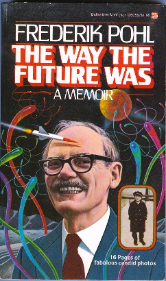

<!-- translated by Yandex Translate -->

# Путь к блогам будущего

Фредерик Пол

## Приятно с тобой познакомиться

Причина, по которой нам нужно представиться, заключается в том, что я новичок в этом деле, и поэтому поначалу у меня может не получиться все правильно. Например, я понимаю, что многие блоги напоминают переписку между блоггером и его подписчиками, но это не то, что я имею в виду. Я думаю о чем-то более похожем на газетную колонку, в которой время от времени (по крайней мере, раз в неделю, а может быть, и чаще) Я пишу несколько сотен слов и отправляю их всем, кто хочет настроиться на меня. С другой стороны, большинство записей в блоге кажутся действительно короткими, может быть, меньше ста слов. Этого я не могу обещать сделать. После целой жизни, когда мне платили словом, я не так хорош в краткости. (Но потом вы можете пролистать, если хотите. Я так и делаю, довольно часто.)

Итак, о чем я буду писать?

Что ж, если вы когда-нибудь читали мой "Эксперимент в автобиографии", *Ретроспектива Будущего (The Way The Future Was),* у вас есть довольно хорошее представление о том, чего ожидать. Очень может быть, что и нет, поскольку она не издавалась двадцать с лишним лет (хотя я должен сказать, что меня постоянно поражает количество потрепанных и с загнутыми уголками экземпляров, которые люди приносят мне для автографа каждый раз, когда я подписываю книгу). Итак, я попытаюсь дать вам представление.

На самом деле, этот блог начался так по двум причинам. Одна из них заключалась в том, что один из моих редакторов уговаривал меня сделать что-то в этом роде в рекламных целях, но чашу весов склонило то, что я уже некоторое время обдумывал идею опубликовать либо расширенное и обновленное издание этой книги, либо ее продолжение. Большая часть этого будет посвящена рассказу о писателях НФ, которых я знал — как клиентов, когда я был литературным агентом, как авторов, когда я редактировал книги или журналы, как соавторов, как попутчиков в путешествиях по большей части мира — то есть, по сути, обо всех писателях, о которых кто-либо когда-либо слышал за последние много лет. (Пример того, что я имею в виду, смотрите в разделе “[**Сэр Артур и я**](/fred-pohl/2009-01-05-sir-arthur-and-i/)".)

Время от времени я мог бы поговорить на любую другую тему, которая меня интересует. Но и там, если вам не интересно, вы можете пролистать. И на случай, если вы только что зашли в этот чат и никогда в жизни не слышали обо мне, что, к сожалению, характерно для значительной части человечества, я также прилагаю [биографический очерк](https://web.archive.org/web/20090123052955/http://www.frederikpohl.com/). (Который вы, конечно, можете просмотреть или пропустить полностью. На самом деле, я рекомендую это.)

Так что давайте покончим с этим. Я надеюсь, что это будет весело!

### 18 Комментариев

- [Билл Хиггинс - жокей на бревне](https://web.archive.org/web/20090123052955/http://beamjockey.fnal.gov/) говорит:
Однажды я наткнулся на стол с остатками, где стопка книг *"Каким было будущее" Ретроспектива Будущего (The Way The Future Was) предлагалась по доллару за штуку.  
Я купил все до единого.  Даже несмотря на то, что у меня уже была копия.  Это потрясающая книга.  На протяжении многих лет я раздавал их друзьям, которые задавались вопросом, как научная фантастика стала такой, какая она есть.   Или какие приключения у вас были на этом пути.
Я рад видеть, что вы завели блог– Мне всегда нравится читать то, что вы пишете, поэтому я с нетерпением жду, что вы здесь скажете.
[**19 января 2009 года, 16:50 вечера**](/fred-pohl/2009-01-07-nice-to-meet-you/)
- [Стефан Джонс](https://web.archive.org/web/20090123052955/http://home.comcast.net/%7Estefan_jones/kira_sitting_lo.jpg) говорит:
Я прочитал “Ретроспективу Будущего(The Way The Future Was)” в колледже... Черт возьми, двадцать лет назад. Отличное чтение. Буквально на днях я вспомнил сцену, связанную с тем, что я оставил пакет с вареными яйцами для бродяги.
[**19 января 2009, 10:27 вечера**](/fred-pohl/2009-01-07-nice-to-meet-you/)
- [Фред Кише](https://web.archive.org/web/20090123052955/http://theeternalgoldenbraid.blogspot.com/) говорит:
“Ретроспектива Будущего(The Way The Future Was)” - одна из моих любимых НФ-автобиографий, наряду с той, что написал этот парень Уильямсон. (Это намек на то, что я надеюсь, что в какой-то момент вы расскажете о своем опыте совместной работы с ним!)
Рад видеть вас в блоге!
[** 20 января 2009 года, 11:55 утра**](/fred-pohl/2009-01-07-nice-to-meet-you/)
- [Ширли Хикс](https://web.archive.org/web/20090123052955/http://www.velochic.ca/) говорит:
Поговорите с Чарли Строллом по адресу http//www.antipope.org. Он тестирует большую часть своих работ через читателей своего блога и собрал целое сообщество преданных поклонников.
Приятно видеть, что вы присоединяетесь к блогосфере. На меня указали здесь из записи Джейм Николл в живом журнале.
[**20 января 2009, 18:15 вечера**](/fred-pohl/2009-01-07-nice-to-meet-you/)
- Кент Клайн говорит:
После многих, многих лет чтения ваших слов для меня большая честь думать, что я могу написать пару слов, которые вы могли бы прочитать. Просто и искренне благодарю вас.
[**20 января 2009, 18:38 вечера**](/fred-pohl/2009-01-07-nice-to-meet-you/)
- Мэтт Тан из Сингапура говорит:
В 80-х мне понравилось читать свой первый роман Фреда Пола “Врата(Gateway)”, написанный в 80-х годах, и я с нетерпением читал все продолжения. Мне также понравилось его сотрудничество с Айзеком Азимовым в фильме ”Our Angry Earth”. Хорошо иметь возможность регулярно читать ваши мысли и мнения в Интернете. Пожалуйста, продолжайте еще долго, очень долго. Спасибо.
[** 20 января 2009 года, 11:00 вечера**](/fred-pohl/2009-01-07-nice-to-meet-you/)
- Питер Нел говорит:
Мистер Пол, мы знаем, кто вы такой, и поверьте мне, для нас большая честь находиться в вашем присутствии. Заставляйте их приближаться! Ваш блог - замечательная новость, и он сразу попадает в “избранное”.
Спасибо вам!
[** 21 января 2009 года, 2:39 ночи**](/fred-pohl/2009-01-07-nice-to-meet-you/)
- говорит Здеслав Бенцон:
Я только что получил "Чудо-эффект", первое издание в мягкой обложке 1962 года, и жду несколько журналов, которые Вы редактировали в шестидесятые годы ("Galaxy" и "If"), еще до моего рождения. Одна из моих любимых книг в жанре НФ - "Космические торговцы"  

и я перечитал ее только в прошлом году. Итак, когда я узнал, что у Вас есть блог, я  

просто хотел сказать вам, что я восхищаюсь тем, как вы все еще живете научной фантастикой  

и как ты сделал мою жизнь богаче благодаря своему творчеству. Я прочитал далеко не все ваши произведения, но я прочитал несколько ваших рассказов и новелл, которые были переведены в бывшей Югославии, а теперь и в Хорватии, и с тех пор, как я  

читайте на английском, а также некоторые из тех, которые не были переведены.  

Один из других моих любимых писателей - Сирил Корнблат, и я приобрел его долю славы благодаря Вашему представлению год назад. Какая замечательная книга.  

Я просто хочу пожелать вам удачи в вашем здоровье и пусть вы будете вести этот блог  

на долгие годы вперед.  

Спасибо Вам
[** 21 января 2009 года, 4:17 утра**](/fred-pohl/2009-01-07-nice-to-meet-you/)
- Йен говорит:
О боже, это так круто. “День на миллион” остается одним из моих любимых рассказов в жанре научной фантастики, наряду с “Чумой Мидаса” и “Голдом в конце Звездной стрелы”.… Не говоря уже про ваши романы *торговцы космосом (Gravy Planet) и трилогии подводных вы сделали с Джек Уильямсон, плюс врата (Gateway) и человек плюс (Man Plus) а лет в городе.* И многое другое, о чем я, вероятно, забыл.  Это просто сногсшибательно, что у вас есть блог. Это считается обязательным к прочтению на каждый день.
[** 21 января 2009 года, 4:48 утра**](/fred-pohl/2009-01-07-nice-to-meet-you/)
- [Нил Ашер](https://web.archive.org/web/20090123052955/http://theskinner.blogspot.com/) говорит:
Это тоже сразу попало в мои фавориты. Отлично, что один из величайших блогеров НФ ведет блог!
[** 21 января 2009 года, 5:49 утра**](/fred-pohl/2009-01-07-nice-to-meet-you/)
- Просто другой Джон говорит:
Мистер Пол, добро пожаловать в блогосферу!  Спасибо, что написали, я еще загляну к вам.  Добавляю этот сайт в избранное прямо сейчас.
[** 21 января 2009, 14:13 вечера**](/fred-pohl/2009-01-07-nice-to-meet-you/)
- Кристофер Хоули говорит:
Еще один благодарный читатель присоединяется к растущей толпе… Спасибо вам за то, что решились и написали статьи в том же удивительно удобочитаемом стиле, что и ваши книги!  

* избранный сайт *
Крис
[** 21 января 2009, 14:37 вечера**](/fred-pohl/2009-01-07-nice-to-meet-you/)
- [Джефф Зугейл](https://web.archive.org/web/20090123052955/http://www.jeffzugale.com/justabitoff/) говорит:
Подписался. Спасибо за все замечательные истории, мистер Пол. Добро пожаловать на наши собственные крошечные первые шаги к тому, чтобы стать “необъятным”.  
(Я просто счастлива, что сеть позволяет мне поздороваться и поблагодарить!)
[**21 января 2009, 18:28 вечера**](/fred-pohl/2009-01-07-nice-to-meet-you/)
- [Чарли (Колорадо)](https://web.archive.org/web/20090123052955/http://explorations.chasrmartin.com/) говорит:
Фред, ты когда-нибудь видел старый мультфильм "Плейбоя", в котором четыре человека сидят за карточным столом; они одеты в скудную и явно римскую одежду, в то время как вокруг них происходит классическая мультяшная римская оргия.  Пятый человек стоит возле стола и с любопытством смотрит на них.  Подпись гласит: “На оргии ты должен делать все, что захочешь.  Что ж, мы хотим поиграть в бридж!”
Это твоя чертова оргия, Фред.  Делай все, что тебе нравится.
Рад видеть вас здесь.
[**21 января 2009, 20:48 вечера**](/fred-pohl/2009-01-07-nice-to-meet-you/)
- [Марк Хеннесси, - говорит Барретт](https://web.archive.org/web/20090123052955/http://www.imaginetix.co.uk/):
Мистер Пол, простое осознание того, что часто можно будет прочитать больше ваших мыслей и слов, является совершенно фантастическим.   Добро пожаловать в блогосферу - я надеюсь, что мы, ваши комментаторы, сможем вернуть хотя бы малую толику спровоцированных мыслей, стимулированных синапсов и расширенной мозговой деятельности, которыми вы делились с нами на протяжении многих лет.  Я остановлюсь здесь, чтобы не распускать язык.   * закладки в качестве избранного*
[**21 января 2009, 10:53 вечера**](/fred-pohl/2009-01-07-nice-to-meet-you/)
- [гневекс](https://web.archive.org/web/20090123052955/http://wrathex.blogspot.com/) говорит:
Уважаемый мистер Пол, 
Спасибо вам за "Цифры и подлецы", "Миллион дней", "Набор для выживания", "Джем", "Предпочтительный риск", "Сказки Хичи" и многое-многое другое.
Спасибо вам за долгие годы восхитительного чтения, а также за то, что вы расширили и задействовали мой интеллект и воображение.
Вы всегда были и остаетесь любимым автором НФ.
[** 22 января 2009 года, 12:27 утра**](/fred-pohl/2009-01-07-nice-to-meet-you/)
- Энтони Каннингем говорит:
Я тоже рад с вами познакомиться. Я с нетерпением жду возможности услышать больше.
Кстати, фамилия Чарли Стросс, а не Стролл.
[**22 января 2009, 14:57 вечера**](/fred-pohl/2009-01-07-nice-to-meet-you/)
- Дэйв Робинсон говорит:
Я прочитал Ретроспективу Будущего(The Way The Future Was), и я рад видеть этот блог.
[** 22 января 2009, 15:26**](/fred-pohl/2009-01-07-nice-to-meet-you/)

[Записи (RSS)](https://web.archive.org/web/20090123052955/http://www.thewaythefutureblogs.com/feed/)
[Комментарии (RSS)](https://web.archive.org/web/20090123052955/http://www.thewaythefutureblogs.com/comments/feed/)
[(Атом)](https://web.archive.org/web/20090123052955/http://www.thewaythefutureblogs.com/feed/atom/)
  
[WordPress](https://web.archive.org/web/20090123052955/http://wordpress.org/)
[TWTFB](https://web.archive.org/web/20090123052955/http://dicksmithsoftware.com/)