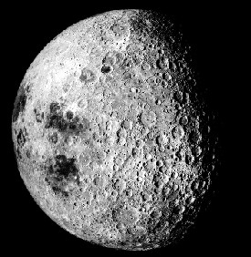

<!-- translated by Yandex Translate -->

# Путь к блогам будущего

Фредерик Пол

## Уголок поэзии

Среди моих детских пороков было сочинение стихов — иногда довольно причудливых, как в первом примере, иногда довольно банальных, как во втором. (Самое лучшее в банальных из них то, что я довольно часто заставлял какого-нибудь редактора покупать их.)

Я написал “!” для самого первого журнала, который я когда-либо редактировал (и опубликовал, и напечатал на мимеографе, и переплел), крошечного полу-[фэнзина](https://web.archive.org/web/20090415165710/http://fancyclopedia.editme.com/FANZINE) под названием Mind of Man. Кроме того, это самая первая вещь, которую я когда-либо написал и которая получила положительные отзывы от таких проницательных людей, как [Сирил Корнблат](https://web.archive.org/web/20090415165710/http://www.luna-city.com/sf/cmk.htm) и [Джеймс Блиш](https://web.archive.org/web/20090415165710/http://www.blish.org/gens/1380I.html), которые выучили ее наизусть и, как известно, декламировали на вечеринках.


!

, , &amp;
! мой друг
;  $
- - . . . . . . .


Второе стихотворение важно даже для меня только потому, что это первое, что я написал, что какой-то редактор купил, опубликовал и заплатил мне наличными.


Элегия мертвой планете: Луна

Опускается тьма, и громоздящиеся башни
Города и деревушки вспыхивают светом.
Резкий, ослепительный блеск дневных суматошных часов
Уступает место сияющему сиянию ночи.
Луна, это бледное создание, царица неба,
Задумчиво смотрит вниз на формы жизни внизу,
думая, возможно, о прошедших эпохах
С тех пор, как жизнь на ее груди угасла под снегом.
Мертвый мир и холод, этот мрачный спутник,
Чьи кратеры и долины безвоздушны и сухи.
Ни малейшего движения от глубокой ямы к вершине,
Ни у одного живого существа нет эго, способного кричать: “Я - это я!”
Но когда-то, много веков назад, эта мрачная гробница в космосе
Принадлежавшие живым существам на его поверхности, теперь обнаженной
До мрачного времени в своем полете, стремительно ускоряясь,
Унес жизнь, движение, мысль прочь, кто может знать, куда?


Ладно, ладно, Луна - это не планета, и на ней никогда не было ни живых существ, ни снега. Подай на меня в суд. Когда я писал это, мне было довольно невежественным пятнадцатилетним подростком.

Затем, когда мне было шестнадцать, редактор журнала "[Amazing Stories](https://web.archive.org/web/20090415165710/http://findarticles.com/p/articles/mi_g1epc/is_tov/ai_2419100031/print?tag=artBody;col1)" [Т. О'Конор Слоун, доктор философии](https://web.archive.org/web/20090415165710/http://books.google.com/books?id=vdgDAAAAYAAJ&pg=PA415&lpg=PA415&dq=%22o%27connor+sloane%22&source=web&ots=Kzp2Nuj9nm&sig=ywUHa2zRlbi_HR3acKsy4hCDPi4&hl=en&sa=X&oi=book_result&resnum=5&ct=result#PPA415,M1), принял ее, и когда мне было семнадцать, он опубликовал ее в своем октябрьском номере за 1937 год, а когда мне исполнилось 18, он заплатил за нее. Два доллара.

** Сообщение по теме:**

[**Стих расшифрован**](/posts/2009-03-16-verse-decoded/)

### 4 Комментария

- Уильям говорит:
Не могли бы вы объяснить, как вы произносите “!”? Я мог бы придумать множество способов, и мне любопытно узнать, какой из них вы имели в виду.
[** 30 января 2009 года, 12:42 утра**](/posts/2009-01-30-the-poetry-corner/)
- [Джефф](https://web.archive.org/web/20090415165710/http://jeffcrook.blogspot.com/) говорит:
Если бы люди только знали, что они создают, когда поощряют пятнадцатилетних писателей.
Иногда это срабатывает к лучшему.
[** 30 января 2009 года, 8:26 утра**](/posts/2009-01-30-the-poetry-corner/)
- адепсис говорит:
Я воспринимаю это как нечто похожее на приветствие -
запятая, запятая, амперсанд!  

восклицательный знак, мой друг!  

точка с запятой, знак доллара!  

дефис, дефис, точки в строке!
Было бы особенно весело после того, как немного “расслабишься” на вечеринке.
[**31 января 2009, 11:04 вечера**](/posts/2009-01-30-the-poetry-corner/)
- Кент Клайн говорит:
Прежде чем перейти по ссылке, чтобы прочитать комментарии, я сам делал “Приветствие восклицательным знаком” и задавался вопросом, улавливаю ли я дух счетчика. Отрадно сознавать, что у адепсиса была похожая реакция на это стихотворение.
Хорошо повеселиться.
[**4 февраля 2009 года, 12:00 утра**](/posts/2009-01-30-the-poetry-corner/)

[WordPress](https://web.archive.org/web/20090415165710/http://wordpress.org/)
[TWTFB](https://web.archive.org/web/20090415165710/http://dicksmithsoftware.com/)