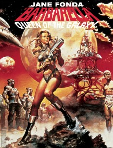

<!-- translated by DeepL -->

# The Way the Future Blogs

Фредерик Пол

## Отчеты о книгах на корабле, часть II

Было еще четыре книги, которые я спас из [**Библиотеки "Рындама "**](/fred-pohl/2009-02-20-the-book-place/). Мой интерес к двум из них был вызван неожиданно роскошным хранилищем классических американских фильмов в "Риндаме". Я и не подозревал, что меня ждет такое удовольствие.

Но когда однажды вечером я переодевался к ужину, телевизор в каюте заставил меня замереть.  Молодой человек противостоял мощному пожилому мужчине.  Я не знал ни того, ни другого по имени, но был почти уверен, что молодой - начинающий композитор, желающий попасть в труппу *Maestro di tutti di maestri di balletto.* И через мгновение - подожди - да, там была [Moira Shearer](https://web.archive.org/web/20090409120616/http://www.nytimes.com/2006/02/02/arts/02shearer.html), чтобы подать заявку в ту же труппу в качестве танцовщицы, выглядящей такой росистой и милой, какой не была ни одна человеческая женщина.

Не было никаких сомнений.  Мы были в самом начале величайшего из когда-либо снятых фильмов о балете - [The Red Shoes](https://web.archive.org/web/20090409120616/http://www.imdb.com/title/tt0040725/).  Конечно, в тот вечер я немного опоздал на ужин, как, впрочем, и не в один другой вечер в том месяце, потому что классика не переставала идти.  *Паттон. Волшебник страны Оз. Африканская королева.  Фантазия.  Клеопатра*

И затем фильм, который привёл меня на книжные полки *Риндама*, "На Золотом пруду "*, с Джейн Фондой в главной роли, сыгравшей на экране отчуждённую дочь Генри так же хорошо, как и в реальной жизни, с Кэтрин Хепберн в роли полностью любимой мамы - но это был только кастинг.  Когда я впервые увидел этот фильм, меня заинтересовала какая-то газетная болтовня о том, что Хепберн критиковала Джейн за политику, а Фонда не одобряла Кейт за то, что та перевела собственную карьеру в черное русло, чтобы посвятить каждую минуту своего времени любви и заботе о [Спенсере Трейси](https://web.archive.org/web/20090409120616/http://themave.com/Tracy/Tracy.htm), человеке, который значил для нее всю жизнь, но не мог развестись со своей женой-католичкой, чтобы подарить ей кольцо.

Это две величайшие киноактрисы любого столетия.  Хотелось бы знать, что ими движет.  Во всяком случае, хотелось, поэтому я взял [Kate](https://web.archive.org/web/20090409120616/http://www.amazon.com/gp/product/0805076255?ie=UTF8&tag=7159-20&linkCode=as2&camp=1789&creative=390957&creativeASIN=0805076255) Уильяма Дж. Манна и *My Life So Far* самой Фонды и начал читать.  Первая пара глав *Моей жизни* прошла достаточно хорошо, не в последнюю очередь потому, что они охватывали период карьеры Джейн в "Барбарелле", а помогать Роджеру Вадиму вычислять, сколько сантиметров ткани можно снять с костюма его жены, чтобы получить максимум розовокожего великолепия, весьма полезно даже для стареющего мужчины.

*А вот Кейт, напротив, не предлагает таких валяний на сене.  Кейт умирает.  Роли, любовники, заголовки газет - все это уже в прошлом.  Все ревущие камины в ее доме закрыты, потому что в доме есть кислород.  Конец приближается.

Ну, скажешь ты, почему бы и нет?  Разве не может быть написана отличная книга о смерти любимого человека?  Конечно, может.  Только не Манном.  Очень жаль.  Это могла бы быть хорошая книга, но, возможно, лучше с другим автором.

Остаются две книги, обе довольно случайно попавшие в руки, и обе настоятельно рекомендованные мной.  Я даже не подозревал о существовании такого тома, как [Лондон Елизаветы](https://web.archive.org/web/20090409120616/http://www.amazon.com/gp/product/0312325665?ie=UTF8&tag=7159-20&linkCode=as2&camp=1789&creative=390957&creativeASIN=0312325665), поэтому не мог отправиться на его поиски, как мог бы сделать перед просмотром *Shakespeare in Love.* В ней ты узнаешь все о том, как елизаветинский Лондон наполнял свои магазины, опорожнял свои уборные и расправлялся со своими преступниками.

С другой стороны, я должен был ожидать существования такой книги, как [Paris 1919](https://web.archive.org/web/20090409120616/http://www.amazon.com/gp/product/0375508260?ie=UTF8&tag=7159-20&linkCode=as2&camp=1789&creative=390957&creativeASIN=0375508260), если бы мне пришло в голову ее искать, потому что наверняка кто-то попытался бы выразить все те сложные взаимодействия победителей и побежденных, которые сделали так много, чтобы гарантировать, что вторая мировая война будет хуже первой.

Легко указать на места, где победившие союзники совершили ошибки, сложнее понять, как они могли их избежать.  Возьми, к примеру, позицию Вудро Вильсона на переговорах. Когда американский флот впервые высадился во Франции после перемирия, он был Человеком, и его слово было законом. Чуть позже - когда американские республиканцы устали от того, что их игнорируют; когда тайные сделки, в результате которых куски населения переходили из одного государства в другое, уже нельзя было держать в секрете; когда от обещаний военного времени приходилось отказываться (катастрофа! или выполнять, что еще хуже), - этот всемирный закон стал иссякать.  К сожалению, Вильсон, похоже, этого не знал.

Еще хуже было другое, чего он, похоже, не знал. А вот Жорж Клемансо и Ллойд Джордж знали: В ноябре немецкое верховное командование потребовало перемирия не потому, что им надоело воевать, а потому, что они были разгромлены огромными, свежими силами союзников. Полное поражение могло произойти в любой день. Однако с заключением перемирия все изменилось. У немцев появилось время зализать раны, а победоносные союзники начали отправлять свои войска домой.

Вскоре численность стала благоприятствовать немцам. Если бы боевые действия возобновились и эти немецкие войска вернулись к штурму Парижа, то их мало что могло бы удержать.

**Related post:**

[**Книжное место**](/fred-pohl/2009-02-20-the-book-place/)

### 2 комментария

- [Стефан Джонс](https://web.archive.org/web/20090409120616/http://home.comcast.net/%7Estefan_jones/kira_sitting_lo.jpg) сказал:
Еще одна книга ("Лондон Елизаветы") в моем списке желаний!
[**Март 15, 2009, 1:13 am**](/fred-pohl/2009-03-11-shipboard-book-reports-part-ii/)
- [kyle cassidy](https://web.archive.org/web/20090409120616/http://www.kylecassidy.com/) говорит:
Однажды, совсем недавно, я столкнулся с Джейн Фондой; она была в книжном магазине, и у нее под мышкой была собака - маленькая пухленькая такая собачка, которую, когда видишь, не сразу замечаешь, потому что это может быть и полотенце для посуды.
[**Март 24, 2009, 2:11 pm**](/fred-pohl/2009-03-11-shipboard-book-reports-part-ii/)

[WordPress](https://web.archive.org/web/20090409120616/http://wordpress.org/)
[TWTFB](https://web.archive.org/web/20090409120616/http://dicksmithsoftware.com/)