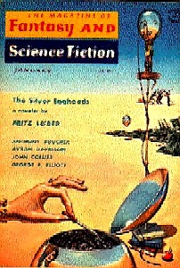

<!-- translated by DeepL -->

# The Way the Future Blogs

Фредерик Пол

## Сирил



Думаю, [Сирил Корнблат](https://web.archive.org/web/20090425195253/http://www.luna-city.com/sf/cmk.htm) понял, что хочет стать писателем, в том возрасте, когда это поняло большинство из нас, то есть в раннем подростковом возрасте.  Его первые попытки, или, по крайней мере, первые, о которых я что-то знал, не были рассказами.  Это были стихи.

У него была книга, написанная, кажется, одним из его школьных учителей, в которой приводились правила написания всех видов стихов, о которых я когда-либо слышал.  Мы с Сирилом изучили книгу и решили написать по одному стихотворению.  Мы неплохо начали, написав [хайку](https://web.archive.org/web/20090425195253/http://www.toyomasu.com/haiku/#whatishaiku) (мы писали его "хокку"), [вилланеллу](https://web.archive.org/web/20090425195253/http://www.poets.org/viewmedia.php/prmMID/5796), [сестину](https://web.archive.org/web/20090425195253/http://www.poets.org/viewmedia.php/prmMID/5792), два [сонета](https://web.archive.org/web/20090425195253/http://www.poets.org/viewmedia.php/prmMID/5791) (один петрарковский, другой шекспировский) и, кажется, еще парочку.  Мы увязли, когда дошли до [chant royal](https://web.archive.org/web/20090425195253/http://www.benybont.co.uk/triolet/chant.htm) (chant royal - это *HARD*), и, как и большинство других футурианцев, решили попытать счастья в научной фантастике.  В то время, думаю, Сирилу было лет четырнадцать, а я на три-четыре года старше.

Если у Сирила и были любимчики среди его рассказов, он не говорил мне о них.  Он серьезно относился к своим работам и очень злился, когда редакторы их портили.  (Особенно [Хорас Голд](https://web.archive.org/web/20090425195253/http://www.iblist.com/author2749.htm).)

У Сирила были отличные рабочие привычки.  Когда он садился писать, он писал.  Я не знаю, чтобы он когда-либо сидел непродуктивно, уставившись в пространство, более нескольких минут за раз, прежде чем положить слова на бумагу, и он редко переписывал.

  
[Ф&СФ](https://web.archive.org/web/20090425195253/http://www.fandsf.com/)
[Bob Mills](https://web.archive.org/web/20090425195253/http://www.thewaythefutureblogs.com/remembering-robert-p-mills/)
[Fritz Leiber's](https://web.archive.org/web/20090425195253/http://www.waldeneast.fsnet.co.uk/leibercontents.htm)
[The Silver Eggheads](https://web.archive.org/web/20090425195253/http://www.amazon.com/gp/product/0345216342?ie=UTF8&tag=7159-20&linkCode=as2&camp=1789&creative=390957&creativeASIN=0345216342)

К сожалению, здоровье Сирила ухудшалось.  Отчасти это было связано с тем количеством кофе, сигарет, горячих бутербродов с пастрами и алкоголя, которое он поглощал с подросткового возраста, но в основном это было связано с войной.  Призывной номер Сирила подошел раньше, но он поймал передышку.  Некоторое время он работал в механической мастерской, поэтому у него был опыт управления металлообрабатывающим оборудованием.   Это было как раз то, что нужно артиллеристам, поэтому его взяли на работу в пушечно-ремонтные мастерские, которые всегда располагались достаточно далеко от линии фронта, чтобы враг не мог молниеносно налететь и украсть ценные станки.  Это была такая безопасная и приятная работа, за которую несколько миллионов солдат продали бы свое правое яичко, но в 1944 году появилось предложение получше.

Высшие чины в командных кругах армии подсчитали, что война, скорее всего, продлится еще несколько лет, и если так, то может возникнуть серьезная нехватка кандидатов с высшим образованием для службы в качестве офицеров.  Они не хотели остаться без этих ценных ресурсов, поэтому быстро организовали так называемую Программу специализированной подготовки армии, по которой солдаты, которым посчастливилось быть принятыми, освобождались от всех обязанностей, кроме учебы в колледже.  Для большинства солдат это звучало как райская мечта, и не в последнюю очередь потому, что в результате неустанных призывов в армию в большинстве колледжей образовался избыток молодых незамужних женщин.

Сирил подал заявление, был принят и с радостью вернулся в школу, правда, в военной форме... пока какой-то человек повыше начальства не заметил, что и немцы, и японцы проигрывают большинство последних сражений, и война может закончиться раньше, чем они опасались.  Поэтому ASTP была императивно упразднена, а весь ее личный состав волей-неволей переведен в пехоту.  В этом роде войск армия испытывала большую и непредвиденную потребность, так как Гитлеру удалось провести грандиозную внезапную рождественскую атаку на ничего не подозревающие войска союзников в Арденнском лесу.

  
[Battle of the Bulge](https://web.archive.org/web/20090425195253/http://www.pbs.org/wgbh/amex/bulge)

Гипертония победила. Редакторская карьера Сирила оборвалась - очень жаль, ведь он мог бы стать выдающимся специалистом.  Ранней весной 1958 года у него была запланирована встреча с Бобом Миллсом в Нью-Йорке.  В Левиттауне, где жил Сирил, выпал сильный снег.  Ему пришлось разгребать подъездную дорожку, из-за чего он едва успел на поезд, поэтому побежал на вокзал и умер от сердечного приступа на платформе.

**К.М. Корнблат работает в Интернете**

- "[Единственное, чему мы учимся](https://web.archive.org/web/20090425195253/http://www.webscription.net/chapters/0671698265/0671698265___7.htm)" (из журнала Startling Stories, июль 1949 года)
- "[Червь разума](https://web.archive.org/web/20090425195253/http://www.scifi.com/scifiction/classics/classics_archive/kornbluth/kornbluth1.html)" (Из журнала Worlds Beyond, декабрь, 1950)
- "[The Cosmic Expense Account](https://web.archive.org/web/20090425195253/http://manybooks.net/titles/kornbluthcother08cosmic_expense_account.html)" (Из НФ, январь 1956)

[К.М. Корнблат на Amazon](https://web.archive.org/web/20090425195253/http://www.amazon.com/gp/redirect.html?ie=UTF8&location=http%3A%2F%2Fwww.amazon.com%2Fs%3Fie%3DUTF8%26x%3D0%26ref%255F%3Dnb%255Fss%255Fb%26y%3D0%26field-keywords%3Dc%2520m%2520kornbluth%26url%3Dsearch-alias%253Dstripbooks&tag=7159-20&linkCode=ur2&camp=1789&creative=390957)

### 5 комментариев

- [Стив Дэвидсон](https://web.archive.org/web/20090425195253/http://www.rimworlds.com/thecrotchetyoldfan) сказал:
Фред, спасибо тебе большое за то, что поделился с нами этим.  Я любил и Сирила, и твои произведения и очень люблю романы, которые вы написали вместе.  Это сблизило меня с Сирилом, я узнал о нем некоторые вещи, которых не знал.
[**April 20, 2009, 8:49 am**](/fred-pohl/2009-04-20-cyril/)
- [Luke McGuff](https://web.archive.org/web/20090425195253/http://holyoutlaw.livejournal.com/) говорит:
Спасибо, что написал эти воспоминания. Я тоже причисляю ваши совместные работы к любимым НФ-романам моего золотого века.
[**April 20, 2009, 12:47 pm**](/fred-pohl/2009-04-20-cyril/)
- [Стефан Джонс](https://web.archive.org/web/20090425195253/http://home.comcast.net/%7Estefan_jones/kira_grinning_lo.JPG) говорит:
Представленный сборник (*His Share of Glory*) полон замечательных вещей и очень рекомендуется. Корнблат писал сатирическое фэнтези за десятилетия до того, как такие парни, как Аспирин и Пратчетт, сделали его популярным.
Примечание для путешественников во времени, которые могут прочитать это: Подумай о том, чтобы перепрыгнуть в 1958 год, арендовать джип и подвезти этого парня.
[**April 20, 2009, 1:39 pm**](/fred-pohl/2009-04-20-cyril/)
- [Elio M. García, Jr.](https://web.archive.org/web/20090425195253/http://www.westeros.org/) рассказывает:
Я только начал учиться в младшей школе (сейчас это можно отнести к 19 годам), когда влюбился в научную фантастику. Я поглощал книги, которые были в моей школьной и местной библиотеках, и, конечно же, они склонялись к романам и сборникам, содержащим великих, классических авторов. Азимов, Хайнлайн, Кларк... и Корнблат (и, если можно так выразиться, Поль). В раннем детстве я прочитал биографический отрывок о Сириле, и он поразил меня (даже в том юном возрасте) как настоящая трагедия, что он умер таким молодым, когда писал такие замечательные истории.
Спасибо, что поделился своими воспоминаниями о нем.
[**April 21, 2009, 2:53 am**](/fred-pohl/2009-04-20-cyril/)
- Говорит Скотт Хаугер:
Просто хочу сообщить тебе, что я очень ценю и наслаждаюсь чтением твоего блога, особенно биографических мемуаров авторов НФ.  Я достаточно взрослый, чтобы прочитать пару твоих совместных работ с Сирилом Корнблатом, когда они только вышли (а также почти все \"juveniles\"} Хайнлайна.  
Но больше всего мне нравятся романы о Вратах (Gateway).  Как ты пришел к их основной концепции?
[**April 21, 2009, 9:23 pm**](/fred-pohl/2009-04-20-cyril/)

[WordPress](https://web.archive.org/web/20090425195253/http://wordpress.org/)
[TWTFB](https://web.archive.org/web/20090425195253/http://dicksmithsoftware.com/)