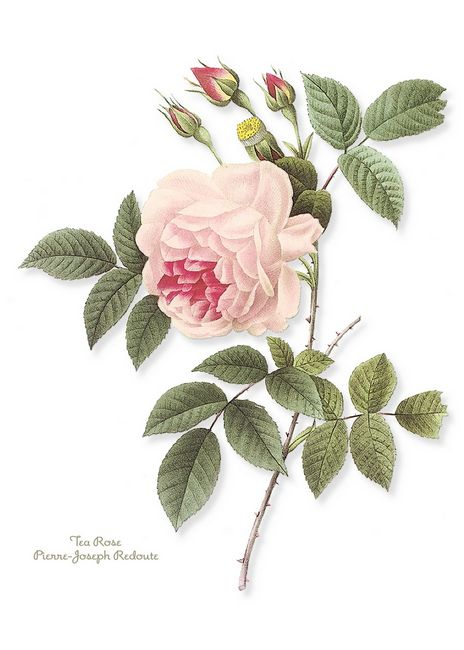

# The Way the Future Blogs

Frederik Pohl

## A Rose By Any Other Name

**By Elizabeth Anne Hull**



Is there any name that can’t be misspelled?  Even John Smith can be Jon Smythe, and a bunch of permutations besides.  We all think our names are *important, even if we hate* our own names, right?   As a baby — before I  had any say in the matter — I  had to be “Betty Anne,” because my mother was already Betty, but I dropped the middle name — which somehow seems to me either diminutive or Southern country (like Billy Bob or Jimmy Jack or Sue Ellen or Mary Jane) — when I went away to college.

Some folks even go to court to get their names changed; my baby sister did it to change Gertrude to “Trudy.”

When an acquaintance who should know better calls Bob “Jim,” Bob may not say anything, but he surely will find it unsettling, to say the least.  Many of us experienced our parents calling us by a sibling’s name.

Some people seem to be incapable of pronouncing certain names.  A friend named Kirsten frequently is called “Kristen.”  My late brother-in-law Anthony was called “Ant-nee” by most of his childhood friends in a Sicilian-immigrant neighborhood.  And aside from the pronunciation of the name, the spelling also seems to be important to us.

Some parents delight in inflicting common names with variant spellings — like Shawn (for Sean) — or unusual or archaic names on their children (like Horace or Hortense or Homer or Peril).  Others want to continue a dynasty, with Juniors, III, IV, V, etc.  Still others superstitiously don’t ever name a baby after a living person, feeling it’s like wishing that person dead already.   From generation to generation, Jews I know  retranslate a Hebrew name into a more modern equivalent.

Many people name their children after popular celebrities, European royalty, people prominent in the Bible or the Koran, etc. or favorite or admired friends, or parents just pick a name that they feel will be normal or acceptable.  Immigrant families often try to Americanize their ethnic names.    Most people  will try to avoid naming children the same name as some individual of infamy — like, when was the last time you met anyone named Adolph?

Though our given names are neither common nor particularly odd, Fred and I have had our problems with the spelling of our names.  I didn’t take Fred’s family name when we married, having gone to some length to reclaim my maiden name just prior to earning my doctorate, because I saw no reason to bestow my accomplishment on the name of my first husband.  (That didn’t solve all my name problems, though, because some people — especially in medical settings — don’t feel comfortable calling me Dr. Hull, so they want to call me Mrs. Hull, making me feel creepy, as if I’ve been married off incestuously to my father.)

And we will always have the problem of people who haven’t met one of us calling me “Mrs. Pohl” or calling Fred “Mr. Hull.”   But spelling is also a problem.  Many who claim to be readers and  Fred’s admirers still want to insert a “c” into Frederik, especially when asking for an autograph.  Even my own relatives sometimes take away the “e” from my middle name.  Not to mention that Elizabeth can be spelled with an “s” for the “z,” and Hull often turns into “Hall” or “Hill” or — you can imagine other variations.  Pohl can become “Phol” or “Pohol” or endless other permutations.

Recently we received a very nice thoughtful card from the committee of a con (that I don’t want to identify by name) which we had  missed due to illness.  Interestingly, the envelope was addressed to “Betty and Fred Hull.” One part of me is amused, but another aspect of my being is deeply disturbed by this.

How would you react if something similar happened to you?

### 19 Comments

- Jane says:
The married name vs maiden name is a problem that will be solved within the next couple of generations, as younger people are more-and-more not bothering with the formality of marriage.  I know that I’m getting Mrs’d a lot less by cold callers, so I think it’s started already.
[**April 30, 2009, 2:59 am**](/fred-pohl/2009-04-30-a-rose-by-any-other-name/)
- [Chookie](https://web.archive.org/web/20090515185434/http://chookiesbackyard.blogspot.com/) says:
I retained my name when I married for similar reasons to yours (except for possession of the ex and the doctorate).  People boggled a bit, fifteen years ago — apart from Dad, who was rather pleased.  My name is uncommon and long, so if the Geek was addressed as Mr Chookie, I’d be amused.  I usually am when people try to pronounce it!
And I can always spot a cold-caller because they invariably address me as Mrs Geek…
[**April 30, 2009, 7:43 am**](/fred-pohl/2009-04-30-a-rose-by-any-other-name/)
- [Jeff](https://web.archive.org/web/20090515185434/http://jeffcrook.blogspot.com/) says:
As you can imagine, I have had issues through the years with my last name - Crook.
Every person I meet seems to believe they are the first person to ever think of the joke “Are you a Crook?” Har, har, har. 
Then there are the people afraid to mispronounce it who inevitably mispronounce it. Mostly I’m called Mr. Cook, but I’ve also been called Mr. Crock and Mr. Crotch. In what world is it better to be a crotch than a crook?
[**April 30, 2009, 8:33 am**](/fred-pohl/2009-04-30-a-rose-by-any-other-name/)
- [kaellinn18](https://web.archive.org/web/20090515185434/http://ipushbuttons.blogspot.com/) says:
I would probably just take it in stride. My last name is Silverthorn, so you can only imagine the seemingly hundreds of different mutilations I’ve seen of my name over the years. I’ve gotten to the point where I just ignore things that don’t have my name correctly spelled.
As for naming conventions, my family has had a tradition for several generations where the first son’s middle name is the father’s first name. I think it’s a neat tradition, and I plan to carry it on.
[**April 30, 2009, 9:01 am**](/fred-pohl/2009-04-30-a-rose-by-any-other-name/)
- Anon says:
“One part of me is amused, but another aspect of my being is deeply disturbed by this.”
I don’t know. Concerned, perhaps, but disturbed?
Incidentally, was the card handwritten? It could be that the committee (mis)used some sort of automated system.
[**April 30, 2009, 9:39 am**](/fred-pohl/2009-04-30-a-rose-by-any-other-name/)
- Elizabeth Coleman says:
I’ve also got the Elizabeth/Elisabeth problem. When I worked for a student-run newspaper in college, for the first four issues or so, they never got my name right–and it was a different misspelling each time! I decided at the time to just laugh at it, and hope it became a running gag. I go by different variants on Elizabeth in different settings. I like the idea of my sense of identity not being tied to a name. 
That said, I’ve got friends who are transgendered, and/or have unusual names, and with them, a certain obligation is felt to make sure people don’t slip into the default line of thinking. People’s minds hate making unnecessary leaps. I’d never caught the lack of “c” in Frederik.
Just talking about it here on the blog might be enough for you. Word will get around. 
I’ve also seen the opposite happen: A con I was at sent a request to a certain author to attend. That author sent back a letter conveying regrets that they couldn’t attend [name of convention that totally wasn't the one that invited him]. He sent an autographed book in his place, which was auctioned off along with the embarrassing letter!
[**April 30, 2009, 11:09 am**](/fred-pohl/2009-04-30-a-rose-by-any-other-name/)
- [Lisa C.](https://web.archive.org/web/20090515185434/http://birdcastle.blogspot.com/) says:
My dad got tired of waiting for grandkids, so he cranked out another batch of kids of his own. He turns 70 this year, and his youngest (of four in this batch) turns 16. All of us (his wife included) have gotten used to being called JuliaLydiaJoyceLisa, or some variation thereof. At least he keeps the genders separate and doesn’t include the dog.
And my problem is that I am called by a derivitave of my middle name, which I dropped when I got married. And I’m also working on the decision whether to reclaim my maiden name post-divorce. I’ve been “C” for so long now that it’s part of who I am, and most of the people I know don’t know me any differently. I’m still trying to decide whether the long-term can o’ worms is worth it.
Parents name their children with odd pronounciations / spellings of relatively common names so that the kids can be different - they’ll have a leg up on standing out in a crowd of Michaels and Jacobs and Emilys and Jessicas (but not so much as to name them something totally off-the-wall - there is a line). The child gets to deal with it for their entire lives - “It’s Shawn, spelled with a ‘w’” becomes a mantra of sorts.
Women I think, have it more difficult: whether you take your husband’s name and deal with the changes and corrections, or don’t and deal with the explanations and misattributions - neither is a clear road. And then there’s the decision to make after divorce.
So I guess - like so many other decisions - you make the naming choice that’t right for you and live with the set of consequences that choice entails.
And because you have great respect for the women you were named after, you choose not to change your first name so you get used to saying “I was the first female grandchild on both sides, so there was serious pressure on my folks to name me after every great-grandmother living and dead, and they somehow managed it, but the first name is also my mother’s name and she hates it, so she said ‘fine, but we won’t call her that, we’ll call her Lisa instead.’”
… yeah, my mantra’s a bit long …
[**April 30, 2009, 12:01 pm**](/fred-pohl/2009-04-30-a-rose-by-any-other-name/)
- A. says:
Most of my misspellings of names is fingers getting in the way.  Or skipping letters.  I use a variation on my first initial and last name in most of my signins, and I often miss either the l or the t, or replace the t with a g as I’m typing my own name in.  Once–only once–someone wanted to use the French spelling of my first name, “Aimee.”  That threw me.  LOL  More often, my last name, because I don’t always enunciate it, can be misspelled as “Shellon,” “Shetton,” or, most frequently, “Sheln,”; it’s quite common to see on junk mail that it’s misspelled “Skelton.”
[**April 30, 2009, 11:23 pm**](/fred-pohl/2009-04-30-a-rose-by-any-other-name/)
- sm says:
I have a last name that is very difficult to spell — I have to spell it for every new person. I am struck that with your more average North American name that inaccuracy bothers you at least as much as me.
[**May 1, 2009, 10:33 am**](/fred-pohl/2009-04-30-a-rose-by-any-other-name/)
- [Quentin Hudspeth](https://web.archive.org/web/20090515185434/http://quentinhudspeth.com/) says:
Oh, I don’t know. I suppose I’d just laugh it off. I’ve been dealing with the screwed up name problem all my life. Upon graduating from high school, I had a scholarship made out to Quentin Huds_t_eth (emphasis added). As a babe, my own godfather gifted me with a charm bracelet inscribed to Quinton. And, there was the lovely time when my girlfriend and I were shopping. She made out a check for payment, and, after the cashier looked at the check, I was told, “Have a nice day, Mr. Lynn”. (She’s now Dr. Hudspeth, by the way.) I’m still surprised, after all the fame of director Tarantino, just how many people don’t even have a guess as to how to spell Quentin.
Q
[**May 1, 2009, 1:22 pm**](/fred-pohl/2009-04-30-a-rose-by-any-other-name/)
- Lee Gold says:
I chose to take my husband’s last name because I felt safer with him (and his father) than with my own father — and it had four letters instead of ten — and it was easier to spell.  Though there are some people who ask me “How do you spell ‘Gold’?” (I think because they didn’t pay attention when we were introduced).  
With the first name of “Lee” (Lee Ann or Lee Anne when I was a child), I occasionally encounter people who write to me as “Mr.”  It’s always a bit disconcerting.  (My parents deliberately chose a unisex name so they could buy a war bond in my name before I was born, partly as a sign of faith that my mother’s previous miscarriage wouldn’t be repeated.)  

I was named after my father’s mother Leanora (who died when my father was 15), who was named after her grandfather’s commanding officer, General Lee.  I chose the “Hebrew name” of Leah when I got married, but had to tell the rabbi that I didn’t think my grandmother had had a Hebrew name and I was absolutely sure that Robert E. Lee hadn’t had one. 
Meanwhile my husband is Barry Gold whose problem is that he’s got a very common name, so we get phone calls for one of the many other Barry Golds who live in the LA area.  
And at one point our friendship circle (and the local SF fan club) had two women named Diane Myers.
[**May 1, 2009, 7:22 pm**](/fred-pohl/2009-04-30-a-rose-by-any-other-name/)
- Nicholas Waller says:
I get called “Walker” fairly often by people mis-hearing the surname and so have to spell it out. I once got a letter addressed to Nick Wobbler (and a friend called Carolyn Dougherty was once addressed as Karen Dirty on a letter).
As for naming conventions, my father, brothers and I all have a silent H in our first names… this started by accident and was turned into a convention by the time I (middle son) was born. This goes wrong in the US for my brother Anthony, who finds his gets the “th” pronounced there, instead of just as “t”. 
And our middle names are all the maiden names of relevant relatives - so my brother has my mother’s maiden name, and I have my grandmother’s (which was Armitage, and causes comment when deployed).
[**May 2, 2009, 2:36 pm**](/fred-pohl/2009-04-30-a-rose-by-any-other-name/)
- Neil says:
It’s not going to stop.  Regardless of the acuity of your insights, analyses, or etiquette critiques, so you might as well just resign yourself to gently correcting people and let it go.  Not at all to suggest that you or your feelings are at all wrong, just that it’s not going to stop.  

We have a family joke on the subject.  When my mother (nee “Rosenberg”) married my father (”Rest”), she joked that now she wouldn’t have trouble with misspellings of her name.  On their honeymoon they sent some laundry to the hotel laundry, and it came back with “Rest” carefully crossed out and “West? Best?” written in.
[**May 3, 2009, 5:54 pm**](/fred-pohl/2009-04-30-a-rose-by-any-other-name/)
- A. says:
I just remembered something.  You asked if there was a name that *couldn’t* be misspelled–I once had an uncle named K.  Just K.  Rather difficult to misspell.  
[**May 4, 2009, 4:59 pm**](/fred-pohl/2009-04-30-a-rose-by-any-other-name/)
- [the blog team](https://web.archive.org/web/20090515185434/http://thewaythefutureblogs.com/) says:
Kay? Kaye?
[**May 4, 2009, 11:28 pm**](/fred-pohl/2009-04-30-a-rose-by-any-other-name/)
- [Marc Novak](https://web.archive.org/web/20090515185434/http://en.wikipedia.org/wiki/Haplogroup_Q_(Y-DNA)) says:
Fortunately my name doesn’t lend itself to permutations but from time to time people do spell “Marc” with a ‘k’, even when armed with the knowledge of how my name is actually spelt. I don’t mind at all if my name is misspelt in the context of receiving an invitation or a card from someone I’ve had little or no contact with over the years. It can however be a little irritating when I sign a written communication ‘Marc’ and the response comes back ‘Mark’.
My surname is an anglicised version of “Nowak” or “Novák” and only on the rarest occasions does someone spell it as the non-anglicised version. Typically that only occurs verbally, e.g. when I’m asked, how do you spell ‘Novak’ is it ‘Nowak’? Which when it happens, I actually quite like.
I’m happy I don’t have a given name that has common permutations. The odds against an individuals wish to retain a particular spelling ‘vs‘ societies need to find the lowest common denominator, declare familiarisation and endearment, must be quite high.
[**May 5, 2009, 2:46 am**](/fred-pohl/2009-04-30-a-rose-by-any-other-name/)
- A. says:
Yeah, K can be misspelled.  LOL  I should have seen that coming.
[**May 5, 2009, 6:32 pm**](/fred-pohl/2009-04-30-a-rose-by-any-other-name/)
- [ChiaLynn](https://web.archive.org/web/20090515185434/http://www.artoftheodd.com/) says:
I’ve gotten used to introducing myself as “Chia, yes like the pet,” just to get it out of the way. It’s also, really, the easiest way to remember it.
I didn’t quite manage to retrieve my maiden name before I had a degree made out in it (two of them, in fact), but went back to it soon after, and kept it when I remarried. When I was using my first husband’s name, though, I also used my maiden name as a second middle name - not hyphenated. You can imagine the bizarre permutations. My favorite was “Mr. Evers C. Fischer.” Mr. Fischer used to get quite a few invitations to tropical resorts.
[**May 6, 2009, 1:34 pm**](/fred-pohl/2009-04-30-a-rose-by-any-other-name/)
- [Eunoia](https://web.archive.org/web/20090515185434/http://www.savory.de/blog.htm) says:
Because people had a problem pronouncing my surname, when I went online I chose ‘Eunoia’ as a nickname,only to discover that most people couldn’t pronounce it either, let alone know what it means  
Stu Savory
[**May 8, 2009, 1:51 pm**](/fred-pohl/2009-04-30-a-rose-by-any-other-name/)

[WordPress](https://web.archive.org/web/20090515185434/http://wordpress.org/)
[TWTFB](https://web.archive.org/web/20090515185434/http://dicksmithsoftware.com/)