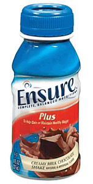

<!-- translated by Yandex Translate -->

# Путь к блогам будущего

Фредерик Пол

## Я и ребята из Абу-Грейб

Существует напиток-пищевая добавка под названием [Ensure Plus](https://web.archive.org/web/20090516003745/http://ensure.com/index.aspx), который мои врачи рекомендуют мне принимать дважды в день с целью вернуть часть веса, который я потеряла за последние пять или шесть лет из-за различных заболеваний.  Это не так уж плохо.

Я пробовал коктейли и похуже в некоторых сетях быстрого питания, и они бывают четырех видов, в основном пригодных для питья.  Их ореховое масло с орехами пекан и шоколад особенно вкусны (и я говорю как человек, который однажды отправил обратно шоколад "Стейк и шейк" как непригодный к употреблению), а клубника неплохая, хотя по вкусу она больше похожа на джем, чем на свежие фрукты.  Что касается ванили, то я воздерживаюсь от комментариев, отчасти потому, что этот аромат мне не очень нравится с самого начала, но в основном потому, что я читаю этикетку.  (Который называет себя “Домашней ванилью”, несмотря на то, что в состав ингредиентов входит много веществ, которые, я думаю, нельзя найти ни в чьей домашней кухне.)

Как бы то ни было, я узнал (из [шоу Стивена Колберта “Фейковые новости](https://web.archive.org/web/20090516003745/http://www.colbertnation.com/the-colbert-report-videos/225298/april-21-2009/the-word---stressed-position)” — газеты и новостные журналы, которые я читал, не упоминали об этом), что Ensure Plus сыграла значительную роль в "жестком допросе" — мы не будем использовать слово "Т" — который наши люди проводили с заключенными в тюрьме [Абу-Грейб](https://web.archive.org/web/20090516003745/http://www.salon.com/news/abu_ghraib/2006/03/14/introduction/index.html). Один из их методов состоял в том, чтобы ограничить питание испытуемых диетой в 1000 калорий в день — ровно настолько, чтобы испытуемые не ставили их в неловкое положение, падая замертво от голода.  И, если Кольбер излагает свои факты правдиво — кто-нибудь там знает? — эти ежедневные калории поступали из одной бутылки Ensure Plus каждый день.  (Сравните с моими двумя бутылками плюс тремя порциями обычного питания в день.)

Я могу себе представить, что это заставило бы почти любого сказать почти все, что угодно, за сэндвич с болонской колбасой — хотя, конечно, у вас не было бы никакой возможности узнать, является ли сказанное им правдой или выдумкой.  Но это всегда проблема при усиленном допросе, не так ли?

### 6 Комментариев

- [Джефф](https://web.archive.org/web/20090516003745/http://jeffcrook.blogspot.com/) говорит:
Не проблема - функция, если то, что вы ищете, - это разведданные, полезные для пропаганды.
Когда несколько лет назад моему сыну удалили миндалины, у него был неприятный опыт, и он перестал есть. Поскольку он и без того был ужасно худым, он не мог позволить себе сбросить те 8 фунтов, которые сбросил за четыре дня. Возможно, это и не спасло его жизнь, но уж точно спасло мою (смерть от беспокойства). После дня, проведенного на обеспечении, он снова начал есть, а к концу недели вернулся в бэттери, хотя все еще выглядел так, словно побывал в лагере для военнопленных Конфедерации.
[**5 мая 2009 года, 8:28 утра**](/fred-pohl/2009-05-05-me-and-the-guys-at-abu-ghraib/)
- [Крисс](https://web.archive.org/web/20090516003745/http://tv.wetgenes.com/) говорит:
Я нахожу интересным, что поддельные новости могут содержать больше новостей, чем настоящие.
Не поймите меня неправильно, я понимаю, что все, что происходит, - это то, что поддельные новости действуют в условиях, отличных от реальных новостей. Это не лучше, это просто по-другому, и с этой точки зрения это неправильно или правильно по-разному.
Странно, но я ожидаю, что фейковые новости будут содержать меньше подтасовок фактов и с меньшей вероятностью будут откровенно лгать мне. А ты?
Что действительно интересно, измените правила производства, и вы получите другой объем информации.
Точно так же Википедия не лучше и не хуже настоящей энциклопедии, она просто работает в условиях другого набора ограничений, что делает ее другой.
С этой целью я экспериментирую с дизайном “игры” и “инструмента”. Не потому, что я думаю, что так будет лучше, просто по-другому, а непохожесть - это интересно…
[**5 мая 2009, 14:15 вечера**](/fred-pohl/2009-05-05-me-and-the-guys-at-abu-ghraib/)
- [Себимейер](https://web.archive.org/web/20090516003745/http://www.sebimeyer.com/) говорит:
Пытка.
Вот, сказал это за тебя. Потому что иногда называть вещи своими именами - это половина работы.
[**6 мая 2009 года, 10:25 утра**](/fred-pohl/2009-05-05-me-and-the-guys-at-abu-ghraib/)
- Брат говорит:
Я думаю, что в целом фейковые новости (Кольбер и Теонион как классические примеры) в наше время имеют больше свободы быть честными, чем настоящие новости.  Кольбер является конкретным примером, его “фальшивка”, так сказать, проистекает скорее из поддержки позиции, которой он не придерживается, нежели из фактов, которых не существует - фальшивые факты, когда они существуют, как правило, очевидны и юмористичны, и, как правило, не относятся к делу.
Шоу Кольбера во многом является отражением нелепой природы сегодняшних новостей.  Вы понимаете, особенно если вы также смотрите the Daily show (меньше фальши, больше издевательства), что то, во что он утверждает, что верит в шутку, - это то, что другие считают настоящей правдой.  Все, что ему нужно сделать, это представить аргументы немного по-другому, и он проливает разоблачающий свет на очевидные недостатки в самих аргументах.
Правда через вымысел.  И это сегодняшнее слово.
[**6 мая 2009, 17:13 вечера**](/fred-pohl/2009-05-05-me-and-the-guys-at-abu-ghraib/)
- Джон Эйч говорит:
The Daily Show и Colbert Report выполняют ту же функцию, что и придворный шут в средневековых судах — смешивают факты с юмором, чтобы развлечь массы за счет правящего класса.
[**6 мая 2009, 19:33 вечера**](/fred-pohl/2009-05-05-me-and-the-guys-at-abu-ghraib/)
- Тина Блэк говорит:
Да, меня сводит с ума, когда я слышу, как старина Дик Чейни разглагольствует о “ценных разведданных”, когда ты знаешь, что эти замученные заключенные скармливали ему именно то, что он хотел услышать.  Иногда заблуждения сильных мира сего особенно корыстны.
[**9 мая 2009 года, 18:20 вечера**](/fred-pohl/2009-05-05-me-and-the-guys-at-abu-ghraib/)

[WordPress](https://web.archive.org/web/20090516003745/http://wordpress.org/)
[TWTFB](https://web.archive.org/web/20090516003745/http://dicksmithsoftware.com/)