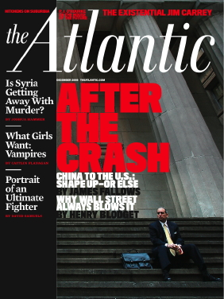

<!-- translated by Yandex Translate -->

# Путь к блогам будущего

Фредерик Пол

## Интересное чтение, которое Вы, возможно, пропустили

["Атлантик](https://web.archive.org/web/20090726215213/http://www.theatlantic.com/)" - это журнал, с которым мне никогда не было комфортно.  Несколько лет я подписывался на него — и по мере того, как каждый выпуск, наполненный мелочами, появлялся в моем почтовом ящике, задавался вопросом, почему, - пока время от времени они не публиковали статью, которую я был действительно рад прочитать, и я стискивал зубы и подписывался на другую.  Их декабрьский номер за 2008 год (как вы видите, я читаю их не так быстро, как они приходят) - один из таких, только на этот раз это не просто одна статья, на которую я продолжаю призывать людей взглянуть.  Их всего двое.

Первая написана бывшим управляющим фондом Генри Блоджетом, и называется она “[Почему Уолл-стрит всегда терпит неудачу](https://web.archive.org/web/20090726215213/http://www.theatlantic.com/doc/200812/blodget-wall-street)”. Блоджет должен знать, потому что (как он говорит в статье) “Я был известным аналитиком по технологическим акциям в Merrill Lynch.  Я был знаменит, потому что был на правильной стороне бума в конце 1990-х... К концу 1998 года я предупреждал клиентов, что "то, что выглядит как пузырь, вероятно, таковым и является", но это меня не спасло.  Пятнадцать месяцев спустя я промахнулся мимо вершины и свел своих клиентов прямо с обрыва”.

И так, по словам Блоджета, всегда будут поступать люди в его положении, потому что такого рода пузырь, при котором цена ценных бумаг поднимается намного выше их реальной стоимости, обязательно произойдет... и обязательно лопнет.

Каково же решение?  Ведь вы хотите купить и удерживать до тех пор, пока пузырь не раздуется, но убирайтесь до того, как он лопнет.  Это хороший совет, и если следовать ему, вы могли бы стать по-настоящему богатым... но вы не можете ему следовать.  Блоджет пытался это сделать.  Он сократил и посоветовал своим клиентам сократить расходы на акции высокотехнологичных компаний, которые подпитывали бум.

Чертовы штуки продолжали подниматься — очень высоко — в любом случае.

Вы можете видеть, что акции, которые вы сбросили, уходят далеко за пределы того уровня, по которому вы их продали, ровно на столько времени, прежде чем начнете думать, что они будут продолжать это делать, и вы упустили момент.  Для Блоджета этот момент наступил, когда “в начале 2000 года, за несколько недель до того, как пузырь лопнул, я вложил много денег туда, где был мой рот.  Два года спустя я потерял сумму, эквивалентную шести высшим образованиям в колледже”.  Потому что, как он также говорит, слишком ранний выход из пузыря вызывает почти столько же проблем, сколько и слишком поздний выход из него.

Другая статья в том же номере называется “[Будьте добры к странам, которые одалживают вам деньги](https://web.archive.org/web/20090726215213/http://www.theatlantic.com/doc/200812/fallows-chinese-banker)”, и это текст записанного разговора между финансовым обозревателем Джеймсом Фэллоузом и Гао Сицином, который является управляющим значительной частью денег, одолженных Китаем Соединенным Штатам. Государства.  Гао - симпатичный китаец американского типа с дипломом юриста университета Дьюка и американским послужным списком, включающим работу в юридической фирме Ричарда Никсона на Уолл-стрит.

Я не собираюсь пытаться кратко изложить то, что он сказал Фэллоузу, только хочу сказать вам, что если вы прочтете это, то будете рады, что сделали — даже если у вас кровь застынет в жилах, когда Фэллоуз намекнет на принцип “слишком велик, чтобы обанкротиться” применительно к американскому долгу, подразумевая, что Китаю это обошлось бы слишком дорого, и Гао соглашается: “Да, в краткосрочной перспективе, но не в долгосрочной”.

### 3 Комментария

- [Джефф](https://web.archive.org/web/20090726215213/http://jeffcrook.blogspot.com/) говорит:
Пол Кругман написал несколько интересных вещей о долларовой ловушке, в которой оказался Китай. Они действительно ничего не могут сделать со всем этим американским долгом, которым владеют, не обрушив свою собственную экономику. Это одна из причин, по которой Китай настаивает на создании мировой торговой валюты, которая заменила бы доллар. 
Кругман также писал об экологических проблемах Китая, в частности о выбросах CO2. [http://www.nytimes.com/2009/05/15/opinion/15krugman.html?_r=1&amp;partner=rssnyt&amp;emc=rss](https://web.archive.org/web/20090726215213/http://www.nytimes.com/2009/05/15/opinion/15krugman.html?_r=1&partner=rssnyt&emc=rss)
На мой взгляд, Китай сидит на экологической бомбе замедленного действия. Они отравляют свою землю, воду и воздух с неприемлемой скоростью. Сегодня они могут быть экономическим локомотивом, но в долгосрочной перспективе их страна станет непригодной для жизни. Затраты на устранение беспорядка, который они устроили в своем стремлении стать экономической сверхдержавой, в конечном счете подорвут китайскую экономику, что, в свою очередь, еще больше уведет остальной мир от той самой экономической модели, основанной на потреблении, которая создала китайскую сверхдержаву. 
Мое мнение - следующие 20 лет будут... интересными. В ближайшие 20 лет мир изменится так же сильно, как и за последние 100. Перемены неизбежны, но как они изменятся, еще предстоит увидеть.
[** 18 мая 2009 года, 9:30 утра**](/posts/2009-05-13-interesting-reading-that-you-may-have-missed/)
- [Даг Кей](https://web.archive.org/web/20090726215213/http://dkretzmann.blogspot.com/) говорит:
Джеймс Фэллоуз на самом деле не является "финансовым" писателем как таковым. Впрочем, его стоит почитать на любую тему. Найдите его веб-блог по адресу

[http://jamesfallows.theatlantic.com /](https://web.archive.org/web/20090726215213/http://jamesfallows.theatlantic.com/)
Я собираюсь подписаться на the Atlantic, и это в основном потому, что я хотел бы помочь поддержать его работу.. 
Теперь мы все кейнсианцы..  

“Рынок может оставаться иррациональным дольше, чем вы можете оставаться платежеспособным”. Джон Мейнард Кейнс
[**18 мая 2009, 16:55 вечера**](/posts/2009-05-13-interesting-reading-that-you-may-have-missed/)
- Тина Блэк говорит:
Я вывел все свои рыночные активы, когда индекс ДОУ-Джонса был на уровне 14 000.  Хороший ход.
 
[** 31 мая 2009 года, 10:53 утра**](/posts/2009-05-13-interesting-reading-that-you-may-have-missed/)

[WordPress](https://web.archive.org/web/20090726215213/http://wordpress.org/)
[TWTFB](https://web.archive.org/web/20090726215213/http://dicksmithsoftware.com/)