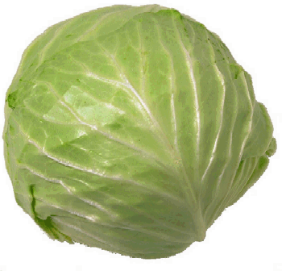

<!-- translated by Yandex Translate -->

# Путь к блогам будущего

Фредерик Пол

## Еще больше изысканных блюд

[Рецепт супа—](/fred-pohl/2009-03-22-gracious-dining/)пюре Fred's Cream из картофеля, моркови, лука и хот—догов стал таким хитом - ну, по крайней мере, для вас двоих, - что я собираюсь поделиться с вами секретом еще одного из моих тщательно охраняемых блюд, на этот раз для моей версии ветчины. и капустный суп.** Для этого вам понадобится:

(В крайнем случае, вы можете использовать спам вместо необработанной свинины.  Только не говорите своим гостям, что вы это сделали.)

Как долго вы готовите ингредиенты, зависит от того, насколько нежной вам нравится ваша капуста.   Моя жена любит, чтобы он был хрустящим.  Мне нравится, когда его доводят до состояния подчинения.  Что касается меня, то я отвариваю ее вместе с мясом в течение 15 минут, прежде чем добавить остальные ингредиенты, затем готовлю, пока морковь не станет мягкой.  Попробуйте перед подачей на стол и поперчите.  Никакой соли, если только ее не потребует какая-нибудь закусочная-салофил; в свином окороке ее предостаточно.

На 4 порции с остатками.

### 4 Комментария

- Джеймс говорит:
Бинго!  Вы дали мне отличный рецепт, чтобы я попробовала его в следующий раз, когда буду есть ветчину.  Спасибо вам!
[**7 июня 2009, 11:32 вечера**](/fred-pohl/2009-06-07-more-fine-dining/)
- Джеймс говорит:
Ах да, я забыл спросить - что вы делаете с костью?  Добавьте его или используйте в другом рецепте? Мы с женой готовим клецки с ветчинной косточкой, которые отлично подходят в холодный день.
[**7 июня 2009 года, 11:35 вечера**](/fred-pohl/2009-06-07-more-fine-dining/)
- Тина Блэк говорит:
Да, я любитель соли.  Большое время.
Этот рецепт кажется почти подходящим для зимы.  Я трачу 4 месяца на приготовление одной кастрюли супа за другой и сохранила рецепты.  Капуста часто была основным ингредиентом, так же как морковь и картофель.
[**15 июня 2009, 20:52 вечера**](/fred-pohl/2009-06-07-more-fine-dining/)
- Кирк Снейвли говорит:
Попробовал, и ему понравилось.  Не знала, должна ли я была нарезать овощи, но все равно сделала это.  В следующий раз, возможно, попробую его с сырым свиным окороком, а не с копчеными окорочками.  Спасибо!
[**6 июля 2009 года, 11:55 утра**](/fred-pohl/2009-06-07-more-fine-dining/)

[WordPress](https://web.archive.org/web/20090821145731/http://wordpress.org/)
[TWTFB](https://web.archive.org/web/20090821145731/http://dicksmithsoftware.com/)