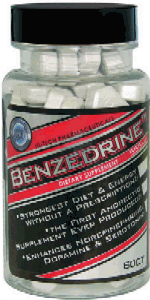

<!-- translated by Yandex Translate -->

# Путь к блогам будущего

Фредерик Пол

## Те дни

В те далекие времена, когда мы с [Сирилом Корнблатом](https://web.archive.org/web/20120826232512/http://www.luna-city.com/sf/cmk.htm) писали такие книги, как "Торговцы Космосом([The Space Merchants](https://web.archive.org/web/20120826232512/http://www.amazon.com/gp/product/0312749511?ie=UTF8&tag=7159-20&linkCode=as2&camp=1789&creative=390957&creativeASIN=0312749511)) и "Гладиатор По Закону([Gladiator-at-Law](https://web.archive.org/web/20120826232512/http://www.amazon.com/gp/product/0671655663?ie=UTF8&tag=7159-20&linkCode=as2&camp=1789&creative=390957&creativeASIN=0671655663))", у нас была идея для эксперимента.  Написание шло довольно хорошо, как обычно, но мы не были довольны тем, что оставили well enough в покое.

Газеты были полны историй о новых фармацевтических препаратах под названием [бензедрин и декседрин](https://web.archive.org/web/20120826232512/http://www.time.com/time/magazine/article/0,9171,892615,00.html), которые, как иногда казалось, помогали людям бодрствовать и работать дольше и лучше.  Итак, один из нас — я не помню, кто именно — сказал другому: “Интересно, сделали бы они что-нибудь для писателей”, а другой ответил: “Не знаю.  Давай выясним.”

Так мы и сделали.  В следующий раз, когда Сирил пришел поработать, он захватил с собой все необходимое.  Я вызвался пойти первым, так что я принял удар и сел писать.  И я написал.  Я был уверен, что начну писать, как только сяду за стол, и мне это в значительной степени удалось.  Я мог видеть, чем закончится эта сцена, и какими будут осложнения для персонажей, и какими должны быть их действия в результате, и какие альтернативные решения они, возможно, предпочли бы принять.  Все это было совершенно ясно и прямолинейно.

Слова вышли сами собой, и когда я заполнил четыре страницы, я спустился вниз, где Сирил пил кофе и читал утреннюю "Таймс", чтобы сказать ему, что эксперимент был многообещающим.  Затем он отработал свой срок и, когда он закончился, сообщил, что он тоже так думает.

Я не думаю, что мы оставались возбужденными до конца книги.  Я тоже не знаю почему, но я почти уверен, что мы просто вернулись к старому способу, когда каждый перелистывал по четыре страницы, пока роман не был завершен. (Нет, я не помню, что это была за книга.)

Итак, книга была закончена и передана издателю.  И Сирил уехал домой в Левиттаун, а я занялся своей собственной работой.  И со временем, возможно, полгода или больше спустя, я столкнулся с той ужасающей вещью, которую они называют писательским кризисом.

В этом вопросе я не эксперт, и я даже не уверен, что то, что иногда случается со мной, действительно заслуживает такого названия.  Я не теряю способности писать.  Вместо этого я теряю способность верить, что то, что я пишу, хоть сколько-нибудь хорошо, и иногда (как я узнаю по прошествии времени и смотрю на эти страницы более критически) на самом деле это не так.

Так что же мне с этим делать?  Я переписываю и продолжаю возвращаться к тому же самому, пока не становится лучше.

Но это медленный и болезненный процесс, и в данном случае мне внезапно пришло в голову, что у меня может быть идея получше, потому что мы с Сирилом израсходовали не весь наш декседрин.  В аптечке в ванной на третьем этаже было достаточно лекарств для более тщательного исследования.

Поэтому я разыскал свою тогдашнюю жену Кэрол, чтобы сказать ей, что в тот вечер я буду работать допоздна.  Она помогла, приготовив ранний ужин, и, вероятно, вскоре после семи вечера я сидел за своим "Ремингтоном Электрик", накормленный, напоенный кофе, напичканный маленькими белыми таблетками и готовый сочинять.

Страхи и беспокойства, которые парализовали мои пальцы, больше не появлялись.  Мои руки были расслаблены, они едва не тянулись к клавиатуре, а в голове складывались предложения.  Я четко осознавал, что должны были сделать мои персонажи, чтобы выбраться из утомительной передряги, в которую я их втянул, и что могло бы происходить в другом месте моей сюжетной вселенной, что могло бы положить начало хорошему новому эпизоду.   По глупости я сам запутался в бессмысленных и ненужных осложнениях.  Но выход было легко найти, и тогда двигаться вперед было бы только в интересах КХЛ.  Я не продумал свою предысторию до конца.  Я и не подозревал, как легко и неизбежно события могут вписаться в приятное повествование — действительно, в одну из самых изящных построчных прозаических работ в моей жизни —

И тут я услышал голос Кэрол с лестницы.   “Я думаю, что собираюсь упаковать это.  Хочешь сегодня покормить в два часа ночи?”

Была почти полночь.  Я просидел перед этой клавиатурой почти пять часов, счастливо наслаждаясь осознанием того, что решил все проблемы с написанием, с которыми сталкивался.  И ни одно слово, даже запятая, не попало на бумагу.  И это то, что я обнаружил о химически опосредованном письме.

Я разговаривал с другими писателями, у которых были подобные разочарования, но не с теми, кто пользовался новыми усилителями мозга.  Кто-нибудь из вас, ребята, там знает кого-нибудь, у кого есть?

### 13 Комментариев

- [Янус](https://web.archive.org/web/20120826232512/http://janusfiles.xanga.com/) говорит:
Единственным химическим средством, которое я когда-либо использовал во время написания, был кофе.  И я узнал, что хорошего действительно может быть слишком много.  Это был День благодарения, и я просматривал кое-какую корреспонденцию.  Я влил в свой организм так много кофе, что мне пришлось остановиться, потому что я не мог держать пальцы на клавиатуре.
[** 20 июня 2009 года, 10:22 утра**](/fred-pohl/2009-06-20-them-days/)
- [Брайан ти](https://web.archive.org/web/20120826232512/http://stereoroid.com/) говорит:
Единственное, к чему я пришел при написании книг, опосредованных наркотиками, - это чрезмерное употребление кофе в течение 36 часов, тестирование компьютерного оборудования и написание обзоров. Это было не так уж требовательно к воображению, но довольно тяжело для системы. Мне пришлось бросить эту работу, потому что я серьезно беспокоился о своем здоровье, физическом и психическом, и стресс, возможно, вызвал ранние симптомы того, что, как я впоследствии узнал, было рассеянным склерозом. (Вы не должны падать со стула в ресторане за обедом!) 
Мне нравится комментарий в той статье журнала Time 1959 года, на которую вы ссылались: “Я бы не хотел, чтобы легкая атлетика дошла до того, что вам пришлось бы проверять победителей, как скаковых лошадей”. Вот это я и называю предвидением!
[** 20 июня 2009 года, 10:51 утра**](/fred-pohl/2009-06-20-them-days/)
- Уильям говорит:
Я больше склоняюсь к эссе, чем к художественной литературе, и мое добавление означает, что никто вообще не должен воспринимать мой опыт как обязательно связанный с химией их мозга. Но иногда я нахожу полезным принимать ~ 15 мг модафинила (он же Провигил) первым делом с утра. (Это означает сокращение стандартной дозы, 100 мг, на 6-8 небольших кусочков.) Я настоятельно избегаю употреблять больше или принимать его чаще, чем раз в два дня.
Я думаю, что у этого есть ряд недостатков, но это существенно помогает мне сосредоточиться, и в конечном итоге я могу быть очень продуктивным. Однако я бы посоветовал людям относиться к нему (или к любому препарату, обладающему когнитивными эффектами) с большой осторожностью. То, что он делает на самом деле, и то, что вы хотите, чтобы он делал, будет слегка отличаться, и если вы будете основывать свое поведение на неправильном, неприятности гарантированы.
Что касается писательства, в частности, я думаю, что опасно слишком сильно забивать себе голову. Когда мы пишем, мы должны постоянно осознавать, как наши результаты будут восприниматься целевой аудиторией. Эта аудитория, по большому счету, не будет на том, на чем вы выступаете.
[**20 июня 2009, 14:07 вечера**](/fred-pohl/2009-06-20-them-days/)
- Дионубис говорит:
Совсем недавно у меня был точно такой же опыт. В настоящее время я заканчиваю свою диссертацию, и недавно мне прописали Аддералл, часто являющийся образцом препаратов, “усиливающих работу мозга” или “повышающих работоспособность”, который на 72% состоит из лиздексамфетамина (соединение d-амфетамина и лизина). Когда я прочитал ваш пост, я понимающе усмехнулся про себя от того, насколько хорошо я знаком с вашим опытом. 
Когда я впервые принял Аддералл, в моей голове прояснилось так, как никогда раньше. Это было так, как если бы мои мысли были помещены в коробку с крошечным отверстием спереди, позволяющую интенсивно фокусироваться через это крошечное отверстие. Я могу писать плавно и разборчиво, не обращая внимания на “утомительный беспорядок” моих хаотичных исследований. Я помню, как чувствовала разочарование, удивляясь, почему мне никогда раньше не прописывали лекарства, учитывая, с какими трудностями я сталкивалась, сосредотачиваясь и работая со средней школы. Когда я описал свой опыт своим коллегам, они посмотрели на меня как на сумасшедшего и сказали: “Я всегда так себя чувствую...”
С другой стороны, когда у меня был писательский кризис, он действовал точно так же, как вы описали. Я все еще вижу, как преодолеть все проблемы и на самом деле создать замечательную прозу. Но это никогда не попадает на страницу. На самом деле, я становлюсь * настолько* сосредоточен на том, как все идеально сочетается друг с другом, что иногда смотрю на часы и вижу, что прошло 6-7 часов, а я вообще не прикасался к клавиатуре.
Я все еще принимаю это (предписания врача), но я должен быть очень внимателен к своему душевному состоянию, когда готовлюсь писать. Если я намереваюсь писать, это сработает чудесно. Если я уже колеблюсь, заблокирован или даже боюсь того, что мне предстоит написать, Adderall не собирается *заставлять* меня писать. Как я объяснил своему другу, это даст вам сосредоточенность, но не мотивацию.
[**21 июня 2009 года, 9:25 вечера**](/fred-pohl/2009-06-20-them-days/)
- [Джефф](https://web.archive.org/web/20120826232512/http://jeffcrook.blogspot.com/) говорит:
Я написал последние 40 000 слов "Темного Тана" за 4 дня, пока у меня был бронхит. К счастью, у меня также было лекарство от кашля с кодеином. Единственной борьбой было оставаться бодрствующим. История практически написана сама собой.
[** 22 июня 2009 года, 8:38 утра**](/fred-pohl/2009-06-20-them-days/)
- Джон Эйч говорит:
Только не очередной допинговый скандал!
[**22 июня 2009, 16:42 вечера**](/fred-pohl/2009-06-20-them-days/)
- Джей Си говорит:
В IIRC Хамфри Дэвис попробовал закись азота (тогда это был новый продукт, о котором говорили, что он дает замечательные результаты) и записал свои впечатления того времени. Замечательное, многозначительное, о-о-очень глубокое озарение, которое он получил, было следующим: "В целом здесь пахнет жареным луком".
[** 23 июня 2009 года, 11:22 утра**](/fred-pohl/2009-06-20-them-days/)
- [Мартин Виссе](https://web.archive.org/web/20120826232512/http://cloggie.org/books/) говорит:
Однажды я по глупости съел три особенных брауни вскоре друг за другом, и примерно через час у меня не могли перестать появляться замечательные, потрясающие идеи примерно каждые тридцать секунд – к сожалению, объем моего внимания сократился менее чем до пятнадцати....
[**23 июня 2009, 18:34 вечера**](/fred-pohl/2009-06-20-them-days/)
- [Брейден](https://web.archive.org/web/20120826232512/http://songsandcigarettes.blogspot.com/) говорит:
Возможно, стоит придерживаться испытанных методов великих американцев - сигарет и скотча.
[**25 июня 2009, 11:05 вечера**](/fred-pohl/2009-06-20-them-days/)
- [Тодд Мейсон](https://web.archive.org/web/20120826232512/http://www.socialistjazz.blogspot.com/) говорит:
Я использую некоторые “умные напитки” (особенно низкоуглеводные монстры), но не нахожу их особенно эффективными при написании художественной литературы, по крайней мере ... я уверен, что они едва ли считаются “умными напитками”, поскольку по сути представляют собой Маунтин Дью или консервированный кофе со следами аминокислот и витаминов.. С моим третьим и четвертым глазами все в порядке.
[**6 июля 2009, 14:53**](/fred-pohl/2009-06-20-them-days/)
- Эл Богдан говорит:
Лучшим усилителем для меня оказались высокие дозы витаминов В12, В9 и В6, принимаемые первым делом с утра. Улучшает мое кровяное давление, облегчает мне сон по ночам и улучшает концентрацию внимания в течение дня.
[**12 июля 2009, 20:43 вечера**](/fred-pohl/2009-06-20-them-days/)
- Марк говорит:
Пачка нефильтрованного "кэмела", шесть банок ДЖОЛТ-КОЛЫ и три таблетки для похудения моей сестры помогли мне закончить две работы и сдать математику в весеннем семестре моего первого курса.  Я также помог двум десяткам человек переехать из своих комнат на летние каникулы.
[** 15 июля 2009, 19:58 вечера**](/fred-pohl/2009-06-20-them-days/)
- Аарон говорит:
Я написал много историй, принимая сильные опиатные обезболивающие.  Проблема была не в том, чтобы перенести слова на бумагу.  На самом деле, написание было плавным и легким.  Нет, проблема была в том, что я действительно думал, что все, что я написал, находясь под влиянием, было замечательным.  Только позже я узнал правду.  Опиаты и писательство плохо сочетаются.
[** 29 апреля 2010 года, 6:44 утра**](/fred-pohl/2009-06-20-them-days/)

[WordPress](https://web.archive.org/web/20120826232512/http://wordpress.org/)
[TWTFB2](https://web.archive.org/web/20120826232512/http://dicksmithsoftware.com/)