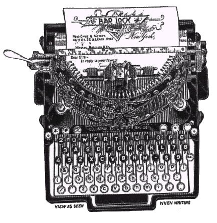

# The Way the Future Blogs

Frederik Pohl

## Some Feedback. Finally

Some of you may remember that some time ago I warned you (twice, actually) that I couldn’t take on a correspondence or even answer letters because [**my right hand**](/posts/2009-01-19-why-i-m-no-pen-pal/) was basically paralyzed and that was the one I wrote with.  Well, it’s still paralyzed.  But I have learned some useful ways of getting around that, to some extent, so I’m going to try to respond to a few communications now.

As you know I’m a beginner at this blog racket.  I don’t know whether it’s etiquette to use people’s actual names, so I’m going to play it safe this time and disguise them.

First a thank you to one I will call DB.  I recently published [**a short essay**](/posts/2009-09-17-let-there-be-fandom-the-science-fiction-league/) on the impetus given to the growth of science-fiction fandom, but said I knew I had published it somewhere already but couldn’t remember where,

DB could.  He wrote,  “I can tell you where you published this.  It’s the opening of the second chapter of *The Way the Future Was*.”

Well, so it was.  That’s a little embarrassing — I didn’t think I was really losing my marbles quite that fast — but anyway thanks!

And happens I have some news about that.  I’ve just signed contracts with Baen Books for the reissue of some chunks of my earlier writing in the electronic book format, including [The Way the Future Was](https://web.archive.org/web/20091204223402/http://www.amazon.com/gp/product/0345260597?ie=UTF8&tag=7159-20&linkCode=as2&camp=1789&creative=390957&creativeASIN=0345260597).  Don’t yet know when they’ll be available, but when I do, you’ll see it here.

And since others commented that they enjoyed reading this sort of ancient history now and then we’ll go ahead and publish the rest of the chapter, shortly.

I was tickled by the comments on [**my story**](/posts/2009-08-28-when-i-graduated-from-high-school-after-73-years/) about finally being granted a high-school diploma, seventy-odd years after becoming a dropout.  A bunch of old buddies got off their duffs long enough to write things like:  “Mazel tov.  Now you can make something of yourself,”  and,  “A person of your intelligence should go on to higher education.  By choosing the right major you can expect a good job when you graduate.”  Etc.

How disrespectful these people are of their elders.  But I love them anyway.

There were almost as many comments on my two postings about [**L. Ron Hubbard**](/posts/2009-09-04-the-worlds-of-l-ron-hubbard/),  A couple of them were quite unhappy with me, for example a woman who wrote:  “I have been a subscriber..  Now I will unsubscribe.”

I’m truly sorry about that.  I’m not trying to make anyone unhappy, so perhaps I should try to spell out what I do try to do.

When I talked about the Scientologists I mentioned that I knew there were reports of terrible things they are said to have done.  I didn’t repeat any of the stories because I had no personal knowledge of how accurate they were, and they didn’t need to be reported as some kind of a public service since they were already widely published.

As we get on in the histories of [John Campbell](https://web.archive.org/web/20091204223402/http://www.thewaythefutureblogs.com/tag/campbell-john-w/) and his involvement with Scientology, etc., there will be some reports I will make about events concerning them.  I won’t, however, print any unless I myself know them to be true or, alternatively, I have been told about them by people I trust who were on the scene.  And if the latter, I will always tell you who my informants were.

Looking at this from the other side:  When I wrote about the Writers (and Artists) of the Future contests, I’m sure the heads of that enterprise would have preferred that I be a little less candid about a few parts of it.  But I was urging beginning writers to take advantage of it, and I couldn’t fail to mention what I thought were its (relatively few) drawbacks.  So candor won.

Candor will generally win in whatever I write.  I won’t publish scandal just for scandalousness’ sake, but I’ll try to tell the simple facts except when (rarely) they might cause more pain than benefit.  That won’t be a big problem.  Most of the sf people I know, which is way the largest fraction of recent generations of them, are basically quite decent folk.

### 10 Comments

- Mike Woodhouse says:
I have been a subscriber. If you start letting blog commenters tell you what you should write, I may unsubscribe. But most likely I won’t.
Regarding the naming of names: I think it’s pretty much accepted in Greater Blogdom that the name someone leaves on a reply has passed into the public domain. Doesn’t mean you have to use it, but you can.
[**September 25, 2009, 9:50 am**](/posts/2009-09-25-some-feedback-finally/)
- [Jeff](https://web.archive.org/web/20091204223402/http://jeffcrook.blogspot.com/) says:
Most large organizations these days, be they corporations or churches or political parties, have people in their employ whose job it is to visit blogs and harrass bloggers who post uncomplimentary things about their organizations. 
I was reading a post on another blog today regarding tazers and their abuse, and it wasn’t too long before a comment appeared that was obviously written by someone from the makers of electronic torture and compliance enforcement devices, extolling its virtues and decrying its detractors. 
It’s best to learn to recognize them, and then ban or ignore them.
[**September 25, 2009, 4:11 pm**](/posts/2009-09-25-some-feedback-finally/)
- [RBH](https://web.archive.org/web/20091204223402/http://www.pandasthumb.org/) says:
Though names on private emails are not fair game.
(And the captcha on this blog is awful for those of us with old eyes.  It took me 2 3 tries to post this comment.)
[**September 25, 2009, 7:04 pm**](/posts/2009-09-25-some-feedback-finally/)
- [Scott Hauger](https://web.archive.org/web/20091204223402/http://www.jscotthauger.com/) says:
Re the atypical hand (pun intended).  Have you looked into speech recognition software that converts speech to text?
[**September 25, 2009, 11:20 pm**](/posts/2009-09-25-some-feedback-finally/)
- [Robert Nowall](https://web.archive.org/web/20091204223402/http://www.robertnowall.com/) says:
I kick myself—mentally—for not checking my copy of “The Way the Future Was,” which is not behind the boxes in my so-called library, but in a different pile in the living room.
[**September 26, 2009, 9:23 am**](/posts/2009-09-25-some-feedback-finally/)
- David Ratnasabapathy says:
I’ve been a fan ever since I came across “Man Plus” at the library.  I’m a regular customer at Baen Webscriptions.  Put your books there and I will buy!
[**September 26, 2009, 10:27 am**](/posts/2009-09-25-some-feedback-finally/)
- David Bratman says:
You are welcome.  This is the second time I have been, I hope, of help to you in a bibliographical matter.  After a book of Worldcon GoH speeches was published a couple years ago, and yours from 1972 wasn’t in it, I photocopied that speech from its published appearance and sent it to Steven Silver (publisher of the book), who promised to pass it along to you.  I trust that he did so.
It may not surprise you that I am a librarian by trade.
[**September 26, 2009, 1:00 pm**](/posts/2009-09-25-some-feedback-finally/)
- Joseph Crockett says:
Dear Mr. Pohl,
I am confused: was the lady upset because she felt that you spoke ill of Scientology or because you hadn’t? I didn’t take anything you wrote as derisive. You seem to have a healthy cynicism regarding power, in general, and religion, specifically. I, at half your age, share that cynicism and feel free to share it with anyone who feels that they must try to push their belief system on me. A man of your wisdom and experience should write what he wishes in his blog and I, for one, will thank you for doing just that.
I would like to take this opportunity to thank you for the blog and for your great body of work. I am not a prolific reader, but I have read more books by you than any other writer(more than twenty)and I think they have been the single biggest influence since childhood in shaping my worldview. The admiration of one more fan during such a long and illustrious career probably doesn’t count for much, but I offer it nonetheless, and most sincerely. Thank you again, sir.
Joseph Crockett
[**September 26, 2009, 5:10 pm**](/posts/2009-09-25-some-feedback-finally/)
- Jeff G says:
Mr. Pohl,
For myself, I appreciate your candor. I’m glad you’re restricting yourself to those things you know of personally rather than speculate. We’ve plenty of that from many sources. 
Your friends, of course, are just looking out for you. They’re right, it is terribly hard to hold down a good job without a diploma these days. This is no doubt a relief to them.  
In general, when dealing with a private correspondence, I leave the names out on my own blog, unless I get prior permission. Pretty much how you’d do it in other media, I gather.
[**September 27, 2009, 12:29 am**](/posts/2009-09-25-some-feedback-finally/)
- Joe Fodor says:
Grand Master Pohl:
How delightful to read you in blog format — you take up a lot of space on my shelves and now I suppose you will be occupying some of my hard drive. I am anxiously awaiting a discussion of “Sorority House” and Jordan Park!
[**September 29, 2009, 8:41 am**](/posts/2009-09-25-some-feedback-finally/)

[WordPress](https://web.archive.org/web/20091204223402/http://wordpress.org/)
[TWTFB](https://web.archive.org/web/20091204223402/http://dicksmithsoftware.com/)