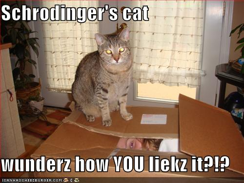

<!-- translated by Yandex Translate -->

# Путь к блогам будущего

Фредерик Пол

## Решение Деборы Вебстер

  
[Лолк-коты и забавные картинки](https://web.archive.org/web/20091204224043/http://icanhascheezburger.com/)

Прошлой зимой Дебора Вебстер из Мидоубрука, Новый Южный Уэльс, Австралия, была обеспокоена тем, как многие ученые, казалось, относились к животным, которых они изучали, — как к “роботам, управляемым стимулом-реакцией, неспособным думать или чувствовать”, - поэтому она написала [New Scientist](https://web.archive.org/web/20091204224043/http://www.newscientist.com/article/mg20026861.000-trained-scientists.html) с предложением: “Каждый ученый, работающий в этой области надо бы завести кошку.”

Это было бы сделано в учебных целях.  Затем, когда ученый будет полностью обучен таким вопросам, как открывание и закрывание дверей, правильный выбор корма для кошек и обеспечение удобных коленей для сидения, он сможет вернуться в свою лабораторию с углубленным пониманием своего предмета.

### 5 Комментариев

- Моз говорит:
Интересно, что она предложила интродуцированный вид вредителя в качестве предпочтительного домашнего животного. Интересно, пытается ли она помочь “ученым” (этой туманной группе неэмоциональных других) развить эмпатию; или показать им, насколько раздражающими могут быть домашние животные, чтобы они были более склонны проводить эксперименты, которые приводят к гибели большого количества диких вредителей. Мне также любопытно, что, по ее мнению, произойдет с вредителями после окончания эксперимента, поскольку, предположительно, они либо вернутся в лабораторию, либо будут утилизированы.
[**1 октября 2009 года, 2:30 ночи**](/fred-pohl/2009-10-01-deborah-webster-s-solution/)
- [Ли Голд](https://web.archive.org/web/20091204224043/http://www.conchord.org/xeno/leegold.html) говорит:
Явный случай зацикленности на кошках: собака могла бы быть столь же полезна.  Хорошая собака могла бы научить ученого бросать мячи, покупать правильный корм для собак, делиться приемлемыми объедками со стола и научиться получать удовольствие от того, что ему моют морду.
[**2 октября 2009 года, 12:32 утра**](/fred-pohl/2009-10-01-deborah-webster-s-solution/)
- [Джефф](https://web.archive.org/web/20091204224043/http://jeffcrook.blogspot.com/) говорит:
Я только что получил два. Фотографии здесь: [http://jeffcrook.blogspot.com/2009/09/behold-week-of-cats.html](https://web.archive.org/web/20091204224043/http://jeffcrook.blogspot.com/2009/09/behold-week-of-cats.html)
С другой стороны, я не ученый.
[**2 октября 2009 года, 8:14 утра**](/fred-pohl/2009-10-01-deborah-webster-s-solution/)
- Пол Кэмп говорит:
Ученые не могут справиться с кошками, потому что природа разумна.
[**3 октября 2009, 10:41 вечера**](/fred-pohl/2009-10-01-deborah-webster-s-solution/)
- Патриция говорит:
Независимо от того, как долго человек сосуществует с домашней кошкой, он никогда не придет к более глубокому пониманию ее.
Я пришел к тому, чтобы принять это.
Мне нужно идти, моя кошка сейчас хочет есть.
[**4 октября 2009, 10:11 вечера**](/fred-pohl/2009-10-01-deborah-webster-s-solution/)

[WordPress](https://web.archive.org/web/20091204224043/http://wordpress.org/)
[TWTFB](https://web.archive.org/web/20091204224043/http://dicksmithsoftware.com/)