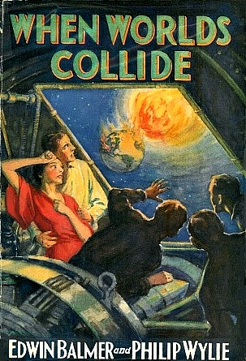

<!-- translated by DeepL -->

# Блоги о будущем

Фредерик Пол

## Ссоры среди звёзд

Если и есть какая-то программа, от которой выиграл бы каждый живой человек, так это программа по обнаружению и контролю за N.E.O. — объектами, сближающимися с Землёй, — то есть за блуждающими астероидами или ядрами комет, которые нацелились на эту прекрасную планету, на которой мы живём. Дело в том, что если бы такой объект появился сейчас в поле зрения наших телескопов — скажем, размером с [Чиксулуб](https://web.archive.org/web/20091208090202/http://www.thunderbolts.info/tpod/2006/arch06/060919chicxulub.htm), который погубил динозавров, — мы бы ничего не смогли с этим поделать, разве что помахать рукой на прощание.

Это не значит, что мы вообще ничего не можем сделать. Наоборот. Просто сейчас у нас нет возможности что-то с этим поделать. В будущем, если мы начнём готовиться к действиям уже сейчас, мы смогли бы сделать чертовски много — начав, скажем, с систематического сканирования околоземных объектов (N.E.O.), чтобы определить, какие из них представляют угрозу (это уже началось, и на самом деле регулярно выявляются те, что пролетают ближе всего к Земле — хотя, к сожалению, большинство из них обнаруживается только после того, как они уже пролетели мимо нас.  Такая ситуация нам явно не на руку).  Но если бы нам удавалось выявлять их раньше, то мы могли бы даже спроектировать и построить флот космических буксиров, чтобы изменять орбиты опасных ОСЗ так, чтобы они не сталкивались с Землёй, а пролетали мимо.

Это не простые задачи.  Если просто сложить все эти затраты, то общая сумма, скорее всего, превысит бюджет всей нынешней мировой космической программы — насколько именно, я не знаю.

Но это только начало.  Если бы мы успешно реализовали такую программу, это могло бы спасти нас от внезапного вымирания.  Но здесь речь идёт лишь о том, что уничтожило бы большую часть жизни на самой планете.  А как насчёт чего-то меньшего, скажем, тунгусского столкновения, которое уничтожило бы один город?  На самом деле [тунгусское событие](https://web.archive.org/web/20091208090202/http://www.sciencedaily.com/releases/2009/06/090624152941.htm) (30 июня 1908 года) не уничтожило город.  Оно уничтожило лишь несколько тысяч акров незаселённого сибирского леса, потому что именно там ему посчастливилось упасть.

Но это не обязательно должно было быть таким безобидным. Поскольку место падения такого объекта по сути случайное, он с таким же успехом мог бы упасть на Таймс-сквер, что означало бы мгновенное уничтожение всего Нью-Йорка.

Тебе это не напоминает что-нибудь, ну, страшное?  Потому что мне — да.  И я почти уверен, что в этом мире много людей, которые сочли бы весьма интересным использовать твой космический буксир… по-другому.

Один из способов заставить астероид пролететь мимо города и вместо этого упасть в море (что, конечно, создаёт свои проблемы с цунами и так далее, но пока об этом не будем) — это подлететь к нему на твоём космическом буксире и вытолкнуть его на чуть другую орбиту.

Нет проблем?

Ну, не совсем так, что проблем нет вовсе.  Есть некоторые довольно проблематичные теоретические возможности.

Представь, что пилот твоего космического буксира — ну, скажем, иранец. И представь, что он горячо верит в правоту взглядов своего президента на Израиль, и почему бы ему не сбросить этот астероид прямо на, скажем, Тель-Авив?

Перенаправление астероидов на другую орбиту, как мы уже описывали, может когда-нибудь спасти нас всех от вымирания. Но с другой стороны, это может стать самым смертоносным оружием, которое когда-либо придумал наш бесконечно изобретательный вид.

Впрочем, нам ведь не стоит всерьёз беспокоиться, что это может стать реальностью, правда?

Я имею в виду, что все космонавты и астронавты мира — здравомыслящие, спокойные люди, которые ни за что не позволят каким-то посторонним соображениям отвлечь их от своих обязанностей.  Поверь мне.  [Посторонние факторы](https://web.archive.org/web/20091208090202/http://www.telegraph.co.uk/news/worldnews/europe/russia/5079904/Trouble-in-space-Row-brews-on-space-station-over-food-and-toilets.html) никак не мешают людям на Международной космической станции выполнять свои обязанности.

Но если тебя беспокоят эти истории о разногласиях на станции, которые время от времени до нас доходят, успокойся. Да, русские однажды не пустили американцев в свои туалеты. Американцы в ответ выгнали русских из американского тренажёрного зала. Потом даже грозились ограничить доступ к еде, воде и даже воздуху.

Но всё в порядке. Расслабься. Спи спокойно.

### 5 комментариев

- Пол А. говорит:
Ты же не был причастен к этой мистификации с латвийским метеоритным кратером, правда? Хороший способ привлечь внимание к проблеме околоземных объектов…
[http://www.wtkr.com/news/nationworld/sns-ap-eu-latvia-meteorite,0,1920607.story](https://web.archive.org/web/20091208090202/http://www.wtkr.com/news/nationworld/sns-ap-eu-latvia-meteorite,0,1920607.story)
[**26 октября 2009 г., 13:38**](/fred-pohl/2009-10-26-squabbles-in-the-stars/)
- [Джефф](https://web.archive.org/web/20091208090202/http://jeffcrook.blogspot.com/) пишет:
Мой первый опубликованный рассказ в жанре научной фантастики был о пилоте буксира, который отправляется в пояс астероидов, чтобы добывать астероиды и тащить их обратно на Землю — для превращения в орбитальную недвижимость, а также в оружие. Он вышел в сборнике «Дети Солнца» в 2003 году. Я перепечатал её здесь: [http://jeffcrookfiction.blogspot.com/2008/10/roid.html](https://web.archive.org/web/20091208090202/http://jeffcrookfiction.blogspot.com/2008/10/roid.html)
[**26 октября 2009 г., 15:02**](/fred-pohl/2009-10-26-squabbles-in-the-stars/)
- [Джефф](https://web.archive.org/web/20091208090202/http://jeffcrook.blogspot.com/) пишет:
Вообще-то, 8 октября над Сулавеси раздался громкий взрыв. Астероид диаметром примерно 10 метров взорвался на большой высоте с силой, равной трём хиросимским бомбам. Он взорвался достаточно высоко, чтобы не нанести никакого ущерба на земле. 
[http://www.newscientist.com/article/dn18046-asteroid-blast-reveals-holes-in-earths-defences.html](https://web.archive.org/web/20091208090202/http://www.newscientist.com/article/dn18046-asteroid-blast-reveals-holes-in-earths-defences.html)
Я что, сошёл с ума, или боги что-то затеяли против Индонезии?
[**28 октября 2009 г., 10:37**](/fred-pohl/2009-10-26-squabbles-in-the-stars/)
- Э. Дж. Гарсия говорит:
Кстати, о ближних космических объектах: всего несколько недель назад [над Индонезией взорвался астероид](https://web.archive.org/web/20091208090202/http://www.telegraph.co.uk/science/space/6444895/Asteroid-explosion-over-Indonesia-raises-fears-about-Earths-defences.html) с энергией, равной трём бомбам, сброшенным на Хиросиму.  Может, это просто совпадение?
[**28 октября 2009 г., 18:23**](/fred-pohl/2009-10-26-squabbles-in-the-stars/)
- Э. Дж. Гарсия говорит:
Кстати, если никто ещё не прокомментировал это, что ты думаешь о том самом печально известном астероиде Апофис, мистер Пол?  2029–2036 годы, к счастью, уже далеко за пределами твоей жизни, но будущие поколения наверняка смогут воспользоваться твоими знаниями (если, конечно, ты захочешь что-нибудь добавить).
[**3 ноября 2009 г., 14:42**](/fred-pohl/2009-10-26-squabbles-in-the-stars/)

[WordPress](https://web.archive.org/web/20091208090202/http://wordpress.org/)
[TWTFB](https://web.archive.org/web/20091208090202/http://dicksmithsoftware.com/)