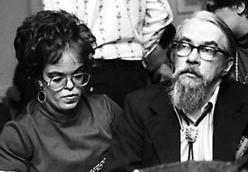

<!-- translated by Gemini (gemini-2.5-flash-lite) -->
# The Way the Future Blogs

Фредерик Пол

## Лестер и Джуди-Линн дель Рей

  

Довольно много лет назад — ну, лет семьдесят, если быть точным — я был подростком-редактором двух профессиональных научно-фантастических журналов для гигантской pulp-фирмы [Popular Publications](https://web.archive.org/web/20091211203126/http://www.nypl.org/research/chss/spe/rbk/faids/popular.html). Я не особо платил за истории, которые попадали в мои журналы, но платил хоть что-то, и поэтому большинство писателей-фантастов той эпохи заглядывали время от времени, чтобы посмотреть, не захочу ли я избавить их от стопки отвергнутых *Astounding*.

Люди вроде старого [Рэя Каммингса](https://web.archive.org/web/20091211203126/http://www.isfdb.org/cgi-bin/ea.cgi?Ray_Cummings) и ярких новых звезд вроде [Л. Спрэга де Кампа](https://web.archive.org/web/20091211203126/http://www.lspraguedecamp.com/bio.html) заходили в мой маленький офис на конце 42-й улицы, там, где она упирается в Ист-Ривер, и однажды наша телефонистка, Этель Клок, сообщила мне, что у меня новый посетитель по имени [Лестер дель Рей](https://web.archive.org/web/20091211203126/http://www.nndb.com/people/208/000085950).

Хотя я никогда не встречал этого человека, я знал имя; я видел его, завистливо, бесчисленное количество раз на странице содержания *Astounding*. «Впускай немедленно!» — приказал я, надеясь, что он принесет рукописи, и через пару минут он стоял там, невысокий, с ангельским лицом, ненамного старше меня самого — и, да, с двумя рукописями рассказов в руках!

Для таких событий существует установленная процедура. Она не позволяет редактору выхватывать машинописные тексты из рук автора, или автору бросать их из дверного проема без слов. Сначала нужно немного поболтать туда-сюда, поэтому мне пришлось ждать, пока Лестер вернется в лифт, чтобы начать читать. Истории были короткими. Я закончил обе за четверть часа.

Затем я отверг обе.

Что было с ними не так? Я не помню. О чем они были? Я тоже этого не помню. И не только я их отверг, но и каждый другой редактор, которому Лестер их показывал. Годы спустя я спросил его, что с ними стало. Он сказал, что понятия не имеет, ничего о них не помнит и надеется, что я больше никогда не буду задавать ему таких неловких вопросов.

Так началось мое бесперспективное знакомство с Лестером дель Реем. К счастью, позже дела пошли лучше.

Позже дела пошли лучше, но это заняло несколько лет. [Джон Кэмпбелл](https://web.archive.org/web/20091211203126/http://www.empsfm.org/exhibitions/index.asp?articleID=926) избавился от своей дурной привычки отвергать рассказы Лестера, так что Лестер не мог ничего продать мне; а затем ВВС пригласили меня присоединиться к ним во Второй мировой войне, так что у меня все равно не было журнала, чтобы покупать их. Затем, после войны, Лестер и я время от времени сталкивались на различных собраниях, а потом в 1947 году мы столкнулись с большим событием. Это был Всемирный конвент научной фантастики 47-го года в Филадельфии.

Мы оба были там. Когда все закончилось, мы пили кофе где-то, когда задумались. Мы так здорово провели время, снова общаясь с нашими самыми близкими и дорогими (а также с некоторыми из наших самых дальних и нелюбимых) из мира научной фантастики, что решили, что нам действительно стоит организовать какую-нибудь местную НФ-группу, чтобы делать это чаще. Так Лестер собрал пару своих друзей и привел их в мою квартиру в Гринвич-Виллидж, где я собрал нескольких своих, и мы сели и создали [Клуб «Гидра»](https://web.archive.org/web/20091211203126/http://jophan.org/mimosa/m25/kyle.htm). (Почему «Гидра»? Потому что нас там было девять, а у мифологической Гидры было девять голов.)

Это была настоящая общественная услуга, потому что на долгие годы вперед Клуб «Гидра» стал местом, куда приезжали писатели-фантасты из других городов [посетить](https://web.archive.org/web/20091211203126/http://books.google.com/books?id=fVEEAAAAMBAJ&lpg=PA127&pg=PA132#v=twopage&q=&f=false), когда они приезжали в Нью-Йорк, чтобы найти людей, с которыми можно было бы поговорить. (Иногда «другие города» означало очень далекие — в случае [Артура Кларка](https://web.archive.org/web/20091211203126/http://www.arthurcclarke.net/) или [У. Олафа Стэплдона](https://web.archive.org/web/20091211203126/http://olafstapledonarchive.webs.com/) — Соединенное Королевство; в случае [А. Бертрама Чендлера](https://web.archive.org/web/20091211203126/http://www.bertramchandler.com/) — примерно так далеко, как можно было уехать, не покидая нашей планеты полностью, а именно из Австралии.)

И «Гидра» была не просто местом, где можно было обменяться профессиональными сплетнями с коллегами. Мы с Лестером оба нашли там жен, и мы, две пары, имели обыкновение ездить на конвенты вместе. Это было легко, потому что через некоторое время Лестер и Эвелин дель Рей приехали в гости к Кэрол и мне и нашему растущему числу детей в нашем большом старом доме в Ред-Банке, Нью-Джерси. Намерение дель Реев было провести выходные. Они остались на семнадцать лет — ну, семнадцать лет в этом районе, во всяком случае, потому что через некоторое время они купили собственный дом по соседству. Возможно, это было бы дольше, но однажды, по дороге на небольшой отпуск во Флориду, их машина зацепилась за след восемнадцатиколесного грузовика и вылетела с дороги. Эвелин вылетела наружу, но потом машина перевернулась на нее, и она погибла.

После этого Лестер не мог оставаться в их доме. Он продал его за жалкую сумму — мебель, книги, винный погреб и все остальное — первому, кто догадался сделать ему предложение, и вернулся в город.

Все эти годы мы были заняты: Лестер писал, я делал кое-что из этого, но также занимался редактированием и другими делами. Собрав серию антологий для [Иэна Баллантайна](https://web.archive.org/web/20091211203126/http://www.nndb.com/people/229/000174704), я стал редактором пары научно-фантастических журналов, *Galaxy* и *If*. Это была не очень хорошо оплачиваемая работа, но я ее любил. Она давала приятные бонусы, включая штатного помощника.

Когда мне нужно было нанять нового, я провел собеседование с недавней выпускницей Барнарда по имени Джуди-Линн Бенджамин, которая казалась достаточно умной и энергичной для этой работы, но представляла две тревожные проблемы. Одна заключалась в том, что ее специализацией были произведения Джеймса Джойса, и она ничего не знала о научной фантастике. Это, как я думал, можно было решить; я не просил бы ее принимать решения о покупке или отказе, а все остальное я мог бы легко ее научить.

Другая показалась мне сложнее. Джуди-Линн была ахондропластическим карликом, ростом чуть больше трех футов, и я не знал, как она сможет дотянуться до верхних ящиков картотечных шкафов. Но я рискнул, и на самом деле она справилась неплохо, оказавшись способной управлять чем угодно. После того, как я ушел из журналов, Джуди-Линн пошла работать в Ballantine Books, в итоге возглавив предприятие, поэтому его нынешний аватар, [Del Rey Books](https://web.archive.org/web/20091211203126/http://www.randomhouse.com/delrey/delrey.html), был назван в ее честь.

Лестер появился на сцене, когда мой издатель, Боб Гинн, настоятельно рекомендовал мне добавить к моей группе журнал фэнтези. Я ничего не имел против фэнтези, но не особо им интересовался, и, кроме того, я не хотел увеличивать свою рабочую нагрузку. Поэтому я уговорил Лестера, который к тому времени уже несколько лет был вдовцом, присоединиться в качестве его редактора. Он хорошо справлялся, и мы трое тоже хорошо ладили, даже лучше, чем я осознавал, пока не получил звонок от Лестера с сообщением, что они с Джуди-Линн женятся, и не хотел бы ли я быть его шафером?

Я хотел. Они поженились. И через некоторое время он присоединился к Джуди-Линн в Ballantine, и — ни для кого, кто их знал, это не было сюрпризом — с Лестером, занимающимся фэнтезийной стороной операции, а Джуди-Линн продолжающей заниматься НФ, они добились сказочного успеха, лидируя по количеству книг, попавших в список бестселлеров *New York Times*.

Что сделало Джуди-Линн успешной? Ответ на этот вопрос прост: она работала с (и/или вышла замуж за) трех лучших редакторов, внимательно изучала их работу и училась у всех них. (Я знаю, что это звучит нескромно, но я учился у лучших, а именно у Дж. В. Кэмпбелла.)

У Лестера был совершенно другой стиль. Лестер взял за образец некоторых исторически великих редакторов прошлого и, как и они, подвергал сомнению каждую фразу и запятую в каждой принятой им рукописи и заставлял авторов переписывать, переписывать, переписывать. Это окупилось — однажды, когда я обедал с боссом Лестера, он сказал мне, что считает Лестера самым прибыльным редактором в издательской индустрии, — но это было утомительно. Некоторые авторы бросали человека, сделавшего их бестселлерами, в пользу другого редактора, который мог бы обеспечить им менее напряженную жизнь.

Так что дель Реи были на коне, но это закончилось. Один из недостатков ахондропластического карлика — вероятность короткой продолжительности жизни. После нескольких очень хороших лет у Джуди-Линн случился обширный инсульт, и она умерла от него, а через несколько лет за ней последовал Лестер.

Другие супружеские пары редакторов в научной фантастике и фэнтези — Иэн и [Бетти Баллантайн](https://web.archive.org/web/20091211203126/http://www.locusmag.com/2002/Issue11/Ballantine.htm), [Дональд](https://web.archive.org/web/20091211203126/http://www.gcwillick.com/Spacelight/wollheim.html) и [Элси Уоллхейм](https://web.archive.org/web/20091211203126/http://wiki.feministsf.net/index.php?title=Elsie_Balter) — добились больших успехов, но по количеству попаданий в список *Times* никто не превзошел дель Реев, и я не думаю, что кто-то когда-либо превзойдет.

### 4 Комментария

- [Stefan Jones](https://web.archive.org/web/20091211203126/http://home.comcast.net/~stefan_jones/kira_park_lo.jpg) говорит:
Настоящая мощная команда. Они были еще вокруг и влиятельны большую часть времени, когда я был «активным» фанатом НФ.
Могу ли я предложить добавить больше дат выше?
[**3 ноября 2009 г., 18:50**](/posts/2009-11-03-lester-and-judy-lynn-del-rey/)
- [David Dyer-Bennet](https://web.archive.org/web/20091211203126/http://dd-b.net/) говорит:
Кажется, я видел эту фотографию раньше! (Я рад видеть ее здесь.)
И я продолжаю получать огромное удовольствие от исторического контента, который вы нам обещали. Спасибо!
[**4 ноября 2009 г., 11:56**](/posts/2009-11-03-lester-and-judy-lynn-del-rey/)
- [Kriss](https://web.archive.org/web/20091211203126/http://www.wetgenes.com/) говорит:
Извините, это не относится к посту, но я только что заметил это и подумал, что людям здесь может быть интересно.
[http://www.gutenberg.org/etext/30399](https://web.archive.org/web/20091211203126/http://www.gutenberg.org/etext/30399)
Pythias Фредерика Пола
Этот электронный текст был создан по материалам *Galaxy Science Fiction* за февраль 1955 года.
Похоже, кто-то оцифровывает старые журналы на проекте Гутенберг.
[**4 ноября 2009 г., 13:25**](/posts/2009-11-03-lester-and-judy-lynn-del-rey/)
- Michael Black говорит:
Я начал покупать больше, чем просто детскую научную фантастику, либо примерно в то время, когда появились Del Rey Books, либо незадолго до этого. Я предполагал, что она названа в его честь, и прошло несколько лет, прежде чем я понял, что он занимался фэнтези, а его жена — научной фантастикой.
Это было золотое время для научной фантастики, так много старых работ возвращалось в печать (я полагаю, потому что издательская деятельность в мягкой обложке шла хорошо, и, вероятно, также потому, что накопилась достаточная читательская база), и вся история публиковалась, не только ваша книга, но и такие вещи, как «Ранний Дель Рей», где его ранние рассказы перемежались автобиографическими вставками о тех временах. Жизнь каждого казалась такой интересной, не только коллектив Футурианцев, но и все то время, которое Лестер Дель Рей тратил на починку своей пишущей машинки или увлекался фотографией.
   Майкл
[**9 ноября 2009 г., 13:26**](/posts/2009-11-03-lester-and-judy-lynn-del-rey/)

[WordPress](https://web.archive.org/web/20091211203126/http://wordpress.org/)
[TWTFB](https://web.archive.org/web/20091211203126/http://dicksmithsoftware.com/)