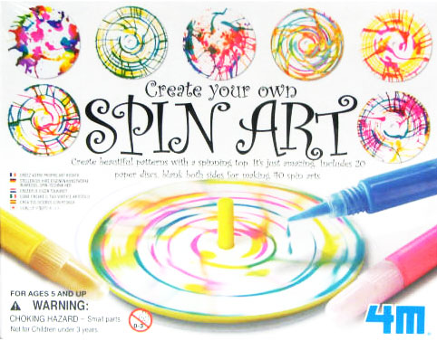

<!-- translated by DeepL -->

# Блоги о будущем

Фредерик Пол

## Сборщик налога на смерть

**Вопрос по лексике:** Когда твой чудаковатый дядя Мортимер оставил тебе все эти деньги, налоговики, работающие на твоего другого дядю — то есть на дядю Сэма, — забрали у тебя часть этой суммы.  Как называется налог, который дал им право так поступить?

**Ответ:**   Он называется «налогом на наследство».  Если ты ответил «налог на имущество», ты тоже был бы прав.  Однако, если ты ответил «налог на смерть», то ты не только ошибся бы, но и попался бы (я узнал об этом из [номера журнала New York Times Magazine от 21 мая](https://web.archive.org/web/20110922110612/http://www.nytimes.com/2009/05/24/magazine/24wwln-q4-t.html)) на одну из коварных уловок человека  по имени Фрэнк Лунц, который работает на Республиканскую партию (и другие правые организации).  Чем занимается Ланц для них?  Он придумывает эмоционально насыщенные названия для вещей, на которые они хотят вызвать у людей эмоциональную реакцию.

Возьмём, к примеру, программу президента Обамы по здравоохранению.  Это вполне описательное название для конкретного плана, но Ланц хочет, чтобы ты думал об этом иначе.  Он предпочитает, чтобы ты называл это «захватом власти Вашингтоном».

Это не одно из его самых гениальных творений, потому что основано на откровенной лжи: в плане президента нет никакого «захвата». Потребитель сохраняет всю свою свободу выбора.  Просто у него появляется больше вариантов на выбор.

Но на самом деле Ланц может заставить людей изменить своё отношение — и свой выбор на выборах — даже не прибегая к лжи.  Хотят ли нефтяные компании, чтобы избиратели более благосклонно относились к разрушению окружающей среды?  Не называй это больше «бурением нефтяных скважин».  Называй это просто «разведкой энергоресурсов».

Если хочешь увидеть, как эта переименование работает на практике, просто включи на некоторое время канал Fox News или послушай дискуссию группы сенаторов-республиканцев о мировых событиях.

### 8 комментариев

- Кирк Снавели говорит:
Круто.  Политические формулировки действительно спекулируют на неосведомлённости избирателей.
[**1 декабря 2009 г., 10:56**](/fred-pohl/2009-12-01-the-death-tax-man/)
- [Стефан Джонс](https://web.archive.org/web/20110922110612/http://home.comcast.net/~stefan_jones/kira_park_lo.jpg) говорит:
Чёрт, и не говори.
Здесь, в Орегоне, у нас смесь прогрессивной политики и политики по типу «Убирайся с моей земли!». Так что: много классных программ, но при этом налоговая система, из-за которой бюджет составляется с трудом. Большая часть излишка от подоходного налога возвращается потребителям. («Кикер».)
Многие компании не платят налог на прибыль или платят минимум 10 долларов. (PGE, энергетическая компания из Портленда, взимала с клиентов государственные налоги, а потом не платила их, потому что принадлежала компании из другого штата. Как она там называлась? Ах да, «Энрон».)
Так что, учитывая, что штат глубоко в минусе из-за рецессии, предлагается пара мер: повысить минимальный налог на прибыль компаний и увеличить налоги для людей с высоким доходом.
Противники этих мер разбили свои стенды повсюду: на ярмарках штата, на парковках, на авиашоу в конце улицы. Гигантский баннер: «СДЕРЖИТЕ УБИВАЮЩЕЕ РАБОЧИЕ МЕСТА ПОВЫШЕНИЕ НАЛОГОВ!»
Трудно спорить с таким ВОЗМУЩЕНИЕМ, НАПИСАННЫМ ЗАГЛАВНЫМИ БУКВАМИ!
[**1 декабря 2009 г., 14:16**](/fred-pohl/2009-12-01-the-death-tax-man/)
- Джофан говорит:
Респект команде блога за сопровождающую картинку. «Опасность удушья» — точно!
[**2 декабря 2009 г., 01:08**](/fred-pohl/2009-12-01-the-death-tax-man/)
- [Денис Дрю](https://web.archive.org/web/20110922110612/http://www.ontodayspage.blogspot.com/) пишет:
Будь ты жив или мёртв  

IRS всё равно заберёт твой хлеб
IRS должна собрать определённую сумму денег, чтобы оплатить счета правительства.  Вопрос только в том: хотим ли мы, чтобы они забрали её, пока мы ещё живы (и пока крупные предприниматели-республиканцы могут вложить эти деньги, чтобы заработать ещё больше для наших близких и правительства), или подождать, пока мы умрём?  Налоговая служба предпочла бы, чтобы мы умерли, потому что тогда мы не будем так яростно бороться за свои деньги — а это позволит им ввести ещё более высокую налоговую ставку.  
[**2 декабря 2009 г., 20:58**](/fred-pohl/2009-12-01-the-death-tax-man/)
- Стив Грин говорит:
В тех редких случаях, когда я смотрел Fox News, меня не только раздражали их ярлыки, но я вообще не мог понять, о какой планете там идет речь.
[**3 декабря 2009 г., 8:53**](/fred-pohl/2009-12-01-the-death-tax-man/)
- Росс Прессер говорит:
Отрывок из книги «Восстание в 2100 году» (1939 г.), Роберт Хайнлайн:
«Именно, именно! Если говорить техническим языком, я выбрал термины с высокими отрицательными индексами — именно для этой ситуации и для этого слушателя. Это точно то, что мы делаем с этой пропагандой, только эмоциональные индексы количественно ниже, чтобы не вызвать подозрений и обойти цензуру — медленный яд, а не удар в живот. Всё, что мы пишем, посвящено Пророку, мы воспеваем его до небес… так что раздражение, возникающее у читателя, переносится на него. Этот метод проникает глубже сознательных мыслей читателя и воздействует на табу и фетиши, которые кишат в его подсознании».
Чем больше всё меняется, тем больше всё остаётся по-старому.
[**5 декабря 2009 г., 00:41**](/fred-pohl/2009-12-01-the-death-tax-man/)
- Тина Блэк говорит:
Черт, на работе «Фокс» круглосуточно включен.  Пока смотрю, я всё время говорю что-то вроде «Ты лжешь, ты мерзавец!» и другие звуки, выражающие неодобрение.
[**5 декабря 2009 г., 16:34**](/fred-pohl/2009-12-01-the-death-tax-man/)
- [Антон Шервуд](https://web.archive.org/web/20110922110612/http://ogre.nu/) говорит:
Я слышал, что если ты завещаешь своё имущество внукам, потому что твой собственный ребёнок, скорее всего, не проживёт тебя надолго, налоговики скажут, что ты обманываешь, и обложат наследство налогом дважды.  Если это правда, то действительно имеет смысл называть это «налогом на смерть», а не «налогом на наследство».
[**28 февраля 2010 г., 19:28**](/fred-pohl/2009-12-01-the-death-tax-man/)

[WordPress](https://web.archive.org/web/20110922110612/http://wordpress.org/)
[TWTFB](https://web.archive.org/web/20110922110612/http://dicksmithsoftware.com/)