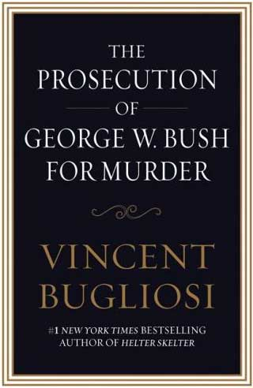

<!-- translated by Gemini (gemini-2.5-flash-lite) -->
# The Way the Future Blogs

Фред Пол

## Интересная книга, которую ты не захочешь читать, но я бы хотел, чтобы ее прочитали все

  

[The Prosecution of George W. Bush for Murder](https://web.archive.org/web/20110907220229/http://www.amazon.com/gp/product/159315481X?ie=UTF8&tag=twtfb-20&linkCode=as2&camp=1789&creative=390957&creativeASIN=159315481X)
  

[Винсент Булиози](https://web.archive.org/web/20110907220229/http://www.prosecutionofbush.com/author.php), упрятавший Чарльза Мэнсона, — вероятно, самый успешный прокурор в мире. Он знает все о предъявлении обвинения в убийстве и получении обвинительного приговора, и в [этой книге](https://web.archive.org/web/20110907220229/http://www.amazon.com/gp/product/159315481X?ie=UTF8&tag=twtfb-20&linkCode=as2&camp=1789&creative=390957&creativeASIN=159315481X) он утверждает, что Джордж Буш-младший вместе с Диком Чейни, Кондолизой Райс и, возможно, другими членами администрации Буша виновны в преступлениях убийства и заговора с целью совершения убийства по законам США. Он описывает, как мог бы их преследовать, если бы имел право подать иск, и указывает, что любой окружной прокурор в любом штате или округе, откуда был отправлен в Ирак и погиб там какой-либо солдат, имеет такое право. Более того, любой из них может подать иск в любое время, поскольку на убийство нет срока давности.

Ну что, думаешь, есть хоть какой-то шанс, что кто-нибудь из этих присягнувших блюстителей закона действительно выдаст ордер на арест и прикажет копам забрать одного или нескольких этих злодеев для обычного снятия отпечатков пальцев, фотороботов и помещения в камеру?

Я — нет. И это заставляет меня задуматься, в какой стране мы живем.

### 11 комментариев

- [Robert Nowall](https://web.archive.org/web/20110907220229/http://www.robertnowall.com/) пишет:
Одно только название меня оттолкнуло. А его предыдущая книга, внушительный том о покушении на Кеннеди, была такой основательной…
[**10 декабря 2009 г., 7:52**](/posts/2009-12-10-an-interesting-bookthat-you-won-t-want-to-read-but-i-wish-everyone-had/)
- [SMD](https://web.archive.org/web/20110907220229/http://wisb.blogspot.com/) пишет:
К сожалению, я не думаю, что это когда-нибудь произойдет, но хотелось бы. Я говорю это не потому, что я против Буша, а потому, что действия той администрации нанесли непоправимый ущерб репутации моей страны. Они не только нарушили закон, но и знали об этом и все скрыли, чтобы их не поймали. США всегда первыми судят лидеров других стран за военные преступления, и поэтому мы должны судить этих людей за ужасные вещи, сделанные людям, которые могли быть врагами, а могли и не быть (для меня это различие бессмысленно… потому что мы все люди, и причинять зло плохим людям — это все равно что причинять зло самим себе).
Но, черт возьми. Этого никогда не произойдет, и никогда не будет справедливости для тысяч американских солдат, которые ушли и погибли за ложь. В этом вся трагедия… семьи, потерявшие близких, теперь должны жить с осознанием того, что это было напрасно…
[**10 декабря 2009 г., 8:42**](/posts/2009-12-10-an-interesting-bookthat-you-won-t-want-to-read-but-i-wish-everyone-had/)
- Бобсън пишет:
Надеюсь увидеть это однажды… Патологически оптимистичен, знаю..
[**10 декабря 2009 г., 11:18**](/posts/2009-12-10-an-interesting-bookthat-you-won-t-want-to-read-but-i-wish-everyone-had/)
- Kirk Snavely пишет:
В прошлом году я видел в интернете, как Булиози давал показания Комитету по судебным делам Палаты представителей относительно возможности импичмента Буша и его приспешников (или что-то в этом роде). Он был взбешен, и это могло повредить его шансам быть воспринятым всерьез республиканцами в комитете, по крайней мере, такое у меня сложилось впечатление от их безразличной и самодовольной реакции на Булиози. Жаль, что в этом комитете нет больше таких людей, как председатель (Коньерс).
[**10 декабря 2009 г., 11:25**](/posts/2009-12-10-an-interesting-bookthat-you-won-t-want-to-read-but-i-wish-everyone-had/)
- leslie deVries пишет:
Он сильный писатель, и я бы хотел это прочитать, но я тоже не питаю больших надежд, что мы когда-нибудь увидим их в Гааге. И давайте не забывать Дона Рамсфельда и его ежедневные библейские брифинги!
[**10 декабря 2009 г., 13:55**](/posts/2009-12-10-an-interesting-bookthat-you-won-t-want-to-read-but-i-wish-everyone-had/)
- [Jeff](https://web.archive.org/web/20110907220229/http://jeffcrook.blogspot.com/) пишет:
Это было бы невежливо. Мы должны смотреть вперед, а не назад, и так далее.
[**11 декабря 2009 г., 8:52**](/posts/2009-12-10-an-interesting-bookthat-you-won-t-want-to-read-but-i-wish-everyone-had/)
- JD Rhoades пишет:
У каждого президента кровь на руках. Если ты откроешь эту дверь, ее будет не так-то просто закрыть. Какой бы привлекательной ни казалась идея увидеть этого ублюдка Буша на скамье подсудимых, следующим шагом будет какой-нибудь самовлюбленный прокурор, обвиняющий Клинтона из-за Боснии или Сомали. Затем Буша-старшего за первую войну в Персидском заливе. И как только Обама покинет свой пост, кто-нибудь обвинит его в чем-нибудь. И так далее.
[**14 декабря 2009 г., 11:54**](/posts/2009-12-10-an-interesting-bookthat-you-won-t-want-to-read-but-i-wish-everyone-had/)
- [Stefan Jones](https://web.archive.org/web/20110907220229/http://home.comcast.net/~stefan_jones/kira_park_lo.jpg) пишет:
Меня воодушевила новость о том, что «22 миллиона» электронных писем Белого дома, которые считались утерянными, были восстановлены.
Даже если мы не увидим, как Рамсфельд, Чейни, Аддисон и т. д. отправятся в тюрьму, было бы замечательно иметь на записях такие вещи, как:
* Признание того, что ОМУ не было, и планы обмануть общественность в любом случае.

* Подтверждение того, что Чейни с самого начала был полон решимости свергнуть Саддама, рассказал об этом нефтяным компаниям и от радости чуть не описался 11 сентября, потому что знал, что получил свое оправдание.
Что-то подобное, даже если бы это не было юридически наказуемо, разрушило бы моральный авторитет этих ублюдков, так что никто бы не воспринимал их всерьез, когда они бы поучали на Fox News и т. д.
[**14 декабря 2009 г., 15:47**](/posts/2009-12-10-an-interesting-bookthat-you-won-t-want-to-read-but-i-wish-everyone-had/)
- [RBH](https://web.archive.org/web/20110907220229/http://www.pandasthumb.org/) пишет:
JD Rhodes написал
«Если ты откроешь эту дверь, ее будет не так-то просто закрыть».
Ее не следует закрывать.
[**17 декабря 2009 г., 15:18**](/posts/2009-12-10-an-interesting-bookthat-you-won-t-want-to-read-but-i-wish-everyone-had/)
- [Sebastian Meyer](https://web.archive.org/web/20110907220229/http://sebimeyer.com/) пишет:
Есть похожая работа, хотя и вымышленная, Николаса Кента. Он написал пьесу «Призванный к ответу. Обвинение Энтони Чарльза Линтона Блэра в преступлении агрессии против Ирака — слушание», которая довольно хитроумно представляет альтернативную историю, в которой Блэр и Ко не ушли от ответственности за ложь стране, чтобы добиться желаемой политики.
Существует также радиопостановка пьесы, которая транслировалась на BBC и получилась довольно хорошей.
Однако остается вопрос: ПОЧЕМУ этих парней не привлекают к ответственности? Неужели они, если перефразировать оправдание для спасения банков, «слишком велики, чтобы потерпеть неудачу»?
[**1 января 2010 г., 15:59**](/posts/2009-12-10-an-interesting-bookthat-you-won-t-want-to-read-but-i-wish-everyone-had/)
- Honest Bikco пишет:
Винсент Булиози, о боже, о боже….
Ну, у него есть веские основания против Буша и Чейни, НО
Это человек, который верит, что одинокий старый парень Освальд мог сделать четыре выстрела, которые эксперты-стрелки (в отличие от Освальда) могли бы сделать, и это противоречит законам физики, с головой, которая резко дергается назад, когда выстрел должен был быть произведен сзади!…..и это от человека, который убедительно и доблестно доказывал, что RFK был убит в результате заговора.
Он игнорирует (и в макромасштабе, корпоративные СМИ, контролируемые ЦРУ «Операция «Пересмешник» + Fox) всю последующую информацию, которая просочилась в общественное достояние, включая:
Признание Мэдлин Браун, любовницы ЛБД, о его близком знании заговора.

Признание Билли Сола Эстеса, делового партнера ЛБД, по крайней мере, в 9 убийствах, последнее из которых — убийство JFK. Гуглите «Estes Documents»

Свидетельство Э. Говарда Ханта, офицера ЦРУ, данное на смертном одре, о том, что некоторые разочарованные фракции из провала в заливе Свиней намеревались отомстить, и ЛБД и его техасские нефтяные миллиардеры организовали убийство.

Заявления Джека Руби о том, что, если бы ЛБД не был вице-президентом, «наш любимый» лидер был бы жив.
Эндрю Джексон баллотировался против банков (Федеральной резервной системы) своего времени, чтобы правительство печатало деньги для нации и не несло расходов по процентам, которые бы их разорили. На него было совершено покушение, нанятое банками, стреляли в упор, пистолеты дали осечку.

1932 год: ФДР имел кабалу бизнес-элит, которые сговорились и попытались заставить генерала Смедли Батлера провести протест Ветеранов Армии и захватить правительство. Он согласился, а затем, получив достаточно доказательств, все рассказал. См. «The Whitehouse Coup» на YouTube.

1948 год: Недалекий Гарри Трумэн санкционировал создание ЦРУ, но позволил ему не отчитываться перед своими руководителями, что давало лидерам возможность «правдоподобно отрицать» тайные операции. Большинство этих оперативников ЦРУ набираются из высших эшелонов частного бизнеса.
Ребята, просто прочитайте блестящую книгу «JFK and the Unspeakable»…
[**2 октября 2010 г., 22:12**](/posts/2009-12-10-an-interesting-bookthat-you-won-t-want-to-read-but-i-wish-everyone-had/)

[WordPress](https://web.archive.org/web/20110907220229/http://wordpress.org/)
[TWTFB](https://web.archive.org/web/20110907220229/http://dicksmithsoftware.com/)