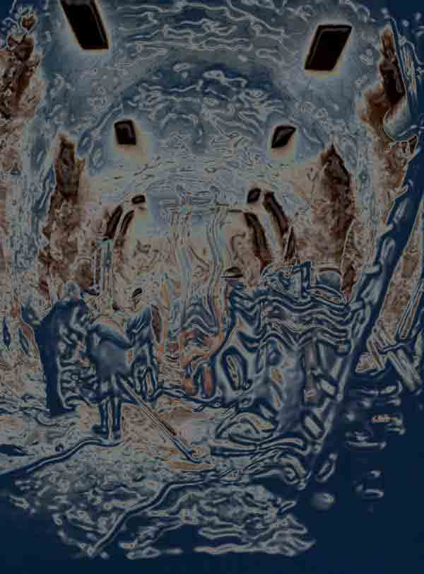

<!-- translated by DeepL -->

# Как будут выглядеть блоги будущего

Фредерик Пол

## Третий выпуск поэзии

Поскольку предыдущие порции стихов в блоге не вызвали особых бунт, попробую опубликовать ещё одну часть — своего рода сонет в стиле Петрарки в свободной форме под названием «Вал». Пусть стихотворение говорит само за себя.


Через матрицу диаметром в одну шестнадцатую дюйма,
Холодную при вытягивании, но выходящую раскалённой, — металлическая нить.
Эта и тысяча других, плотно сплетенных вместе,
Прикреплённых к электрической лебедке и к вагонетке.

В листах чертежной плёнки просверливают отверстие.
Затем создаётся подходящая стальная и каменная рама,
Вертикально вверх и вниз на триста футов — шахта,
Утроба пустоты, становится реальностью.

Потом туда входят люди вслепую, осторожные люди.
Но всё равно слепые.  Жестоко поднимаясь, они жестоко спускаются.
Подниматься, спускаться — по жестоким поручениям.

Железный трос в железном вакууме.
Железное сознание,  негибкое и тупое.
Всё железное (жестокое), всё (жестокое) железное.


Надеюсь, тебе это не слишком не понравилось.  Мне, наверное, было 17, когда я это написал.

**Похожие посты:**

- [**Уголок поэзии**](/fred-pohl/2009-01-30-the-poetry-corner/)
- [**Уголок поэзии 2**](/fred-pohl/2009-01-30-the-poetry-corner/)
- [**Расшифровка стихов**](/fred-pohl/2009-03-16-verse-decoded/)
- [**Квадрумвират**](/fred-pohl/2009-05-08-the-quadrumvirate/)

*Иллюстрация Лии А. Зельдес.*

### 4 комментария

- [Роберт Ноуолл](https://web.archive.org/web/20110922100616/http://www.robertnowall.com/) пишет:
Почему-то первая и последняя строки запомнились мне с самого первого прочтения…
[**22 января 2010 г., 12:11**](/fred-pohl/2010-01-21-third-hit-of-poetry/)
- [Босоногий бродяга](https://web.archive.org/web/20110922100616/http://barefootbum.blogspot.com/) говорит:
Я твой большой фэн; прочитал уже с двадцать твоих произведений, и ты ни разу не разочаровал. Но, при всем уважении, не могу так же высоко оценить твой талант и мастерство в поэзии, как в прозе.
[**22 января 2010 г., 20:49**](/fred-pohl/2010-01-21-third-hit-of-poetry/)
- [Ralan](https://web.archive.org/web/20110922100616/http://www.ralan.com/) пишет:
Мне довольно понравилось. Я бы не хотел показывать стихи, которые писал в семнадцать лет.
[**23 января 2010 г., 4:47**](/fred-pohl/2010-01-21-third-hit-of-poetry/)
- Дин говорит:
Это намного лучше всего, что я писал в 17 лет.
[**25 января 2010 г., 9:30 утра**](/fred-pohl/2010-01-21-third-hit-of-poetry/)

[WordPress](https://web.archive.org/web/20110922100616/http://wordpress.org/)
[TWTFB](https://web.archive.org/web/20110922100616/http://dicksmithsoftware.com/)