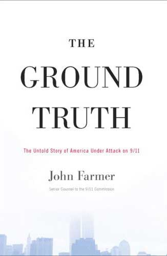
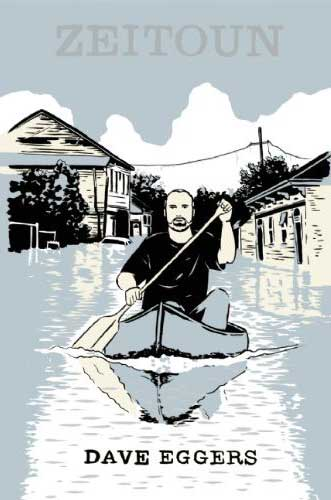

<!-- translated by Yandex Translate -->

# Путь к блогам будущего

Фредерик Пол

## Две книги о разрушении города

** Основная правда: нерассказанная история Америки, подвергшейся нападению 11 сентября, Джон Фармер, издательство "Риверхед Букс", Нью-Йорк**

** "Зейтун" Дэйва Эггерса, издательство McSweeney's Books, Сан-Франциско**

9/11, иначе известное как 11 сентября 2001 года, избавило американцев от всех иллюзий безопасности, которыми они обладали, когда 19 террористов "Аль-Каиды" захватили четыре авиалайнера на Восточном побережье.  Два самолета эксплуатировались авиакомпанией United Airlines, остальные - American Airlines, и каждой из угонщиков была назначена конкретная цель для атаки.  UA 175 должен был поразить Северную башню Всемирного торгового центра в Нью-Йорке, AA 11 - Южную башню.  Американец 77 должен был уничтожить Пентагон, а Объединенный 93 - Белый дом.  Двое, которые врезались в башни, были "Боинг-767"; два других "Боинга-757".

В течение примерно девяноста минут тем утром первые три группы угонщиков выполнили свои задачи, врезавшись в назначенные цели и убив более трех тысяч мужчин, женщин и детей в атакованных зданиях (и, конечно, также убив самих себя, а также пассажиров и экипаж уничтоженных самолетов).  Однако четвертая команда угонщиков потерпела поражение от пассажиров и выжившего экипажа "Юнайтед 93", которые массово напали на своих угонщиков.  Они успешно справлялись с террористами, когда тот, кто управлял самолетом, очевидно, убедившись, что они потерпели поражение, воскликнул: “Аллах - величайший!” и перевел самолет в почти вертикальное пике, разбившись, со смертельным исходом для всех находившихся на борту, недалеко от небольшого населенного пункта Шенксвилл, штат Пенсильвания.

Это было удачей для Белого дома во многих отношениях. В тот момент UA93 находился всего в 20 минутах полета от Белого дома, который был его целью, и — “наземная правда” была противоположна тому, что утверждали участники — команда президента плохо контролировала ситуацию.  Истребителям F-16, преследовавшим его, даже не был отдан приказ сбить его задолго до того, как он уже потерпел крушение.  Даже не ясно, мог ли этот приказ быть издан вовремя.  Власти, казалось, меньше интересовались UA93, чем другим самолетом, который подозревался в угоне, Delta 1989, но таковым не был.  На самом деле, на момент обсуждения Delta 1989 доказывала это, послушно приземлившись за тысячу миль отсюда, на Среднем Западе.

Из текста Фармера в его книге "Земная правда"*:

Проблема с попыткой рецензирования этой книги заключается в том, что в ней Фармер документирует все свои обвинения.  Прочитав книгу, становится ясно, что то, что он только что сказал, правда: генералы, главы департаментов и даже члены кабинета министров должны были либо откровенно лгать в рамках заговора (организованная ложь), либо непростительно не знать реальных условий, которые они описывали и притворялись, что контролируют (административная некомпетентность).

Но чтобы доказать их в этом обзоре, нужно много слов — вероятно, примерно столько же, сколько в его книге.  И во многих случаях то, что на самом деле сделали ответственные лица, могло показаться свидетелям не особенно важным.  Например, поднятие истребителей F-16 с военно-воздушной базы Лэнгли было вызвано сообщением об угнанном самолете, направлявшемся из Нью-Йорка в Вашингтон, с его ужасающим количеством потенциальных целей, после чего истребители были подняты в воздух.  О чем солгали, так это о личности того угнанного самолета.  Кто—то по радио — так и не было установлено, кто именно - сказал, что это был AA 11, и это правда, что на самом деле это был тот самый “самолет”, на перехват которого были подняты истребители.  Конечно, это было невозможно.  AA 11 уже прекратил свое существование как реальный самолет и к тому времени был всего лишь частью компонентов South Tower inferno.  Но ошибка сохранялась.

Затем, когда появился American 77 — настоящий угнанный самолет, на самом деле направлявшийся в Вашингтон, и было неправдиво заявлено, что именно он вдохновил на отдачу приказа о запуске F-16, — можно предположить, что лживые люди думали, что все, что они делают, это упрощают чрезмерно сложную ситуацию.

Но все небольшие исправления были сделаны в одном направлении, которое заключалось в том, чтобы исключить сообщения обо всех грубых ошибках, допущенных вышестоящими лицами, и укрепить иллюзию того, что они на самом деле были главными.  Все эти небольшие “исправления” реальной истории имели два довольно серьезных последствия.  Первым было переизбрание Джорджа У. Буша в 2004 году, поскольку его якобы сильное и мудрое отношение к 9/11 и его последствиям было его главной претензией на компетентность.  Вторым был безбожный, даже смертельный беспорядок, последовавший за нападением урагана "Катрина" на Новый Орлеан в 2005 году.

(Я должен заявить, что утверждение о влиянии сокрытия событий 11 сентября на результаты выборов 2004 года Фармер прямо не делает в своей книге, хотя я думаю, что это неизбежно следует из представленных им доказательств.   Что касается события "Катрина", смотрите ниже.)

Хорошая вещь в "Катрине" заключается в том, что планировщики всегда знали, что это, вероятно, когда-нибудь произойдет, и это заставило многих вдумчивых людей поверить, что нации следует лучше подготовиться к тому, чтобы справиться с этим.

Соответственно, в июле 2004 года несколько сотен сотрудников экстренных служб приняли участие в учениях, в которых были задействованы представители всех различных ведомств, которые могли бы сыграть определенную роль в реальной катастрофе.  В течение трех дней они обдумывали, что делать в связи с вторжением (несуществующего) Ураган Пэм обрушился на уязвимый город..

Все согласились с тем, что учения прошли с большим успехом и выявили серьезные недостатки в существующих планах.  Были быстро разработаны новые планы, некоторые из требований которых касались улучшения отношений между заинтересованными сторонами и ведомствами; заблаговременного размещения запасов воды, продуктов питания, льда и других предметов первой необходимости по крайней мере за 72 часа до ожидаемой необходимости в них; и пересмотра правил дорожного движения, в том числе такого, которое позволило бы Полиция штата Луизиана ограничит использование местных автомагистралей односторонним движением “против потока”, ограничив все полосы движения только для людей, выезжающих из города.

В этом случае губернатор Луизианы Кэтлин Бланко действительно внесла соответствующие изменения в планы строительства шоссе.  По мнению экспертов, это спасло тысячи, возможно, десятки тысяч жизней, которые были бы потеряны в противном случае.

К сожалению, никаких других шагов предпринято не было.

В этом случае вовлеченные стороны ни разу не работали в тесном контакте друг с другом.  Некоторые, включая полицейское управление Нового Орлеана, вообще почти не работали; лишь немногие полицейские остались на работе, большинство ушли домой и заботились о своих семьях, значительная часть не только не пресекла начавшиеся грабежи, но фактически присоединилась к ним..

Чем выше были вовлеченные лица, тем меньше их действия соответствовали потребностям ситуации.  Губернатор Бланко и штаб президента Буша поссорились из-за того, следует ли федерализовать войска, оказывающие помощь, или нет; команда Буша хотела это сделать, губернатор сказал, что это была попытка завоевать доверие.  Президент созывал регулярные совещания для ускорения оказания помощи.  У них не было никаких контактов с теми силами по оказанию помощи, которые на самом деле занимались этим..  Подготовка необходимых запасов воды, льда, продуктов питания и т.д. за 72 часа до возникновения необходимости не состоялась.  Примерно за 12 (а не за 72) часов до удара урагана "Катрина" президент выступил по телевидению, чтобы заверить жителей Нового Орлеана в том, что огромные запасы всех необходимых припасов уже отправлены в путь.  Возможно, так оно и было.  Чего он не сказал, так это того, что пройдет несколько недель, прежде чем все они прибудут.

Большим плюсом было то, что юридические шаги по перекрытию магистралей действительно были предприняты губернатором Бланко, но насколько было бы лучше, если бы организации по оказанию помощи осуществили все другие замечательные планы, которые они сами разработали, а затем проигнорировали.

Мы знаем, какой была “основная правда” Нового Орлеана во времена урагана "Катрина": тысячи погибших, десятки тысяч разрушенных домов, десятки тысяч людей оказались в затруднительном положении в окрестностях города, который потерял электричество, еду, воду и верховенство закона.  Но чтобы узнать, каково было находиться в городе, когда разразилась ураган "Катрина" — и когда шторм продолжился, а на смену ему пришло человеческое насилие беззаконного города, — нам нужно обратиться к истории уроженца Сирии Абдулрахмана Зейтуна, который пережил худшее, потому что он думал, что сможет помочь — и который был вознагражден тем, что был арестован как мародер — в своем собственном доме — и заключен в тюрьму без связи с внешним миром.

### 6 Комментариев

- нурблз говорит:
Хотя мне не хочется защищать Буша (я думаю, что он был / остается некомпетентным болваном) Я чувствую себя вынужденным указать на то, что события, подобные 9/11, чрезвычайно сбивают с толку, когда они происходят на самом деле. Использование таких слов, как “грубая ошибка”, для описания действий правительства - это наживка (и да, я на нее клюнул), потому что, хотя ошибки, безусловно, были допущены, большинство (если не все) из них, вероятно, были лучшим выбором в то время, учитывая ограниченность доступной информации.  Обладая даром исторической ретроспективы, к решениям легко относиться более сурово, особенно людьми, у которых есть свои планы.
Честно говоря, я считаю почти замечательным тот факт, что *любой* военный самолет был поднят в воздух, когда даже *один* из самолетов все еще находился в воздухе.  Поскольку террористы выбирали самолеты, траектории полета которых приближали их к целям, кому-либо было очень, очень трудно определить, какие самолеты представляют угрозу, пока они не оказались в терминальной части своих рейсов.  Конечно, военные могли бы перестрелять их ВСЕХ, но это в некотором роде противоречило бы цели.
Что касается "Катрины", то это была совместная ошибка федерального правительства, правительства штата и, в некотором смысле, людей, которые там живут.  Ураганы не появляются волшебным образом (по крайней мере, не в Cat 5), и люди, живущие в "рукавице ловца ураганов", должны быть готовы к таким чрезвычайным ситуациям или не должны выбирать жить там (я живу на восточном побережье Флориды и * готов* по крайней мере неделю провести без электричества или какой-либо возможности убирайся из дома).  Тем не менее, определенно потребовалось больше времени, чем кто-либо ожидал, чтобы доставить помощь в этот район, и это показало, что такие места, как район, разрушенный ураганом "Катрина", нуждаются в некоторой инфраструктуре, предназначенной для использования * после* чрезвычайных ситуаций, подобных этой (например, лучшие приюты с собственным питанием для медикаментов, охлаждения и связи).
[** 23 марта 2010 года, 5:37 утра**](/posts/2010-03-22-two-books-about-the-ruin-of-a-city/)
- [Джефф](https://web.archive.org/web/20111106214531/http://jeffcrook.blogspot.com/) говорит:
Политика имеет последствия, и голосование за человека, с которым вам больше всего хотелось бы выпить пива (или принести в жертву белого теленка на горящем алтаре), является не большей основой для системы правления, чем странные женщины, лежащие в прудах и раздающие мечи. 
Черт возьми, говорю я. Черт возьми.
[** 23 марта 2010 года, 9:56 утра**](/posts/2010-03-22-two-books-about-the-ruin-of-a-city/)
- [Джефф](https://web.archive.org/web/20111106214531/http://jeffcrook.blogspot.com/) говорит:
Конечно, величайшей катастрофой из всех, затронувшей сотни городов и, возможно, изменившей их навсегда, мог бы стать банковский кризис.
[** 24 марта 2010 года, 8:52 утра**](/posts/2010-03-22-two-books-about-the-ruin-of-a-city/)
- [Ричард](https://web.archive.org/web/20111106214531/http://www.f1reth0rns.blogspot.com/) говорит:
Фред,
Мой тесть умер 9/11/2001, не связанный с терроризмом, но все равно очень удручающий. Поэтому невероятно воодушевляет мысль о том, что кто-то другой, оказавший очень большое влияние на мою жизнь, мог бы откликнуться на эти слова. Когда я переписал новеллу, которую вы ранее видели, и попросил вас порекомендовать агента, вы забрали у меня мою новеллу, вы передали ее Кирби Макколи, вы сказали Кирби передать ее Джуди-Линн Дель Рей, и вы сказали Джуди-Линн опубликовать ее. Она так и сделала. Спасибо вам. Я ждал 34 года, чтобы сказать тебе это. Сейчас я в слезах пишу эти слова. Спасибо вам. Спасибо вам. Спасибо вам.
[**24 марта 2010, 15:05**](/posts/2010-03-22-two-books-about-the-ruin-of-a-city/)
- Джон Эйч говорит:
Ошибки, допущенные во время "Тумана войны", простительны — когда обученный профессионал принимает поспешное решение, основанное на ограниченной информации, которая оказывается неточной, я не придираюсь к этому решению.  Что непростительно, так это ошибки, допущенные по умышленному невежеству, такие как то, что Буш и его кабинет отвергли разведданные, переданные им уходящей администрацией Клинтона относительно угрозы со стороны "Аль-Каиды" и Усамы бен Ладена, или не выполнили рекомендованные изменения в планах реагирования на чрезвычайные ситуации в Новом Орлеане.
[**30 марта 2010 года, 9:52 утра**](/posts/2010-03-22-two-books-about-the-ruin-of-a-city/)
- Честный Бикко говорит:
"Туман войны" блонни....Кеннеди был поражен, потому что он не пошел на войну и фактически состоял в переписке с Хрущевым и Кастро. LBJ, чей Техас был местом переворота, поддерживался "Брауном и Рутом", небольшой местной фирмой, которая на протяжении десятилетий, при поддержке LBJ, получала крупные контракты "Нового курса". Позже она была объединена с Halliburton.
Что касается 9/11.... помимо Мартина Шина, Дэвида Линча, Эда Аснера, Чарли Шина и целого сонма инженеров, экспертов по физике, архитекторов и ученых, которые говорят, что 9/11 противоречит законам физики, черт возьми - просто проверьте это сами....
[http://video.google.com/videoplay ?docid=2361717427531377078#](https://web.archive.org/web/20111106214531/http://video.google.com/videoplay?docid=2361717427531377078)
с наилучшими пожеланиями, Сэм Бикко
[**2 октября 2010, 10:23 вечера**](/posts/2010-03-22-two-books-about-the-ruin-of-a-city/)

[WordPress](https://web.archive.org/web/20111106214531/http://wordpress.org/)
[TWTFB](https://web.archive.org/web/20111106214531/http://dicksmithsoftware.com/)