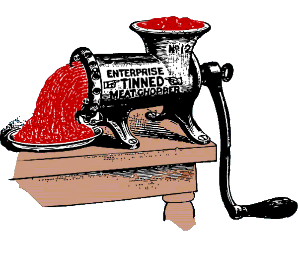

<!-- translated by Yandex Translate -->

# Путь к блогам будущего

Фредерик Пол

## Измельчение мяса

Когда мне было десять лет, моя мать обычно заставляла меня кататься на коньках до мясной лавки на Флэтбуш-авеню и за 39 центов покупать полфунта рубленого круглого стейка и “смотреть, как он его измельчает”.

Потом прошло время.  Мы получили все преимущества современных технологий по мере их появления.  К этому времени мясная лавка уже была в местном супермаркете, а “мясной фарш” - в заранее отмеренных и завернутых в пластик упаковках, самый здоровый на вид, самый красный мясной фарш, который вы когда-либо видели, и, за исключением редких случаев стафилококка или кишечной палочки, все было в порядке. настолько современно и гигиенично, насколько это возможно, и, конечно, это уже не было 39 центов.

Еще одна вещь, которую мы знали, в смутном, обобщенном виде, заключалась в том, что на самом деле это тоже был уже не совсем круглый стейк.  Этот продукт из супермаркета в огромных количествах готовят на фабриках по производству мясного фарша.  Не все это начинается с какого-либо вида стейка; это губы, или рубец, или желудки, или сердца, или это маленькие кусочки мяса, оставшиеся после приготовления стейков и отбивных, и эти маленькие кусочки “скрепляются” вместе (мы не говорим “склеиваются”) с помощью продукты, называемые “мясными эмульсиями” и “экстрагированными белками миофибрилл”, используются для приготовления больших кусков, которые можно нарезать кубиками, как то, что мы называем “жаркое”.

Все это, конечно, звучит неприятно, но когда вы покупаете его полфунтовую упаковку, он поджаривается, как любой другой гамбургер, и на вкус почти такой же.

Однако.

Чего вы не знаете, так это того, сколько этой говядины (или свинины) производится на так называемых предприятиях по концентрированному кормлению животных, или CAFOs, с добавлением антибиотиков в качестве регулярной части их рациона.  Этого ты действительно не хочешь.  Это вредно для вашего здоровья.  Более важным (во всяком случае, для меня) является то, что это вредно и для моего организма, потому что, если вы едите такие продукты, вы способствуете развитию устойчивых к антибиотикам микроорганизмов и других неприятностей, которые попадают в организм других людей, включая мой.

Принимая все это во внимание, мы решили, что действительно хотим знать, что мы едим, и поэтому решили измельчить мясо самостоятельно.  Сначала мы купили старую добрую мясорубку, которую вы прикрепляете к чему-то действительно прочному и мощному с помощью мышц вашей сильной правой руки.  Однако это была более тяжелая работа, чем та, к которой привыкли мы, изнеженные современные люди, поэтому мы отказались от нее и вложили деньги в электрическую модель.  Это позволяет выполнять работу быстро и комфортно, и мы рассчитываем, что так будет и впредь.

Еще одним преимуществом измельчения нашего собственного рубленого стейка является то, что это позволяет нам контролировать, сколько жира мы хотим измельчить вместе с нежирным мясом.  Вам нужно приличное количество жира (помните, ”вкус в жире”), и лучший способ добиться правильных пропорций - это метод проб и ошибок.   Истинные гурманы среди нас на самом деле могут захотеть разные пропорции для разных блюд, но если вы один из таких, то в этом вы сами виноваты.

Так что молитесь на здоровье, дорогие друзья, и в следующий раз, когда будете готовить мясной рулет, можете пригласить нас в гости.

### 8 Комментариев

- [Стефан Джонс](https://web.archive.org/web/20111106210951/http://home.comcast.net/~stefan_jones/kira_park_lo.jpg) говорит:
Еще более жуткий, чем подносы с мясным фаршем:
“Голавли”
Толстая колбаска в форме вилки из мясного фарша, заключенная в пластиковую оболочку.
Вы можете только представить, что они наполнены бычьим эквивалентом курицы Литтл.
Вы все еще можете попросить мясника из мясного отдела приготовить для вас говяжий фарш из отборных кусков, но вам придется потратить на это время. Когда вы собираетесь на барбекю к другу, гораздо проще достать готовые котлеты. И получающиеся в результате гамбургеры
... Блин, мне не следовало бы думать о таких вещах в понедельник утром.
[** 12 апреля 2010 года, 10:53 утра**](/fred-pohl/2010-04-12-meat-grinding/)
- Джон Эйч говорит:
А если вам действительно хочется приключений, вам стоит попробовать объединить коров: [http://www.time.com/time/magazine/article/0 ,9171,1902835,00.html](https://web.archive.org/web/20111106210951/http://www.time.com/time/magazine/article/0,9171,1902835,00.html)
[**12 апреля 2010, 14:23**](/fred-pohl/2010-04-12-meat-grinding/)
- [Джон Мерфи](https://web.archive.org/web/20111106210951/http://resistentialismincarnate.blogspot.com/) говорит:
О, это очень весело! В зависимости от приобретенной вами модели может быть предусмотрена насадка для приготовления собственных сосисок, которую также стоит попробовать.
[**12 апреля 2010, 14:42**](/fred-pohl/2010-04-12-meat-grinding/)
- Эйс Лайтнинг говорит:
Жир в мясе действительно в некоторой степени улучшает вкус, но более важным является тот факт, что именно жир сохраняет мясо сочным, нежным и влажным при приготовлении, особенно если вам нравится мясо средней прожарки или хорошо прожаренное. Я люблю гамбургеры и жалею, что не могу позволить себе мясорубку - известно, что я готовлю на углях даже в середине зимы. (Одной запоминающейся вечеринкой в канун Нового года было полномасштабное барбекю с грилем прямо за кухонной дверью, чтобы еду можно было быстро занести внутрь и подать на стол, пока она не остыла. Жаль, что у меня до сих пор нет фотографии, на которой я готовлю бургеры на гриле, а вокруг валит снег...)
[**13 апреля 2010 года, 4:07 утра**](/fred-pohl/2010-04-12-meat-grinding/)
- [Стефан Джонс](https://web.archive.org/web/20111106210951/http://home.comcast.net/~stefan_jones/kira_park_lo.jpg) говорит:
@Ace: Если вы наберетесь терпения, то рано или поздно практически каждое кухонное приспособление появится в благотворительных магазинах Goodwill.
[**13 апреля 2010, 17:52 вечера**](/fred-pohl/2010-04-12-meat-grinding/)
- Эл Богдан говорит:
Мой дедушка был дородным польским мясником в Нью-Йорке. Он всегда приносил домой самую лучшую килбасу. Цельные куски мяса без каких-либо неидентифицируемых измельченных частей. Парню также понравились его свиные ножки в желе, поэтому, когда он предостерегал нас от употребления хот-догов и некоторых других сосисок, вы знали, что в них, должно быть, содержится какая-то гадость.
На самом деле я начал плохо реагировать на говяжий фарш около пяти лет назад. Только фарш, а не стейки. Я вспомнил, что мой дедушка всегда сам готовил гамбургер, вместо того чтобы покупать предварительно измельченный, поэтому мы начали готовить стейки в Cuisinart. Это решило проблему.
Мы также стараемся по возможности употреблять мясо, не содержащее антибиотиков.
[**15 апреля 2010 года, 6:46 утра**](/fred-pohl/2010-04-12-meat-grinding/)
- Нил из Чикаго говорит:
Кошерный продукт остается конкурентом для тех, кто достаточно хорошо разбирается в этом продукте.
@John H - Я не знаю, сохранились ли они до сих пор, но, по крайней мере, до недавнего времени в маленьких городках были холодильники / морозильники с морозильной камерой, поэтому, когда вы покупали, скажем, половину бычка и разрезали ее, у вас было где хранить ее, пока вы постепенно используете кусочки.
[**17 апреля 2010, 19:53 вечера**](/fred-pohl/2010-04-12-meat-grinding/)
- Эйс Лайтнинг говорит:
@Стефан Джонс:  

Я думала, что у меня есть “бабушкина” мясорубка с ручным приводом, которая крепится к краю стола, но, похоже, ее взял мой взрослый сын (который сам серьезный гурман). В любом случае, мне нужен мощный… но мне приходит в голову, что у меня уже есть почтенный миксер KitchenAid с отбором мощности, и для этого есть насадка для мясорубки. Теперь я просто должен быть в состоянии *позволить себе* это…
[** 19 апреля 2010 года, 2:36 ночи**](/fred-pohl/2010-04-12-meat-grinding/)

[WordPress](https://web.archive.org/web/20111106210951/http://wordpress.org/)
[TWTFB](https://web.archive.org/web/20111106210951/http://dicksmithsoftware.com/)