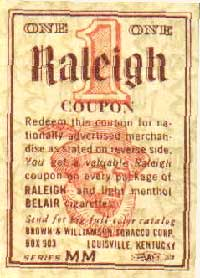

<!-- translated by DeepL -->

# Блоги о будущем

Фредерик Пол

## Работа с Робертом Хайнлайном, часть 2



Со временем мы с [Робертом Хайнлайном](https://web.archive.org/web/20100715075459/http://www.amazon.com/gp/redirect.html?ie=UTF8&location=http%3A%2F%2Fwww.amazon.com%2Fgp%2Fentity%2FRobert-A.-Heinlein%2FB000APVWZW%3Fie%3DUTF8%26ref_%3Dntt%5Fathr%5Fdp%5Fpel%5Fpop%5F1&tag=twtfb-20&linkCode=ur2&camp=1789&creative=390957) стали довольно хорошими друзьями.  У нас были общие мелкие пороки, например, в те времена мы курили сигареты одной марки (Raleigh с пробковым фильтром, и мы оба сохраняли купоны, которые шли в каждой пачке), и хотя мы оба презирали политические взгляды друг друга, нам было весело спорить об этом.  Мы не так часто виделись, потому что Хайнлайны жили на Западном побережье, а я — на Восточном, но время от времени наши пути пересекались.

Когда Хайнлайны приезжали в Нью-Йорк, они предпочитали останавливаться в каком-нибудь небольшом, но шикарном отеле где-то недалеко от Тюдор-Сити, и иногда приглашали меня к себе на вечер, чтобы покурить, выпить и дружелюбно покритиковать мировоззрения друг друга. (Ну, обычно это было дружелюбно.)  И я помню вечера в таких местах, как Талса и Гранд-Рапидс, а также в том чудесном круглом доме, который Хайнлайны построили на великолепном, хотя и кишащем гремучими змеями, участке земли в Калифорнии, когда здоровье Джинни уже не позволяло ей жить на полпути к вершине горы в Колорадо.  Однако время от времени на всё это ложилась тень.

Один из самых мрачных моментов случился, когда я опубликовал сериал Хайнлайна — мне стыдно признаться, что я забыл, какой именно, но, возможно, это был тот, где в будущем африканцы стали доминирующей расой в мире. Прочитав его, я позвонил [Лертону Блассингейму](https://web.archive.org/web/20100715075459/http://www.blackmaskmagazine.com/blassingame.html), тогдашнему литературному агенту Роберта, и сказал, что с удовольствием опубликую рассказ, но считаю, что в начале есть пять или десять тысяч слов, которые носят спорный характер, не относятся к делу и довольно скучны, и я хотел получить разрешение их вырезать. (Но я пообещал, что мы заплатим даже за те слова, которые я хотел вырезать.)

«Конечно, давай», — сказал Луртон, и я так и сделал.  Но Луртон не посоветовался с Робертом Хайнлайном, и когда Роберт получил номер с первой частью, он просто взбесился.  Когда я сказал ему, что  просил и получил  разрешение, он перенес свой гнев на Луртона… но не совсем полностью, потому что когда вышла книжная версия, Роберт добавил к уведомлению об авторских правах строку, которая гласила примерно так: «Неодобренная версия этого произведения,  жестоко испорченная Фредом Полом, появилась в его журнале „If“».

(Ну, по-моему, так там и было написано, но книги у меня больше нет. Как я уже упоминал, эти воспоминания — первый набросок, то есть написаны с ходу, и я могу ошибиться в некоторых деталях, которые будут исправлены, когда я в конце концов опубликую их в книге.  Поэтому, если кто-нибудь из вас сможет сказать мне, какой именно роман Хайнлайна это был и что именно он написал в уведомлении об авторских правах, я буду тебе благодарен.)

*Про Хайнлайна будет ещё...*

**Похожие посты**

- [**Работа с Робертом Хайнлайном**](/fred-pohl/2010-05-03-working-with-robert-a-heinlein/)
- [**Жёны (и увлечения) Роберта Хайнлайна, часть 1**](/fred-pohl/2010-05-17-the-wives-and-drives-of-robert-heinlein-part-1/)
- [**Жёны (и увлечения) Роберта Хайнлайна: Леслин**](/fred-pohl/2010-05-19-the-wives-and-drives-of-robert-heinlein-leslyn/)
- [**Жёны (и увлечения) Роберта Хайнлайна: Джинни**](/fred-pohl/2010-05-21-the-wives-and-drives-of-robert-heinlein-ginny/)
- [**Роберт Хайнлайн, Элджис Будрис и я**](/fred-pohl/2010-05-12-robert-a-heinlein-algis-budrys-and-me/)
- [**Привет из S17° 32,18′ W149° 34,17′**](/fred-pohl/2009-02-09-greetings-from-s17-32-18-w149-34-17/)

### 23 комментария

- Стивен Сейделл говорит:
Я могу сузить список возможных книг Хайнлайна, о которых может идти речь. Согласно [http://www.heinleinprize.com/rah/hiswritings.htm](https://web.archive.org/web/20100715075459/http://www.heinleinprize.com/rah/hiswritings.htm) в журнале «If» были опубликованы следующие рассказы:
«Подкайн с Марса», публиковалась частями в журнале «Worlds of If» в ноябре 1962 года, а также в январе и марте 1963 года. Издательство Putnam, 1963 год.
«Свободное владение Фарнхэма», публиковалась частями в журнале «If» в июле, августе и октябре 1964 года. Издательство Putnam, 1964 год. Переиздано издательством Ace Books.
«Луна — Суровая Хозяйка (The Moon is a Harsh Mistress)», публиковалась частями в журнале «If» в декабре 1965 года, а также в январе, феврале, марте и апреле 1966 года; издательство Putnam, 1966 год. Переиздано издательством Ace Books.
[**10 мая 2010 г., 1:31**](/fred-pohl/2010-05-10-working-with-robert-a-heinlein-part-2/)
- [Розмари Кирштейн](https://web.archive.org/web/20100715075459/http://www.rosemarykirstein.com/) говорит:
Может, речь идёт о книге «Фарнхэмс Фрихолд»?
[**10 мая 2010 г., 4:31 утра**](/fred-pohl/2010-05-10-working-with-robert-a-heinlein-part-2/)
- Йехуда говорит:
Книга называлась «Фарнхэмс Фрихолд». Мне придётся подождать, пока вернусь домой вечером, чтобы проверить информацию об авторских правах.
[**10 мая 2010 г., 5:20 утра**](/fred-pohl/2010-05-10-working-with-robert-a-heinlein-part-2/)
- [Элио М. Гарсия-младший](https://web.archive.org/web/20100715075459/http://www.westeros.org/) говорит:
Думаю, речь идёт о сериале «Фарнхэмс Фрихолд», как написано в Википедии (http://en.wikipedia.org/wiki/Farnham%27s_Freehold):
«Farnham’s Freehold» — это роман в жанре научной фантастики Роберта Хайнлайна, действие которого происходит в ближайшем будущем. Серийная версия, отредактированная Фредериком Полом, выходила в журнале «Worlds of If» (июль, август, октябрь 1964 г.). Полная версия была издана в виде романа издательством G.P. Putnam позже в том же 1964 году».
Я очень ценю эти воспоминания и надеюсь, что когда-нибудь ты найдёшь время поговорить о том, как создавался «Врата (Gateway)» — один из моих самых любимых романов НФ с тех пор, как я впервые прочитал его в середине 90-х.
[**10 мая 2010 г., 6:15 утра**](/fred-pohl/2010-05-10-working-with-robert-a-heinlein-part-2/)
- [Майкл А. Бурштейн](https://web.archive.org/web/20100715075459/http://www.mabfan.com/) пишет:
Роман, о котором ты думаешь, — это *«Фарнхэмс Фрихолд»*.  Больше информации есть в Википедии: [http://en.wikipedia.org/wiki/Farnham](https://web.archive.org/web/20100715075459/http://en.wikipedia.org/wiki/Farnham)’s_Freehold
[**10 мая 2010 г., 8:18 утра**](/fred-pohl/2010-05-10-working-with-robert-a-heinlein-part-2/)
- [Гэри Фарбер](https://web.archive.org/web/20100715075459/http://amygdalagf.blogspot.com/) говорит:
Ты публиковал *«Фарнхэмс Фрихолд»* в журнале *Worlds of If* в номерах за июль, август и октябрь 1964 года.  
Затем *«Луна — Суровая Хозяйка (The Moon is a Harsh Mistress) в журнале «Worlds of If»* в декабре 1965 года, а также в январе, феврале, марте и апреле 1966 года.
А потом *«Я не буду бояться зла» в журнале «Galaxy»* в июле, августе/сентябре, октябре/ноябре и декабре 1970 года.
Насколько я заметил, ни в одном из недавних книжных изданий этих произведений на страницах с информацией об авторских правах нет никаких упоминаний о тебе, но я пока не могу проверить более старые издания.
[**10 мая 2010 г., 9:51**](/fred-pohl/2010-05-10-working-with-robert-a-heinlein-part-2/)
- Джон Х. говорит:
Помню, у нас были целые коробки, забитые купонами на сигареты «Raleigh» — мои родители оба курят, и мы накопили тысячи таких купонов…
[**10 мая 2010 г., 10:05**](/fred-pohl/2010-05-10-working-with-robert-a-heinlein-part-2/)
- [Марио Милошевич](https://web.archive.org/web/20100715075459/http://mariowrites.com/) говорит:
У меня этой книги тоже уже нет, но судя по твоему описанию, похоже, это «Фарнхэмс Фрихолд».
[**10 мая 2010 г., 10:08**](/fred-pohl/2010-05-10-working-with-robert-a-heinlein-part-2/)
- Теофилакт говорит:
Это точно *«Фарнхэмс Фрихолд»*. Наверное, единственная книга Хайнлайна, которую я не смог дочитать.
[**10 мая 2010 г., 11:19**](/fred-pohl/2010-05-10-working-with-robert-a-heinlein-part-2/)
- Ларс говорит:
Судя по названию, это «Фарнхэмс Фрихолд». Извини, кто-то другой должен будет рассказать тебе, что он написал в уведомлении об авторских правах — у меня нет экземпляра.
[**10 мая 2010 г., 12:29**](/fred-pohl/2010-05-10-working-with-robert-a-heinlein-part-2/)
- [Майкл Уолш](https://web.archive.org/web/20100715075459/http://www.oldearthbooks.com/) говорит:
«Farnham’s Freehold» — это сериал из трёх частей, который выходил в журнале IF в июле и августе, а потом, судя по всему, IF пропустил один номер, так что третья часть появилась в октябрьском номере.
[**10 мая 2010 г., 12:52**](/fred-pohl/2010-05-10-working-with-robert-a-heinlein-part-2/)
- [Стефан Джонс](https://web.archive.org/web/20100715075459/http://home.comcast.net/~stefan_jones/kira_park_lo.jpg) говорит:
«Farnham’s Freehold» — это роман про то, как после ядерного взрыва у власти оказались чернокожие.
Не могу сказать, что там написано в уведомлении об авторских правах, потому что давно избавился от своего экземпляра. Мне он показался довольно… э-э… странным?
[**10 мая 2010 г., 13:40**](/fred-pohl/2010-05-10-working-with-robert-a-heinlein-part-2/)
- Джон Х. говорит:
Может, это была книга *«Фарнхэмс Фрихолд»? Я её не читал, так что точно не знаю, но в Википедии написано, что она публиковалась частями в журнале *Worlds of If* в 1964 году и в ней африканцы владеют белыми рабами.
[http://en.wikipedia.org/wiki/Farnham%27s_Freehold](https://web.archive.org/web/20100715075459/http://en.wikipedia.org/wiki/Farnham%27s_Freehold)
[**10 мая 2010 г., 16:07**](/fred-pohl/2010-05-10-working-with-robert-a-heinlein-part-2/)
- Брайан Л. пишет:
«Farnham’s Freehold», мягкая обложка Signet № T2704, сентябрь 1965 г., на странице с информацией об авторских правах:  

«Сокращённая версия этого романа, отредактированная и переработанная Фредриком Полом, была опубликована в журнале Worlds of If в 1964 году. — Р. А. Х.»
[**10 мая 2010 г., 19:47**](/fred-pohl/2010-05-10-working-with-robert-a-heinlein-part-2/)
- [Кен Хоутон](https://web.archive.org/web/20100715075459/http://angrybear.blogspot.com/) пишет:
Убрать из этой книги 10 000 слов — одно из лучших редакторских решений за всю историю.  Ты молодец.
[**11 мая 2010 г., 8:38**](/fred-pohl/2010-05-10-working-with-robert-a-heinlein-part-2/)
- Джон Рейнольдс говорит:
В экземпляре, который мы с женой купили в прошлом году на распродаже из наследства, написано: «Сокращённая версия этого романа, отредактированная и переработанная Фредериком Полом, была опубликована в журнале „Worlds of If“ в 1964 году. - Р. А. Х.»
[**11 мая 2010 г., 9:00**](/fred-pohl/2010-05-10-working-with-robert-a-heinlein-part-2/)
- Росс Прессер говорит:
Как и все остальные говорят, это был «Фарнхэмс Фрихолд». Я не могу найти всю страницу с информацией об авторских правах в Google Books, но вот этот фрагмент [http://3.ly/XlQ2](https://web.archive.org/web/20100715075459/http://3.ly/XlQ2) действительно гласит: «…, переработанный Фредериком Полом, опубликован в <I>журнале „Worlds of If“</I>, 1964 г. — Р.А.Х.»
[**11 мая 2010 г., 11:00**](/fred-pohl/2010-05-10-working-with-robert-a-heinlein-part-2/)
- Росс Прессер говорит:
При поиске в Google нашлось несколько страниц, где говорится, что полная аннотация звучала так: «Сокращённая версия этого романа, отредактированная Фредериком Полом, появилась в журнале „Worlds of If“ в 1964 году — Р.А.Х.»
[**11 мая 2010 г., 11:02**](/fred-pohl/2010-05-10-working-with-robert-a-heinlein-part-2/)
- Майкл Касутт пишет:
Это действительно был «Фарнхэм», и в оригинальной заметке на странице с информацией об авторских правах первого издания в твёрдом переплёте от Putnam было написано:
«Сокращённая версия этого романа, отредактированная и переработанная Фредериком Полом, была опубликована в журнале «Worlds of If» в 1964 году. — Р.А.Х.»
Майкл Кассатт
[**11 мая 2010 г., 15:04**](/fred-pohl/2010-05-10-working-with-robert-a-heinlein-part-2/)
- [Тодд Мейсон](https://web.archive.org/web/20100715075459/http://www.socialistjazz.blogspot.com/) говорит:
Если бы ты вырезал из «Фарнхэма» ещё 40 или 50 тысяч слов, роман, наверное, стал бы намного лучше. Я так и не дочитал до части про рабство, так как роман был издан в мягкой обложке, ведь даже те отрывки в начале романа, где в бомбоубежище разыгрывается сцена «Кто здесь главный», были одними из худших текстов, которые мне когда-либо приходилось с трудом прочитывать. А я читал «Гимн».
[**11 мая 2010 г., 20:09**](/fred-pohl/2010-05-10-working-with-robert-a-heinlein-part-2/)
- [Майк Рэнсом](https://web.archive.org/web/20100715075459/http://tulsatvmemories.com/) пишет:
Я храню экземпляр того августовского номера журнала «If» за 1964 год с середины 1960-х.
Прочитав эту запись, я сразу же пошёл проверить, есть ли это примечание в моём издании романа от «Signet», и оказалось, что его смягчили, как и приведено здесь в комментариях.
Я приободрился, когда упомянули мой родной город — Талсу. Что же здесь произошло, что свело Пола и Хайнлайна? И когда это было? Первые конвенции, о которых я знаю, проходили здесь в 70-х.
Мне «Фарнхэмс Фрихолд» показался очень увлекательным, но он, похоже, был ранним прототипом болтливого стиля Хайнлайна, с сексом, происходящим «Прямо сейчас!» «Сейчас же!». Понимаю, почему это могло привлечь внимание редактора.
[**11 мая 2010 г., 23:36**](/fred-pohl/2010-05-10-working-with-robert-a-heinlein-part-2/)
- [Майк Рэнсом](https://web.archive.org/web/20100715075459/http://tulsatvmemories.com/) говорит:
Если хорошенько подумать, то, по-моему, первым был «Чужак в Чужой Стране (Stranger in a Strange Land)».
[**12 мая 2010 г., 00:13**](/fred-pohl/2010-05-10-working-with-robert-a-heinlein-part-2/)
- [Майк Рэнсом](https://web.archive.org/web/20100715075459/http://tulsatvmemories.com/) говорит:
Шутка про эти купоны Raleigh всегда заключалась в том, что, если накопить их достаточно, можно было обменять их на железное легкое.
[**12 мая 2010 г., 00:18**](/fred-pohl/2010-05-10-working-with-robert-a-heinlein-part-2/)

[WordPress](https://web.archive.org/web/20100715075459/http://wordpress.org/)
[TWTFB](https://web.archive.org/web/20100715075459/http://dicksmithsoftware.com/)