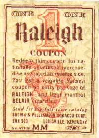

# The Way the Future Blogs

Frederik Pohl

## Working with Robert A. Heinlein, Part 2



Along the way, [Robert Heinlein](https://web.archive.org/web/20100715075459/http://www.amazon.com/gp/redirect.html?ie=UTF8&location=http%3A%2F%2Fwww.amazon.com%2Fgp%2Fentity%2FRobert-A.-Heinlein%2FB000APVWZW%3Fie%3DUTF8%26ref_%3Dntt%5Fathr%5Fdp%5Fpel%5Fpop%5F1&tag=twtfb-20&linkCode=ur2&camp=1789&creative=390957) and I had got to be pretty good  friends.  We shared some minor vices,  for example in those days smoking the same brand of cigarettes (cork-tipped Raleighs, and we both saved the coupons that came with every pack), and we both abhorred each other’s political views but had some good times arguing about them.  We didn’t get together very often because the Heinleins were West Coasters and I was resolutely East, but every now and then our paths would cross.

When the Heinleins came to New York, they preferred to stay in a mall but spiffy hotel somewhere near Tudor City, and on occasion asked me over for an evening of smoking, drinking and amiably criticizing each other’s world views.  (Well, usually it was amiable.)  And there were evenings I  remember at places like Tulsa and Grand Rapids and that wonderful circular house that the Heinleins built on a gorgeous, if rattlesnake-infested, piece of California land when Ginny’s health no longer let her live halfway up a Colorado mountain.  Now and then, though, a shadow did fall.

One of the darkest of them happened when I published a Heinlein serial — I am embarrassed to say I have forgotten which one, but it may have been the one about the future in which Africans have become the dominant gens in the world. After I had read it, I phoned [Lurton Blassingame](https://web.archive.org/web/20100715075459/http://www.blackmaskmagazine.com/blassingame.html), then Robert’s literary agent, and said I would be glad to publish the story but thought there were five or ten thousand words in the beginning that were argumentative, extraneous and kind of boring, and I wanted permission to cut them out.  (But, I promised, we would pay for even the words I wanted to cut.)

“Sure, go ahead,” said Lurton, and I did.  But Lurton hadn’t consulted with Robert Heinlein and when Robert got the issue containing the first installment he went ballistic.  When I told him that I  had asked for, and received,  permission he transferred his ire to Lurton … but not quite entirely, because when the book version came out Robert appended to the copyright notice a line that said something like “An unapproved version of this work,  brutally corrupted by Fred Pohl, appeared in his magazine If.”

(Well, I think that’s what it said, but I no longer have the book.  As I mentioned earlier, these reminiscences are first draft, which means right off the top of my head, and I may get some details wrong which will be corrected when I ultimately publish them in a book.  For which reason, if any of you out there can tell me which Heinlein  novel it was and exactly what he said in the copyright notice, I will be grateful.)

*More Heinlein to come. . . .*

**Related posts**

- [**Working with Robert A. Heinlein**](/posts/2010-05-03-working-with-robert-a-heinlein/)
- [**The Wives (and Drives) of Robert A. Heinlein, Part 1**](/posts/2010-05-17-the-wives-and-drives-of-robert-heinlein-part-1/)
- [**The Wives (and Drives) of Robert A. Heinlein: Leslyn**](/posts/2010-05-19-the-wives-and-drives-of-robert-heinlein-leslyn/)
- [**The Wives (and Drives) of Robert A. Heinlein: Ginny**](/posts/2010-05-21-the-wives-and-drives-of-robert-heinlein-ginny/)
- [**Robert A. Heinlein, Algis Budrys and Me**](/posts/2010-05-12-robert-a-heinlein-algis-budrys-and-me/)
- [**Greetings from S17° 32.18′ W149° 34.17′**](/posts/2009-02-09-greetings-from-s17-32-18-w149-34-17/)

### 23 Comments

- Steven Seydell says:
I can narrow down the list of possibilities on which Heinlein book this could be.   From [http://www.heinleinprize.com/rah/hiswritings.htm](https://web.archive.org/web/20100715075459/http://www.heinleinprize.com/rah/hiswritings.htm) the stories published in If are:
Podkayne Of Mars, serialized in Worlds of If, November 1962, January, March 1963. Putnam, 1963.
Farnham’s Freehold, serialized in If, July, August, October 1964. Putnam, 1964. Reprinted by Ace Books.
The Moon Is A Harsh Mistress, serialized in If, December 1965, January, February, March, April 1966, Putnam, 1966. Reprinted by Ace Books.
[**May 10, 2010, 1:31 am**](/posts/2010-05-10-working-with-robert-a-heinlein-part-2/)
- [Rosemary Kirstein](https://web.archive.org/web/20100715075459/http://www.rosemarykirstein.com/) says:
Would the book in question be Farnham’s Freehold?
[**May 10, 2010, 4:31 am**](/posts/2010-05-10-working-with-robert-a-heinlein-part-2/)
- Yehuda says:
The book was Farnham’s Freehold. I’ll have to wait to check the copyright notice until I get home tonight.
[**May 10, 2010, 5:20 am**](/posts/2010-05-10-working-with-robert-a-heinlein-part-2/)
- [Elio M. García, Jr.](https://web.archive.org/web/20100715075459/http://www.westeros.org/) says:
I believe the serial in question is FARNHAM\’S FREEHOLD, as per Wikipedia (http://en.wikipedia.org/wiki/Farnham%27s_Freehold):
\"Farnham\’s Freehold is a science fiction novel set in the near future by Robert A. Heinlein. A serialised version, edited by Frederik Pohl, appeared in Worlds of If magazine (July, August, October 1964). The complete version was published in novel form by G.P. Putnam later in 1964.\"
I appreciate these reminiscences and hope some day you might find time to discuss the genesis of GATEWAY, which is among my very favorite SF novels since I first read it in the mid-90\’s.
[**May 10, 2010, 6:15 am**](/posts/2010-05-10-working-with-robert-a-heinlein-part-2/)
- [Michael A. Burstein](https://web.archive.org/web/20100715075459/http://www.mabfan.com/) says:
The novel you’re thinking of is *Farnham’s Freehold*.  There’s more information on Wikipedia: [http://en.wikipedia.org/wiki/Farnham](https://web.archive.org/web/20100715075459/http://en.wikipedia.org/wiki/Farnham)’s_Freehold
[**May 10, 2010, 8:18 am**](/posts/2010-05-10-working-with-robert-a-heinlein-part-2/)
- [Gary Farber](https://web.archive.org/web/20100715075459/http://amygdalagf.blogspot.com/) says:
You published *Farnham’s Freehold in Worlds of If* in the July, August, and  October 1964 issues.  
Then *The Moon Is A Harsh Mistress in Worlds of If* in December 1965, and January, February, March, and April of 1966.
Then *I Will Fear No Evil in Galaxy* in July, August/September, October/November, December 1970).
None of the recent book editions of these books have any comments about you on their copyright pages that I’ve noticed, but I’m not presently able to check older editions.
[**May 10, 2010, 9:51 am**](/posts/2010-05-10-working-with-robert-a-heinlein-part-2/)
- John H says:
I remember having boxes filled with Raleigh coupons — both my parents smoke and we had thousands of those coupons saved up…
[**May 10, 2010, 10:05 am**](/posts/2010-05-10-working-with-robert-a-heinlein-part-2/)
- [Mario Milosevic](https://web.archive.org/web/20100715075459/http://mariowrites.com/) says:
I don’t have the book anymore either, but from your description it sounds like it must be Farnham’s Freehold.
[**May 10, 2010, 10:08 am**](/posts/2010-05-10-working-with-robert-a-heinlein-part-2/)
- Theophylact says:
Has to be *Farnham’s Freehold*. Probably the only Heinlein I couldn’t bear to read.
[**May 10, 2010, 11:19 am**](/posts/2010-05-10-working-with-robert-a-heinlein-part-2/)
- Lars says:
“Farnham’s Freehold”, by the sound of it. Sorry, someone else will have to tell you what he said in the copyright notice - I don’t own a copy.
[**May 10, 2010, 12:29 pm**](/posts/2010-05-10-working-with-robert-a-heinlein-part-2/)
- [Michael Walsh](https://web.archive.org/web/20100715075459/http://www.oldearthbooks.com/) says:
“Farnham’s Freehold” was a 3 part serial in IF in July, Aug, and apparently IF skipped an issue so part 3 was in the October issue.
[**May 10, 2010, 12:52 pm**](/posts/2010-05-10-working-with-robert-a-heinlein-part-2/)
- [Stefan Jones](https://web.archive.org/web/20100715075459/http://home.comcast.net/~stefan_jones/kira_park_lo.jpg) says:
“Farnham’s Freehold” was the after-the-bomb-falls blacks-in-charge novel.
I can’t tell you what the copyright notice says, because I got rid of my copy long ago. I found it rather . . . cranky?
[**May 10, 2010, 1:40 pm**](/posts/2010-05-10-working-with-robert-a-heinlein-part-2/)
- John H says:
Could the book have been *Farnham’s Freehold? I haven’t read it so I don’t know for sure, but Wikipedia says it was serialized in Worlds of If* in 1964 and has Africans owning white slaves.
[http://en.wikipedia.org/wiki/Farnham%27s_Freehold](https://web.archive.org/web/20100715075459/http://en.wikipedia.org/wiki/Farnham%27s_Freehold)
[**May 10, 2010, 4:07 pm**](/posts/2010-05-10-working-with-robert-a-heinlein-part-2/)
- Brian L says:
Farnham’s Freehold, Signet paperback #T2704, Sept. 1965, on the copyright page:  

“A short version of this novel, as cut and revised by Fredrik Pohl, appeared in Worlds of If Magazine, 1964.–R.A.H.”
[**May 10, 2010, 7:47 pm**](/posts/2010-05-10-working-with-robert-a-heinlein-part-2/)
- [Ken Houghton](https://web.archive.org/web/20100715075459/http://angrybear.blogspot.com/) says:
Cutting 10,000 words from that book is one of the best editorial decisions ever made.  You did good.
[**May 11, 2010, 8:38 am**](/posts/2010-05-10-working-with-robert-a-heinlein-part-2/)
- John Reynolds says:
The copy that my wife and I bought at an estate sale last year has it as “A short version of this novel, as cut and revised by Frederik Pohl, appeared in Worlds of If magazine, 1964. - R.A.H.”
[**May 11, 2010, 9:00 am**](/posts/2010-05-10-working-with-robert-a-heinlein-part-2/)
- Ross Presser says:
As everyone else is saying, it was Farnham\’s Freehold.  I can\’t get the whole copyright page from Google books, but this snippet here [http://3.ly/XlQ2](https://web.archive.org/web/20100715075459/http://3.ly/XlQ2) does say \"…, revised by Frederik Pohl, appeared in <i>Worlds of If</i> Magazine, 1964. — R.A.H.\"
[**May 11, 2010, 11:00 am**](/posts/2010-05-10-working-with-robert-a-heinlein-part-2/)
- Ross Presser says:
A Google search found several pages saying the full annotation was “A short version of this novel, cut and revised by Frederik Pohl, appeared in Worlds of If magazine 1964 — R.A.H.”"
[**May 11, 2010, 11:02 am**](/posts/2010-05-10-working-with-robert-a-heinlein-part-2/)
- Michael Cassutt says:
It was indeed FARNHAM’S, and the original note on the copyright page of the first Putnam hardcover said:
“A short version of this novel, as cut and revised by Frederik Pohl, appeared in Worlds of If Magazine, 1964. — R.A.H.”
Michael Cassutt
[**May 11, 2010, 3:04 pm**](/posts/2010-05-10-working-with-robert-a-heinlein-part-2/)
- [Todd Mason](https://web.archive.org/web/20100715075459/http://www.socialistjazz.blogspot.com/) says:
If you had cut a further 40 or 50K words from FARNHAM’S FREEHOLD, you probably would’ve improved it immeasurably. I couldn’t get as far as the slaveholding part, as the novel was published in paperback, since even the working out Who’s Boss in the bomb shelter passages at the beginning of the novel were among the worst writing by anyone I’ve ever slogged through. And I’ve read ANTHEM.
[**May 11, 2010, 8:09 pm**](/posts/2010-05-10-working-with-robert-a-heinlein-part-2/)
- [Mike Ransom](https://web.archive.org/web/20100715075459/http://tulsatvmemories.com/) says:
I’ve hung onto a copy of that August 1964 issue of If since the mid-1960s.
After reading this entry, I immediately had to go check my Signet edition of the novel for the notice, and it was toned down, as transcribed here in the comments.
I perked up at the mention of my hometown, Tulsa. What was going here on that brought Pohl and Heinlein together? And when was that? The first conventions I know about here were in the 70s.
I found “Farnham’s Freehold” very readable, but it seemed to be an early prototype of the talky Heinlein style, complete with sex occurring “Right!” “Now!” I can see why it might have attracted the editor’s pen.
[**May 11, 2010, 11:36 pm**](/posts/2010-05-10-working-with-robert-a-heinlein-part-2/)
- [Mike Ransom](https://web.archive.org/web/20100715075459/http://tulsatvmemories.com/) says:
On second thought, I believe “Stranger in a Strange Land” was the first.
[**May 12, 2010, 12:13 am**](/posts/2010-05-10-working-with-robert-a-heinlein-part-2/)
- [Mike Ransom](https://web.archive.org/web/20100715075459/http://tulsatvmemories.com/) says:
The joke about those Raleigh coupons was always that if you saved enough of them, you could cash them in for an iron lung.
[**May 12, 2010, 12:18 am**](/posts/2010-05-10-working-with-robert-a-heinlein-part-2/)

[WordPress](https://web.archive.org/web/20100715075459/http://wordpress.org/)
[TWTFB](https://web.archive.org/web/20100715075459/http://dicksmithsoftware.com/)