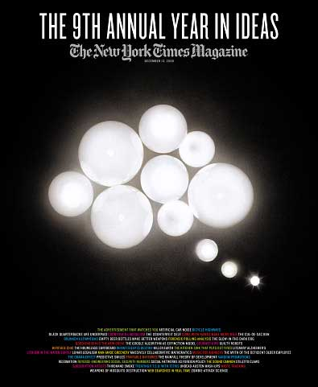

<!-- translated by DeepL -->

# Блоги «The Way the Future»

Фредерик Пол

## Почему я люблю журнал «New York Times Magazine»

Признаюсь, я его обожаю, и, честно говоря, люблю с двенадцати лет, хотя с годами причины менялись.  Конечно, сначала меня привлекали обильные и богато иллюстрированные рекламы, из-за которых я первым хватал [этот раздел](https://web.archive.org/web/20110922130958/http://www.nytimes.com/pages/magazine/) по воскресным утрам: Какому двенадцатилетнему мальчику не нравятся фото симпатичных девочек в нижнем белье? Потом меня привлекали одновременно воскресные кроссворды и кулинарная рубрика… Я ни разу не пробовал ни одного из тех блюд, разве что в воображении, но в моих фантазиях каждое из них было восхитительным.  И, конечно, на протяжении десятилетий решение  этого огромного воскресного кроссворда было ритуалом для половины американских семей.

Но «Таймс» до сих пор не отпускает меня.  Это одна из моих самых больших роскошей — и я имею в виду не стоимость в долларах и центах, а непомерную цену в часах и минутах.  К тому времени, как я пробираюсь через раздел мировых новостей, национальные новости, а также рубрики «Книги», «Путешествия», «Обзор недели» и «Журнал», день уже практически на исходе, а я даже не открыл «Бизнес», «Спорт» или какие-либо из тех восьми-десяти других разделов, которые вываливаются из пластиковой обложки.

Но те разделы, которые я читаю, мне очень нравятся.  Они неизменно дарят мне маленькие крупицы знаний,  которые я, возможно,  иначе бы не получил.  Например, в одном из номеров «Журнала» я узнал, что если в моей водопроводной воде есть немного природного лития, вероятность того, что я покончу с собой, снижается — так [сообщил](https://web.archive.org/web/20110922130958/http://query.nytimes.com/gst/fullpage.html?res=9C07E1DE1E39F930A25751C1A96F9C8B63) нейропсихиатр Такеши Терао после исследования населённых пунктов в японской префектуре Оита.  А если ты достанешь свои старые школьные снимки из шестого класса и внимательно посмотришь на них, ты там улыбаешься?  Психолог Мэтью Хертенштейн  [сообщил](https://web.archive.org/web/20110922130958/http://query.nytimes.com/gst/fullpage.html?res=9A01E2DD1E39F930A25751C1A96F9C8B63), что когда он сравнил 10 % детей, которые в детстве улыбались чаще всего, с теми, кто улыбался реже всего, то у не улыбающихся детей, когда они выросли, разводов было в пять раз больше.

В том же номере журнала я узнал, что теперь у нас есть третий вариант того, что делать с нашими телами, когда мы с ними покончим, в дополнение к старым проверенным способам — погребению или кремации.  Это называется [резомация](https://web.archive.org/web/20110922130958/http://query.nytimes.com/gst/fullpage.html?res=9504E1DD1E39F930A25751C1A96F9C8B63) — экологически безопасный способ, который не увеличивает выбросы углерода и не отнимает ценную землю у продуктивного использования.  Эту технологию впервые внедрила [клиника Мэйо](https://web.archive.org/web/20110922130958/http://mayoclinic.com/) для утилизации пожертвованных тел, когда в них больше нет нужды, и сейчас она постепенно становится доступной для коммерческих похоронных бюро в нескольких штатах. При резомации тело нагревают в растворе гидроксида калия в течение трёх часов, после чего остаётся только мягкий белый пепел, похожий на кремационный, плюс блестящие зубные пломбы и хирургические имплантаты, если таковые имелись, а также коричневатая жидкость, которая, будучи на 100 процентов стерильной, может быть сливана вместе со сточными водами.

### 4 комментария

- [Там же](https://web.archive.org/web/20110922130958/http://dougintology.blogspot.com/) говорит:
Я планирую, чтобы меня кремировали, смешали мой прах с бетоном и использовали этот бетон для создания сложной скульптуры или надгробного камня по моему собственному проекту. Это не только придаст индивидуальности этим скучным кладбищам, заполненным маленькими одинаковыми надгробиями, но и когда их превратят в кондоминиумы, мне не придётся выкапывать. Просто приковывай меня к вилочному погрузчику — и всё готово. 
Спасибо, что порекомендовал мне Мюррея Лейнстера. Я уже читал «Плачущий астероид», но на сайте manybooks.net нашёл ещё кучу его произведений.
[**28 мая 2010 г., 7:22 утра**](/fred-pohl/2010-05-28-why-i-love-the-new-york-times-magazine/)
- Боб Мунк говорит:
Меня должны кремировать и хранить до тех пор, пока не запустят первый космический лифт. Потом мой прах поднимут выше геостационарной орбиты, до самого края — может, на 100 000 км — и будут медленно рассыпать в течение 24 часов в день равноденствия. Одной только инерции хватит, чтобы долететь до Юпитера, и я полагаю, что солнечный ветер вытолкнет часть меня за пределы Солнечной системы. Конечно, меня ещё слегка рассыпят по всем планетам и лунам этой системы.
[**28 мая 2010 г., 16:30**](/fred-pohl/2010-05-28-why-i-love-the-new-york-times-magazine/)
- [Эд Газвода](https://web.archive.org/web/20110922130958/http://cycledlife.com/) говорит:
Я тоже люблю читать «Таймс». Статья о Resomation(R), опубликованная в «Таймс» в 2008 году, стала толчком к моему нынешнему бизнесу. Я являюсь конкурентом компании Resomation(R)LTD. Спустя почти два года я создал систему, которая намного лучше и значительно дешевле, чем Resomation(R).
Благодаря использованию гидроксида калия мягкие останки можно разбрасывать по земле, а не сбрасывать в канализацию. Эти останки не содержат патогенов и не оставляют следов ДНК. Тела вскоре станут питать землю, обеспечивая соотношение NPK 3,1,6. Лучше всего этот процесс можно описать как утилизацию с помощью воды и щелочи, так как Resomation® использует этот термин для обозначения процесса, осуществляемого компанией Resomation LTD. Ведущим производителем таких систем является CycledLife. [http://www.CycledLife.com](https://web.archive.org/web/20110922130958/http://www.cycledlife.com/). Кремация и захоронение вредны для живых. Утилизация с помощью воды и щелочи — лучший способ показать семье и друзьям, что о тебе помнят, когда планируешь неизбежное.
[**28 мая 2010 г., 17:41**](/fred-pohl/2010-05-28-why-i-love-the-new-york-times-magazine/)
- Стефан Джонс говорит:
Я обожаю воскресную версию NYTimes, но не часто её покупаю, потому что *чувствую, что не могу уделить ей столько времени, сколько она заслуживает*. Особенно журналу. Что дало мне терпение и повод уделить ей должное внимание: долгий перелёт на самолёте.
В большинстве воскресных газет страны есть приложение под названием «Parade Magazine». Это просто ужасно. По сравнению с ним даже «USA Today» выглядит интеллектуальным и содержательным.
[**28 мая 2010 г., 20:29**](/fred-pohl/2010-05-28-why-i-love-the-new-york-times-magazine/)

[WordPress](https://web.archive.org/web/20110922130958/http://wordpress.org/)
[TWTFB](https://web.archive.org/web/20110922130958/http://dicksmithsoftware.com/)