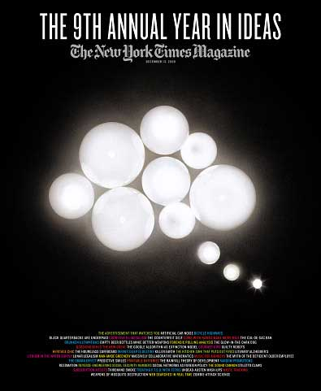

<!-- translated by Yandex Translate -->

# Путь к блогам будущего

Фредерик Пол

## Почему я люблю журнал "Нью-Йорк Таймс"

  

Я признаю, что люблю, и на самом деле люблю с тех пор, как мне исполнилось двенадцать лет, хотя с годами мои причины менялись.  Конечно, в первую очередь меня привлекли многочисленные и богато иллюстрированные рекламные объявления, которые заставили меня первым делом заглянуть в [этот раздел](https://web.archive.org/web/20110922130958/http://www.nytimes.com/pages/magazine/) воскресным утром: какому двенадцатилетнему мальчику не нравятся фотографии хорошеньких молодых девушек в нижнем белье?  Затем настал черед воскресного кроссворда и кулинарной страницы..  Я никогда не пробовал ни одного из этих блюд, кроме как в воображении, но в таком виде все они были восхитительны.  И, конечно, на протяжении десятилетий разгадывание этого огромного воскресного кроссворда было ритуалом для половины семей в Америке.

Но "Таймс" все еще удерживает меня.  Это одна из моих величайших экстравагантностей, под которой я подразумеваю не ее стоимость в долларах и центах, а ее непомерную цену в часах и минутах.  К тому времени, как я просматриваю раздел "Мировые новости" и "Национальный", а также "Книги", "Путешествия", "Неделя в обзоре" и "Журнал", день уже довольно насыщен, а я даже не открыл "Бизнес", "Спорт" или любой из восьми или десяти других разделов, которые вываливаются из своих пластиковых оболочек.

Но мне нравятся те, которые я действительно читаю.  Они неизменно снабжают меня маленькими крупицами знаний, которыми я, возможно, в противном случае не обладал бы.  Например, в одном номере журнала я узнал, что если в водопроводной воде содержится немного природного лития, то вероятность моего самоубийства снижается — так [сообщил](https://web.archive.org/web/20110922130958/http://query.nytimes.com/gst/fullpage.html?res=9C07E1DE1E39F930A25751C1A96F9C8B63) нейропсихиатр Такеши Терао после исследования сообществ в японской префектуре Оита.  И если вы достанете те старые свои снимки, сделанные в шестом классе, и изучите их, улыбнетесь ли вы?  Психолог Мэтью Хертенштейн [сообщил](https://web.archive.org/web/20110922130958/http://query.nytimes.com/gst/fullpage.html?res=9A01E2DD1E39F930A25751C1A96F9C8B63), что, когда он сравнил десять процентов самых улыбчивых детей в детстве с самыми неулыбчивыми, оказалось, что у неулыбчивых детей, когда они выросли, было в пять раз больше разводов.

В том же номере журнала я узнал, что теперь у нас есть третий вариант того, что делать с нашими трупами, когда мы покончим с ними, в дополнение к старым вариантам захоронения или кремации.  Это называется [рекультивацией](https://web.archive.org/web/20110922130958/http://query.nytimes.com/gst/fullpage.html?res=9504E1DD1E39F930A25751C1A96F9C8B63), и это экологически безопасно, не увеличивая углеродную нагрузку и не выводя бесценную землю из продуктивного использования.  Впервые этот метод был применен [клиникой Майо](https://web.archive.org/web/20110922130958/http://mayoclinic.com/) как средство утилизации донорских трупов, когда в нем больше нет необходимости, и в настоящее время он начинает становиться доступным коммерческим похоронным бюро в нескольких штатах.  При воскрешении труп нагревают в растворе гидроксида калия в течение трех часов, после чего все, что остается, - это мягкий белый пепел, похожий на кремационный, плюс блестящие зубные пломбы и хирургические имплантаты, если таковые имелись, и коричневатая жидкость, которая, будучи на 100% стерильной, может быть вылита. со сточными водами.

### 4 Комментария

- [Там](https://web.archive.org/web/20110922130958/http://dougintology.blogspot.com/) же говорится:
Мой план состоит в том, чтобы меня кремировали, смешали мой прах с каким-нибудь бетоном и использовали бетон для изготовления сложной статуи / надгробия по моему собственному дизайну. Это не только придаст какой-то характер этим убогим кладбищам, полным маленьких однообразных надгробий, но и когда они превратят их в жилые дома, им не придется меня выкапывать. Просто привяжи меня цепью к погрузчику, и все готово. 
Спасибо, что порекомендовали мне Мюррея Лейнстера. Я уже прочитал “Плачущий астероид”, но нашел гораздо больше его работ в manybooks.net .
[** 28 мая 2010 года, 7:22 утра**](/posts/2010-05-28-why-i-love-the-new-york-times-magazine/)
- Боб Манк говорит:
Меня должны кремировать и хранить до тех пор, пока не поднимется первый космический лифт. Затем мой прах будет пронесен мимо ГЕО до самого конца, возможно, за 100 000 км, и медленно высвобождаться в течение 24 часов в день равноденствия. Один только импульс доставит меня до Юпитера, и я полагаю, что Солнечный ветер полностью вытолкнет часть меня за пределы Солнечной системы.  Конечно, я также слегка посыплю все планеты и спутники в этой системе.
[** 28 мая 2010 года, 16:30 вечера**](/posts/2010-05-28-why-i-love-the-new-york-times-magazine/)
- [Эд Газвода](https://web.archive.org/web/20110922130958/http://cycledlife.com/) говорит:
Мне тоже нравится читать "Таймс". Статья о переселении (R), опубликованная в 2008 году в Times, привела к моему нынешнему бизнесу. Я являюсь конкурентом Resomation(R)LTD. Почти два года спустя я создал гораздо лучшую и значительно менее дорогостоящую систему, чем Resomation(R).
Используя гидроксид калия, мягкие остатки можно рассыпать по земле, не обязательно сливать в канализацию. Мягкие останки не содержат патогенов, без каких-либо следов ДНК. Тела скоро будут насыщать землю NPK с концентрацией 3.1.6. Лучшим описанием этого процесса является удаление воды и щелочи, поскольку Resomation(R) относится к процессу, выполняемому компанией Resomation LTD. Ведущим производителем таких систем является компания CycledLife. [http://www.CycledLife.com](https://web.archive.org/web/20110922130958/http://www.cycledlife.com/) . Кремация и захоронение вредны для живых. Распределение воды и щелочи - лучший способ показать, что вы помните семью и друзей, когда готовитесь к неизбежному.
[**28 мая 2010, 17:41 вечера**](/posts/2010-05-28-why-i-love-the-new-york-times-magazine/)
- Стефан Джонс говорит:
Я люблю воскресную "Нью-Йорк Таймс", но получаю ее нечасто, потому что *Я не чувствую, что могу уделить ей столько времени, сколько она заслуживает *. Особенно журнал. Что дало мне терпение и повод уделить этому то внимание, которого оно требует: длительный перелет на самолете.
В большинстве воскресных газет страны есть что-то под названием “Журнал о параде”. Это за гранью жалости. Это придает нам сегодня интеллектуальный и всесторонний вид.
[**28 мая 2010, 20:29 вечера**](/posts/2010-05-28-why-i-love-the-new-york-times-magazine/)

[WordPress](https://web.archive.org/web/20110922130958/http://wordpress.org/)
[TWTFB](https://web.archive.org/web/20110922130958/http://dicksmithsoftware.com/)