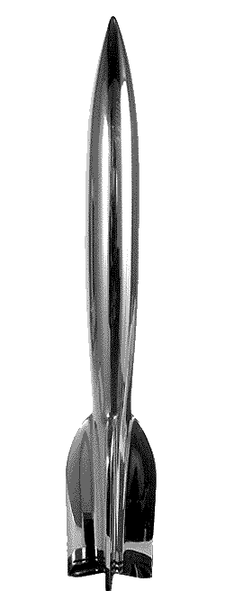

<!-- translated by DeepL -->

# Как будут вестись блоги в будущем

Фредерик Пол

## Ты уже проголосовал за премии Хьюго?

**От команды блога:**

 

Мы ждали, когда Фред что-нибудь скажет, но, похоже, он слишком скромен. У *нас* же таких угрызений совести нет, так что, если ты ещё не слышал новость, мы с радостью сообщаем:

**Фредерик Пол — футурист, член First Fandom и блогер — номинирован на премию «Хьюго» 2010 года в номинации «Лучший фэн-писатель»!**

И это ещё не всё — *ты* можешь проголосовать!

Срок голосования заканчивается 31 июля 2010 года, а [вот бюллетень](https://web.archive.org/web/20111110023952/http://www.aussiecon4.org.au/hugoawards/final_ballot.php). Участие в Ворлдкон этого года в качестве поддерживающего члена обойдётся тебе в 50 долларов США, но за это ты получишь все публикации конвента, а также электронный пакет с произведениями других номинантов на премии «Хьюго» и «Премию Джона В. Кэмпбелла» за лучшего нового писателя 2010 года.

Насколько нам известно, Фред — самый пожилой фэн, когда-либо удостоенный этой чести (не считая ретро-премий «Хьюго»). Мы уверены, что он — самый пожилой фэн или профессионал, ведущий блог.

Вперёд, Фред!

### 4 комментария

- [Брайан](https://web.archive.org/web/20111110023952/http://astoundingartifacts.blogspot.com/) говорит:
Спасибо, что рассказали нам об этом! Мистер Пол, ты слишком скромен, это тебе не на пользу. Мне очень нравится этот блог, и я с нетерпением жду твоих постов — не могу придумать никого, кто заслуживал бы этой чести больше тебя. 
Мне также кажется, что в этом есть что-то действительно прекрасное: когда фэн вырастает и становится лауреатом премии, а потом продолжает получать награды (надеюсь!) за свои фанатские произведения. Твоя номинация напоминает нам, что профессиональная и фанатская стороны научной фантастики постоянно пересекаются — и так было с самого начала. Благодаря этому всё сообщество становится сильнее, творче и ярче. Да и веселее, конечно. 
Удачи!
[**2 июня 2010 г., 19:32**](/fred-pohl/2010-06-02-have-you-voted-for-the-hugo-awards/)
- [Майкл А. Бурштейн](https://web.archive.org/web/20111110023952/http://www.mabfan.com/) говорит:
Я уже думал, не упомянет ли кто-нибудь об этом. Поздравляю!
[**3 июня 2010 г., 11:21**](/fred-pohl/2010-06-02-have-you-voted-for-the-hugo-awards/)
- Брюс говорит:
Остаётся только надеяться, что ты достаточно здоров, чтобы полететь в Австралию и получить награду!
[**7 июня 2010 г., 20:18**](/fred-pohl/2010-06-02-have-you-voted-for-the-hugo-awards/)
- Карен Андерсон говорит:
А, вижу, мой комментарий, который я разместила не в том месте, перенесли туда, где он и должен был быть; спасибо тому, кто этим занялся.
Поздравляю с номинацией на «Хьюго» в категории «Фэн»! Я бы проголосовала за тебя, если бы вообще собиралась голосовать. Но я — черт возьми — не еду в Австралию; да и не вижу смысла покупать бюллетень, когда я видела так мало из номинированных работ. 
Единственные предстоящие конвенции, на которые я планирую поехать, — это местные: WesterConChord в Пасадене, где я буду петь филк, и LosCon в Лос-Анджелесе, где я, несомненно, также буду участвовать в различных панелях. И, конечно же, днём тусоваться в баре, а ночью веселиться на вечеринках.
[**22 июня 2010 г., 23:58**](/fred-pohl/2010-06-02-have-you-voted-for-the-hugo-awards/)

[WordPress](https://web.archive.org/web/20111110023952/http://wordpress.org/)
[TWTFB](https://web.archive.org/web/20111110023952/http://dicksmithsoftware.com/)