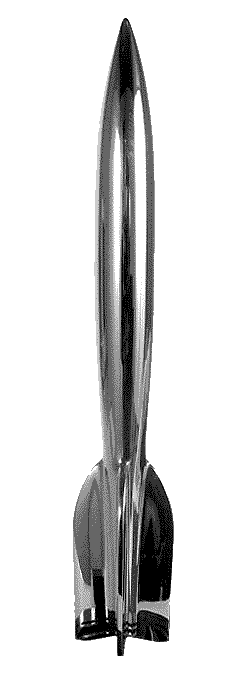

<!-- translated by Yandex Translate -->

# Путь к блогам будущего

Фредерик Пол

## Голосовали ли вы за премию Хьюго?

**От команды блога:**

  

Мы ждали, что Фред что-нибудь скажет, но, похоже, он слишком скромен. Однако у нас нет таких угрызений совести, так что, если вы еще не слышали эту новость, мы с радостью сообщим вам:

** Фредерик Пол — футурианец, первый участник фэнд—сообщества и блогер - был номинирован как лучший фэн-писатель на Хьюго-премии 2010 года!**

Не только это, но и *вы* можете голосовать!

Крайний срок - 31 июля 2010 года, и [это бюллетень](https://web.archive.org/web/20111110023952/http://www.aussiecon4.org.au/hugoawards/final_ballot.php) для голосования. Участие в Ворлдконе этого года в качестве участника поддержки обойдется вам в 50 долларов США, но при этом вы получите все публикации конференции, а также электронный пакет с работами других номинантов на Хьюго 2010 года и Премию Джона В. Кэмпбелла в номинации "Лучший новый писатель".

Насколько нам известно, Фред - самый старый фэн, когда-либо удостаивавшийся этой чести (не считая ретро-Хьюго). Мы уверены, что он самый старший фэн или профессионал, который ведет блог.

Уходи, Фред!

### 4 Комментария

- [Брайан](https://web.archive.org/web/20111110023952/http://astoundingartifacts.blogspot.com/) говорит:
Спасибо, что рассказали нам об этом! Мистер Пол, вы слишком скромны для своего же блага. Я люблю этот блог и с нетерпением жду ваших постов — я не могу представить никого, кто больше заслуживал бы этой чести. 
Я также думаю, что есть что-то действительно приятное в том, что фэн вырастает и становится автором, отмеченным наградами, а затем продолжает получать награду (я надеюсь!) за то, что пишет как фэн. Ваша номинация напоминает нам о том, что профессиональная и фанатская стороны научной фантастики постоянно пересекаются, и так было с самого начала. Все сообщество становится сильнее, креативнее и энергичнее, потому что если это. К тому же это намного веселее. 
Желаю удачи!
[**2 июня 2010, 19:32 вечера**](/fred-pohl/2010-06-02-have-you-voted-for-the-hugo-awards/)
- [Майкл А. Бурштейн](https://web.archive.org/web/20111110023952/http://www.mabfan.com/) говорит:
Мне было интересно, собирается ли кто-нибудь упомянуть об этом. Поздравляю!
[**3 июня 2010 года, 11:21 утра**](/fred-pohl/2010-06-02-have-you-voted-for-the-hugo-awards/)
- Брюс говорит:
Я могу только надеяться, что вы достаточно здоровы, чтобы поехать принимать награду в Австралию!
[**7 июня 2010, 20:18 вечера**](/fred-pohl/2010-06-02-have-you-voted-for-the-hugo-awards/)
- Карен Андерсон говорит:
Ах, я вижу, комментарий, который я разместил не в том месте, был размещен там, где ему следовало быть; моя благодарность тому, кто / что бы ни позаботилось об этом.
Поздравляем с номинацией на премию "Хьюго Фэн"! Я бы проголосовал за тебя, если бы вообще собирался голосовать. Я, черт возьми, не собираюсь в Австралию; и я не могу представить себе покупку бюллетеня, когда я видел так мало номинированных работ. 
Единственные предстоящие конференции, которые я планирую посетить, - местные: WesterConChord в Пасадене, где я буду петь в стиле filk, и LosCon в Лос-Анджелесе, где я, несомненно, также буду участвовать в различных панелях. И, конечно же, тусоваться в баре днем, устраивать вечеринки ночью.
[**22 июня 2010, 11:58 вечера**](/fred-pohl/2010-06-02-have-you-voted-for-the-hugo-awards/)

[WordPress](https://web.archive.org/web/20111110023952/http://wordpress.org/)
[TWTFB](https://web.archive.org/web/20111110023952/http://dicksmithsoftware.com/)