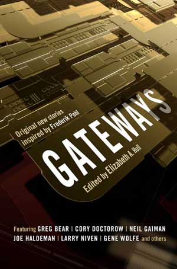

<!-- translated by DeepL -->

# Как будут выглядеть блоги будущего

Фредерик Пол

## Ладно, ты меня поймал!

#### Меня номинировали на премию «Хьюго» в номинации «Лучший фэн-автор» (и я просто в восторге!)

Конечно, номинация на «Хьюго» — это не то же самое, что победа.  Этот урок я усвоил уже не раз.  Тем не менее, это приятное чувство, и я очень ценю это.

Команда блога тоже была абсолютно права, когда призывала тебя [присоединиться к Ворлдкон](https://web.archive.org/web/20111012172009/http://www.aussiecon4.org.au/index.php?page=27), заплатить им 50 долларов и получить сборник номинантов на премию «Хьюго».  Он выходит в электронном формате, а не в старом добром печатном виде, что мне лично гораздо больше нравится, но цена вполне приемлемая.  Все эти замечательные романы, повести, новеллы и рассказы стоили бы в разы дороже, если бы ты покупал их по розничной цене, да к тому же ты получаешь подборки из всех остальных номинаций премии.

*   *   *

Раз уж мы заговорили, у меня есть ещё пара вещей, о которых я хотел с тобой поговорить.  Одно из них — действительно классная книга, которая выйдет в следующем месяце в издательстве Tor.  Она называется [Врата (Gateway)](https://web.archive.org/web/20111012172009/http://www.amazon.com/gp/product/0765326620?ie=UTF8&tag=twtfb-20&linkCode=as2&camp=1789&creative=390957&creativeASIN=0765326620) — обрати внимание на «s» во множественном числе — её подготовила моя самая любимая редакторша антологий (то есть та, с которой я женат уже четверть века, [Элизабет Энн Халл](https://web.archive.org/web/20111012172009/http://www.nippon2007.us/participants/hulle_participant.php)), и идея возникла, когда Бетти Энн сказала нашему редактору из [Tor](https://web.archive.org/web/20111012172009/http://us.macmillan.com/Tor.aspx), [Джиму Френкелю](https://web.archive.org/web/20111012172009/http://us.macmillan.com/author/jamesfrenkel), что хотела бы составить юбилейный сборник к моему тогда еще предстоящему 90-летию, состоящий из новых рассказов авторов, на чью карьеру я оказал значительное влияние — будь то как редактор, агент, соавтор или в каком-то другом качестве.

Когда она составила список, Джим присвистнул и сказал: «Здесь же почти все ведущие авторы в этой области». Не все из них смогли прислать ей рассказы, но большинство — да, и я считаю, что некоторые из них в это же время в следующем году появятся в списках номинантов на литературные премии.

Правда, к моему дню рождения она не успела. Я то и дело болел, и все её усилия уходили на то, чтобы поддержать меня на плаву. А потом сама Бетти упала на парковке у банка и сломала поясничный позвонок — это привело к болям, операции и большим задержкам.  Но теперь книга появится в магазинах, не успеешь и глаз моргнуть, и я думаю, тебе она понравится.

*   *   *

Кстати, о недугах, которые неминуемо преследуют нас, смертных…

Пару недель назад мне пришлось отрегулировать одно из устройств, которые помогают мне вести более или менее нормальную жизнь.  Мы только что припарковались у больницы, где мне чаще всего делают эти «ремонтные работы», как рядом с нами остановилась другая машина, и из неё вышли наши сотрудники: [Лия А. Зельдес](https://web.archive.org/web/20111012172009/http://www.zeldes.com/), нашей блог-мастерицей, и её мужем, [Диком Смитом](https://web.archive.org/web/20111012172009/http://www.dicksmithsoftware.com/), который следит за тем, чтобы у нас было достаточно трафика и наши компьютеры работали почти всегда.  (Кстати, они сами — неплохие кандидаты на премию «Хьюго» в номинации «Фэнзин», ведь их классный фэнзин [STET](https://web.archive.org/web/20111012172009/http://en.wikipedia.org/wiki/STET_(fanzine) три раза номинировали на эту награду.)

Я уехал оттуда и вернулся домой за пару часов.  А вот Лии — не так быстро. Её несколько дней держали под наблюдением, пока врачи выясняли, что ей нужно, потом была небольшая операция, затем постельный режим для восстановления, а в завершение, чтобы врачи не расслаблялись, ещё и небольшая пневмония.

Сейчас она вернулась домой и поправляется.  Но ей всё же удалось опубликовать пару постов прямо с больничной койки.

### 7 комментариев

- Пэт говорит:
Ты просто поднял мне настроение. Хотя, возможно, это будет уже в следующем году, так как я живу в Великобритании — а «Врата (Gateway)» планируется выпустить и здесь?
Береги себя.
[**4 июня 2010 г., 00:45**](/fred-pohl/2010-06-04-all-right-you-got-me/)
- [RAB](https://web.archive.org/web/20111012172009/http://estoreal.blogspot.com/) пишет:
Два комментария:
Во-первых, я с нетерпением жду «Враты (Gateway)».  Звучит просто потрясающе.
Во-вторых, огромное спасибо Элизабет, Лии и Дику за всё, что вы делаете.
[**4 июня 2010 г., 2:40**](/fred-pohl/2010-06-04-all-right-you-got-me/)
- [Стефан Джонс](https://web.archive.org/web/20111012172009/http://home.comcast.net/~stefan_jones/tan_jacket_lo.jpg) пишет:
В этом сборнике представлен довольно разнообразный круг авторов. И это только судя по тем, кто попал на обложку.
[**4 июня 2010 г., 12:08**](/fred-pohl/2010-06-04-all-right-you-got-me/)
- [Джеймс Дэвис Николл](https://web.archive.org/web/20111012172009/http://james-nicoll.livejournal.com/) говорит:
По-моему, оглашения где-нибудь в сети нет?
[**5 июня 2010 г., 8:58**](/fred-pohl/2010-06-04-all-right-you-got-me/)
- [Марк](https://web.archive.org/web/20111012172009/http://www.facebook.com/MrNovak) пишет:
Круто! Я только что заказал экземпляр в предзаказе, жду с нетерпением 6 июля!
Спасибо, Элизабет Энн, Фредерик и остальные ребята из команды, вы скрасили довольно скучный и дождливый день на этой стороне океана.
[**8 июня 2010 г., 3:58 утра**](/fred-pohl/2010-06-04-all-right-you-got-me/)
- Саймон говорит:
Мистер Пол, мое воображение тебе так много обязано. Выросший в холодном, сыром и грязном английском городке, я каждый день после школы проводил в библиотеке, ожидая пересадки на автобус, чтобы добраться домой, и именно там я случайно взял в руки «Врата (Gateway)», а сразу за ней — «За Синим Горизонтом Событий (Beyond the Blue Event Horizon)», и с этого момента открыл для себя всю вселенную. Благодаря твоей работе я прочитал Воннегута, Азимова, Балларда, Кэмпбелла, Зелазного, Брэдбери, Адамса — список слишком длинный, чтобы продолжать. Спасибо.
[**8 июня 2010 г., 6:13 утра**](/fred-pohl/2010-06-04-all-right-you-got-me/)
- [Лысый парень](https://web.archive.org/web/20111012172009/http://www.irememberjfk.com/) говорит:
Пусть твои хитрости позволят тебе ещё долго-долго оставаться с нами, мистер Пол.
[**9 июня 2010 г., 12:18**](/fred-pohl/2010-06-04-all-right-you-got-me/)

[WordPress](https://web.archive.org/web/20111012172009/http://wordpress.org/)
[TWTFB](https://web.archive.org/web/20111012172009/http://dicksmithsoftware.com/)