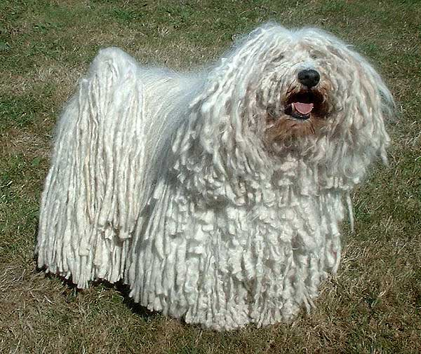

<!-- translated by DeepL -->

# Как пишут блоги будущего

Фредерик Пол

## Что рассмешило футурианцев: «История о лохматой собаке»

  

  

В 1930-х у нас у всех денег на развлечения было не так уж и много.  Те деньги, что у нас были, — это скудные и с трудом заработанные средства.  Радио было для нас главным источником юмора, а эфир заваливали два титана — Джек Бенни и Фред Аллен.  Но в основном мы сами придумывали шутки, и одной из любимых форм были «нелепые истории», которые рассказывали в заведениях нью-йоркского кафе-социума.

Профессионалы выступали в ночных клубах — иногда это были убогие залы с крошечной сценой, местами для 100–300 человек и, конечно, баром.  Те, кто там выступал, были профессионалами.  А мы — нет.  У нас не было мебели, электроники или укомплектованных баров — у нас было очень мало, кроме нас самих. К счастью, нам больше ничего и не нужно было.

Мы, Футурианцы, собирались на крыльце многоквартирного дома по адресу 2574 Бедфорд-авеню в Бруклине. Там находились четыре комнаты, которые мы называли «Башней из слоновой кости». После того как мы немного поболтали, пошутили, посплетничали, попели и немного пошумели, мы начинали действовать.

[**Сирил Корнблат**](/fred-pohl/2009-04-20-cyril/) чаще всего участвовал в таких выступлениях, [**Док Лоундс**](/fred-pohl/2009-05-08-the-quadrumvirate/) — почти так же часто.  [Чет Коэн](https://web.archive.org/web/20120421070852/http://www.philsp.com/homeville/fmi/d439.htm#A17715), Джек Гиллеспи и [Деймон Найт](https://web.archive.org/web/20120421070852/http://www.gcwillick.com/Spacelight/DKnight.html) — или, как он предпочитал писать в те дни, damon knight — могли быть частыми участниками, как и любой Футуриан или, если на то пошло, любой другой фэн, временно тусовавшийся с нами.

Так что, когда нас собиралось четверо-пятеро, мы, скорее всего, начинали представление: рассказчик продолжал свою историю, а когда он доходил до конца, кто-то из остальных начинал другую.

Почти все футурианские «нелепые истории» утрачены для представлений XXI века.  И это не совсем плохо.  Весь смысл «запутанной истории» заключался в том, что у неё не обязательно должен быть смысл. Когда Футурианцы рассказывали свои истории в присутствии обычных фенov, на лицах слушателей часто отражалось какое-то ошеломлённое недоверие. «Запутанную историю» нужно было растягивать как можно дольше.

Я не могу записать для тебя текст классической футурианской «шершавой» истории. Дело не только в том, что моя [**правая рука**](/fred-pohl/2009-01-19-why-i-m-no-pen-pal/) засохла бы и отвалилась. Ты бы её всё равно не прочитал.

Вместо этого я приведу краткое изложение классического примера футуристской «истории о лохматой собаке», давшей название всему жанру, а также «Истории о медной пушке» — практически единственного рассказа в сборнике, который порой действительно заставлял слушателей смеяться в голос.

> **История о лохматой собаке**

> У одного парня, у которого была лохматая собака, она сбежала.  Он разместил объявления во всех местных газетах с просьбой вернуть его собаку.  Он пишет: «Моя собака сбежала, и я хочу, чтобы её вернули.  Это лохматая собака, и я заплачу вознаграждение за её возвращение».

> На следующий день к нему приходит человек, который утверждает, что нашёл собаку, но когда собака появляется у двери дома, мужчина говорит: «Ой, она не такая уж и лохматая».

> **История о медной пушке**
> Это история о Лу Маленьком — самом младшем и самом маленьком сыне Великого Чама, самого влиятельного магната в провинции.  Все сыновья Великого Чама преуспели, особенно старшие, которые стали послами, губернаторами и высокопоставленными военными чиновниками.  Но к тому времени, когда появился Лу-Малыш, для него, казалось, уже ничего не осталось.

> Однако Великий Чам приказал своим чиновникам найти Лу работу.  Это заняло некоторое время, но в конце концов Лу-Малыш получил должность.

> Куратор сокровищницы Великого Чама, просматривая заброшенные уголки коллекции Великого Чама, наткнулся на старинную латунную пушку, которая датировалась временем самых ранних войн Чама.  «Почему бы (предложил он Великому Чаму) не устроить святилище с этой пушкой и не поручить его Лу Младшему?»  Его обязанности были бы несложными.  Ему нужно было бы лишь раз в неделю выносить пушку и натирать её маслом.  Когда ему сделали это предложение, Лу Маленький с неохотой согласился.  Он сказал, что это тяжелее, чем он привык, но попробует.

> И с тех пор каждую неделю он вставал рано утром, наполнял флягу специальным маслом для смазки пушки и отправлялся в лес, туда, где она хранилась.  Затем он тщательно смазывал её и усердно натирал, пока она не засияла золотистым блеском.  Потом он возвращался домой и отдыхал целую неделю.

> А однажды Великий Чам случайно заметил Лу Маленького, сидящего в тени небольшого перелеска, который, судя по всему, совсем забыл про пушку.  Он спросил: «Слушай, Лу Маленький, сегодня же вторник?»

> Маленький Лу ответил: «Да, сегодня вторник».

> «А разве вторник — не тот день, когда ты выходишь помазать латунную пушку?»

> Лу сказал:  «Да, так и было».

> Великий Чам сказал: «Как ты смеешь говорить „было“?  Разве ты не выполняешь свои обязанности?»

> Лу Маленький широко улыбнулся ему.  Он сказал: «Я надеялся, что ты будешь мной гордиться.  Видишь ли, на прошлой неделе я купил латунную пушку, и теперь я открываю собственное дело».

### 14 комментариев

- Ларс говорит:
Я всегда задавался вопросом, откуда Хайнлайн взял эту историю — ту, про медную пушку. Если честно, она не выглядит намного понятнее, чем когда я читал её версию в «Луна — Суровая Хозяйка (The Moon is a Harsh Mistress)».
А истории футурианцев с неожиданными поворотами когда-нибудь заканчивались ужасными каламбурами?
[**11 июня 2010 г., 17:10**](/fred-pohl/2010-06-11-what-made-the-futurians-laugh-the-shaggy-dog-story/)
- Тод говорит:
Извини, что звучу как идиот…  

Я не понимаю.
Рассказ Алана Дина Фостера «Шах Гвидо Г» я понял…  

к сожалению, но твой?… Мне нужны подсказки.
[**11 июня 2010 г., 17:13**](/fred-pohl/2010-06-11-what-made-the-futurians-laugh-the-shaggy-dog-story/)
- [Дэвид Дайер-Беннет](https://web.archive.org/web/20120421070852/http://dd-b.net/) говорит:
Хайнлайн использует практически эту же историю, даже в ещё более сокращённом виде, в одной из своих книг; кажется, это «Луна — Суровая Хозяйка (The Moon is a Harsh Mistress)».  А, да, вот оно; Профессор говорит Мэнни, когда они находятся на Земле:
  Он протянул руку и погладил блестящий ствол. «Мануэль, когда-то был человек, который занимался политической фиктивной работой, как и многие здесь, в этом Директорате, — полировал латунные пушки вокруг здания суда».  

	«А зачем зданию суда пушка?» 

 «Неважно. Он занимался этим годами. Это кормило его и позволяло немного откладывать, но в жизни он не продвигался вперёд. И вот однажды он уволился, снял сбережения, купил латунную пушку — и открыл собственное дело».
Есть идеи, мог ли он услышать эту историю от какого-нибудь Футурианца? Или что-то подобное уже ходило в народе ещё до, хм, середины 1960-х?
[**11 июня 2010 г., 21:33**](/fred-pohl/2010-06-11-what-made-the-futurians-laugh-the-shaggy-dog-story/)
- Ace Lightning говорит:
По крайней мере, эти истории не были «Фегутами»!
[**12 июня 2010 г., 4:46**](/fred-pohl/2010-06-11-what-made-the-futurians-laugh-the-shaggy-dog-story/)
- [Лысый парень](https://web.archive.org/web/20120421070852/http://www.irememberjfk.com/) говорит:
Джим Моррисон, как известно, любил рассказывать такие истории. Может, он был Футурианцем?  
[**12 июня 2010 г., 21:41**](/fred-pohl/2010-06-11-what-made-the-futurians-laugh-the-shaggy-dog-story/)
- Саймон говорит:
Я думал, что история про Шаха Гвидо Г. — от Азимова?
[**14 июня 2010 г., 5:44 утра**](/fred-pohl/2010-06-11-what-made-the-futurians-laugh-the-shaggy-dog-story/)
- Пэт Берри пишет:
«Шах Гвидо Г.» — это НЕ Алан Дин Фостер! Автор — Айзек Азимов. Эту историю можно найти в его сборнике «Купи Юпитер и другие рассказы».
[**14 июня 2010 г., 13:27**](/fred-pohl/2010-06-11-what-made-the-futurians-laugh-the-shaggy-dog-story/)
- Саймон говорит:
Я всегда считал рассказ «Шах Гвидо Г» ну, как бы сказать, полной чепухой. Спасибо, мистер Пол, за то, что объяснил мне контекст, необходимый для правильного восприятия этой истории.
[**15 июня 2010 г., 5:05**](/fred-pohl/2010-06-11-what-made-the-futurians-laugh-the-shaggy-dog-story/)
- Джен пишет:
«Деймон Найт» заставил меня хихикнуть.    Одно из замечательных качеств твоих воспоминаний — то, что они делают наших героев более человечными.
[**15 июня 2010 г., 9:54 утра**](/fred-pohl/2010-06-11-what-made-the-futurians-laugh-the-shaggy-dog-story/)
- Тод говорит:
Может, они ОБА взяли это из одного и того же источника?…  

АЛАН ДИН ФОСТЕР!  

«С такими друзьями…»  

Примерно начало 80-х  

И (хе-хе-хе) он ОБЪЯСНЯЕТ, откуда в названии взялась отсылка к «Шагги Дог».
[**15 июня 2010 г., 20:35**](/fred-pohl/2010-06-11-what-made-the-futurians-laugh-the-shaggy-dog-story/)
- Тод говорит:
Он даже ПРОСИТ тебя «произнести это имя вслух, очень быстро».
[**15 июня 2010 г., 20:36**](/fred-pohl/2010-06-11-what-made-the-futurians-laugh-the-shaggy-dog-story/)
- bostonEddie говорит:
Хм… когда я это услышал, это было «дюжина яблок».  

Ты знаешь ту историю про лохматого пса, которая заканчивается так: «Ой, куда ты идешь, о медвежонок с ножками Чан…?»  

(Не переживай, что раскроешь интригу — главное не то, как она заканчивается, а то, как к этому доходит)
[**22 июня 2010 г., 21:13**](/fred-pohl/2010-06-11-what-made-the-futurians-laugh-the-shaggy-dog-story/)
- Карен Андерсон говорит:
Я знала историю про латунную пушку задолго до того, как прочитала «Луна — суровая хозяйка». Вообще-то думала, что все её знают. В той версии, которую я слышала, если правильно помню, фигурировал памятник временам Войны за независимость или Гражданской войны в маленьком городке. У меня где-то есть крошечная латунная пушка с капсюльным зарядом, сделанная по образцу конной пушки с большими колёсами. У самого Хайнлайна была небольшая, но работоспособная морская пушка на деревянной лафете, которую он, по-моему, приобрел где-то после переезда из Колорадо-Спрингс в Санта-Круз. 

 — Карен Андерсон  

(Можешь использовать моё полное имя)
[**22 июня 2010 г., 23:14**](/fred-pohl/2010-06-11-what-made-the-futurians-laugh-the-shaggy-dog-story/)
- [Антон Шервуд](https://web.archive.org/web/20120421070852/http://ogre.nu/) говорит:
Что, есть люди, которые не знают, что такое «шагги-дог-тейл»?!
[**8 августа 2010 г., 21:58**](/fred-pohl/2010-06-11-what-made-the-futurians-laugh-the-shaggy-dog-story/)

[WordPress](https://web.archive.org/web/20120421070852/http://wordpress.org/)
[TWTFB2](https://web.archive.org/web/20120421070852/http://dicksmithsoftware.com/)