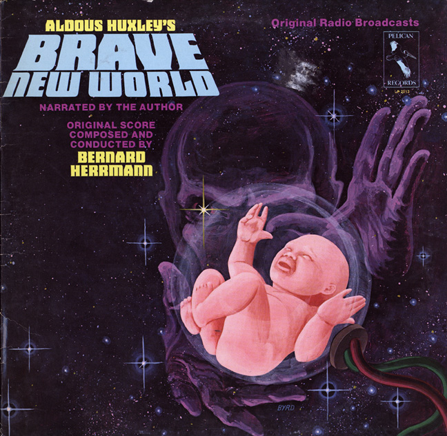

<!-- translated by DeepL -->

# Блоги «Путь в будущее»

Фредерик Пол

## Футуристическая поэзия II

  
[Сторона 1](https://web.archive.org/web/20120605095816/http://recordbrother.typepad.com/imagesilike/2005/03/a_brave_new_wor.html)
[Сторона 2](https://web.archive.org/web/20120605095816/http://recordbrother.typepad.com/imagesilike/2005/03/brave_new_world.html)


Один кубический сантиметр избавляет от десяти мрачных мыслей.
Было и будет
Меня тошнить
Я принимаю грамм и просто
Грамм — это лучше, чем проклятие
Грамм вовремя спасает девять.

— слова Олдоса Хаксли, аранжировка Фредерика Пола


(Вообще-то это нужно петь как канон, но я не совсем уверен, что это возможно.)

### 3 комментария

- Джон Х. говорит:
Олдос Хаксли читает «О дивный новый мир» под музыку Бернарда Херрманна? Это должно быть просто круто!
[**16 июня 2010 г., 10:09**](/fred-pohl/2010-06-16-futurian-poetry-ii/)
- [Стефан Джонс](https://web.archive.org/web/20120605095816/http://home.comcast.net/~stefan_jones/tan_jacket_lo.jpg) говорит:
Мне бы сейчас не помешало немного сомы.
* * *
Радиопостановка по ссылке неплохая. Сильно сокращённая, но всё равно интересная.
[**16 июня 2010 г., 11:52**](/fred-pohl/2010-06-16-futurian-poetry-ii/)
- [Себастьян Мейер](https://web.archive.org/web/20120605095816/http://sebimeyer.com/) говорит:
Вау, спасибо, что выложил эту обложку! Это одна из моих самых любимых радиопостановки того времени. С ней может сравниться разве что классическая «Война Миров (The War of the Worlds)».
[**16 июня 2010 г., 18:08**](/fred-pohl/2010-06-16-futurian-poetry-ii/)

[WordPress](https://web.archive.org/web/20120605095816/http://wordpress.org/)
[TWTFB2](https://web.archive.org/web/20120605095816/http://dicksmithsoftware.com/)