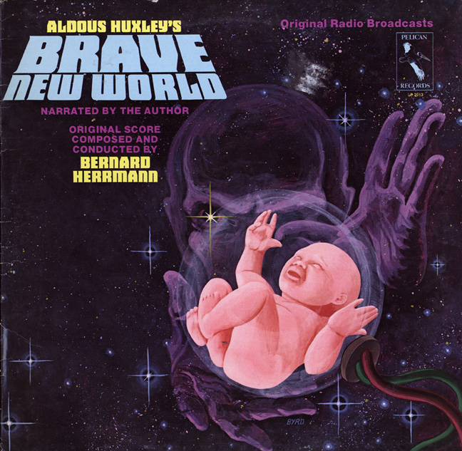

<!-- translated by Yandex Translate -->

# Путь к блогам будущего

Фредерик Пол

## Футуристическая поэзия II

  

  
[Сторона 1](https://web.archive.org/web/20120605095816/http://recordbrother.typepad.com/imagesilike/2005/03/a_brave_new_wor.html)
[Сторона 2](https://web.archive.org/web/20120605095816/http://recordbrother.typepad.com/imagesilike/2005/03/brave_new_world.html)


Один кубический сантиметр излечивает десять мрачных настроений.
Был и будет
Сделай так, чтобы мне стало плохо
Я принимаю грамм и только
Грамм лучше, чем чертов
Один грамм во времени экономит девять.

— слова Олдоса Хаксли, аранжировка Фредерика Пола


(На самом деле, это должно быть спето в виде раунда, но я не совсем уверен, что так может быть.)

### 3 Комментария

- Джон Эйч говорит:
Олдос Хаксли читает “О дивный новый мир” под музыку Бернарда Херрманна? Это, должно быть, очень круто!
[** 16 июня 2010 года, 10:09 утра**](/posts/2010-06-16-futurian-poetry-ii/)
- [Стефан Джонс](https://web.archive.org/web/20120605095816/http://home.comcast.net/~stefan_jones/tan_jacket_lo.jpg) говорит:
Мне бы сейчас не помешало немного сомы.
* * *
Радиопостановка по ссылке неплоха. Сильно сокращенный, но все равно интересный.
[** 16 июня 2010 года, 11:52 утра**](/posts/2010-06-16-futurian-poetry-ii/)
- [Себастьян Мейер](https://web.archive.org/web/20120605095816/http://sebimeyer.com/) говорит:
Ух ты, спасибо, что опубликовали эту обложку! Это одна из моих самых любимых радиопередач той эпохи. Только классическая "Война миров" приближается к этому.
[**16 июня 2010, 18:08 вечера**](/posts/2010-06-16-futurian-poetry-ii/)

[WordPress](https://web.archive.org/web/20120605095816/http://wordpress.org/)
[TWTFB2](https://web.archive.org/web/20120605095816/http://dicksmithsoftware.com/)