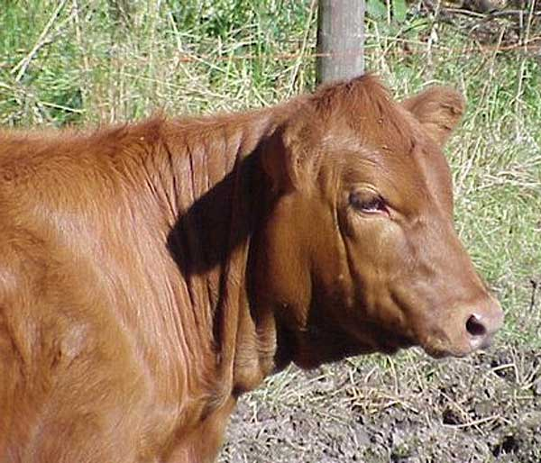

<!-- translated by DeepL -->

# Блоги «Путь в будущее»

Фредерик Пол

## Мясо и жара

  

Качество мяса, которое ты ешь, отчасти зависит от того, испытывают ли животные тепловой стресс по дороге на скотобойню.  После забоя животного его гликоген расщепляется и превращается в молочную кислоту, в результате чего pH снижается с 7 до 5,5.  Теперь мясо «напоминает размокшую белую промокательную бумагу» и начинает пахнуть гнилью, — говорит [Невилл Грегори](https://web.archive.org/web/20120304203152/http://www.rvc.ac.uk/Staff/ngregory.cfm) из Королевского ветеринарного колледжа в Англии.

При каких температурах это происходит?  О, примерно при той температуре окружающего воздуха, которая будет после глобального потепления.

*  *  *

[Моджиб Латиф](https://web.archive.org/web/20120304203152/http://climateprogress.org/2010/01/14/science-dr-mojib-latif-global-warming-cooling/), климатофизик из Института морских наук имени Лейбница в Киле, Германия, предупреждает, что в некоторые периоды ближайших десятилетий естественная изменчивость может перевесить глобальное потепление.  Скептики, не верящие в глобальное потепление, воспользуются этим, чтобы поставить под сомнение всю теорию — но, по словам Латифа, потепление вернётся.

**Похожие посты:**

- [**Измельчение мяса**](/fred-pohl/2010-04-12-meat-grinding/)
- [**Глупость Фреда**](/fred-pohl/2010-07-14-fred-s-dumb-thing/)

### 7 комментариев

- [Стефан Джонс](https://web.archive.org/web/20120304203152/http://home.comcast.net/~stefan_jones/tan_jacket_lo.jpg) говорит:
Вся суть отрицания глобального потепления заключается в том, чтобы не дать обществу предпринять какие-либо меры по решению этой проблемы. Это классическая кампания по запугиванию, дезинформации и созданию паники (FUD).
[**18 июня 2010 г., 12:29**](/fred-pohl/2010-06-18-meat-and-heat/)
- jsallison говорит:
Мне нравятся твои публикации на протяжении многих лет, и я очень ценю твои воспоминания об Азимове, Хайнлайне и Кларке, но да ладно тебе. Те же самые люди и их предки, которые сегодня вопят о «Глеуболл-потеплении», то есть об изменении климата, не так давно вопили о грядущем ледниковом периоде.  Честно говоря, по сравнению с тем гигантским источником тепла над нашими головами, я бы сказал, что утверждать, будто мы хоть как-то влияем на ситуацию, — это вершина высокомерия.
[**19 июня 2010 г., 01:17**](/fred-pohl/2010-06-18-meat-and-heat/)
- [TJIC](https://web.archive.org/web/20120304203152/http://tjic.com/) говорит:
Если принять за данность самый худший сценарий глобального потепления (чего я не делаю), то речь идёт об изменении температуры на 5 °.
Так что, изменение температуры, составляющее примерно 1/4 от суточных колебаний температуры между утром и серединой дня, разрушит мировое мясопроизводство?
Кому-нибудь здесь это кажется разумным?
> Естественная изменчивость может перевесить глобальное потепление в некоторые периоды ближайших десятилетий. Скептики сценария потепления воспользуются этим, чтобы посеять сомнения
Какой аргумент по принципу «выпадет ли «орел» — я выиграю, «решка» — я проиграю»!  «Если данные за следующие 30 лет меня подтвердят, значит, я прав.  Если данные за следующие 30 лет мне противоречат, то кому ты будешь верить?  Мне или данным?!?».
Ты вообще об этом задумываешься, прежде чем что-то публиковать?
[**19 июня 2010 г., 6:16 утра**](/fred-pohl/2010-06-18-meat-and-heat/)
- RGM говорит:
Говорю как человек, который забил на месте несколько десятков животных (разделывал оленей, свиней, коз и т. д.) и поэтому видел, что происходит с мясом после того, как оно достигает температуры окружающей среды. Мне кажется, уважаемый мистер Грегори сильно заблуждается. Имей в виду, что я, в частности, потрошил диких свиноматок в разгар техасского августа, когда даже в тени деревьев было 99f, так что могу говорить об этом с полной уверенностью.
Если не слить ВСЮ кровь из тканей (а это очень сложно), мясо останется красным, пока белки не денатурируются или не отбелятся. Незначительное повышение температуры, которое может вызвать более высокая «средняя температура на улице», не имеет практического значения. Куриц и индюков после забоя «промывают», чтобы грудное мясо оставалось белым — так требуют потребители.
Поскольку на скотобойнях специально поддерживается прохлада в рамках санитарных процедур, а животным, которых собираются забить, дают время между транспортировкой и переработкой, чтобы они отдохнули и успокоились (что облегчает процесс переработки/разделки), комментарии уважаемого господина являются неосведомлёнными, если не ложными.
[**21 июня 2010 г., 2:57 утра**](/fred-pohl/2010-06-18-meat-and-heat/)
- [Фредерик Пол](https://web.archive.org/web/20120304203152/http://www.thewaythefutureblogs.com/) говорит:
Отвечая на вопрос, думаю ли я над тем, что пишу, прежде чем публиковать: да, думаю. Позволь рассказать тебе о некоторых вещах, которые я обдумываю по поводу глобального потепления:
    Одна судоходная компания сейчас планирует редкие, но регулярные рейсы через Северо-Западный проход, так как льда, мешающего проходу, уже не хватает.
    Похоже, зоны штормов в Северной Америке смещаются на север — скажем, из Оклахомы примерно в район Висконсина. (У нас тут неделю назад был настоящий кошмар.)
    Один вид холодолюбивых антарктических пингвинов каждый год сдвигает свои места размножения чуть южнее. Их старые места теперь пустуют. Проблема для пингвинов в том, что в какой-то момент они доберутся до той части Антарктиды, где солнце вообще не восходит, и там царит вечная тьма, и тогда весь этот вид вымрет.
    Очевидно, с нашей погодой происходит что-то серьёзное.  Можешь придерживаться любой теории о причинах этого, какую предпочитаешь.  Я считаю, что это глобальное потепление, вероятно, вызванное сжиганием человеком ископаемого топлива.
    Правда, ещё не так давно научное сообщество, похоже, больше беспокоилось о будущем похолодании, чем о потеплении.  Правда и то, что в какой-то момент истории то же самое сообщество верило, что Солнце вращается вокруг Земли, а потом, совсем не так давно, изменило своё мнение и по этому поводу.
    Ты тоже можешь иметь своё мнение по этому поводу.  Я считаю, что когда учёные понимают, что новая теория более достоверна, чем старая, они (как правило) предпочитают принять новую. 
Мне нечестно обсуждать такие вопросы с читателями, потому что последнее слово всегда остается за мной, поэтому я стараюсь этого не делать.  Но ты задал вопрос, на который, как мне показалось, я должен был ответить.
[**23 июня 2010 г., 16:03**](/fred-pohl/2010-06-18-meat-and-heat/)
- Лесли де Врис говорит:
Привет снова, мистер П. —  поскольку мы вступаем в 8-ю глобальную катастрофу, подумала, что тебе это может показаться «забавным»:
«Наслаждайся жизнью, пока можешь»  

Независимый климатолог Джеймс Лавлок считает, что катастрофа неизбежна, компенсация выбросов углерода — это шутка, а этичный образ жизни — афера. 
[http://www.guardian.co.uk/theguardian/2008/mar/01/scienceofclimatechange.climatechange/print](https://web.archive.org/web/20120304203152/http://www.guardian.co.uk/theguardian/2008/mar/01/scienceofclimatechange.climatechange/print)
Я стараюсь не слишком сентиментально относиться к «покойной великой планете Земля», но это всё равно заставляет меня плакать. Когда я обсуждаю эти вещи со своими очень прозорливыми детьми, они, похоже, верят, что ситуация будет только ухудшаться, но что этот процесс отбора через много веков превратит планету в своего рода новый «Эдем». Боже мой, подростки такие странные — одновременно и реалисты, и идеалисты!
Тебе, возможно, тоже будет интересен блог Дредда, хотя он и немного тяжёлый. [http://blogdredd.blogspot.com/](https://web.archive.org/web/20120304203152/http://blogdredd.blogspot.com/) (Термин «MOMCOM», придуманный Дреддом, — это идеальное словосочетание: «военно-нефтяной медиа-комплекс»)
[**24 июня 2010 г., 15:00**](/fred-pohl/2010-06-18-meat-and-heat/)
- Джерри Куинн говорит:
Диапазон климатических зон, где мясо является популярным продуктом питания, очень широк; он включает в себя самые жаркие и самые холодные места, населённые людьми.  Глобальное потепление будет иметь различные последствия, как благотворные, так и пагубные — но, думаю, мы можем быть уверены, что внезапное превращение мяса в несъедобный продукт не будет среди них.
[**26 июня 2010 г., 3:13**](/fred-pohl/2010-06-18-meat-and-heat/)

[WordPress](https://web.archive.org/web/20120304203152/http://wordpress.org/)
[TWTFB2](https://web.archive.org/web/20120304203152/http://dicksmithsoftware.com/)