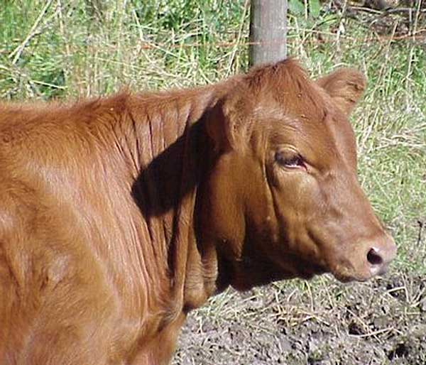

<!-- translated by Yandex Translate -->

# Путь будущего блогов

Фредерик Пол

## Мясо и тепла

  

  

Качество мяса вы едите частично зависит от того, животные страдают тепловой стресс по дороге на бойню.  После того, как животное забивают, его гликогена сломана и подкисляют до молочной кислоты, снижая ее pH с 7 до 5,5 .  Мясо теперь “напоминает сырой белой промокательной бумаги” и начинает чувствовать запах гниения, - говорит [Невилл Григорий](https://web.archive.org/web/20120304203152/http://www.rvc.ac.uk/Staff/ngregory.cfm) Англии Королевский ветеринарный колледж.

При какой температуре это происходит?  Ой, При о температуре окружающего воздуха, после глобального потепления.

*  *  *

[Mojib Латиф](https://web.archive.org/web/20120304203152/http://climateprogress.org/2010/01/14/science-dr-mojib-latif-global-warming-cooling/), климат физик по имени Лейбница Институт морских наук в Киле, Германия, предупреждает, что естественную изменчивость может перевесить глобальное потепление на некоторые периоды в ближайшие десятилетия.  Скептики сценария потепления будет использовать это, чтобы бросить тень на весь аргумент — но, - говорит Латиф, потепление вернется.

**Соответствующие должности:**

- [**Куттерования**](/fred-pohl/2010-04-12-meat-grinding/)
- [**Фред стремное дело**](/fred-pohl/2010-07-14-fred-s-dumb-thing/)

### 7 комментариев

- [Стефан Джонс](https://web.archive.org/web/20120304203152/http://home.comcast.net/~stefan_jones/tan_jacket_lo.jpg) говорит:
Вся суть за отрицание глобального потепления, чтобы предотвратить их делается в этом отношении в обществе. Это классическая кампания Д. Ю. Федорович.
[**18 июня 2010, 12:29 часов**](/fred-pohl/2010-06-18-meat-and-heat/)
- jsallison говорит:
Я наслаждался твоим опубликованных работ за эти годы и очень ценим ваши воспоминания Азимов, Хайнлайн и Кларк Но да ладно.  Сама же Люда и своих предков, которые верещат о Glewball Wormening сегодня изменение климата ака визжали о грядущем Ледниковом периоде и не столь давно.  Честно говоря, по сравнению с, что GI-normous источник тепла над головой я бы сказал, что это высота высокомерно заявлять, что мы еще и близко не имея каких-либо ощутимого эффекта.
[**19 июня 2010, 1:17 утра**](/fred-pohl/2010-06-18-meat-and-heat/)
- [TJIC](https://web.archive.org/web/20120304203152/http://tjic.com/) говорит:
Если мы принимаем как данность худшем случае глобального потепления (который я не), мы смотрим на 5 ° изменения температуры.
Так, изменения в температуре около 1/4 размер дневные колебания температур между утром и в середине дня собирается уничтожить производство мяса во всем мире?
Это имеет смысл для кого?
&gt; естественную изменчивость может перевесить глобальное потепление на некоторые периоды в ближайшие десятилетия. Скептики сценария потепления будет использовать это, чтобы бросить тень сомнения
Что такое “Орел-я выиграл, решка-проиграем” аргумент!  “Если данные в течение 30 лет, поддерживает меня, я прав.  Если данные за следующие 30 лет противоречит мне, то кому ты будешь доверять?  Я, или сведения?!?”.
Ты думаешь об этих вещах, прежде чем публиковать их?
[**19 июня 2010, 6:16 утра**](/fred-pohl/2010-06-18-meat-and-heat/)
- РГМ говорит:
Пишу как человек, который убивал несколько десятков животных в области (сфере переработки оленей, свиней, коз, и т. д.), И так видел результаты мяса животных приближается к температуре окружающей среды в дальнейшем, я считаю, респектабельным Мистером Грегори сильно дезинформировали. Имейте в виду, что это включает в себя потрошения диких свиноматок в середине Техаса августе, когда температура воздуха в тени раскидистых деревьев, 99f, я могу говорить с некоторым авторитетом.
Если человек высасывает всю кровь из тканей (что очень трудно), он будет оставаться красным до тех пор, пока белки денатурируют или отбеленные прочь. незначительные повышения температуры, что выше средней температуры наружного воздуха будет приносить незначительный. Кур и индеек не смыл после убийства, чтобы сохранить мясо грудки белые, как потребители требуют.
После бойни намеренно храниться в холодном месте, в рамках санитарной обработки процедур, а также животные должны быть убиты дается время между транспортом и обработки, чтобы отдохнуть и расслабиться (что делает переработке/разделке легче), уважаемого джентльмена комментарии неведении, если бы не лживый.
[**21 июня 2010, 2:57 утра**](/fred-pohl/2010-06-18-meat-and-heat/)
- [Фредерик Пол](https://web.archive.org/web/20120304203152/http://www.thewaythefutureblogs.com/) говорит:
Отвечая на вопрос о том, стоит ли мне думать о вещах, прежде чем я отправлю их: да, я знаю.  Позвольте мне рассказать вам некоторые вещи, которые я думаю по поводу глобального потепления:
    Одной судоходной линии сейчас планирования нечастых но регулярных рейсов через Северо-Западный проход, там уже не достаточно льда, чтобы вмешиваться.
    Шторм поясов в Северной Америке, кажется, движется на север, скажем, от Оклахомы до Висконсина.  (У нас был трудный сюда неделю назад.)
    Один из видов холодного любящих Антарктиде пингвинов движется его питательной почвой немного на юг каждый год.  Старые основания, теперь опустела.  Проблема для пингвинов является то, что в какой-то момент они добрались до той части Антарктиды, где солнце никогда не поднимается вообще, производя постоянную тьму, и то, что Вида все умрем.
    Явно что-то серьезное происходит с нашей погодой.  Ты можешь все, что теорию вы предпочитаете, чтобы ее причинах.  Моя заключается в том, что глобальное потепление, вероятно, образуются при сжигании человеком ископаемого топлива.
    Правда, не так много лет назад научное сообщество, казалось, больше беспокоился о будущем похолодания, чем потепления.  Это также верно, что в одной точке в истории, что же сообщество полагает, что Солнце крутится вокруг Земли, а потом, не все, что много позже, изменили свое мнение по этому поводу, тоже.
    Добро пожаловать на собственное мнение, а также.  Моя заключается в том, что, когда ученые выяснили, что новая теория является более надежным, чем старый, они (обычно) выбрать принять новый. 
    Это не справедливо для меня, чтобы обсуждать такие вопросы с моими читателями, потому что я всегда получаю последнее слово, поэтому я стараюсь этого не делать.  Но вы задали вопрос, что я чувствовал, что должен ответить.
[**23 июня 2010, 4:03 часов**](/fred-pohl/2010-06-18-meat-and-heat/)
- Лесли де Врис говорит:
И снова здравствуйте г-п– потому что мы входим в 8-м глобальная катастрофа, подумал, что вы могли бы найти в этом ‘забавные’:
‘Наслаждайся жизнью, пока можешь  

Наука о климате Маверик Джеймс Лавлок считает, что катастрофа неизбежна, углеродная компенсация шутка, и жили высоконравственной жизнью лохотрон. 
[http://www.guardian.co.uk/theguardian/2008/mar/01/scienceofclimatechange.climatechange/print](https://web.archive.org/web/20120304203152/http://www.guardian.co.uk/theguardian/2008/mar/01/scienceofclimatechange.climatechange/print)
Я стараюсь не быть слишком сентиментальными о “последние дни Великой планеты Земля”, но это просто заставляет меня плакать. Когда я обсуждаю такие вещи с моей очень дальновидно детей, они, похоже, считают, что это только собирается получить хуже, но этот процесс выбраковки, во многих веков, покинуть планету своего рода Новый “Эдем”. Боже мой, подростки удивительно реалистичные и идеалистические одновременно!
Вы также можете найти Дредд блог Интересный, но немного тяжелая. [http://blogdredd.blogspot.com/](https://web.archive.org/web/20120304203152/http://blogdredd.blogspot.com/) (Дредда MOMCOM является идеальным чеканки–военная масла медиа-комплекс)
[**24 июня 2010, 3:00 ч.**](/fred-pohl/2010-06-18-meat-and-heat/)
- Джерри Куинн говорит:
Диапазон климатом, в котором мясо-это популярная еда широкое; он включает в себя самые жаркие и самые холодные места заселена человеком.  Глобальное потепление будет иметь различные эффекты, некоторые полезные, а некоторые вредны – но я думаю, мы можем быть уверены, что мясо, внезапно развернувшись непродовольственными не будет среди них.
[**26 июня 2010, 3:13 ам**](/fred-pohl/2010-06-18-meat-and-heat/)

[На WordPress](https://web.archive.org/web/20120304203152/http://wordpress.org/)
[TWTFB2](https://web.archive.org/web/20120304203152/http://dicksmithsoftware.com/)