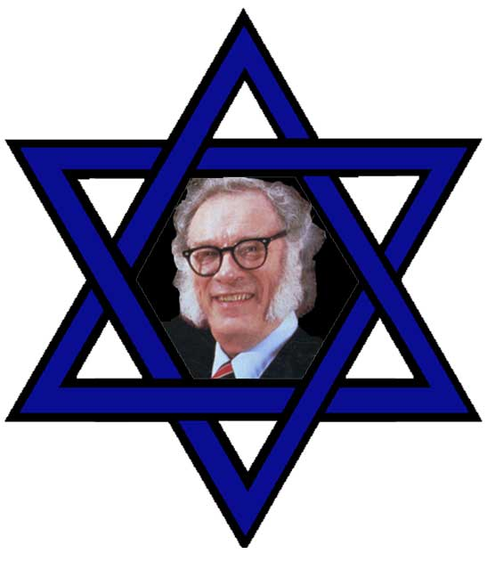

<!-- translated by DeepL -->

# «Как будет выглядеть будущее» — блог

Фредерик Пол

## Русские, евреи и Айзек Азимов

*(Это не совсем следующая часть моих воспоминаний об Айзеке Азимове. Просто дополнительные подробности по некоторым моментам, которые я хотел прояснить.  Скоро перейду к следующей части.)*

Когда я написал, что Айзек и его семья были «русскими евреями», а не просто русскими, я хотел объяснить, почему это уместно.  Но это было отступление, и хотя я обожаю отступать от темы, мне показалось, что в той статье я переборщил с этим.   Дело в том, что в России в то время, когда Айзек ещё там жил — не знаю, изменилось ли это с тех пор — русские евреи, как и все россияне, носили внутренние паспорта, и в их паспортах всегда указывалось, что они евреи.

В те времена, когда я много путешествовал, моим лучшим другом в СССР был профессор Юлий Кагарлицкий — московский учёный, театральный критик и фэн научной фантастики, автор первого (и долгое время единственного) критического труда по научной фантастике, изданного там, *«Что это за фантастика?»* (в переводе: «Что такое научная фантастика?»*). Он показал мне свой паспорт, и именно так его и идентифицировали.

Жена Юли и мать их сына Бориса не была еврейкой, и поэтому Юли, с некоторыми трудностями, удалось оформить паспорт малышу, в котором его просто указали как русского, чтобы немного облегчить ему жизнь, когда он вырастет.  (В итоге [Борис](https://web.archive.org/web/20120304203420/http://www.zcommunications.org/zspace/boriskagarlitsky) не слишком облегчил себе жизнь.  Он стал активно участвовать в политической деятельности как противник советской системы и в результате провёл пару лет в [Лефортовской тюрьме](https://web.archive.org/web/20120304203420/http://www.sptimes.ru/index.php?action_id=2&story_id=3758).  (Но когда он вышел, мир менялся, он баллотировался на выборах и, с помощью моего руководства по этой теме, [«Практическая политика»](https://web.archive.org/web/20120304203420/http://www.amazon.com/gp/product/0345023633?ie=UTF8&tag=twtfb-20&linkCode=as2&camp=1789&creative=390957&creativeASIN=0345023633), был избран в Московскую городскую думу (ну как тебе такое отступление?).))

Но это уже совсем другая история.

В любом случае, быть евреем в больших городах было чуть менее хлопотно, чем быть евреем в деревнях, как ты знаешь, если когда-нибудь видел [«Скрипач на крыше»](https://web.archive.org/web/20120304203420/http://www.amazon.com/gp/product/B000KX0IQS?ie=UTF8&tag=twtfb-20&linkCode=as2&camp=1789&creative=390957&creativeASIN=B000KX0IQS) (а если нет, то что с тобой не так?).  А место, откуда родом Айзек Азимов, находилось где-то посередине.

* * *

Раз уж я заговорил о еврействе, то Айзек Азимов не был религиозен, не вступал во многие еврейские организации и время от времени слышал кучу упреков за то, что не поддерживал еврейские дела.  Я помню один случай, о котором он рассказывал, но не помню имени того человека.  (А жаль, ведь именно в этом имени и заключается суть истории.  Придётся придумать что-нибудь — скажем, «Брюстер Адамсон».)  В общем, старик Брюстер очень публично и резко упрекнул Айзека за то, что тот не вступает в большее количество еврейских организаций и не работает на благо еврейских целей,  намекнув, что Айзек должен извиниться перед другими евреями за то, что отвернулся от культуры своего народа.  Айзек, что было для него несвойственно, разозлился и, тоже совершенно публично, ответил тому человеку, что «Айзеку Азимову» не нужно извиняться перед «Брюстером Адамсоном» за то, что он отвернулся от своего еврейства.

**Связанные посты**:

- [**Айзек**](/fred-pohl/2010-01-25-isaac-part-1-of-i-don-t-know-how-many/)
- [**Айзек, часть 2**](/fred-pohl/2010-01-31-isaac-part-2-of-many/)
- [**Айзек, часть 3**](/fred-pohl/2010-02-11-isaac-part-3-of-quite-a-few/)
- [**Айзек, часть 4**](/fred-pohl/2010-02-26-isaac-part-4-and-some-other-guys/)
- [**Айзек, часть 5**](/fred-pohl/2010-03-05-isaac-part-5-in-our-continuing-series/)

### 11 комментариев

- Дэвид Голдфарб говорит:
Помню, что читал об этом последнем случае где-то в произведениях Азимова.  Насколько я помню, он сказал: «Если бы я хотел скрыть своё еврейское происхождение, первым делом я бы сменил фамилию на „Брюстер Адамсон“».
[**25 июня 2010 г., 00:48**](/fred-pohl/2010-06-25-russians-jews-and-isaac/)
- [журнал Males Herbes](https://web.archive.org/web/20120304203420/http://www.lesmalesherbes.blogspot.com/) пишет:
Браво, отличная история!
Не знал об этой истории с «внутренним паспортом» в советской России…
[**25 июня 2010 г., 3:50 утра**](/fred-pohl/2010-06-25-russians-jews-and-isaac/)
- [Роберт Ноуолл](https://web.archive.org/web/20120304203420/http://www.robertnowall.com/) говорит:
Могу сказать, что сам Азимов использовал разные имена в тех нескольких случаях, когда писал об этом — хотя, полагаю, он сам их придумал, чтобы защитить виновных и себя от злонамеренных судебных исков.  У меня сейчас нет под рукой источников, но имена, которые я помню, — это «Джексон Дэвенпорт» и «Джефферсон Скэнлон». И идея, и сама история были отличными.
[**25 июня 2010 г., 8:41 утра**](/fred-pohl/2010-06-25-russians-jews-and-isaac/)
- qiihoskeh говорит:
Если бы это было в Бостоне, то точно бы рассмеялся.  

И отступление с тремя скобками — неплохо!
[**25 июня 2010 г., 11:22**](/fred-pohl/2010-06-25-russians-jews-and-isaac/)
- mostlyDigital пишет:
Моя государственная школа, P.S.99 в районе Мидвуд в Бруклине (Нью-Йорк), переименовали в «Школу науки и литературы имени Айзека Азимова».  За последние несколько десятилетий в этом районе стало много русских евреев.  Могу только предположить, что именно это и стало причиной смены названия, ведь хотя доктор Азимов и жил в Бруклине, его дом находился не в моём старом районе.
[**27 июня 2010 г., 16:47**](/fred-pohl/2010-06-25-russians-jews-and-isaac/)
- Росс Прессер говорит:
Один из простых способов объяснить определение «русский еврей» — это то, что слово «русский» уточняет «еврей», а не наоборот.  По крайней мере, так это воспринимается в американской еврейской культуре.
[**27 июня 2010 г., 20:55**](/fred-pohl/2010-06-25-russians-jews-and-isaac/)
- [Майкл Паркер](https://web.archive.org/web/20120304203420/http://scifipen.blogspot.com/) говорит:
Может, у меня и не самая еврейская фамилия, но моя семья, особенно  со стороны отца, состояла из русских евреев. Я насквозь американец и еврей.
Как и у Азимова, я ни в коем случае не религиозен, но это моя культура и этническая принадлежность, и я этим горжусь. Значит ли это, что я должен называть себя американским евреем и посвятить себя еврейским делам?
Я знаю, что творчество Азимова вдохновило меня, а его личная история затронула меня на каком-то другом уровне. И для меня этого было достаточно.
[**28 июня 2010 г., 2:10 утра**](/fred-pohl/2010-06-25-russians-jews-and-isaac/)
- Том Тетцлафф говорит:
Дэвид Голдфарб заслуживает золотую звездочку.
В 6-й главе книги «I. Азимов» (Doubleday [конечно же] 1994) автор указывает его как «Джефферсон Скэнлон».
«Харлан Эллисон» — не такое уж и еврейское имя, если подумать…
[**28 июня 2010 г., 20:55**](/fred-pohl/2010-06-25-russians-jews-and-isaac/)
- [Даг К](https://web.archive.org/web/20120304203420/http://dkretzmann.blogspot.com/) говорит:
Я раньше работал с одной русской еврейкой, и у неё действительно был этот внутренний паспорт, хотя у меня сложилось впечатление, что у неё не было выбора — его носить, это было навязано обществом.  Она уехала из России с родителями в конце 80-х. В рамках этой сделки у её отца конфисковали российский паспорт и военные медали. Он сражался за Россию во Второй мировой войне, так что для него это было просто разбивающим сердце ударом, но всё же это было лучше, чем сталкиваться с антисемитизмом в России.
[**2 июля 2010 г., 12:44**](/fred-pohl/2010-06-25-russians-jews-and-isaac/)
- [Антон Шервуд](https://web.archive.org/web/20120304203420/http://ogre.nu/) говорит:
«Навязывалось обществом»? Давление со стороны окружающих и всё такое?
[**8 августа 2010 г., 22:41**](/fred-pohl/2010-06-25-russians-jews-and-isaac/)
- Э. Харрис говорит:
Официальная фиксация еврейского происхождения в государственных удостоверениях личности в СССР, скорее всего, помогла предотвратить их ассимиляцию и, таким образом, сохранить их как отдельный народ. Возможно, это и не было целью, но по сравнению с царской Россией к евреям относились неплохо, по крайней мере не хуже, чем к русским в целом. 
На верхушке дискриминации в отношении евреев практически не было. Многие из высших партийных чиновников с самых первых дней были евреями, а у многих других жены были еврейками.
[**10 мая 2011 г., 22:14**](/fred-pohl/2010-06-25-russians-jews-and-isaac/)

[WordPress](https://web.archive.org/web/20120304203420/http://wordpress.org/)
[TWTFB2](https://web.archive.org/web/20120304203420/http://dicksmithsoftware.com/)