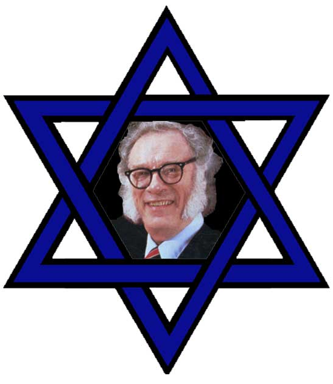

<!-- translated by Yandex Translate -->

# Путь к блогам будущего

Фредерик Пол

## Русские, евреи и Исаак

* (Это не совсем следующая часть моих воспоминаний об Айзеке Азимове. Это просто дополнительная информация по некоторым моментам, которые я хотел бы прояснить.  Скоро я перейду к следующей части.)*

Когда я написал, что Исаак и его семья были “русскими евреями”, а не просто русскими, я подумал о том, чтобы попытаться объяснить, почему это было уместно.  Однако это было отступление, и хотя я люблю отступать от темы, мне показалось, что в этом произведении я сделал слишком много.   Дело в том, что в России во времена, когда Исаак еще был там — я не знаю, изменилось ли это с тех пор, — русские евреи, как и все русские, носили внутренние паспорта, и в них неизменно декларировалось их еврейство.

В те дни, когда я много путешествовал, моим лучшим другом в СССР был профессор Юлий Кагарлицкий, московский академик, театровед и фэн-фанат научной фантастики, автор первой (и долгое время единственной) критической работы по научной фантастике, опубликованной там. *Што это за фантастика? (перевод: Что такое научная фантастика?*).  Он показал мне свой паспорт, и именно так его опознали.

Жена Юлия и мать их сына Бориса не была еврейкой, и поэтому Юлию с определенными трудностями удалось оформить паспорт ребенка, в котором он был указан просто как русский, чтобы немного облегчить ему жизнь, когда он вырастет.  (В любом случае, [Борис](https://web.archive.org/web/20120304203420/http://www.zcommunications.org/zspace/boriskagarlitsky) не так-то просто все это устроил для себя.  Он стал политически активным противником советской системы и в результате провел пару лет в [Лефортовской тюрьме](https://web.archive.org/web/20120304203420/http://www.sptimes.ru/index.php?action_id=2&story_id=3758).  (Но когда он вышел, мир менялся, он баллотировался на должность и, с помощью моего руководства по предмету "[Практическая политика](https://web.archive.org/web/20120304203420/http://www.amazon.com/gp/product/0345023633?ie=UTF8&tag=twtfb-20&linkCode=as2&camp=1789&creative=390957&creativeASIN=0345023633)", был избран в Московский городской совет (и как вам такое отступление?).))

Но все это уже другая история.

В любом случае, быть евреем в больших городах было несколько менее хлопотно, чем быть евреем в деревнях, о чем вы знаете, если когда-нибудь видели "[Скрипача на крыше](https://web.archive.org/web/20120304203420/http://www.amazon.com/gp/product/B000KX0IQS?ie=UTF8&tag=twtfb-20&linkCode=as2&camp=1789&creative=390957&creativeASIN=B000KX0IQS)" (а если нет, то что с вами такое?).  А место, откуда родом Азимовы, находилось где-то посередине.

* * *

Пока я говорю о еврействе, Исаак не исповедовал религию, не вступал во многие еврейские организации и время от времени получал множество упреков за то, что не помогал поддерживать еврейские дела.  Я помню один случай, о котором он упомянул, все, кроме имени другого человека.  (Жаль, потому что название - это суть истории.  Мне придется что—нибудь придумать - скажем, “Брюстер Адамсон".).  Как бы то ни было, Олд Брюстер очень публично и жестко упрекнул Айзека в том, что он не присоединился к большему количеству еврейских организаций и не работал на достижение более еврейских целей, предположив, что Айзек должен извиниться перед другими евреями за то, что отвернулся от культуры своего народа.  Айзек нехарактерно разозлился и, также довольно публично, сказал этому человеку, что “Айзеку Азимову” не нужно извиняться перед “Брюстером Адамсоном” за то, что он отвернулся от своего еврейства.

**Связанные должности**:

- [**Исаак**](/fred-pohl/2010-01-25-isaac-part-1-of-i-don-t-know-how-many/)
- [** Исаак, часть 2**](/fred-pohl/2010-01-31-isaac-part-2-of-many/)
- [** Исаак, часть 3**](/fred-pohl/2010-02-11-isaac-part-3-of-quite-a-few/)
- [** Исаак, часть 4**](/fred-pohl/2010-02-26-isaac-part-4-and-some-other-guys/)
- [** Исаак, часть 5**](/fred-pohl/2010-03-05-isaac-part-5-in-our-continuing-series/)

### 11 Комментариев

- Дэвид Голдфарб говорит:
Я помню, что читал об этом последнем инциденте где-то в трудах Азимова.  Насколько я помню, он сказал: “Если бы я хотел скрыть свое еврейство, самое первое, что я бы сделал, это сменил бы свое имя на "Брюстер Адамсон’”.
[** 25 июня 2010 года, 12:48 утра**](/fred-pohl/2010-06-25-russians-jews-and-isaac/)
- [ревиста самцов Трав](https://web.archive.org/web/20120304203420/http://www.lesmalesherbes.blogspot.com/) говорит:
Браво, отличная история!
Не знали об этой проблеме с “внутренним паспортом” в советской России…
[** 25 июня 2010 года, 3:50 утра**](/fred-pohl/2010-06-25-russians-jews-and-isaac/)
- [Роберт Новолл](https://web.archive.org/web/20120304203420/http://www.robertnowall.com/) говорит:
Я могу сказать вам, что сам Азимов несколько раз использовал разные имена, когда писал об этом — хотя он сам их выдумал, чтобы защитить виновных и себя, я полагаю, от злонамеренного судебного процесса.  У меня нет под рукой рекомендаций, но имена, которые я припоминаю, - “Джексон Дэвенпорт” и “Джефферсон Скэнлон”.  И суть, и история были хороши.
[** 25 июня 2010 года, 8:41 утра**](/fred-pohl/2010-06-25-russians-jews-and-isaac/)
- киихоске говорит:
Если бы это было в Бостоне, то определенно ЛОЛ.  

И отступление в 3 скобки - это неплохо!
[** 25 июня 2010 года, 11:22 утра**](/fred-pohl/2010-06-25-russians-jews-and-isaac/)
- В основном Digital говорит:
Моя государственная школа P.S.99 в районе Мидвуд в Бруклине (Нью-Йорк) была переименована в “Школу науки и литературы имени Айзека Азимова”.  Этот район за последние несколько десятилетий стал населен русскими евреями.  Я могу только предположить, что это и есть причина смены названия, потому что, хотя доктор Азимов действительно жил в Бруклине, его дом находился не в моем старом районе.
[**27 июня 2010, 16:47 вечера**](/fred-pohl/2010-06-25-russians-jews-and-isaac/)
- Росс Прессер говорит:
Один из быстрых способов объяснить определение “русский еврей” состоит в том, что слово “русский” видоизменяет слово “еврей”, а не наоборот.  По крайней мере, так все заканчивается в американской еврейской культуре.
[**27 июня 2010, 20:55 вечера**](/fred-pohl/2010-06-25-russians-jews-and-isaac/)
- [Майкл Паркер](https://web.archive.org/web/20120304203420/http://scifipen.blogspot.com/) говорит:
Возможно, у меня не самая еврейская фамилия, но моя семья, особенно по отцовской линии, были русскими евреями. Я американец до мозга костей и еврей.
Как и у Азимова, хотя я ни в коем случае не религиозен, это моя культура и этническая принадлежность, и я горжусь этим. Означает ли это, что я должен называть себя американским евреем и посвятить себя еврейским делам?
Я знаю, что творчество Азимова вдохновило меня, и его личная история связана со мной на другом уровне. И для меня этого было достаточно.
[** 28 июня 2010 года, 2:10 утра**](/fred-pohl/2010-06-25-russians-jews-and-isaac/)
- Том Тецлафф говорит:
Дэвид Голдфарб получает звезду Голд.
Глава 6 из раздела “I. Азимов” (Doubleday [of COURSE], 1994), автор называет его "Джефферсон Скэнлон”.
"Харлан Эллисон" - не такое уж и еврейское имя, теперь, когда я думаю об этом…
[**28 июня 2010, 20:55 вечера**](/fred-pohl/2010-06-25-russians-jews-and-isaac/)
- [Даг Кей](https://web.archive.org/web/20120304203420/http://dkretzmann.blogspot.com/) говорит:
Раньше я работал с русской еврейкой, и у нее определенно был этот внутренний паспорт, хотя, по моему мнению, у нее не было выбора в его ношении, это было навязано обществом.  Она уехала из России вместе со своими родителями в конце 80-х. Российский паспорт ее отца и военные медали были конфискованы в рамках сделки. Он сражался за Россию во время Второй мировой войны, так что это было душераздирающе для него, но все же это было лучше, чем столкнуться с антисемитизмом в России.
[**2 июля 2010, 12:44 вечера**](/fred-pohl/2010-06-25-russians-jews-and-isaac/)
- [Антон Шервуд](https://web.archive.org/web/20120304203420/http://ogre.nu/) говорит:
“навязанный обществом”? Давление со стороны сверстников и тому подобное?
[**8 августа 2010, 10:41 вечера**](/fred-pohl/2010-06-25-russians-jews-and-isaac/)
- Э Харрис говорит:
Официальная регистрация еврейства в государственных документах в СССР, вероятно, помогла предотвратить их ассимиляцию и, таким образом, помогла сохранить их как особый народ. Возможно, это и не входило в намерения, но по сравнению с имперской Россией с евреями обращались неплохо, по крайней мере, не хуже, чем с русскими в целом. 
На самом верху не было никакой дискриминации в отношении евреев. Многие из высших партийных чиновников с самых первых дней были евреями, и у многих других были жены-еврейки.
[**10 мая 2011, 10:14 вечера**](/fred-pohl/2010-06-25-russians-jews-and-isaac/)

[WordPress](https://web.archive.org/web/20120304203420/http://wordpress.org/)
[TWTFB2](https://web.archive.org/web/20120304203420/http://dicksmithsoftware.com/)