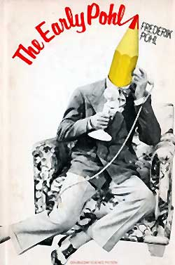

<!-- translated by DeepL -->

# Как будут вести блоги в будущем

Фредерик Пол

## «Подвал и империя»



**Введение**

*Это пришло без предупреждения от моего старого друга Эндрю Портера, который когда-то был редактором и издателем журнала «Algol/Science Fiction Chronicle» — единственного настоящего конкурента журнала «Locus».  Энди не объяснил, зачем прислал, но, наверное, просто решил, что мне будет приятно увидеть это снова — это отрывок из главы моей книги под названием  [Ранний Пол](https://web.archive.org/web/20110922134338/http://www.amazon.com/gp/product/0891907971?ie=UTF8&tag=twtfb-20&linkCode=as2&camp=1789&creative=390957&creativeASIN=0891907971)*  *, которую я не перечитывал уже много лет.  Ну, некоторые места мне действительно понравились (хотя в других частях просто повторялось то, что я уже писал здесь и в других местах).  Учитывая, как много людей говорили, что тебе понравилась глава, которую я нечаянно перепечатал из  [Ретроспективы Будущего (The Way the Future Was)](https://web.archive.org/web/20110922134338/http://www.amazon.com/gp/product/0345260597?ie=UTF8&tag=7159-20&linkCode=as2&camp=1789&creative=390957&creativeASIN=0345260597)* , *некоторым из вас, возможно, понравится и это, так что я рискну и перепечатаю и это тоже.  (Убрав при этом большую часть, хотя, наверное, и не всё, из того, что уже было в предыдущей статье.)*

*Название статьи придумал Энди. (Оно отсылает к тому, что если в 30-х годах в Нью-Йорке ты хотел создать клуб НФ, было полезно иметь подвал, где можно было проводить собрания клуба.)   Также Энди решил поместить в начале фотографию Уилла Сикоры и Вилли Лей, хотя к этой статье имеет отношение только Сикора, да и то не сильно.  Так что я скажу тебе, что собираюсь сделать.  В качестве послесловия я добавлю немного информации о том, кто они такие, а также расскажу забавную, хотя и немного неловкую для меня историю о книге «Ранний Пол», из которой взята эта статья.*

ПОДВАЛ И ИМПЕРИЯ  

*Из книги «Ранний Пол», авторские права ©1976 Фредерик Пол. (Сокращённая версия.)*

Зимой 1933 года, когда мне только что исполнилось тринадцать, я открыл для себя три новые истины.

Первая истина заключалась в том, что в мире царил полный хаос. Вторая — в том, что я действительно не собирался всю жизнь проработать химическим инженером, что бы я ни говорил своему школьному консультанту в [**Бруклинской технической средней школе**](/fred-pohl/2009-08-28-when-i-graduated-from-high-school-after-73-years/). А третья заключалась в том, что в своём увлечении научной фантастикой как образом жизни я был не один.

Все эти новые открытия были для меня важны, и в некотором смысле они все были связаны между собой. Я только что начал второй семестр первого курса в [Бруклинской технической школе](https://web.archive.org/web/20110922134338/http://www.bths.edu/). Это была холодная, грязная зима в самый разгар Великой депрессии. Радости было не так уж много. Мужчины продавали яблоки на улицах. Безработные стояли в [очереди за хлебом](https://web.archive.org/web/20110922134338/http://minnesota.publicradio.org/collections/special/columns/news_cut/content_images/bread_line_depression.jpg%22) и молились о снеге — это означало, что появится работа по уборке снега с тротуаров. Рузвельт только что был избран президентом, но ещё не вступил в должность — день инаугурации, по-прежнему привязанный к расписанию дилижансов 1789 года, ещё не перенесли с 4 марта. Банки разорялись.

Денег было мало, но с другой стороны, много и не нужно было. Проезд в метро стоил 5 центов. Столько же стоил хот-дог в [Nedick’s](https://web.archive.org/web/20110922134338/http://www.barrypopik.com/index.php/new_york_city/entry/always_a_pleasure_nedicks/), чего хватало на обед школьнику. В кино можно было сходить за 10 центов или, иногда, за банку супа, которую потом отдавали голодающим.

«Бруклин Тек» был престижной школой, и, возможно, именно поэтому я и решил поступить туда. Как и многие мои коллеги, с сожалением должен признать, что в детстве я всегда был чем-то вроде интеллектуального сноба. (О том, кем я являюсь сейчас, говорить не хочу.) «Тех» зародился в старинном заводском здании, рядом с въездом на Манхэттенский мост, в самой грязной части промышленного приречного района Бруклина. Со временем он перерос это помещение и теперь располагался в нескольких обветшалых бывших гимназиях в том же районе. Мы переходили из здания в здание, с урока на урок.

Однажды я шёл с урока технического черчения в школе № 5 на урок кузнечного дела и литейного производства в главном здании в компании высокого худощавого парня по имени [**Джозеф Гарольд Доквейлер**](/fred-pohl/2009-09-28-let-there-be-fandom-part-2-school-days/). Примерно в третий раз, когда мы вместе пересекали Флэтбуш-авеню, я обнаружил, что у нас есть одна очень важная общая черта. Он тоже был фэном научной фантастики третьей степени. То есть он не просто читал эту литературу и не ограничивался сбором старых выпусков и поиском упущенных произведений в букинистических магазинах. Он, как и я, твёрдо намеревался когда-нибудь сам написать такие произведения.

Через шесть или семь лет Джозеф Гарольд Доквейлер сменил имя на Дирк Уайли.  Ещё позже мы с ним стали партнёрами в литературном агентстве, а ещё позже — но, к сожалению, не намного позже — он умер в ужасающем возрасте двадцати восьми лет от последствий службы в [Битве за Арденны](https://web.archive.org/web/20110922134338/http://www.pbs.org/wgbh/amex/bulge) во Второй мировой войне.

Дирк был первым человеком, которого я встретил и который был похож на меня. Узнав, что мы не единственные, мы задумались о том, чтобы найти ещё таких же, кто смог бы и хотел бы сравнить достоинства журналов «Amazing Stories» и «Wonder Stories» и обсудить охватывающий всю галактику блеск рассказов [**Э. Э. Смита**](/fred-pohl/2009-12-22-doc-skylark-smith/) [«Скайларк»](https://web.archive.org/web/20110922134338/http://manybooks.net/titles/smithee2086920869-8.html). Одним словом, мы отправились на поиски фэндома научной фантастики.

Плохо было то, что фэндом тогда ещё практически не существовало.

Хорошо было то, что оно как раз собиралось появиться на свет, когда журнал «Wonder Stories» запустил клуб переписки под названием [**Лига Научной Фантастики (Science Fiction League)**](/fred-pohl/2009-09-17-let-there-be-fandom-the-science-fiction-league/), чтобы увеличить тираж. Мы сразу же вступили в него и начали ходить на собрания клуба, как только образовалось местное отделение, где познакомились с такими же, как мы.

*Продолжение следует...*

**Связанные посты:**

- [**«Подвал и империя», часть 2: Встречи любителей научной фантастики**](/fred-pohl/2010-07-07-basement-and-empire-part-2-science-fiction-meetings/)
- [**«Подвал и империя», часть 3: уроки НФ**](/fred-pohl/2010-07-09-basement-and-empire-part-3-lessons-in-sf/)
- [**«Подвал и империя», послесловие**](/fred-pohl/2010-07-12-basement-and-empire-afterwords/)
- [**«Квадрумвират»**](/fred-pohl/2009-05-08-the-quadrumvirate/)
- [**Да будет фэндом: Лига Научной Фантастики (Science Fiction League)**](/fred-pohl/2009-09-17-let-there-be-fandom-the-science-fiction-league/)
- [**Да будет фэндом, часть 2: Школьные годы**](/fred-pohl/2009-09-28-let-there-be-fandom-part-2-school-days/)
- [**Да будет фэндом, часть 3: Детство в Бруклине**](/fred-pohl/2009-10-02-let-there-be-fandom-part-3-a-brooklyn-boyhood/)
- [**Да будет фэндом, часть 4: Новый курс, новые миры**](/fred-pohl/2009-10-08-let-there-be-fandom-part-4-new-deal-new-worlds/)
- [**Да будет фэндом, часть 5: Высшая лига**](/fred-pohl/2009-10-12-let-there-be-fandom-part-5-the-big-league/)
- [**Да будет фэндом, часть 6: Профи!**](/fred-pohl/2009-10-15-let-there-be-fandom-part-6-the-pros/)
- [**Пусть будет фэндом, часть 7: Крестовый поход**](/fred-pohl/2009-10-19-let-there-be-fandom-part-7-the-crusade/)

### 2 комментария

- [Стефан Джонс](https://web.archive.org/web/20110922134338/http://home.comcast.net/~stefan_jones/kira_park_lo.jpg) пишет:
Продолжай в том же духе!
Ого, Вилли Лей на этой фотографии выглядит так молодо! У меня есть пара наборов пластиковых моделей космических кораблей — это переиздания моделей, выпущенных в конце 50-х. На коробках ([1](https://web.archive.org/web/20110922134338/http://www.fantastic-plastic.com/SPACE%20TAXI%20PAGE.htm)  , [2](https://web.archive.org/web/20110922134338/http://www.fantastic-plastic.com/MONOGRAM%20PASSENGER%20ROCKET%20PAGE.htm)) изображён Вилли Лей, показывающий готовые модели аккуратно одетым детям.
[**5 июля 2010 г., 19:13**](/fred-pohl/2010-07-05-basement-and-empire/)
- [Лысый парень](https://web.archive.org/web/20110922134338/http://www.irememberjfk.com/) говорит:
Точно, как сказал Стефан!
Мистер Поль, может, когда-нибудь ты поделишься воспоминаниями об «Analog»? Для молодого представителя поколения бумеров в начале 70-х это был отличный журнал…
[**6 июля 2010 г., 16:53**](/fred-pohl/2010-07-05-basement-and-empire/)

[WordPress](https://web.archive.org/web/20110922134338/http://wordpress.org/)
[TWTFB](https://web.archive.org/web/20110922134338/http://dicksmithsoftware.com/)