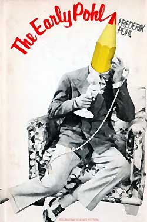

<!-- translated by Yandex Translate -->

# Путь к блогам будущего

Фредерик Пол

## Подвал и империя



**Введение**

* Это пришло без предупреждения от моего старого друга Эндрю Портера, некогда редактора и издателя "Алгол/хроника научной фантастики", единственного реального конкурента, который когда-либо был у "Локуса".  Энди не сказал, зачем он это прислал, но я думаю, он просто подумал, что я хотел бы увидеть это снова — это часть главы, взятой из моей книги под названием "[Ранний Пол](https://web.archive.org/web/20110922134338/http://www.amazon.com/gp/product/0891907971?ie=UTF8&tag=twtfb-20&linkCode=as2&camp=1789&creative=390957&creativeASIN=0891907971)", которую я не просматривал годами.  Что ж, кое-что из этого мне действительно понравилось (хотя другие части просто повторяли то, что я написал здесь и в других местах).  Учитывая, сколько людей сказали, что вам понравилась глава, которую я непреднамеренно перепечатал из Ретроспективы Будущего ([The Way The Future Was](https://web.archive.org/web/20110922134338/http://www.amazon.com/gp/product/0345260597?ie=UTF8&tag=7159-20&linkCode=as2&camp=1789&creative=390957&creativeASIN=0345260597)), некоторым из вас это тоже может понравиться, поэтому я собираюсь рискнуть и перепечатать и это.  (Вырезав многое, хотя, вероятно, и не все, из того, что уже было в предыдущем фрагменте.)*

* Название статьи принадлежит Энди.  (Это относится к тому факту, что если вы хотели основать клуб НФ в Нью-Йорке в 30-х годах, вам помогало наличие подвала, в котором вы могли бы проводить собрания клуба.) Также Энди решил включить фотографию Уилла Сикоры и Вилли Лея в начале, хотя только Сикора имеет какое-то отношение к этому произведению, да и то не очень большое.  Итак, я скажу вам, что я собираюсь сделать.  В качестве послесловия я добавлю немного о том, кто они такие, а также расскажу вам забавную, хотя и немного смущающую меня историю о раннем Поле, книге, из которой взят этот фрагмент.*

ПОДВАЛ И ИМПЕРИЯ  

* Из книги "Ранний Пол", авторское право ©1976 Фредерика Пола.   (Сокращенно.)*

Зимой 1933 года, когда мне только исполнилось тринадцать, я открыл для себя три новые истины.

Первая истина заключалась в том, что мир был в адском беспорядке. Вторая заключалась в том, что я действительно не собирался всю свою жизнь быть инженером-химиком, что бы я ни говорил своему методисту в [Бруклинской технической средней школе.](/fred-pohl/2009-08-28-when-i-graduated-from-high-school-after-73-years/) И третье заключалось в том, что в своем обращении к научной фантастике как образу жизни я был не одинок.

Все эти новые открытия были важны для меня, и в некотором смысле все они были взаимосвязаны. У меня только что начался второй семестр моего первого курса в [Бруклинском технологическом](https://web.archive.org/web/20110922134338/http://www.bths.edu/) институте. Это была холодная, промозглая зима в самых глубинах Великой депрессии. Там было не так уж много радости. Мужчины продавали яблоки на улицах. Безработные стояли в [очередях за хлебом](https://web.archive.org/web/20110922134338/http://minnesota.publicradio.org/collections/special/columns/news_cut/content_images/bread_line_depression.jpg%22) и молились о снеге — это означало, что будет работа по его уборке с тротуаров. Рузвельт только что был избран президентом, но еще не вступил в должность — день инаугурации, все еще привязанный к расписанию дилижансов 1789 года, еще не был перенесен с 4 марта. Банки разорялись.

Денег было немного, но, с другой стороны, много и не требовалось. Проезд в метро стоил пять центов. Как и хот-дог у [Недика](https://web.archive.org/web/20110922134338/http://www.barrypopik.com/index.php/new_york_city/entry/always_a_pleasure_nedicks/), которого хватило бы на обед школьнику. Вы могли бы сходить в кино за десятицентовик или, иногда, за банку супа, которую можно было бы пожертвовать голодающим.

Бруклинский технический университет был престижной школой, и, возможно, именно поэтому я решил поступить в нее в первую очередь. Как и многие мои коллеги, я с сожалением должен сказать, что в детстве я всегда был чем-то вроде интеллектуального сноба. (Я не хочу обсуждать, кем я являюсь сейчас.) Технология зародилась в старинном здании фабрики, рядом со входом на Манхэттенский мост в самой мрачной части промышленного района Риверсайд в Бруклине. Она переросла это и теперь располагалась вокруг кучки ветхих бывших средних школ в том же районе. Мы переходили из здания в здание, из класса в класс.

Я обнаружил, что иду из класса механического рисования в P.s. № 5 в класс кузнечного и литейного дела в главном здании в компании высокого худощавого парня по имени [Джозеф Гарольд Доквейлер**](/fred-pohl/2009-09-28-let-there-be-fandom-part-2-school-days/). Примерно в третий раз, когда мы вместе пересекали Флэтбуш-авеню, я обнаружил, что у нас есть нечто очень важное общее. Он тоже был фэном научной фантастики третьей степени. То есть он не просто читал материал и даже не останавливался на сборе старых выпусков и поиске в букинистических магазинах пропущенных произведений. У него, как и у меня, было твердое намерение когда-нибудь написать ее.

Шесть или семь лет спустя Джозеф Гарольд Доквейлер переименовал себя в Дирка Уайли.  Еще позже мы с ним стали партнерами в литературном агентстве, а позже, но, к сожалению, не намного позже, он умер в ужасающем возрасте двадцати восьми лет от последствий своей службы в [битве при Арденнах](https://web.archive.org/web/20110922134338/http://www.pbs.org/wgbh/amex/bulge) во время Второй мировой войны.

Дирк был первым человеком, которого я нашла похожим на себя. Узнав, что мы не уникальны, мы рассмотрели возможность найти еще кого-нибудь, кто смог бы и захотел сравнить достоинства Amazing с другими. Рассказывайте удивительные истории и обсуждайте очарование, охватывающее всю Galaxy, в рассказах [Э.Э. Смита "](/fred-pohl/2009-12-22-doc-skylark-smith/)Жаворонок[".](https://web.archive.org/web/20110922134338/http://manybooks.net/titles/smithee2086920869-8.html) Одним словом, мы отправились на поиски фэнд научной фантастики.

Плохая часть этого заключалась в том, что фэндом еще не совсем существовал.

Хорошей частью было то, что она только собиралась появиться на свет, когда Wonder Stories основали заочный клуб, увеличивающий тиражи, под названием [** Лига Научной Фантастики(Science Fiction League)**](/fred-pohl/2009-09-17-let-there-be-fandom-the-science-fiction-league/). Мы присоединились к instanter и начали посещать собрания клуба, как только было создано местное отделение, где мы познакомились с такими же, как мы сами.

* Это еще не все. . . .*

**Связанные должности:**

- [** Подвал и Империя, часть 2: Встречи по научной фантастике**](/fred-pohl/2010-07-07-basement-and-empire-part-2-science-fiction-meetings/)
- [** Подвал и империя, часть 3: Уроки НФ**](/fred-pohl/2010-07-09-basement-and-empire-part-3-lessons-in-sf/)
- [** Подвал и Империя, послесловия**](/fred-pohl/2010-07-12-basement-and-empire-afterwords/)
- [** Квадрумвират**](/fred-pohl/2009-05-08-the-quadrumvirate/)
- [**Пусть будет фэндом: Лига Научной Фантастики(Science Fiction League)**](/fred-pohl/2009-09-17-let-there-be-fandom-the-science-fiction-league/)
- [**Пусть будет фэндом, часть 2: Школьные дни**](/fred-pohl/2009-09-28-let-there-be-fandom-part-2-school-days/)
- [** Пусть будет фэндом, часть 3: Бруклинское детство**](/fred-pohl/2009-10-02-let-there-be-fandom-part-3-a-brooklyn-boyhood/)
- [**Да будет фэндом, часть 4: Новый курс, новые миры**](/fred-pohl/2009-10-08-let-there-be-fandom-part-4-new-deal-new-worlds/)
- [**Да будет фэндом, часть 5: Высшая лига**](/fred-pohl/2009-10-12-let-there-be-fandom-part-5-the-big-league/)
- [** Пусть будет фэндом, часть 6: Плюсы!**](/fred-pohl/2009-10-15-let-there-be-fandom-part-6-the-pros/)
- [**Да будет фэндом, часть 7: Крестовый поход**](/fred-pohl/2009-10-19-let-there-be-fandom-part-7-the-crusade/)

### 2 Комментария

- [Стефан Джонс](https://web.archive.org/web/20110922134338/http://home.comcast.net/~stefan_jones/kira_park_lo.jpg) говорит:
Заставляйте их приближаться!
Боже, Вилли Лей выглядит молодо на этой фотографии! У меня есть пара наборов пластиковых моделей космических кораблей, переиздания моделей, выпущенных в конце 50-х годов. На коробках ([1](https://web.archive.org/web/20110922134338/http://www.fantastic-plastic.com/SPACE%20TAXI%20PAGE.htm), [2](https://web.archive.org/web/20110922134338/http://www.fantastic-plastic.com/MONOGRAM%20PASSENGER%20ROCKET%20PAGE.htm)) изображен Вилли Лей, демонстрирующий готовые модели аккуратно одетым детям.
[**5 июля 2010, 19:13 вечера**](/fred-pohl/2010-07-05-basement-and-empire/)
- [Лысый парень](https://web.archive.org/web/20110922134338/http://www.irememberjfk.com/) говорит:
То, что сказал Стефан!
Мистер Пол, не могли бы вы как-нибудь вспомнить о Analog? Это был хороший материал для молодого бумера начала 70-х…
[**6 июля 2010, 16:53**](/fred-pohl/2010-07-05-basement-and-empire/)

[WordPress](https://web.archive.org/web/20110922134338/http://wordpress.org/)
[TWTFB](https://web.archive.org/web/20110922134338/http://dicksmithsoftware.com/)