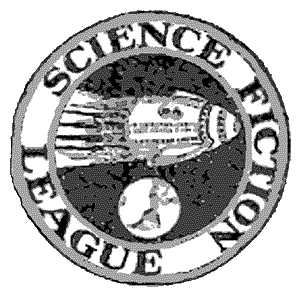

<!-- translated by DeepL -->

# Как будут вести блоги в будущем

Фредерик Пол

## Подвал и империя, часть 2: Встречи любителей научной фантастики

Бруклинская [**Лига Научной Фантастики (Science Fiction League)**](/fred-pohl/2009-09-17-let-there-be-fandom-the-science-fiction-league/) собиралась в подвале у своего председателя, [**Джорджа Гордона Кларка**](/fred-pohl/2009-10-12-let-there-be-fandom-part-5-the-big-league/). Он был энергичным парнем. Когда журнал «Wonder Stories» объявил о создании ЛНФ, Кларк не стал терять времени, сразу же прислал свой купон и, как следствие, стал членом № 1. Когда ЛНФ объявила, что готова открывать местные отделения, он снова действовал мгновенно, и так БЛНФ стала также отделением № 1.

Подвал Кларка нам быстро стал тесен; там хватало места только на четверых, если считать его коллекцию НФ-журналов. Мы переехали в классную комнату в соседней государственной школе. Что я больше всего помню об этих встречах, так это удивление от того, что я уже не мог поместиться за школьные парты — в конце концов, прошло всего пару лет с тех пор, как я каждый школьный день сидел за такими же партами. Помню, мы много обсуждали, как толковать [«Правила процедуры Роберта»](https://web.archive.org/web/20110922150102/http://manybooks.net/titles/robertheetext058rror10.html), и довольно много времени тратили на чтение протоколов предыдущего собрания. Если и происходило что-то ещё существенное, я об этом совершенно забыл.

Но, ах, это «собрание после собрания»! Вот это была самая веселая часть. Именно тогда мы уходили в ближайший открытый кафе-мороженое, заказывали газировку и мороженое с добавками и сидели там, пока нас не выгоняли, обсуждая научную фантастику.

Это всегда было кафе-мороженое. Не всегда одно и то же; за эти годы мы, фэны, наверное, обшарили и «заняли» десятки таких заведений по всему городу. Но мы были так пристрастились к мороженым коктейлям, что через несколько лет, в другом районе города, после собраний другого клуба, мы наконец придумали свой собственный мороженый коктейль, который назвали «Научная фантастика спец», и уговорили владельца заведения включить его в меню.

Как видишь, мы были молодой компанией. За исключением Кларка, которому, наверное, было чуть за двадцать, самым старшим в группе был [Дональд Уоллхейм](https://web.archive.org/web/20110922150102/http://www.gcwillick.com/Spacelight/wollheim.html), которому вот-вот должно было исполниться девятнадцать. [Джон Б. Мишель](https://web.archive.org/web/20110922150102/http://fancyclopedia.editme.com/MICHELIS) пришёл вместе с Дональдом; а чуть позже, из Коннектикута, приехал [**Роберт В. Лоундс**](/fred-pohl/2009-05-08-the-quadrumvirate/); мы вчетвером составили квадрумвират, который продержался — о, кажется, целую вечность — наверное, целых три или четыре года. За это время мы создавали клубы и распускали их, издавали фан-журналы, сражались со всеми подряд за господство в фэндоме и в итоге начали воевать между собой.

Фанские разборки не совсем появились одновременно с самим фэндомом, но почти одновременно. Ни один из клубов, похоже, не просуществовал долго. БЛНФ продержался год, потом мы перешли в «Лигу Научной Фантастики (Science Fiction League)» — конкурирующее отделение головной организации, которое откололось и переименовалось в «Независимую лигу научной фантастики». Это заняло нас ещё на год, а потом настала очередь [Международной Научной Ассоциации (International Scientific Association)](https://web.archive.org/web/20110922150102/http://jophan.org/mimosa/m27/madle.htm) (также известной как Международный клуб «Космос-Наука»). [МНА (ISA)](https://web.archive.org/web/20110922150102/http://fancyclopedia.editme.com/ISA) не была особо научной, и уж точно не такой уж международной; мы собирались в подвале дома Уилла Сикоры в Астории, Квинс. (ENYSFL-ILSF тоже собиралась в подвале — в подвале своего председателя, Гарольда В. Киршенблита. Не знаю, как бы поступили фанаты научной фантастики, скажем, во Флориде, где в домах не было подвалов.)

Не имело большого значения, как назывался клуб или где мы собирались. Мы занимались примерно тем же самым. Мы собирались раз в месяц, и встречи в основном сводились к спорам о том, имеет ли предложение о перерыве приоритет над вопросом о личных привилегиях. В промежутках мы собирались, чтобы издавать мимеографированные журналы, где оттачивали свои начинающие таланты — как в писательстве, так и в искусстве ругани.

Фан-журналы (сейчас их называют «[фэнзины](https://web.archive.org/web/20110922150102/http://fancyclopedia.editme.com/FANZINE)», но тогда этот термин ещё не придумали) иногда выпускались силами всего клуба, а иногда — отдельными людьми. Мне часто удавалось становиться редактором клубных журналов, но этого было недостаточно; я выпускал и свои собственные. Больше всего мне нравился один минималистичный восьмистраничный мимеографированный журнал размером 4 ¼ на 5 ½ дюйма — стандартный лист [мимео](https://web.archive.org/web/20110922150102/http://fancyclopedia.editme.com/MIMEO) формата 8 ½ на 11 дюймов, сложенный вдвое, — под названием *Mind of Man*.* Поскольку это было моё собственное издание, я мог публиковать в нём всё, что хотел. Больше всего мне нравилось публиковать свои [**стихи**](/fred-pohl/2009-01-30-the-poetry-corner/), которые в то время были совершенно бессмысленными и в равной степени находились под влиянием «Джаббервоки» Льюиса Кэрролла и некоторых самых безумных экспонатов в [transition](https://web.archive.org/web/20110922150102/http://www.davidson.edu/academic/english/Little_Magazines/transition/Synopsis.html).

*Продолжение следует...*

**Связанные посты:**

- [**«Подвал и империя»**](/fred-pohl/2010-07-05-basement-and-empire/)
- [**Подвал и империя, часть 3: уроки НФ**](/fred-pohl/2010-07-09-basement-and-empire-part-3-lessons-in-sf/)
- [**Подвал и империя, послесловия**](/fred-pohl/2010-07-12-basement-and-empire-afterwords/)
- [**Квадрумвират**](/fred-pohl/2009-05-08-the-quadrumvirate/)
- [**Да будет фэндом: Лига Научной Фантастики (Science Fiction League)**](/fred-pohl/2009-09-17-let-there-be-fandom-the-science-fiction-league/)
- [**Да будет фэндом, часть 2: Школьные годы**](/fred-pohl/2009-09-28-let-there-be-fandom-part-2-school-days/)
- [**Да будет фэндом, часть 3: Детство в Бруклине**](/fred-pohl/2009-10-02-let-there-be-fandom-part-3-a-brooklyn-boyhood/)
- [**Да будет фэндом, часть 4: Новый курс, новые миры**](/fred-pohl/2009-10-08-let-there-be-fandom-part-4-new-deal-new-worlds/)
- [**Да будет фэндом, часть 5: Высшая лига**](/fred-pohl/2009-10-12-let-there-be-fandom-part-5-the-big-league/)
- [**Да будет фэндом, часть 6: Профи!**](/fred-pohl/2009-10-15-let-there-be-fandom-part-6-the-pros/)
- [**Да будет фэндом, часть 7: Крестовый поход**](/fred-pohl/2009-10-19-let-there-be-fandom-part-7-the-crusade/)

### 4 комментария

- [Роберт Ноуолл](https://web.archive.org/web/20110922150102/http://www.robertnowall.com/) говорит:
Да, я помню, как читал «Раннего Пола».  У меня был экземпляр из книжного клуба.  Мне было жаль, что это не было тем большим томом (в двух частях в мягкой обложке), как у Азимова и дель Рей… Судя по тому, что я тогда понял, дело было в продажах и маркетинге…
Ого, как всё изменилось.  В те времена нужны были типографские станки или мимеографы — даже ксероксов ещё не было.  А сейчас, благодаря «сети» или как там это модно называть, молодёжь — да и любой желающий, независимо от возраста — может вести блог или выкладывать практически всё, что угодно, в любое время.  (Я начал выкладывать свои отклонённые работы на свой сайт, в основном чтобы показать миру, а главное — другим начинающим писателям, что я могу писать не только интернет-фэнфики…)
[**7 июля 2010 г., 6:15 утра**](/fred-pohl/2010-07-07-basement-and-empire-part-2-science-fiction-meetings/)
- [Лысый парень](https://web.archive.org/web/20110922150102/http://www.irememberjfk.com/) говорит:
Круто, Роберт. Я скопировал «Девушку-растение» и вставил в текстовый файл, надеюсь, ты не против. Мне нужно читать с бумаги, я, конечно, луддит. Распечатаю это на работе.
[**7 июля 2010 г., 11:55**](/fred-pohl/2010-07-07-basement-and-empire-part-2-science-fiction-meetings/)
- [Роберт Ноуолл](https://web.archive.org/web/20110922150102/http://www.robertnowall.com/) говорит:
Бумага по-прежнему мой любимый способ читать, но надо быть гибким.  К тому же так экономишь на картриджах…
Я, честно говоря, забыл, что тут выложил ссылку на свой сайт…
[**8 июля 2010 г., 11:47**](/fred-pohl/2010-07-07-basement-and-empire-part-2-science-fiction-meetings/)
- Эндрю Портер говорит:
Э-э, вступление Фреда к этому неверно. ALGOL и SCIENCE FICTION CHRONICLE были двумя разными журналами. «ALGOL», позже переименованный в «STARSHIP», был нерегулярным критическим журналом, который прекратил выходить в 1984 году. «SCIENCE FICTION CHRONICLE» — это ежемесячный новостной журнал, который начал выходить в 1979 году, а в 2000-м я его продал; он прекратил выходить в 2006 году.
Фотография Сикоры и Лей была одной из многих, которые мне прислал Форрест Дж. Акерман, а я отсканировал и выложил в интернет. Я нигде её не публиковал. Я отправил её Фреду одновременно с текстом его вступления, которое я опубликовал в «ALGOL» как отдельную статью.
Единственная связь между этими двумя журналами заключается в том, что колонки Фреда, которые начали выходить в «ALGOL» после очень положительной реакции на его первую статью, позже перекочевали в «SCIENCE FICTION CHRONICLE». Но это были два разных журнала, у них даже были разные ISSN…
[**14 июля 2011 г., 16:41**](/fred-pohl/2010-07-07-basement-and-empire-part-2-science-fiction-meetings/)

[WordPress](https://web.archive.org/web/20110922150102/http://wordpress.org/)
[TWTFB](https://web.archive.org/web/20110922150102/http://dicksmithsoftware.com/)