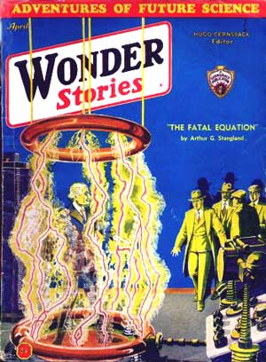

<!-- translated by DeepL -->

# Как будут писать блоги в будущем

Фредерик Пол

## «Подвал и империя», часть 3: уроки НФ

Не знаю, каким бы писателем я стал, если бы не встретил [**Дирка Уайли**](/fred-pohl/2009-09-28-let-there-be-fandom-part-2-school-days/) и, благодаря ему и вместе с ним, весь мир фанатов научной фантастики. Наверное, примерно таким же. Я почти наверняка стал бы каким-то писателем — к чему-то другому я вряд ли гожусь. И я уже пытался писать НФ как минимум за год до встречи с Дирком, в свободные минуты на уроках в восьмом классе. Но без этого всё заняло бы гораздо больше времени.

Я многим обязан фэндом. От [Дона Уоллхейма](https://web.archive.org/web/20110922133749/http://www.gcwillick.com/Spacelight/wollheim.html), [Джона Мишеля](https://web.archive.org/web/20110922133749/http://fancyclopedia.editme.com/MICHELIS), [**Дока Лоундса**](/fred-pohl/2009-05-08-the-quadrumvirate/), а позже — [**Сирилу Корнблат**](/fred-pohl/2009-04-20-cyril/), [Дику Уилсону](https://web.archive.org/web/20110922133749/http://www.juggle.com/richard-wilson), [**Айзека Азимова**](/fred-pohl/2010-01-25-isaac-part-1-of-i-don-t-know-how-many/) и другим — я узнал кое-что о том, чему они учились в плане писательского мастерства; мы все показывали друг другу свои рассказы, даже когда не работали над ними вместе. В фан-журналах я приобрел навыки, необходимые для того, чтобы подготовить что-то к публикации — и смелость, чтобы это позволить.

В чём я не так уверен, так это в том, стоило ли изучать всё то, чему мы тогда учились.

В те времена научная фантастика была чисто палп-жанром. Иногда акцент делался на технических изысках, иногда — на кровавых и захватывающих приключениях; в лучших случаях главным достоинством были образы новых миров и новых форм жизни. Ни в коем случае это не было художественной литературой, и там не стоило искать свежих взглядов на человеческое существование. Мы учились друг у друга и у окружающего мира ремеслу писателя. Как зацепить читателя. Как поддержать динамику сюжета, чтобы история не затягивалась. Как создавать «визитные карточки» персонажей — не их характер, а причуды, особенности, мелкие повадки, которые делают героя не живым, но узнаваемым. Так я научился придумывать лучевые пистолеты и заставлять сюжет идти вперёд, но прошло очень, очень много времени, прежде чем я начал пытаться научиться использовать рассказ, чтобы сказать то, что нужно было сказать.

На самом деле, когда я оглядываюсь на журналы научной фантастики двадцатых и начала тридцатых годов — те самые, которые привили мне любовь к научной фантастике, — я иногда задаюсь вопросом: что же именно мы все нашли в них такого, что стало основой нашей жизни?

Думаю, было две вещи. Во-первых, научная фантастика была способом выбраться из плохой ситуации; во-вторых, она была окном в мир получше.

Мир действительно оказался в беде. В финансовой беде. Великая депрессия — это не просто несколько миллионов безработных или тысяча банков, оказавшихся на грани краха. Это был *страх*. И он охватил весь мир. Так или иначе, экономическая жизнь человечества сошла с рельсов. Никто не был уверен, что она снова встанет на ноги. Никто не мог быть уверен, что его собственная жизнь не претерпит катастрофических перемен, и научная фантастика предлагала спасение от всего этого.

Ещё одна особенность того мира заключалась в том, что технологии только-только начали становиться частью жизни каждого. Каждый день происходили новые чудеса. Огромные новые здания. Гигантские дирижабли. Огромные океанские лайнеры. Человек перелетел через Атлантику и облетел Южный полюс. Машины ехали быстрее, туннели становились глубже, Эмпайр-Стейт-Билдинг взмывал в небо на пятую милю, а радио доносило голос певца с другого континента.

Было ясно, что за всем этим ростом и ускорением что-то происходило, и что это не ограничится огромными цеппелинами и гигантскими зданиями, а будет продолжаться и дальше. Научная фантастика рассказывала именно об этом «продолжении». О следующем шаге и о том, что будет после него. Не только о радио, но и о телевидении. Не просто покорение воздуха, а покорение космоса.

Конечно, даже научная фантастика почти ничего не рассказывала нам о цене прогресса. Она рассказывала о будущем автомобиля; но не говорила, что загрязнение диоксидом серы разрушит камень в зданиях, выстроившихся вдоль улиц. Она рассказывала нам о сверхскоростных самолётах, но не о звуковом ударе; об атомной энергии, но не о радиоактивных осадках; о пересадке органов и продлении жизни, но не о мрачной агонии перенаселения.

Никто другой об этом нам тоже не рассказывал. Спустя десятилетие или два научная фантастика очень быстро — а может, даже слишком полно — уловила мрачную сторону за всем этим блеском. Но в те ранние времена мы были такими же наивными, как физики, папы и президенты. Мы видели только обещания, а не угрозы.

И, честно говоря, мы не искали угроз. Мы искали красоту и вызов. Когда не могли найти их на Земле, мы искали за её пределами более красивые и увлекательные места. Марс. Венера. Выдуманные планеты придуманных звёзд где-то посреди галактики или в галактиках ещё дальше.

Думаю, мы все свято верили, что во Вселенной, кроме нас, есть и другие разумные расы — и их немало. (Я до сих пор в это верю! Меня только удивляет, почему ни одна из них до сих пор не прилетела к нам в гости. Хотелось бы поверить в истории про летающие тарелки — но не могу; доказательства просто неубедительны. Но отсутствие весомых фактов не поколебало мою веру в то, что [осномианцы и фенахроны](https://web.archive.org/web/20110922133749/http://manybooks.net/titles/smithee2086920869-8.html) *где-то* там есть.) Уверен, если бы провели опрос, мы бы все согласились: где есть планета, там есть жизнь — или была, или будет.

Но, увы, теперь мы знаем, что шансы не так высоки, как мы надеялись, особенно в нашей собственной Солнечной системе. Местные условия для жизни оставляют желать лучшего. Меркурий слишком жаркий и там слишком мало воздуха; Венера слишком жаркая, а воздуха слишком много, да к тому же он ещё и ядовитый. Марс всё ещё остаётся вариантом, но отнюдь не лучшим — а что ещё есть? Но в середине тридцатых мы знали гораздо меньше, чем знаем сейчас. Крупные телескопы ещё не были построены, и, конечно, ни один космический корабль ещё не доставил телекамеру на Марс или Луну.

Но мы верили.

*Следи за обновлениями...*

**Похожие посты:**

- [**«Подвал и империя»**](/fred-pohl/2010-07-05-basement-and-empire/)
- [**«Подвал и империя», часть 2: Встречи любителей научной фантастики**](/fred-pohl/2010-07-07-basement-and-empire-part-2-science-fiction-meetings/)
- [**«Подвал и империя», послесловия**](/fred-pohl/2010-07-12-basement-and-empire-afterwords/)
- [**Квадрумвират**](/fred-pohl/2009-05-08-the-quadrumvirate/)
- [**Да будет фэндом: Лига Научной Фантастики (Science Fiction League)**](/fred-pohl/2009-09-17-let-there-be-fandom-the-science-fiction-league/)
- [**Да будет фэндом, часть 2: Школьные дни**](/fred-pohl/2009-09-28-let-there-be-fandom-part-2-school-days/)
- [**Да будет фэндом, часть 3: Детство в Бруклине**](/fred-pohl/2009-10-02-let-there-be-fandom-part-3-a-brooklyn-boyhood/)
- [**Да будет фэндом, часть 4: «Новый курс», «Новые миры»**](/fred-pohl/2009-10-08-let-there-be-fandom-part-4-new-deal-new-worlds/)
- [**Да будет фэндом, часть 5: Высшая лига**](/fred-pohl/2009-10-12-let-there-be-fandom-part-5-the-big-league/)
- [**Пусть будет фэндом, часть 6: Профи!**](/fred-pohl/2009-10-15-let-there-be-fandom-part-6-the-pros/)
- [**Пусть будет фэндом, часть 7: Крестовый поход**](/fred-pohl/2009-10-19-let-there-be-fandom-part-7-the-crusade/)

### 2 комментария

- [Стефан Джонс](https://web.archive.org/web/20110922133749/http://home.comcast.net/~stefan_jones/tan_jacket_lo.jpg) говорит:
Немного грустно, что в наши дни у молодёжи нет какого-то более-менее реалистичного «мира за пределами реальности», на который можно было бы надеяться.
Клише из палпов, вроде летающих машин и роботов-слуг, сегодня в основном воспринимаются как ироничные шутки.
Некоторые ждут «Сингулярности», но это всё больше похоже на мессианский порыв.
[**9 июля 2010 г., 13:55**](/fred-pohl/2010-07-09-basement-and-empire-part-3-lessons-in-sf/)
- Бека С. говорит:
*На Меркурии слишком жарко и слишком мало воздуха; на Венере слишком жарко, а воздуха слишком много, да ещё и ядовитого.*
Ооо, но только представь, какие возможности для жизни, которая ПРОЦВЕТАЕТ в таких условиях! Я отказываюсь верить, что жизнь, какую мы знаем на Земле, — единственный возможный вид жизни во вселенной.
Где-то там есть другая жизнь. Может, они тоже спорят, существуем ли мы или нет.
[**11 июля 2010 г., 14:09**](/fred-pohl/2010-07-09-basement-and-empire-part-3-lessons-in-sf/)

[WordPress](https://web.archive.org/web/20110922133749/http://wordpress.org/)
[TWTFB](https://web.archive.org/web/20110922133749/http://dicksmithsoftware.com/)