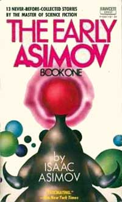

<!-- translated by DeepL -->

# Блоги о будущем

Фредерик Пол

## «Подвал и империя», послесловия



Уилл Сикора вместе с [Джеймсом Таурази](https://web.archive.org/web/20110922120242/http://authors.wizards.pro/authors/writers/james-v-taurasi) и [Сэмом Московицем](https://web.archive.org/web/20110922120242/http://jophan.org/mimosa/m21/kyle.htm) были лидерами анти-[**футуристского**](/fred-pohl/2009-05-08-the-quadrumvirate/) крыла нью-йоркского фэндома.  У них было гораздо больше членов, чем у нас, поэтому при голосовании им не составляло труда отстранять нас даже от тех вещей, которые изначально были нашими идеями, например, от [Ворлдкон № 1 1939 года](https://web.archive.org/web/20110922120242/http://fanac.org/worldcon/NYcon/w39-p00.html).

[Вилли Лей](https://web.archive.org/web/20110922120242/http://www.astronautix.com/astros/ley.htm) в своей родной Германии входил в круг первых немецких энтузиастов ракетной техники, в том числе [**Вернера фон Брауна**](/fred-pohl/2009-01-05-sir-arthur-and-i/), которые в значительной степени способствовали развитию исследований, приведших к созданию летающих бомб V1 и V2.  К тому времени, однако, Лей, убеждённый антинацист, уже сбежал в Америку, где стал писать на эту и смежные темы.

У Сикоры не было никакой особой связи с Леем. Просто им обоим посчастливилось сидеть за одним столом, а рядом оказался кто-то с фотоаппаратом.

*  *  *

Забавная история о [Раннем Поле](https://web.archive.org/web/20110922120242/http://www.amazon.com/gp/product/0891907971?ie=UTF8&tag=twtfb-20&linkCode=as2&camp=1789&creative=390957&creativeASIN=0891907971):

Идея издать сборник первых (и, как правило, самых плохих) рассказов, когда-либо опубликованных рядом писателей-НФ, включая [**Айзека Азимова**](/fred-pohl/2010-01-25-isaac-part-1-of-i-don-t-know-how-many/) и меня, принадлежала некоторым редакторам издательства «Даблдей».  Так получилось, что два самых ранних рассказа Айзека были написаны мной в соавторстве с ним, и он хотел включить их в [«Ранний Азимов (The Early Asimov)»](https://web.archive.org/web/20110922120242/http://www.amazon.com/gp/product/0345325907?ie=UTF8&tag=twtfb-20&linkCode=as2&camp=1789&creative=390957&creativeASIN=0345325907).  Поэтому в качестве оплаты за мой вклад в эту работу я получил 5 процентов от дохода, принесённого книгой Айзека.

Самое забавное, хотя для меня и немного неловкое, в этой истории:

Мы ещё некоторое время получали гонорары за эти книги, и в каждом отчётном периоде деньги от моих 5 процентов гонорара Айзека всегда превышали мои 100 процентов гонорара за собственные работы.

*  *  *

Кстати, и P.S.:

Ты заметил, насколько тривиальными были те [**ужасные последствия технологий**](/fred-pohl/2010-07-07-basement-and-empire-part-2-science-fiction-meetings/), которыми я пытался напугать читателя?  В связи с реактивными самолётами я предупреждал о звуковом ударе; в связи с автомобилями — о коррозии каменной кладки.

Какими же мы были невежественными, даже когда считали себя передовыми умниками!

**Связанные посты:**

- [**«Подвал и империя»**](/fred-pohl/2010-07-05-basement-and-empire/)
- [**«Подвал и империя», часть 2: Встречи любителей научной фантастики**](/fred-pohl/2010-07-07-basement-and-empire-part-2-science-fiction-meetings/)
- [**Подвал и империя, часть 3: уроки НФ**](/fred-pohl/2010-07-09-basement-and-empire-part-3-lessons-in-sf/)

### Один комментарий

- [Джеффри Свонсон](https://web.archive.org/web/20110922120242/http://www.wormseyeview-criticalmass.blogspot.com/) говорит:
Я как раз недавно прочитал «Ранний Пол» — нашёл эту книгу на распродаже в библиотеке пару месяцев назад.  Мне понравилось, особенно комментарии.  Очень напоминает то, как Айзек комментировал свои работы, особенно сборники рассказов и эссе.  

Ещё мне интересно, не напишешь ли ты о своей трилогии «Подводный флот» и т. д., написанной совместно с Джеком Уильямсоном. Я большой фэн НФ для подростков и коллекционирую её. Спасибо. (Кстати, поздравляю с получением диплома Бруклинского технического института от выпускника 1969 года.)
[**4 августа 2010 г., 13:48**](/fred-pohl/2010-07-12-basement-and-empire-afterwords/)

[WordPress](https://web.archive.org/web/20110922120242/http://wordpress.org/)
[TWTFB](https://web.archive.org/web/20110922120242/http://dicksmithsoftware.com/)