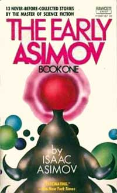

# The Way the Future Blogs

Frederik Pohl

## Basement and Empire, Afterwords



Will Sykora, along with [James Taurasi](https://web.archive.org/web/20110922120242/http://authors.wizards.pro/authors/writers/james-v-taurasi) and [Sam Moskowitz](https://web.archive.org/web/20110922120242/http://jophan.org/mimosa/m21/kyle.htm), were the leaders of the anti-[**Futurian**](/posts/2009-05-08-the-quadrumvirate/) wing of New York fandom.  They had way more members than we, so on votes they had no trouble cutting us off from even things that originally had been our ideas, like the [1939 Worldcon No. 1](https://web.archive.org/web/20110922120242/http://fanac.org/worldcon/NYcon/w39-p00.html).

[Willy Ley](https://web.archive.org/web/20110922120242/http://www.astronautix.com/astros/ley.htm)  in his natal Germany was a member of the circle of early German rocket enthusiasts, including [**Wernher von Braun**](/posts/2009-01-05-sir-arthur-and-i/), which were largely responsible for encouraging the research which produced the V1 and V2 flying bombs.  By then, however, Ley, a confirmed anti-Nazi, had escaped to America where he became a writer on that and related subjects.

Sykora had no particular connection with Ley.  They just both happened to sit at the same table, and there was somebody with a camera.

*  *  *

The funny story about [The Early Pohl](https://web.archive.org/web/20110922120242/http://www.amazon.com/gp/product/0891907971?ie=UTF8&tag=twtfb-20&linkCode=as2&camp=1789&creative=390957&creativeASIN=0891907971):

It was the idea of some of the Doubleday editors to publish a book of the first (and generally the worst) stories ever published by a number of sf writers, including [**Isaac Asimov**](/posts/2010-01-25-isaac-part-1-of-i-don-t-know-how-many/) and me.  As it happened, two of Isaac’s earliest stories had been collaborations with me, and he wanted to include them in [The Early Asimov](https://web.archive.org/web/20110922120242/http://www.amazon.com/gp/product/0345325907?ie=UTF8&tag=twtfb-20&linkCode=as2&camp=1789&creative=390957&creativeASIN=0345325907).  So to pay me for my contribution to the work, I received a 5-percent share of the income from Isaac’s book.

The funny, if embarrassing to me, part of it:

We kept on getting royalties on these books for some time, and in every royalty period the money from my 5-percent share of Isaac’s royalties was always more than my 100-percent share of my own.

*  *  *

By the way and P.S:

Did you notice how trivial were the [**dreadful effects of technology**](/posts/2010-07-07-basement-and-empire-part-2-science-fiction-meetings/) that I was trying to worry the reader with?  From jet planes, I warned of sonic boom; from cars, the corroding of stonework.

How ignorant we were even when we thought we were cutting-edge smart!

**Related posts:**

- [**Basement and Empire**](/posts/2010-07-05-basement-and-empire/)
- [**Basement and Empire, Part 2: Science Fiction Meetings**](/posts/2010-07-07-basement-and-empire-part-2-science-fiction-meetings/)
- [**Basement and Empire, Part 3: Lessons in SF**](/posts/2010-07-09-basement-and-empire-part-3-lessons-in-sf/)

### One Comment

- [Jeffrey Swanson](https://web.archive.org/web/20110922120242/http://www.wormseyeview-criticalmass.blogspot.com/) says:
I actually just read The Early Pohl, found it at a library sale a few months ago.  Enjoyed it,especially the commentaries.  Very like the way Isaac used to comment on his stuff, especially his short story collections, and essay collections.  

I also wonder if you would write about your Undersea Fleet, etc trilogy with Jack Williamson.  I am a big fan of juvenile SF and collect it.  Thanks.  (By the way, congratulations on the Brooklyn Tech diploma from a class of 1969 Technite.)
[**August 4, 2010, 1:48 pm**](/posts/2010-07-12-basement-and-empire-afterwords/)

[WordPress](https://web.archive.org/web/20110922120242/http://wordpress.org/)
[TWTFB](https://web.archive.org/web/20110922120242/http://dicksmithsoftware.com/)