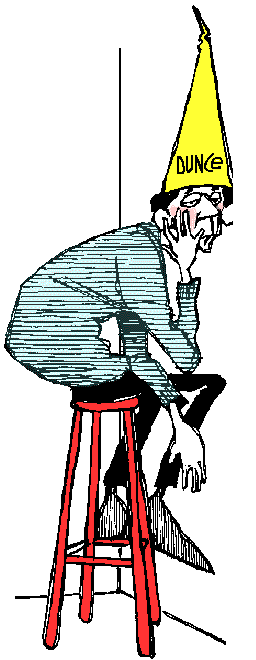

<!-- translated by DeepL -->

# Как будут вести блоги в будущем

Фредерик Пол

## Глупость Фреда

Пару недель назад я [**ответил**](/fred-pohl/2010-06-18-meat-and-heat/) на комментарий одного читателя, подписавшегося как [**TJIC**](/fred-pohl/2010-06-18-meat-and-heat/), в котором он, среди прочего, написал, что в Антарктиде есть вид пингвинов, который постепенно перемещает свои места размножения всё дальше и дальше на юг.  Причина в том, что они мигрируют в более холодные широты, пытаясь избежать потепления, которое разрушает их морской лёд.

В целом то, что я сказал, похоже, верно, но потом я добавил, что если пингвины будут продолжать мигрировать в этом направлении, то рано или поздно доберутся до места, расположенного так далеко на юге, что там Солнце никогда не взойдёт, и там будет вечная тьма.

Это смешно. Такого места не существует.  Это доказывает простая геометрия.

Я неверно понял слова своего источника — теперь подозреваю, что речь шла о том, что им больше не о чем беспокоиться насчёт льда, ведь они уже оказались в центре Антарктического континента, — и неправильно это записал. Так что теперь я признаю свою ошибку перед всеми вами и прошу прощения.

Есть ещё одна вещь в том наспех написанном ответе, которая требует небольшого разъяснения. Я сказал: «…в какой-то момент истории (научное) сообщество верило, что Солнце вращается вокруг Земли, а потом, не так уж и спустя долгое время, изменило своё мнение…»

Это не совсем неверно.  Но это неполно. Дело не только в том, что ученые всего мира обычно рассматривают две представленные им теории — старую и новую — и говорят: «Ага, да, новая более полная, точная и полезная, чем старая, так что с этого момента я за новую».

Такое действительно бывает, но это лишь часть процесса. Другая часть заключается в том, что многие учёные держатся за старую теорию до самой смерти, несмотря ни на какие доказательства. Но потом они умирают, а новое поколение учёных, пришедшее им на смену, вырастает с новой теорией, уже укоренившейся в их сознании.

Так что это правда: когда-то почти все учёные верили, что Солнце вращается вокруг Земли, а позже почти все учёные верили, что Земля вращается вокруг Солнца.  Но это были не те же самые учёные.

### 9 комментариев

- Орин говорит:
Томас Кун и другие философы и историки науки, изучая научные революции, высказали мнение, что революция не завершается до тех пор, пока не умрёт старая гвардия — то есть новые «парадигмы» или «исследовательские традиции» обычно перенимают молодые учёные, а пожилые учёные, как правило, более привязаны к прежней модели.
[**14 июля 2010 г., 4:19 утра**](/fred-pohl/2010-07-14-fred-s-dumb-thing/)
- Билл Гудвин говорит:
Ещё есть третья группа, которая считает, что Земля и Солнце вместе вращаются вокруг центра масс системы «Земля-Солнце» (извини… не удержался!).
[**14 июля 2010 г., 4:20 утра**](/fred-pohl/2010-07-14-fred-s-dumb-thing/)
- Грего говорит:
В науке часто бывает, что учёные говорят: «Знаешь, это действительно хороший аргумент; моя точка зрения ошибочна», — и потом они действительно меняют своё мнение, и ты больше никогда не услышишь от них прежней точки зрения. Они действительно так поступают. Это происходит не так часто, как следовало бы, потому что учёные — тоже люди, а изменения порой бывают болезненными. Но это происходит каждый день. Я не могу вспомнить, когда в последний раз что-то подобное происходило в политике или религии. 

 — Карл Саган, основной доклад на конференции CSICOP, 1987 г.
[**14 июля 2010 г., 18:01**](/fred-pohl/2010-07-14-fred-s-dumb-thing/)
- JG говорит:
В тот день, когда я это прочитал (сегодня), я нахожусь выше Северного полярного круга, где в понедельник солнце зайдет впервые с мая… Твоя история про пингвинов, как ни странно, неверна…  

Кроме того, я не знаю ни одной компании, которая бы осуществляла перевозки через Северо-Западный проход (через Канадский Арктический архипелаг), хотя, по-моему, есть такие, что используют Северо-Восточный проход через Россию.
[**15 июля 2010 г., 16:26**](/fred-pohl/2010-07-14-fred-s-dumb-thing/)
- jsallison говорит:
А лет 40 назад те же самые люди, которые сейчас визжат о глобальном потеплении… э-э, об изменении климата, в панике кричали о грядущем ледниковом периоде, фу.  Я поверю, что это кризис, когда те, кто кричит мне в ухо, что это кризис, начнут вести себя так, будто это действительно кризис. И когда появятся реальные, независимо проверенные данные, доказывающие, что наш выброс тепла — это не просто случайный шум по сравнению с той термоядерной реакцией, которая постоянно происходит над нашими головами.
[**15 июля 2010 г., 20:19**](/fred-pohl/2010-07-14-fred-s-dumb-thing/)
- [Стефан Джонс](https://web.archive.org/web/20111110112332/http://home.comcast.net/~stefan_jones/tan_jacket_lo.jpg) говорит:
В 1970-х я был подростком-ботаником и довольно внимательно следил за научными новостями.
Шумиха вокруг «нового ледникового периода» разгорелась *после* того, как появились опасения по поводу парникового эффекта. Это была кратковременная и несущественная тревога, основанная на исторической статистике (проще говоря: «Нам уже давно пора в ледниковый период»). Никаких призывов к действию или «паники» не было.
Этого хватило разве что на статью на обложке *Newsweek* и, может, на один выпуск «Nova» — и всё.* Ажиотаж вокруг ледникового периода ни в коем случае не сравнится с опасениями по поводу глобального потепления. Сравнивать это — дешёвый риторический трюк.
Вот тебе пятиценник, парень. Иди купи себе новых тем для разговоров.
[**16 июля 2010 г., 17:50**](/fred-pohl/2010-07-14-fred-s-dumb-thing/)
- Билл Гудвин говорит:
Дело никогда не было в том, сколько тепла мы выделяем.  Нас беспокоит именно выброс парниковых газов, которые удерживают тепло, поступающее в результате упомянутой выше продолжающейся реакции термоядерного синтеза.
[**16 июля 2010 г., 21:34**](/fred-pohl/2010-07-14-fred-s-dumb-thing/)
- Джон Х. говорит:
Печально то, jsallison, что у нас сегодня есть доказательства, которые такие люди, как ты, предпочитают игнорировать, потому что это проще, чем отказаться от разрушительных, но относительно дешёвых источников энергии.
[**18 июля 2010 г., 7:32**](/fred-pohl/2010-07-14-fred-s-dumb-thing/)
- armband thomas sabo говорит:
Печально то, jsallison, что у нас сегодня есть доказательства, которые такие люди, как ты, предпочитают игнорировать, потому что это проще, чем отказаться от разрушительных, но относительно дешёвых источников энергии.
[**4 августа 2010 г., 2:45 утра**](/fred-pohl/2010-07-14-fred-s-dumb-thing/)

[WordPress](https://web.archive.org/web/20111110112332/http://wordpress.org/)
[TWTFB](https://web.archive.org/web/20111110112332/http://dicksmithsoftware.com/)