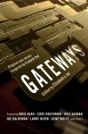

<!-- translated by DeepL -->

# Как будут вести блоги в будущем

Фредерик Пол

## Выиграй экземпляр книги «Gateways»!

**От команды блога:**

Отличные новости, фэны Пола! Goodreads разыгрывает несколько экземпляров [**«Враты»**](/fred-pohl/2009-01-01-elizabeth-anne-hull/) — только что вышедшего сборника оригинальных новых рассказов, вдохновленных творчеством Фредерика Пола, написанных ведущими авторами в жанре НФ и отредактированных женой Фреда, [Элизабет Энн Халл](https://web.archive.org/web/20100722002709/http://www.nippon2007.us/participants/hulle_participant.php). Срок [участия в конкурсе](https://web.archive.org/web/20100722002709/http://www.goodreads.com/giveaway/show/4822-gateways) — 31 июля, так что спеши зарегистрироваться!

А тем временем Бетти написала об этой книге для [информационного бюллетеня Tor/Forge](https://web.archive.org/web/20100722002709/http://torforge.wordpress.com/2010/07/12/frederik-pohls-best-friends-in-sf-give-back-in-gateways):

> [специальный сборник](https://web.archive.org/web/20100722002709/http://www.amazon.com/gp/product/0765326620?ie=UTF8&tag=twtfb-20&linkCode=as2&camp=1789&creative=390957&creativeASIN=0765326620)
> [Боб Силверберг](https://web.archive.org/web/20100722002709/http://www.majipoor.com/)
> [Джим Ганн](https://web.archive.org/web/20100722002709/http://www2.ku.edu/~sfcenter/bio.htm)
> [Гарднер Дозоис](https://web.archive.org/web/20100722002709/http://www.sfsite.com/11b/gd93.htm)
> [Гарри Харрисон](https://web.archive.org/web/20100722002709/http://harryharrison.com/)
> 

> Главное здесь, конечно, — научная фантастика. [Джо Холдеман](https://web.archive.org/web/20100722002709/http://home.earthlink.net/%7Ehaldeman/), [Майк Резник](https://web.archive.org/web/20100722002709/http://www.fortunecity.com/tattooine/farmer/2/), [Фрэнк Робинсон](https://web.archive.org/web/20100722002709/http://frankmrobinson.com/), Гарри Харрисон и [Джоди Линн Най](https://web.archive.org/web/20100722002709/http://www.sff.net/people/JodyNye/) — каждый из них написал по отличному новому рассказу. Многие из этих рассказов прямо или косвенно вдохновлены собственными произведениями Фреда, чаще всего — его любимым рассказом, который, как он сам утверждает, готов выгравировать на своём памятнике после смерти, — «Миллионный день». Я был в восторге, когда понял, что [Джин Вулф](https://web.archive.org/web/20100722002709/http://templetongate.tripod.com/genewolfe.htm) написал именно такой рассказ о сингулярности, действие которого происходит в мире в неопределённое время — предположительно в нашем будущем — когда люди изменились настолько, что их саму природу приходится объяснять, или, как в случае с Джином, демонстрировать через его рассказчика от первого лица.

> Название повести [Кори Доктороу](https://web.archive.org/web/20100722002709/http://craphound.com/) не оставляет сомнений в том, что на него повлияла книга [«Торговцы Космосом»](https://web.archive.org/web/20100722002709/http://www.amazon.com/gp/product/0312749511?ie=UTF8&tag=7159-20&linkCode=as2&camp=1789&creative=390957&creativeASIN=0312749511), но то, как он обработал эту концепцию, совершенно свежо и оригинально, и я не удивлюсь, если через пятьдесят лет «Чикен Литтл» станет классикой сама по себе.

> В четырёх замечательных рассказах Джима Ганна, написанных от первого лица об умных инопланетных расах, он позволяет инопланетянам раскрыться через то, что они говорят и как они это говорят, а также через то, что каждый из них решает рассказать нам о себе. Думаю, на Джима повлияли не только многочисленные романы и рассказы Фреда, в которых тот создавал оригинальные инопланетные виды, но и те многочисленные лета, которые они с Фредом провели, давая советы молодым писателям на семинарах в Университете Канзаса.

> А ещё есть рассказы, которые… ну, в стиле Фреда Пола, как, например, рассказ [Вернора Винга](https://web.archive.org/web/20100722002709/http://www.salon.com/technology/feature/1999/04/05/vinge). Мне было очень приятно увидеть, что Вернор написал рассказ, которым, как мне кажется, Фред сам бы гордился.

> Иногда Фред оказывал влияние как редактор, представляя публике работы писателей. Я уверен, что Фред поощрял сатирический талант [Шери Теппер](https://web.archive.org/web/20100722002709/http://www.sheri-s-tepper.com/), а [Бен Бова](https://web.archive.org/web/20100722002709/http://benbova.net/) в своём рассказе показывает, что понимает: чувство юмора не менее важно, чем «сенсавунда».

> Этот проект стал делом любви не только для меня, но и для всех участников — судя по тому, что все эти суперзанятые авторы нашли время прислать свои новые работы — [Нил Гейман](https://web.archive.org/web/20100722002709/http://www.neilgaiman.com/) даже прислал свою прямо из Китая!

> Ах да, и ещё одно, о чём я должен упомянуть: Фред номинирован на [**премию «Хьюго» в номинации «Лучший фэн-писатель»**](/fred-pohl/2010-06-02-have-you-voted-for-the-hugo-awards/) — за [thewaythefutureblogs.com](https://web.archive.org/web/20100722002709/http://thewaythefutureblogs.com/). Обязательно загляни туда. Мастер по-прежнему с удовольствием пишет каждый день и сейчас дорабатывает свой новый роман *All the Lives He Led*, который выйдет весной следующего года в издательстве Tor.

Похоже, это также хороший повод напомнить тебе, что крайний срок [голосования за премию «Хьюго»](https://web.archive.org/web/20100722002709/http://www.aussiecon4.org.au/hugoawards/final_ballot.php) — тоже 31 июля!

### 7 комментариев

- Кам-Юнг Сох говорит:
Привет,
Пожалуйста, уточни (в начале статьи), что в конкурсе могут участвовать только жители США.  Иначе фэны Пола из других стран могут слишком воодушевиться, а потом разочароваться.
С уважением,  

Кам-Юнг
[**16 июля 2010 г., 00:50**](/fred-pohl/2010-07-16-win-a-copy-of-gateways/)
- Лесли Деврис пишет:
Это просто супер — вы постоянно творите и вдохновляете всей командой, и я благодарю вас за это. (А теперь пойду голосовать!)
[**16 июля 2010 г., 6:53 утра**](/fred-pohl/2010-07-16-win-a-copy-of-gateways/)
- [Shakatany](https://web.archive.org/web/20100722002709/http://shakatany.livejournal.com/) пишет:
«Чтобы отпраздновать 90-й виток моего мужа вокруг Солнца». Как мило это сформулировано.
[**16 июля 2010 г., 9:25 утра**](/fred-pohl/2010-07-16-win-a-copy-of-gateways/)
- [Стефан Джонс](https://web.archive.org/web/20100722002709/http://home.comcast.net/~stefan_jones/tan_jacket_lo.jpg) говорит:
Спасибо за розыгрыш, но я собираюсь купить экземпляр, чтобы поддержать продажи!
Много лет назад я был на конференции миростроителей CONTACT. Кто-то спросил приглашённого докладчика Ларри Нивена, кого бы он порекомендовал в президентскую комиссию, созданную для решения вопросов, связанных с предстоящим контактом с инопланетянами. Ответ Ларри, насколько я помню: «Ну, первым на уме был бы Фред Пол». 
Это единственное имя, которое он упомянул. Мне это кажется особенно примечательным, учитывая, что они придерживаются совершенно разных политических взглядов.
[**16 июля 2010 г., 13:02**](/fred-pohl/2010-07-16-win-a-copy-of-gateways/)
- andrewc пишет:
Эй, этот конкурс только для США, это несправедливо… канадцев не пускают.
[**16 июля 2010 г., 13:22**](/fred-pohl/2010-07-16-win-a-copy-of-gateways/)
- Джон Боланд пишет:
Это не имеет отношения к «Вратам», но я надеюсь, что Фред найдёт время поподробнее рассказать, каково было редактировать журналы «If» и «Galaxy». Думаю, ответ на этот вопрос должен быть «много всего разного», но мне часто интересно, как это было, когда пришла первая история из «Riverworld», или «The Star Pit», или «Driftglass». Фармер просто прислал их, без всяких предисловий? А Делани, может, заскочил с рукописью и сказал: «Не знаю, понравится ли тебе это»? Или рассказы про «Кукловода»? Должно быть, было здорово быть редактором и получать такие рассказы. Они, безусловно, надолго остались в памяти этого читателя, и я за это благодарен.
[**17 июля 2010 г., 15:54**](/fred-pohl/2010-07-16-win-a-copy-of-gateways/)
- Блейк Болингер говорит:
Пока что читать просто замечательно.  Я прочитал уже примерно треть, скачав версию для Kindle на iPad (идеальный формат для тех из нас, у кого слабое зрение).  Это отличная вещь.
[**17 июля 2010 г., 21:15**](/fred-pohl/2010-07-16-win-a-copy-of-gateways/)

[WordPress](https://web.archive.org/web/20100722002709/http://wordpress.org/)
[TWTFB](https://web.archive.org/web/20100722002709/http://dicksmithsoftware.com/)