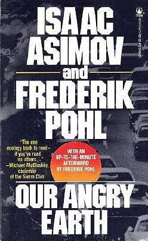

<!-- translated by DeepL -->

# Как будут вести блоги в будущем

Фредерик Пол

## Ископаемое топливо и неаккуратный учет



Много лет назад я вместе с [**Айзеком Азимовым**](/fred-pohl/2010-01-25-isaac-part-1-of-i-don-t-know-how-many/) написал книгу об экологии под названием [«Our Angry Earth»](https://web.archive.org/web/20140811004342/http://www.amazon.com/gp/product/0812520963?ie=UTF8&tag=twtfb-20&linkCode=as2&camp=1789&creative=390957&creativeASIN=0812520963).  Она не имела особого успеха.  Должен признать, что она и не была такой хорошей, как я бы хотел.  Айзек заболел почти сразу после того, как мы договорились её написать, и поэтому не смог внести в работу даже близко столько, сколько я ожидал — что сказалось на качестве книги.

Но в книге было несколько частей, которые полностью принадлежали мне и с самого начала задумывались именно так.  Одна из них — раздел, в котором я показал, что многие проблемы, связанные с загрязнением и ущербом окружающей среде, на самом деле сводятся к плохому ведению отчётности.

Например. В период с 1947 по 1977 год компания General Electric сбросила около 1,3 миллиона фунтов крайне токсичных [полихлорированных бифенилов](https://web.archive.org/web/20140811004342/http://www.atsdr.cdc.gov/tfacts17.html) (ПХБ) — отходов производства электронных устройств — на двух своих заводах в верховья [реки Гудзон](https://web.archive.org/web/20140811004342/http://www.riverkeeper.org/campaigns/stop-polluters/pcbs/).  GE поступила так потому, что, хотя безопасная утилизация ПХБ вполне возможна, это значительно увеличило бы себестоимость производства устройств.  Сброс ПХБ в реку обошёлся General Electric чуть дороже, чем доставка их на грузовиках к берегу реки.

Это не значит, что сброс не повлек за собой никаких затрат. Затрат было много, и некоторые из них оказались довольно высокими. Загрязнение реки сделало рыбу непригодной для употребления в пищу, что привело к финансовым потерям для коммерческого рыболовства. Ограничения даже на любительскую рыбалку привели к тому, что меньше отдыхающих проводили там лето, что ударило по туризму.  Здоровье людей, живущих поблизости, пострадало, а ущерб от этого невозможно оценить.  Цены на недвижимость упали, так как район потерял часть своей привлекательности.  Если сложить всё это вместе, то реальные затраты на сброс составили миллионы долларов.  Однако все эти затраты были тем, что бухгалтеры называют «внешними издержками».

Это значит, что General Electric не пришлось их оплачивать, потому что счета пошли напрямую остальному миру.

С другой стороны, при правильном ведении бухгалтерского учета эти затраты сразу бы включили в себестоимость продукции — и тогда ответственное удаление загрязняющих веществ стало бы выгоднее с коммерческой точки зрения.

И таким образом, если бы предприятия обычно платили за свои внешние издержки, многие проблемы, связанные с промышленным загрязнением, просто исчезли бы.  (Правда, в конце концов суд все-таки обязал GE оплатить частичную очистку реки. Это не исправило весь нанесённый ущерб, но, по крайней мере, это уже что-то, и это показало, что постепенно начинают понимать: нельзя бесконечно игнорировать внешние издержки.)

Не только производители перекладывают свои внешние издержки на общество. Добывающие отрасли, среди прочих, виноваты не меньше, а то и больше. В нефтяной и угольной отраслях достаточно взглянуть на Мексиканский залив, чтобы увидеть, какие внешние издержки компания British Petroleum навязала местному населению.  (Правда, президент Обама заставляет их выплачивать миллиарды долларов в качестве компенсации, но некоторые убытки невозможно полностью возместить. Даже у BP столько денег нет.)

И, конечно, разлив нефти в Мексиканском заливе — это лишь одна, пусть и самая серьёзная на данный момент, из множества подобных катастроф.  Некоторые из нас, наверное, помнят [«Эксон Валдез»](https://web.archive.org/web/20140811004342/http://www.marinij.com/opinion/ci_15574868) в 1989 году, но на самом деле почти каждый год где-то в мире происходит как минимум один крупный разлив — под «крупной» подразумевается утечка как минимум десятков тысяч, а зачастую и десятков миллионов галлонов нефти — где-то в мире почти каждый год.

Крупные разливы нефти в водоёмах за последние пять лет по данным [Infoplease](https://web.archive.org/web/20140811004342/http://www.infoplease.com/ipa/A0001451.html):

- **2010:**  BP, *Deepwater Horizon*, Мексиканский залив
- **2010:**  Танкер *Eagle Otome*, Порт-Артур, Техас
- **2009:** *MV Pacific Adventurer*, Квинсленд, Австралия
- **2008:**  Баржа, река Миссисипи, Новый Орлеан, Луизиана
- **2007:**  Танкер *Hebei Spirit*, у побережья Южной Кореи
- **2006:**   Река Калкашу, Луизиана, разлив отработанного масла
- **2006:**    Израильский флот бомбардировал электростанцию на побережье Джие
- **2006:**    Танкер затонул в глубоких водах, до сих пор течет нефть, Гимарас, Филиппины
- **2005:**   7 миллионов галлонов нефти разлилось во время урагана «Катрина», Новый Орлеан, Луизиана

(А до этого список был очень длинным.)

Тем не менее, очевидно, что ущерб от взрыва нефтяной скважины намного превосходит ущерб от других разливов нефти.  Объем разлива нефти с платформы *Deepwater Horizon* компании BP — на данный момент — оценивается в более чем 160 миллионов галлонов.  Единственный другой разлив, который хотя бы приблизился к этому показателю, — это [Ixtoc](https://web.archive.org/web/20140811004342/http://www.incidentnews.gov/incident/6250) 1979 года, также в Мексиканском заливе.  Тогда за три месяца до того, как утечку удалось остановить — путем бурения аварийной скважины рядом с ней — вытекло 140 миллионов галлонов. И там тоже виновником катастрофы была нефтяная компания — мексиканская «ПЕМЕКС».

Это что касается нефти. А как насчёт угля?

Угольные компании, если что, пожалуй, даже чуть более алчные, чем нефтяные.  В США их основные неучтенные внешние издержки — это наводнения, оползни, превращение красивых горных районов в карьеры… и погибшие шахтеры.

И как этим гигантским компаниям удаётся уходить от ответственности?

Ответ прост: деньги.  Чиновники, за которых мы с тобой голосуем, чтобы они защищали наши интересы, порой слишком охотно, ради денег, продают свои голоса тем самым людям, от которых нам больше всего нужна защита.  И дело здесь не столько в партийной принадлежности.  Да, республиканцы традиционно немного более лояльны к крупному бизнесу, чем демократы.  Но есть около восьми сенаторов-демократов, которых по понятным причинам называют «угольными демократами». И по крайней мере один обозреватель не верит, что в штатах, граничащих с Мексиканским заливом, есть хоть один кандидат в законодательные или судебные органы от любой из партий, который не получил бы значительные деньги от нефтяных гигантов.

Вот в чём ещё заключается главный вклад, который я постарался внести в книгу *«Our Angry Earth»*.*  Нам, простым людям, не хватает сил, чтобы противостоять этим гигантским корпорациям.  Только правительство может защитить нас от их худших выходок.

А в чём секрет контроля над правительством?

Это называется политика.  Если бы те из нас, кто хотел бы видеть меньше коррупции и злоупотреблений со стороны избранных чиновников, хотя бы немного участвовали в этом, произошли бы замечательные перемены.

Что нужно сделать, чтобы хоть немного принять участие?

Откажись на один вечер от «Танцев со звездами» и сходи на ближайшие дебаты кандидатов, организованные [Лигой женщин-избирателей](https://web.archive.org/web/20140811004342/http://www.lwv.org/) в твоём районе.  (Информация о них есть в твоей местной газете. Если не можешь найти, позвони в Лигу и спроси, что у них запланировано.

Когда увидишь кандидата, за которого хотел бы проголосовать, представься и спроси, не нужен ли ему волонтёр, чтобы время от времени заполнять конверты или заниматься чем-то подобным.  А если позже ты решишь, что тебе это не нравится или не нравится сам кандидат, ты всегда можешь просто уйти.  В конце концов, это свободная страна.

И чем чаще ты будешь заниматься подобными вещами, тем больше ты поможешь сохранить эту свободу.

Те из нас, кто не хочет участвовать в политике, потому что это грязная игра, только делают её ещё грязнее.

### 7 комментариев

- [Майкл А. Бурштейн](https://web.archive.org/web/20140811004342/http://www.mabfan.com/) говорит:
Спасибо, что призываешь участвовать в местной политике.  Девять лет назад я решил включиться в этот процесс и баллотировался в местное городское собрание; шесть лет назад я баллотировался в попечительский совет библиотеки. Я до сих пор занимаю обе должности и очень горжусь своим участием.
Что касается вопроса, почему мы позволяем нефтяным и угольным компаниям так много сойти с рук, я бы хотел отметить одну проблему, которую ты практически не затронул.  Мы, как потребители, хотим дешёвой энергии, и пока мы не убедим людей поддержать альтернативные источники энергии и, возможно, не будем готовы тратить на энергию больше, проблема будет оставаться.
[**23 июля 2010 г., 8:21**](/fred-pohl/2010-07-23-fossil-fuels-and-bad-bookkeeping/)
- Кирк говорит:
Спасибо, что упомянул дебаты, организованные Лигой женщин-избирателей (LWV).  Я об этом не знал, поэтому подписался на рассылку Лиги, чтобы узнать, когда могут пройти местные дебаты.
[**23 июля 2010 г., 11:32**](/fred-pohl/2010-07-23-fossil-fuels-and-bad-bookkeeping/)
- [Стефан Джонс](https://web.archive.org/web/20140811004342/http://home.comcast.net/~stefan_jones/tan_jacket_lo.jpg) говорит:
Экономисты-сторонники свободного рынка и производители ДЕЙСТВИТЕЛЬНО знают, как справляться с внешними эффектами.
Они просто игнорируют их, высмеивают тех, кто об этом беспокоится, и сражаются не на жизнь, а на смерть с политиками, которые заставляют их обращать на них внимание.
В случае с BP они нанимают всех учёных, которые могли бы свидетельствовать против них в судебных процессах об экологической ответственности. Внешние издержки? Что это такое? Эй, смотри, в нашем новом рекламном ролике счастливые дельфины и ламантины жонглируют мячами, складывая из них логотип BP. Видишь, BP *действительно заботится!*
[**23 июля 2010 г., 16:30**](/fred-pohl/2010-07-23-fossil-fuels-and-bad-bookkeeping/)
- Оуэн Глендауэр говорит:
Хорошо сказано, сэр.  Нам, возможно, нужно больше законов, устанавливающих ответственность «от колыбели до могилы» за определённые загрязнители.  Подобные законы уже многое сделали для борьбы с тем «недобросовестным учётом», о котором ты говоришь.
Ещё один пример недобросовестного учёта: почти всегда, если не всегда, у нас есть военно-морское присутствие в Персидском заливе.  Сомневаюсь, что все эти расходы отражаются в цене на заправке.
[**28 июля 2010 г., 11:03**](/fred-pohl/2010-07-23-fossil-fuels-and-bad-bookkeeping/)
- Тэт Вуд говорит:
Извини, что придираюсь, но называть BP «British Petroleum» — неточно и бесполезно. Это уже не так примерно со времени поглощения Amoco. Более трёх четвертей сотрудников — американцы (хотя они любезно оставили на месте какого-то идиота с английским акцентом, чтобы он принимал на себя всю критику). Если бы BP управлялась британцами, у неё был бы совет директоров, члены которого выросли на фоне последствий катастрофы «Торри Каньон» и других случаев, когда нефтяные разливы опустошали пляжи Уэльса и Шотландии, и, говоря прямо, они бы хоть что-то понимали в безопасности и экологических рисках.
[**7 августа 2010 г., 17:16**](/fred-pohl/2010-07-23-fossil-fuels-and-bad-bookkeeping/)
- greggarious говорит:
В книге «Нерассказанная история молока» рассказывается о масштабной поставке корма для молочных коров, содержавшего ПББ (ну да ладно, ещё одно сильнотоксичное химическое вещество). Коровы и их молоко были загрязнены гораздо сильнее, чем допустимо, но FDA и департамент сельского хозяйства штата Мичиган сначала преуменьшили, а потом не смогли должным образом справиться с проблемой. Их главная забота заключалась в том, чтобы защитить рыночную долю, репутацию и избежать ответственности крупного поставщика кормов. Загрязнение продолжалось годами: многие коровы заболевали, стали давать меньше молока или погибли, а многие люди, включая фермеров и покупателей молока, тоже заболели или умерли.  

Как органы, ответственные за сдерживание и управление такими катастрофами, могли так плохо защитить население и мелких молочных фермеров? То же самое, что и с BP: политика FDA и государственных ведомств фактически заключается в защите корпоративных интересов тех, кто вкладывает деньги в их предвыборные фонды и другими способами покупает их благосклонность (да, именно так — взяточничество).  

Мы в США часто видим в СМИ репортажи о коррупции в правительствах развивающихся стран. Может ли быть коррупция в правительстве хуже, чем здесь, в США?  

Похоже, появляется целый поджанр научной фантастики, который развивает старую идею: «Если это (корпоративное доминирование в политике) продолжится…». То, что роман Пауло Бацибалупи «Девушка-куколка» получает награды, — явный признак признания этого поджанра. Это не столько постапокалиптика, сколько мир после тотального корпоративного господства.  

Реальные истории, скрытые под тонкой коркой СМИ, окружают нас повсюду и становятся всё хуже. Молли Айвинс придерживалась «теории тараканов»: на каждого, ползающего на виду, приходится сотня, прячущихся в стенах. Разлив нефти BP — это капля в море.
[**8 августа 2010 г., 22:54**](/fred-pohl/2010-07-23-fossil-fuels-and-bad-bookkeeping/)
- [Антон Шервуд](https://web.archive.org/web/20140811004342/http://ogre.nu/) говорит:
Когда-то (так я слышал) кто-то успешно подал в суд на производителя за сброс отходов в реку; после чего Конгресс, ужаснувшись тому, что кто-то, кроме него самого, осмелился встать на пути Прогресса, запретил частные иски по поводу загрязнения окружающей среды.
С тех пор экологическое регулирование представляет собой набор заплаток на заплатки, призванных сгладить эту ключевую ошибку.
Ответственность за разливы нефти законодательно ограничена какой-то абсурдно низкой суммой.  Конечно, никто (кроме экономистов, а кто к ним прислушивается?) не мог предсказать, что такое законодательство может повлиять на поведение нефтяных компаний.
[**9 августа 2010 г., 13:15**](/fred-pohl/2010-07-23-fossil-fuels-and-bad-bookkeeping/)

[WordPress](https://web.archive.org/web/20140811004342/http://wordpress.org/)
[TWTFB2](https://web.archive.org/web/20140811004342/http://dicksmithsoftware.com/)