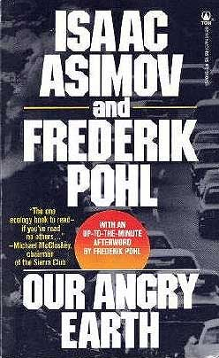

<!-- translated by Yandex Translate -->

# Путь к блогам будущего

Фредерик Пол

## Ископаемое топливо и плохая бухгалтерия



Много лет назад в сотрудничестве с [** Айзеком Азимовым**](/posts/2010-01-25-isaac-part-1-of-i-don-t-know-how-many/) я написал книгу об окружающей среде под названием [Our Angry Earth](https://web.archive.org/web/20140811004342/http://www.amazon.com/gp/product/0812520963?ie=UTF8&tag=twtfb-20&linkCode=as2&camp=1789&creative=390957&creativeASIN=0812520963).  Это было не особенно удачно.  Я должен признать, что это тоже была не такая хорошая книга, как мне хотелось бы.  Айзек заболел почти в тот самый момент, когда мы договорились об этом, и поэтому он не смог написать и близко столько, сколько я ожидал, — в ущерб книге.

Но в книге было несколько частей, которые полностью принадлежали мне, и так всегда и было задумано.  Одним из них был раздел, в котором демонстрировалось, что многие проблемы, связанные с загрязнением и ущербом окружающей среде, были просто результатом плохого ведения бухгалтерского учета.

Например. В период с 1947 по 1977 год General Electric сбросила около 1,3 миллиона фунтов чрезвычайно токсичных [полихлорированных дифенилов](https://web.archive.org/web/20140811004342/http://www.atsdr.cdc.gov/tfacts17.html) (ПХД), отходов производства электронных устройств на двух своих заводах, в верховья реки [Гудзон](https://web.archive.org/web/20140811004342/http://www.riverkeeper.org/campaigns/stop-polluters/pcbs/).  GE сделала это потому, что, хотя безопасная утилизация печатных плат была вполне возможна, это значительно увеличило бы стоимость изготовления устройств.  Сброс ПХД в реку обошелся General Electric немногим дороже, чем плата за их транспортировку грузовиком к берегу реки.

Это не означает, что демпинг не повлек за собой никаких затрат.  Было много затрат, и некоторые из них были довольно высокими.  Загрязнение реки сделало ее рыбу несъедобной, что привело к денежным потерям коммерческой рыбной промышленности.  Ограничения даже на спортивную рыбалку привели к тому, что меньше отдыхающих проводило там лето, что привело к потере туризма.  Здоровье людей, живущих поблизости, было подорвано неисчислимой ценой.  Цены на недвижимость упали, поскольку этот район частично утратил свою привлекательность.  Сложите их все вместе, и получится, что реальные затраты на демпинг составили миллионы долларов.  Однако все эти затраты были тем, что бухгалтеры называют “внешними”.

Это означает, что это были расходы, которые General Electric не должна была оплачивать, потому что счета шли непосредственно остальному миру.

С другой стороны, надлежащие процедуры бухгалтерского учета немедленно включили бы их в производственные затраты, что повысило бы эффективность ответственной утилизации загрязняющих веществ.

И, таким образом, если бы обычной практикой было заставлять предприятия платить за свои внешние затраты, многие проблемы, связанные с промышленным загрязнением, просто исчезли бы.  (Однако верно, что суды в конце концов обязали GE оплатить частичную очистку реки.  Это не залечило весь нанесенный ущерб, но, по крайней мере, это было хоть что-то, и это свидетельствовало о зарождающемся осознании того, что внешними факторами не следует пренебрегать бесконечно.)

Не только производители перекладывают свои внешние издержки на плечи населения.  Добывающие отрасли, среди прочих, заслуживают порицания по меньшей мере в равной степени, если не в большей.  В нефтяной и угольной промышленности нам достаточно взглянуть на Мексиканский залив, чтобы увидеть, какие внешние издержки British Petroleum наложила на близлежащее население.  (Это правда, что президент Обама вынуждает их выплатить миллиарды долларов в качестве реституции, но возместить некоторые убытки полностью невозможно.  Даже у BP нет столько денег.)

И, конечно, разлив нефти в Персидском заливе - лишь одно, хотя пока и самое серьезное, из многих подобных бедствий.  Некоторые из нас помнят аварию [Exxon Valdez](https://web.archive.org/web/20140811004342/http://www.marinij.com/opinion/ci_15574868) в далеком 1989 году, но на самом деле почти каждый год где—нибудь в мире происходит по крайней мере один крупный разлив — “крупный” означает, по меньшей мере, десятки тысяч, а слишком часто и десятки миллионов галлонов разлившейся нефти.

Крупные разливы нефти на водных путях за последние пять лет, по данным [Infoplease](https://web.archive.org/web/20140811004342/http://www.infoplease.com/ipa/A0001451.html):

- **2010:** BP, *Deepwater Horizon,* Мексиканский залив
- **2010:** Танкер *Eagle Otome,* Порт-Артур, Техас
- ** 2009:** *MV Pacific Adventurer,* Квинсленд, Австралия
- ** 2008:** Баржа, река Миссисипи, Новый Орлеан, Лос-Анджелес
- **2007:** Танкер *Hebei Spirit,* у берегов Южной Кореи
- **2006:** Река Калькасье, Лос-Анджелес, разлив отработанного масла
- ** 2006:** Израильский флот бомбит береговую электростанцию Джие
- ** 2006:** Танкер тонет на большой глубине, из него все еще вытекает нефть, Гимарас, Филиппины
- ** 2005:** 7 миллионов галлонов нефти разлилось во время урагана "Катрина", Новый Орлеан, Лос-Анджелес

(До этого список был очень длинным.)

Тем не менее, очевидно, что затраты на продувку нефтяной скважины превосходят другие разливы нефти.  Разлив нефти BP *Deepwater Horizon* — на данный момент — оценивается более чем в 160 миллионов галлонов.  Единственным другим разливом, который был даже близок к этому, был Ixto в 1979 году, также в Мексиканском [заливе](https://web.archive.org/web/20140811004342/http://www.incidentnews.gov/incident/6250).  Этот разлив составил 140 миллионов галлонов за три месяца, прежде чем его остановили — путем бурения аварийной скважины рядом с ним, и там также ответственной за катастрофу стороной была нефтяная компания, мексиканская Pemex.

Вот тебе и нефть.  А как насчет угля?

Угольные компании, во всяком случае, возможно, немного более алчны, чем нефтяные компании.  В Соединенных Штатах основными неудовлетворенными внешними издержками являются наводнения, оползни, превращение красивых горных районов в открытые шахты... и погибшие шахтеры.

И как этим гигантским компаниям это сходит с рук?

Ответ прост: деньги.  Чиновники, за которых мы с вами голосуем, чтобы защитить наши интересы, иногда слишком охотно за деньги продают свои голоса тем самым людям, от которых мы больше всего нуждаемся в защите..  На самом деле это тоже не вопрос вечеринки.  Да, республиканцы традиционно немного более дружелюбны к крупному бизнесу, чем демократы.  Но есть около восьми сенаторов-демократов, которые по понятным причинам известны как коалиционные демократы.  И по крайней мере один комментатор не верит, что в штатах, граничащих с Мексиканским заливом, есть хоть один кандидат в законодательные или судебные органы от любой из партий, который не получил значительных денег от Big Oil.

Это еще один основной вклад, который я пытался внести в *Our Angry Earth.* У нас, отдельных людей, нигде не хватает сил, чтобы справиться с гигантскими корпорациями.  Только правительство может защитить нас от их наихудших эксцессов.

И что является ключом к контролю над правительством?

Это называется политикой.  Если бы те из нас, кто хотел бы видеть меньше коррупции и неправомерных действий среди выборных должностных лиц, хотя бы немного поучаствовали, произошли бы замечательные перемены.

Что вам нужно сделать, чтобы хоть немного поучаствовать?

Вы отказываетесь от "Танцев со звездами" на один вечер и идете на следующие дебаты кандидатов, спонсируемых [Лигой женщин-избирателей](https://web.archive.org/web/20140811004342/http://www.lwv.org/), которые запланированы в вашем районе.  (Они указаны в вашей местной газете.  Если вы не можете его найти, позвоните в Лигу сами и спросите, что у них есть.

Когда вы увидите кандидата, за которого хотели бы проголосовать, представьтесь и спросите, не нужен ли ему доброволец, чтобы время от времени набивать конверты или что-то в этом роде.  Затем, если позже вы решите, что вам это не нравится или кандидат вам не нравится, вы всегда можете просто уйти.  В конце концов, это свободная страна.

И чем больше вы делаете подобных вещей, тем больше вы помогаете поддерживать их в таком состоянии.

Те из нас, кто не хочет активно участвовать в политике, потому что это грязная игра, просто помогают сделать ее еще грязнее.

### 7 Комментариев

- [Майкл А. Бурштейн](https://web.archive.org/web/20140811004342/http://www.mabfan.com/) говорит:
Спасибо вам за содействие участию в местной политике.  Девять лет назад я решил принять участие и баллотировался на местное городское собрание; шесть лет назад я баллотировался на пост попечителя библиотеки. Я по-прежнему занимаю обе должности и очень горжусь своим участием.
Что касается вопроса о том, почему мы позволяем нефтяным и угольным компаниям так много выходить сухими из воды, я укажу на одну проблему, которую вы на самом деле не затронули.  Мы, как потребители, хотим дешевой энергии, и до тех пор, пока мы не убедим людей поддерживать альтернативные источники энергии и, возможно, не станем готовы тратить больше на энергию, проблема будет продолжать существовать.
[** 23 июля 2010 года, 8:21 утра**](/posts/2010-07-23-fossil-fuels-and-bad-bookkeeping/)
- Кирк говорит:
Спасибо за упоминание о дебатах, спонсируемых LWV.  Я не знал об этом, поэтому зашел в список рассылки Лиги, чтобы узнать, когда могут состояться местные дебаты.
[** 23 июля 2010 года, 11:32 утра**](/posts/2010-07-23-fossil-fuels-and-bad-bookkeeping/)
- [Стефан Джонс](https://web.archive.org/web/20140811004342/http://home.comcast.net/~stefan_jones/tan_jacket_lo.jpg) говорит:
Экономисты свободного рынка и производители ДЕЙСТВИТЕЛЬНО знают, как справляться с внешними факторами.
Они игнорируют их, насмехаются над людьми, которые беспокоятся о них, и изо всех сил борются с политиками, которые заставляют их обращать на них внимание.
В случае с BP они нанимают всех ученых, которые могут свидетельствовать против них в исках об экологической ответственности. Внешние издержки? Что это? Эй, смотрите, в нашем новом рекламном ролике счастливые дельфины и ламантины жонглируют мячами, образуя логотип BP. Видите, BP * действительно заботится!*
[** 23 июля 2010 года, 16:30 вечера**](/posts/2010-07-23-fossil-fuels-and-bad-bookkeeping/)
- Оуэн Глендауэр говорит:
Хорошо сказано, сэр.  Возможно, нам нужно больше законов, определяющих ответственность “от колыбели до могилы” за определенные загрязнители.  Законы, подобные этим, многое сделали для борьбы с “плохой бухгалтерией”, на которую вы ссылаетесь.
Еще один пример плохой бухгалтерии: большую часть времени, если не все время, у нас есть военно-морское присутствие в Персидском заливе.  Я сомневаюсь, что вся эта стоимость отражается в цене на заправке.
[** 28 июля 2010 года, 11:03 утра**](/posts/2010-07-23-fossil-fuels-and-bad-bookkeeping/)
- Тат Вуд говорит:
Извините за придирки, но называть BP ‘Бритиш Петролеум’ неточно и бесполезно. Такого не было примерно со времен поглощения Amoco. Значительно более 3/4 персонала - американцы (хотя они услужливо наняли имбецила с английским акцентом, чтобы тот не мешал). У британской BP был бы совет директоров, который вырос бы на последствиях катастрофы в Торри-Каньоне и на различных других пляжах Уэльса и Шотландии, опустошенных разливами нефти, и, чтобы не заострять на этом внимание, имел бы представление о безопасности и экологических рисках.
[**7 августа 2010, 17:16 вечера**](/posts/2010-07-23-fossil-fuels-and-bad-bookkeeping/)
- греггариус говорит:
В книге "Нерассказанная история молока" мне рассказывают об огромной поставке корма для молочных коров, который содержал ПБД (что угодно; еще одно высокотоксичное химическое вещество). Коровы и их молоко были загрязнены намного больше допустимых уровней, но Управление по санитарному надзору за качеством пищевых продуктов и медикаментов и департамент сельского хозяйства штата Мичиган сначала недооценили, а затем и не справились с проблемой. Их главным интересом была защита корпоративной доли рынка, ответственности и имиджа крупного поставщика кормов. Заражение продолжалось в течение многих лет, в результате чего многие коровы заболели и стали давать мало молока или погибли, и многие люди, включая фермеров и покупателей молока, также заболели или умерли.  

Как могли агентства, ответственные за сдерживание подобных катастроф и управление ими, так плохо выполнять работу по защите населения и мелких молочных фермеров? То же самое, что и в случае с BP: политика FDA и государственных агентств фактически заключается в защите корпоративных интересов, которые платят в фонды своих предвыборных кампаний и другими способами покупают их благосклонность (правильно, взяточничество).  

Мы в США часто видим в средствах массовой информации истории о коррупции в правительстве развивающихся стран. Может ли быть еще худшая коррупция в правительстве, чем здесь, в США?  

Похоже, появляется целый поджанр научной фантастики, который отражает старую посылку "Если это (корпоративное доминирование в политике) продолжится". Фильм Пауло Бачибалупи "Заводная девчонка", получивший награды, является верным признаком признания этого поджанра. Не столько постапокалиптический, сколько пост-тотальное корпоративное доминирование в мире.  

Правдивые истории, скрывающиеся под тонкой оболочкой СМИ, окружают нас со всех сторон и усугубляются. Молли Айвинс придерживалась теории тараканов: на каждого, кто ползает на открытом месте, приходится сотня, прячущихся в стене. Утечка BP - это капля в море.
[**8 августа 2010, 10:54 вечера**](/posts/2010-07-23-fossil-fuels-and-bad-bookkeeping/)
- [Антон Шервуд](https://web.archive.org/web/20140811004342/http://ogre.nu/) говорит:
Давным-давно (так я слышал) кто-то успешно подал в суд на производителя за то, что тот выбросил воду в реку; после чего Конгресс, придя в ужас от того, что кто-то, кроме него самого, осмелился встать на пути прогресса, запретил частные судебные иски за загрязнение окружающей среды.
С тех пор природоохранное регулирование менялось постепенно, чтобы смягчить эту ключевую ошибку.
Ответственность за разливы нефти законодательно ограничена какой-то абсурдно низкой цифрой.  Конечно, никто (кроме экономистов, а кто их слушает?) никогда бы не смог предсказать, что такое законодательство может повлиять на поведение нефтяных компаний.
[**9 августа 2010 года, 14:15 вечера**](/posts/2010-07-23-fossil-fuels-and-bad-bookkeeping/)

[WordPress](https://web.archive.org/web/20140811004342/http://wordpress.org/)
[TWTFB2](https://web.archive.org/web/20140811004342/http://dicksmithsoftware.com/)