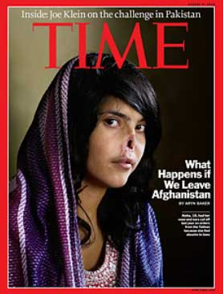

<!-- translated by DeepL -->

# Блоги «Путь в будущее»

Фредерик Пол

## Наши (возможные) будущие союзники из числа талибов

[Политические обозреватели](https://web.archive.org/web/20140917173831/http://theweek.com/article/index/204575/is-a-taliban-peace-deal-possible) пишут, что у американцев появился новый план по работе с талибами в Афганистане.  То есть они пытаются подкупить талибов, чтобы те стали нашими союзниками, а не врагами.

Тем, кто сомневается, хорошая ли это идея, рекомендую взглянуть на обложку журнала [Time](https://web.archive.org/web/20140917173831/http://www.time.com/time/world/article/0,8599,2007238,00.html) от 9 августа.  На ней изображена (ранее) симпатичная 18-летняя афганка, семья мужа которой так жестоко с ней обращалась, что она сбежала.   Талибы не дают такой свободы выбора никому, кому не повезло родиться с влагалищем, поэтому, чтобы преподать ей урок, они приказали отрезать ей уши и нос.

Эти люди — отбросы общества.  Если не с такими, как они, то с кем же мы воюем?

### 16 комментариев

- [Микаэль Бергстрём](https://web.archive.org/web/20140917173831/http://blog.omegarpg.net/) говорит:
Ну… Дело в том, что ты не победишь талибов, вступив с ними в войну. Экстремизм нельзя убить или взорвать до основания. Наверное, самым эффективным решением было бы наладить дипломатические контакты и воздействовать на них более тонко. За каждого талиба, которого ты застрелишь, трое людей становятся настолько разъярёнными и отчаявшимися, что присоединяются к движению. Это как экспоненциальная игра «Удар по кроту». Меметическая война была бы лучшим выбором — давай воевать с помощью идей. Обычно они более эффективны, если их правильно вести.
[**10 августа 2010 г., 4:59 утра**](/fred-pohl/2010-08-09-our-taliban-perhaps-future-allies/)
- Пэт говорит:
Если это была причина, по которой мы там находимся, почему мы не вторглись в Саудовскую Аравию?
Если мы хотим сделать огромный шаг к миру, нам следует позволить афганским производителям опиума конкурировать с другими поставщиками лекарств на легальном рынке.
[**10 августа 2010 г., 7:13 утра**](/fred-pohl/2010-08-09-our-taliban-perhaps-future-allies/)
- [Джефф](https://web.archive.org/web/20140917173831/http://jeffcrook.blogspot.com/) говорит:
Никогда не забывай, что в 2000–2001 годах мы выделили им около 60 миллионов долларов на искоренение опийных плантаций. Раньше они были нашими союзниками, а потом стали врагами. 
Они также предлагали выдать Бен Ладена, если бы мы предоставили доказательства — именно такой запрос любая страна выдвинула бы перед экстрадицией.
[**10 августа 2010 г., 7:17 утра**](/fred-pohl/2010-08-09-our-taliban-perhaps-future-allies/)
- Теофилакт говорит:
Это было сделано с участием США *в* Афганистане. Это что, повод для нас оставаться там навсегда?
[**10 августа 2010 г., 8:51 утра**](/fred-pohl/2010-08-09-our-taliban-perhaps-future-allies/)
- Кирк Снавели говорит:
«Эти люди — отбросы общества». А как же «наши» люди — армия США и спецназ, которые убили тысячи афганских мирных жителей?
[**10 августа 2010 г., 20:46**](/fred-pohl/2010-08-09-our-taliban-perhaps-future-allies/)
- Эллен Ашер говорит:
Мне кажется, твой последний абзац — это несправедливая клевета на донную тину…
[**10 августа 2010 г., 22:37**](/fred-pohl/2010-08-09-our-taliban-perhaps-future-allies/)
- Реалист говорит:
«Экстремизм нельзя уничтожить, и бомбами его не искоренить»
Ну, да, на самом деле можно. Мы это сделали. Как дела у немецкой нацистской партии на выборах? Когда-то они были довольно популярны. Мы их уничтожили.
[**11 августа 2010 г., 9:56**](/fred-pohl/2010-08-09-our-taliban-perhaps-future-allies/)
- Realist говорит:
Пристрастие левых к самокритике, помимо прочих их ошибок, — одна из причин, по которой фашизму позволили вновь поднять голову как у нас, так и за рубежом.
[**11 августа 2010 г., 10:00**](/fred-pohl/2010-08-09-our-taliban-perhaps-future-allies/)
- Майкл говорит:
@Реалист — ты не очень реалистично смотришь на вещи… Нацистская партия процветает среди экстремистских групп в США и так было всё время с момента окончания Второй мировой войны. На самом деле она процветает и в Европе — просто это не так заметно, потому что люди скрывают свою причастность к нацистам. Однако довольно активные нацистские движения есть везде, где белые люди чувствуют себя ущемлёнными теми, кого они не считают белыми. 
Тем не менее, если бы Буш поступил правильно, объявил войну и действительно вел войну, а не занимался этой ерундой с «построением государства» и борьбой с повстанцами, то погибло бы меньше людей, а исход был бы более решительным (и да, вероятно, это привело бы к широкомасштабной наземной войне в Азии, охватившей Пакистан и Индию, но нельзя же иметь всё).
[**12 августа 2010 г., 14:58**](/fred-pohl/2010-08-09-our-taliban-perhaps-future-allies/)
- Реалист говорит:
Безусловно, наблюдается реакция против прогресса, достигнутого в начале XX века — и «Талибан», и «Чайная партия» являются частью этого. Но нельзя сказать, что нацистская партия «процветает». Ты говоришь о партии, которая поднялась на волне народной и глобальной поддержки и быстро заставила великие державы мира трепетать от страха. Сейчас, как ты сам говоришь, даже расистам приходится скрывать свои настоящие чувства, потому что им никогда не позволят прийти к власти, если они раскроют свои истинные мотивы. Мы должны, чтобы так и оставалось.
[**13 августа 2010 г., 15:50**](/fred-pohl/2010-08-09-our-taliban-perhaps-future-allies/)
- Рэй Джонсон говорит:
@Кирк Снавели – Большинство афганских мирных жителей, убитых американскими войсками, стали жертвами войны. Прискорбно, да. Трагично, да. Но это ни в коем случае не сопоставимо с этим преднамеренным нанесением увечий. Что касается тех немногих военнослужащих вооружённых сил США, которые, возможно, совершили подобные зверства, то они тоже — отбросы общества.
Но в обществе явно что-то не так, если нам трудно провести грань между зверством и трагедией. Во время Второй мировой войны американские и союзные войска убили много нацистов. При этом они также убивали женщин, детей и стариков, чьим единственным «преступлением» было то, что они оказались в ловушке нацистской Германии. Но ни бомбы, ни пули не являются настолько точными инструментами, чтобы всегда и исключительно убивать только тех «плохих парней», в которых ты целишься. Смерть этих невинных людей была трагедией. Смерть миллионов в нацистских концентрационных лагерях была зверством.
[**19 августа 2010 г., 17:09**](/fred-pohl/2010-08-09-our-taliban-perhaps-future-allies/)
- Джош говорит:
@Рэй, существуют такие понятия, как военные преступления, права человека, международное право и теория справедливой войны; хотя Кирк действительно проводит ложное сравнение, наша сторона не раз совершала несправедливые массовые убийства мирных жителей, и Вторая мировая война — не исключение, хотя две последующие войны в этом плане были ещё хуже. Чаще всего вина лежит не на «нескольких военнослужащих вооружённых сил США», а на их командирах или гражданских политиках.  Еще раз хочу заверить тебя, что я понимаю разницу между тем, что происходит в ходе войны, которую наша сторона не начинала, и зверствами, совершаемыми правящей партией страны в отношении собственных жителей.
[**21 августа 2010 г., 6:58 утра**](/fred-pohl/2010-08-09-our-taliban-perhaps-future-allies/)
- Нил из Чикаго пишет:
Я смирился со своим давним огорчением из-за того, что в этой истории нет места народу Афганистана.  Похоже, для американцев всё действительно вращается только вокруг нас.  

В той части мира не существует такого понятия, как «победа» или «поражение» в том смысле, в каком мы эти слова используем. В конце концов, в бесконечном перераспределении сил между фракциями, отколовшимися группировками и лояльными сторонами складывается такая конфигурация, при которой все оказываются на одной «стороне», и на этом всё заканчивается.
[**22 августа 2010 г., 13:59**](/fred-pohl/2010-08-09-our-taliban-perhaps-future-allies/)
- [Билл Гудвин](https://web.archive.org/web/20140917173831/http://771715/) говорит:
Честно говоря, самым разрушительным событием для безопасности США, которое я могу себе представить, был бы захват Усамы бен Ладена. И я полагаю, что власть имущие об этом знают.
[**24 августа 2010 г., 7:30**](/fred-pohl/2010-08-09-our-taliban-perhaps-future-allies/)
- Марк говорит:
Забомбардируй их «Макдоналдсом», «Old Navy» и каналом «Playboy». Преврати эти казни талибов в старое доброе американское самоуничижение.
[**24 августа 2010 г., 14:34**](/fred-pohl/2010-08-09-our-taliban-perhaps-future-allies/)
- Деннис говорит:
Мистер Пол, один из самых интересных и обоснованных анализов ситуации в Афганистане — из тех, с которыми я сталкивался, — это лекция бывшей репортёрши NPR, а теперь активистки по развитию Афганистана Сары Чейз.  Она выступила с докладом на эту тему в рамках цикла лекций имени Э. Н. Томпсона в Университете Небраски в Линкольне.  Архивную версию можно посмотреть ниже.
Во время сессии вопросов и ответов речь зашла о её взглядах на то, кто такие талибы и как с ними обращаться.  И это слова одной американской женщины, которая годами жила и работала в Кандагаре без целой охраны, обеспечивающей её безопасность.  Думаю, тебе, да и, возможно, другим, это будет интересно.
[http://www.netnebraska.org/television/news/ent_archives.html](https://web.archive.org/web/20140917173831/http://www.netnebraska.org/television/news/ent_archives.html)
Ссылки на видео и аудио:  

[http://netreal.unl.edu/asxgen/winmedia/enthompson/entchayes_030409.wmv.asx](https://web.archive.org/web/20140917173831/http://netreal.unl.edu/asxgen/winmedia/enthompson/entchayes_030409.wmv.asx)  

[http://www.netnebraska.org/television/news/media/entchayes_030409.m3u](https://web.archive.org/web/20140917173831/http://www.netnebraska.org/television/news/media/entchayes_030409.m3u)
[http://en.wikipedia.org/wiki/Sarah_Chayes](https://web.archive.org/web/20140917173831/http://en.wikipedia.org/wiki/Sarah_Chayes)
[**12 октября 2010 г., 13:17**](/fred-pohl/2010-08-09-our-taliban-perhaps-future-allies/)

[WordPress](https://web.archive.org/web/20140917173831/http://wordpress.org/)
[TWTFB2](https://web.archive.org/web/20140917173831/http://dicksmithsoftware.com/)