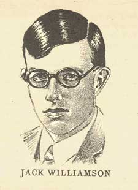

<!-- translated by DeepL -->

# Как будут выглядеть блоги будущего

Фредерик Пол

## Джек «Чудесный» Уильямсон, часть 1 из многих

Мой дорогой друг [Джек Уильямсон](https://web.archive.org/web/20131228035619/http://www.gcwillick.com/Spacelight/williamson.html), который умер несколько лет назад, был на десять или одиннадцать лет старше меня, и я на самом деле не встречал его — то есть лично, хотя, конечно, знал и преклонялся перед ним благодаря его чудесным рассказам — пока  ему не исполнилось  уже за тридцать, а мне было 19, и я только начинал свою собственную жизнь.  Джек,  конечно, уже десять лет или больше жил своей жизнью, и жизнь у него была интересная:  в детстве он приехал в Нью-Мексико на крытом фургоне, плавал по Миссисипи вместе с другим писателем, встретил любовь всей своей жизни, когда они были ещё детьми — а потом потерял её — и снова нашёл её, когда она овдовела.  Но так как меня не было рядом в те бурные времена, я не могу тебе о них рассказать.

К счастью, сам Джек мог это сделать — и сделал в своей замечательной автобиографии [«Ребёнок чуда»](https://web.archive.org/web/20131228035619/http://www.amazon.com/gp/product/1932100571?ie=UTF8&tag=twtfb-20&linkCode=as2&camp=1789&creative=390957&creativeASIN=1932100571), которую тебе обязательно стоит достать и прочитать.  Для меня личная история Джона Стюарта Уильямсона начинается с [первой Всемирной Конвенции Научной Фантастики](https://web.archive.org/web/20131228035619/http://efanzines.com/1939Nycon/index.htm) в Нью-Йорке в 1939 году, на которой был Джек Уильямсон, а меня и шестерых других [**Футурианцев**](/fred-pohl/2009-05-08-the-quadrumvirate/) были [выгнаны](https://web.archive.org/web/20131228035619/http://fancyclopedia.editme.com/EXCLUSIO).  (Это долгая история, которую я уже немного устал рассказывать, но со временем я всё-таки напишу об этом в блоге — да и вообще, она есть в моей автобиографии, [«Ретроспектива Будущего (The Way the Future Was)»](https://web.archive.org/web/20131228035619/http://www.amazon.com/gp/product/0345260597?ie=UTF8&tag=7159-20&linkCode=as2&camp=1789&creative=390957&creativeASIN=0345260597). Книга сейчас распродана, но совсем скоро появится в виде электронной книги от издательства Baen. Не волнуйся, я обязательно упомяну об этом в блоге, когда она станет доступна.)

На самом деле, хотя я и не подозревал, что когда-то окажусь в пределах тысячи миль от самого Джека, он уже успел внести одно важное изменение в мою жизнь.  В десять или одиннадцать лет я уже был увлечён НФ.  В те годы научная фантастика в Америке существовала только в виде классических палп-журналов [Amazing](https://web.archive.org/web/20131228035619/http://www.philsp.com/mags/amazing_stories.html), [Wonder](https://web.archive.org/web/20131228035619/http://www.philsp.com/mags/wonderstories.html) (под несколькими вариантами названия) и [**Astounding**](/fred-pohl/2009-11-12-astounding-years-30-37-bc-clayton-magazines/).  Я мог позволить себе все три только потому, что покупал их по 5 или 10 центов за штуку в магазине подержанных журналов. (Помнишь, это были времена Великой депрессии. Магазины подержанных товаров были повсюду.)

Мне это вполне хватало до 1931 года, когда мне улыбнулась удача — или, точнее, биполярная удача, смесь хорошего и плохого.  Хорошая часть заключалась в том, что кто-то расстался со своим экземпляром свежего номера «Amazing», пока он ещё лежал на прилавках, и так я прочитал первую половину двухсерийного романа одновременно с богатыми людьми.  Этот роман назывался «Камень с зелёной звезды» Джека(https://web.archive.org/web/20131228035619/http://www.amazon.com/gp/product/B002JJE3D0?ie=UTF8&tag=twtfb-20&linkCode=as2&camp=1789&creative=390957&creativeASIN=B002JJE3D0).  Плохо было то, что только Бог знал, когда следующий номер «Amazing» с развязкой этой истории попадет мне в руки.  Может, через несколько месяцев, а может, даже через год или больше.

Смог бы я выдержать такое долгое ожидание, чтобы узнать, чем всё закончилось?

Не смог бы.  Но у меня был способ решить эту проблему.  Моя дневная норма на обед составляла 25 центов — этого хватало на сэндвич «Вестерн» за 20 центов в кафетерии внизу по улице и стакан молока за 5 центов, чтобы его запить.  Мне оставалось лишь пропустить обед в один из дней на следующей неделе — и этот новенький номер «Amazing» был бы мой. Я не колебался. Я так и сделал. И ни разу об этом не пожалел.

Конечно, по мнению большинства критиков, *«Камень с зелёной звезды»* — это, без сомнения, самый слабый из романов Джека. Но что я тогда знал? Мне было одиннадцать лет, и я был просто зависим от его книг.

*Продолжение следует...*

**Похожие посты:**

- **Джек «Чудесный» Уильямсон, Часть 2, Часть 3, Часть 4**

### Один комментарий

- Дуайт Декер говорит:
Фэны разных эпох… похожие проблемы, похожие решения. В 1965 году я учился в восьмом классе, и моей слабостью были научно-фантастические книжки в мягкой обложке серии Ace F (буква «F» обозначала цену в 40 центов). К сожалению, мои карманные деньги были небольшими даже по меркам того времени и того места. Зато я получал 35 центов в день на обед в школьной столовой. Поэтому большую часть восьмого класса я пропускал обед и тратил эти деньги на НФ-книжки в мягкой обложке. Возможно, мне было бы легче, когда я сидел в библиотеке во время обеденного перерыва и слушал, как у меня урчит в животе, если бы я знал, что продолжаю славную традицию, заложенную ни кем иным, как самим Фредом Полом. В любом случае, когда я устроился разносить газеты прямо перед началом девятого класса, в моём дневнике появилась запись: «Я снова могу есть!»
[**13 августа 2010 г., 20:18**](/fred-pohl/2010-08-12-jack-the-wonderful-williamson-part-1-of-many/)

[WordPress](https://web.archive.org/web/20131228035619/http://wordpress.org/)
[TWTFB2](https://web.archive.org/web/20131228035619/http://dicksmithsoftware.com/)