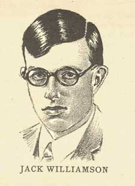

# The Way the Future Blogs

Frederik Pohl

## Jack the Wonderful Williamson, Part 1 of many

My dear friend [Jack Williamson](https://web.archive.org/web/20131228035619/http://www.gcwillick.com/Spacelight/williamson.html), who died a few years ago, was ten or eleven years older than I, and I didn’t actually meet him — in the flesh, that is, though I certainly knew and revered him through his wonderful stories — until  he was  an elderly 30 and I was 19, and just beginning a life of my own.  Jack,  of course, had been living his own life for a decade or more, and an interesting life it was:  coming to New Mexico in a covered wagon as a child., sailing down the Mississippi with another writer , finding the love of his life when they were kids — and then losing her — and finding her again when she became widowed.  But as I wasn’t there for those busy times I can’t tell you about them.

Fortunately Jack himself could, and did in his marvelous autobiography, [Wonder’s Child](https://web.archive.org/web/20131228035619/http://www.amazon.com/gp/product/1932100571?ie=UTF8&tag=twtfb-20&linkCode=as2&camp=1789&creative=390957&creativeASIN=1932100571), which you should get your hands on and read.  For me, the personal story of John Stuart Williamson begins with the [first World Science Fiction Convention](https://web.archive.org/web/20131228035619/http://efanzines.com/1939Nycon/index.htm), in New York City in 1939, which Jack attended, and I and six other [**Futurians**](/fred-pohl/2009-05-08-the-quadrumvirate/) were [thrown out of](https://web.archive.org/web/20131228035619/http://fancyclopedia.editme.com/EXCLUSIO).  (That’s a long story that I’m getting a little tired of telling, but I’ll do it by and by for the blog  — and anyway it’s in my own autobiog, [The Way the Future Was](https://web.archive.org/web/20131228035619/http://www.amazon.com/gp/product/0345260597?ie=UTF8&tag=7159-20&linkCode=as2&camp=1789&creative=390957&creativeASIN=0345260597). Which is out of print but will be available real soon now as an ebook from Baen. Don’t worry, I’ll mention it in the blog when it is available.)

Actually, although I had never knowingly been within a thousand miles of Jack in the flesh, he had in fact already caused one significant change in my life.  At the age of ten or eleven I was already hooked on sf.  In those years science fiction in America came only in the form of the canonical pulp-paper magazines [Amazing](https://web.archive.org/web/20131228035619/http://www.philsp.com/mags/amazing_stories.html), [Wonder](https://web.archive.org/web/20131228035619/http://www.philsp.com/mags/wonderstories.html) (under several variations of title) and [**Astounding**](/fred-pohl/2009-11-12-astounding-years-30-37-bc-clayton-magazines/).  I was able to afford all three only because I was able to buy them for a nickel or a dime apiece in a second-hand magazine store.  (Depression days, remember.  There were second-hand everything stores everywhere.)

That was fine for me until 1931, when I had a stroke of good — or more accurately of bipolar, mixed good and bad — luck.  The good part was that someone had parted with his copy of  the current Amazing while it was still on the stands, and so I had read the first half of a two-part serial at the same time time as the rich people.  That serial was Jack’s [The Stone From the Green Star](https://web.archive.org/web/20131228035619/http://www.amazon.com/gp/product/B002JJE3D0?ie=UTF8&tag=twtfb-20&linkCode=as2&camp=1789&creative=390957&creativeASIN=B002JJE3D0).  The bad part was that God alone knew when the next issue of Amazing, with the conclusion of the story, would fall into my hands.  It might be months, might even be a year or more.

Could I stand waiting that long to learn how it all came out?

I could not.  I had a way of dealing with the problem, though.  My lunch allowance was 25¢ a day, enough for a 20¢ Western sandwich at the cafeteria down the street and a 5¢ glass of milk to wash it down.  All I had to do was skip lunch for one day of the next week and that brand-new Amazing was mine.  I didn’t hesitate.  I did it.  I never regretted it, either.

It is true, of course, that in the judgment of most authorities *The Stone from the Green Star* is by a wide margin the least of Jack’s novels.  But what did I know?  I was eleven years old, and addicted.

*To be continued. . . .*

**Related posts:**

- **Jack the Wonderful Williamson, Part 2, Part 3, Part 4**

### One Comment

- Dwight Decker says:
Fans of different eras… similar problems, similar solutions. In 1965, I was in Eighth Grade and my weakness was Ace F-series SF paperbacks (“F” being a price code for 40 cents). Unfortunately, my allowance was low even by the standards of the time and the place. However, I did get 35 cents a day for lunch in the school cafeteria. So I skipped lunch for much of Eighth Grade and channeled the money into SF paperbacks. Perhaps I would have been consoled as I sat in the library during lunch period listening to my stomach rumble to know that I was carrying on a glorious tradition pioneered by none other than Fred Pohl. Anyway, when I got a paper route just before Ninth Grade started, my diary’s entry is: “I can eat again!”
[**August 13, 2010, 8:18 pm**](/fred-pohl/2010-08-12-jack-the-wonderful-williamson-part-1-of-many/)

[WordPress](https://web.archive.org/web/20131228035619/http://wordpress.org/)
[TWTFB2](https://web.archive.org/web/20131228035619/http://dicksmithsoftware.com/)