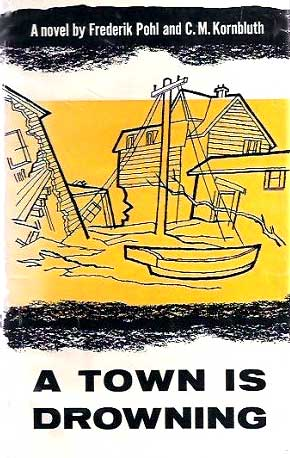

<!-- translated by DeepL -->

# Как будут вести блоги в будущем

Фредерик Пол

## Краткое изложение мудрости Фреда о писательстве, часть 3

Что делают другие

Я уже говорил [**ранее**](/fred-pohl/2010-04-27-fred-s-distilled-writing-wisdom-part-2-collaboration/), что существует множество способов сотрудничества, и это действительно так.

Можно взять то, в чём кто-то другой хорошо разбирается, но не умеет писать; ты просишь его рассказать об этом или дать тебе черновик того, что он хочет сказать, а сам доводишь текст до ладу.  (Я делал что-то подобное для [Иэна Баллантина](https://web.archive.org/web/20131010100808/http://www.nndb.com/people/229/000174704) с парой ранних романов, которые изначально были написаны кем-то другим: [«Отпусти тигров»](https://web.archive.org/web/20131010100808/http://www.coverbrowser.com/image/ballantine-books/707-1.jpg) и [«Бог Первого канала»](https://web.archive.org/web/20131010100808/http://www.leonardshoup.com/shop_image/product/138723.jpg).)

Есть ещё такой вариант, когда считается, что у одного из партнёров идеи лучше, поэтому он пишет что-то вроде наброска сюжета, а другой его дорабатывает.  (Именно так я поступал при написании нескольких не очень удачных рассказов вместе с [**Сирилом Корнблаттом**](/fred-pohl/2009-04-20-cyril/)  и двух, не намного лучших, вместе с [**Айзеком Азимовым**](/fred-pohl/2010-01-25-isaac-part-1-of-i-don-t-know-how-many/) — эти две по-прежнему доступны для тех, кто действительно, действительно хочет их прочитать, в книге Айзека [**«Ранний Азимов»**](/fred-pohl/2010-07-12-basement-and-empire-afterwords/).)

Вообще-то, мне даже нравится брать чужой черновик и доводить его до состояния, пригодного для публикации.  Те девять с лишним книг, которые я написал вместе с [**Джеком Уильямсоном**](/fred-pohl/2010-08-12-jack-the-wonderful-williamson-part-1-of-many/),  создавались примерно так.  Первую из них, [«Подводный флот»](https://web.archive.org/web/20131010100808/http://www.amazon.com/gp/product/B0007E3KBA?ie=UTF8&tag=twtfb-20&linkCode=as2&camp=1789&creative=390957&creativeASIN=B0007E3KBA), он передал мне в виде беспорядочного набора заметок и сцен.  Он пробовал обработать этот материал десятком разных способов, но так и не смог сформировать из него роман, поэтому отдал его мне, чтобы я посмотрел на него свежим взглядом.

Остальные восемь книг мы в основном писали специально в соавторстве,  учитывая, что Джек жил в Нью-Мексико, а я — то в Нью-Джерси, то в Иллинойсе.  Хотя мы и путешествовали вместе время от времени, мы редко садились писать вместе.  Мы обменивались письмами, как правило, в течение нескольких месяцев, обсуждая то, что хотели бы увидеть в книге — например, новую научную теорию (мы извлекли из [гипотезы стационарного состояния](https://web.archive.org/web/20131010100808/http://abyss.uoregon.edu/~js/glossary/steady_state.html) максимум пользы, пока её не опровергли).  А когда мы придумывали все возможные повороты и последствия, Джек, да упокоится его душа, садился и писал полный первый черновик, а потом отправлял его мне.  Потом я много над ним работал, и мы отправляли его издателю.

Самый лучший метод совместной работы, с которым я сталкивался, — это тот, что мы использовали, когда писали с Сирилом Корнблаттом, и мы открыли его совершенно случайно.  Всё было так: Сирил приезжал к нам в дом на берегу реки в Ред-Бэнке, штат Нью-Джерси, где мы держали для него комнату на третьем этаже с собственной ванной, кроватью и пишущей машинкой.  Потом мы с ним ужинали: он выпивал стаканчик-другой, а я пил кофе, и мы болтали о том, что хотели бы увидеть в новой книге — персонажи, ситуации, места действия, всё, что интересовало кого-то из нас.  Когда нам казалось, что идей хватит, чтобы начать писать, мы подбрасывали монету.  Проигравший поднимался наверх к своей печатной машинке и писал первые четыре страницы. Потом он спускался и говорил: «Теперь твоя очередь!» А другой поднимался и писал следующие четыре, и так далее, по очереди, пока мы не доходили до страницы с надписью «Конец».

К этому моменту у нас была целая книга, хотя и не совсем готовая.  Кто-то, обычно я, должен был пройтись по рукописи, исправить ошибки, несоответствия и неудачные формулировки, может, добавить пояснения, переходы и прочее, немного подправить текст, а потом мы отдавали её издателю.

В этой системе был только один недостаток.  Она отлично работала с Сирилом, но совершенно не подходила ни для одного другого писателя в мире.  Я знаю это, потому что пробовал с несколькими, в том числе с несколькими действительно хорошими, но та самая «телепатия», которая позволяла нам с Сирилом быть на одной волне, даже не объясняя точно, в чём заключалась эта «волна», так и не сработала.

За исключением одного писателя, о котором я даже не думал.

После того как мы закончили одну из наших книг — кажется, это была [«Город тонет»](https://web.archive.org/web/20131010100808/http://www.amazon.com/gp/product/B001AITVQU?ie=UTF8&tag=twtfb-20&linkCode=as2&camp=1789&creative=390957&creativeASIN=B001AITVQU), которая не относится к научной фантастике и которую ты, скорее всего, никогда не читал, — Сирил уехал домой, а я работал над какой-то своей книгой и испытывал большие трудности.

«Чёрт возьми», —  жаловался я своей пишущей машинке,  — «Я написал четыре страницы и уже выдохся.  Если бы Сирил был здесь, я бы сказал ему, что теперь его очередь, а сам спустился бы вниз и посмотрел бы матч «Метс»».

И эта идея показалась мне настолько заманчивой, что я выключил пишущую машинку и свет, спустился вниз и посмотрел матч.  Потом я поужинал, помог уложить детей спать и ещё немного посмотрел телевизор.   Потом я сам лег спать. А когда проснулся на следующее утро, сварил себе кофе, отнёс его на третий этаж, снова включил пишущую машинку и перечитал те последние четыре отчаянные страницы.

Я заметил кое-что, чего не ожидал.  У меня по-прежнему не было чёткого представления о том, как именно я хочу закончить рассказ или что должно произойти в сюжете, чтобы дойти до этого.  Но я уже видел, какими должны быть следующие страница или две, и у меня даже появились некоторые подсказки о том, что должно последовать сразу за ними.

Так что я написал эти страницы, а потом откинулся на спинку стула, скрестив руки на животе, и с удовольствием улыбался, глядя на окно и деревья в моём заднем дворе, потому что чувствовал, как в моём животе рождается чудесная новая идея и её тепло распространяется по всему телу.

У меня уже был соавтор, который всегда был под рукой! Это был я сам!

Я писал по четыре страницы каждый божий день, а после четвёртой останавливался и занимался другими делами — писал письма, которые давно нужно было отправить, или оплачивал счета, или косил газон, или собирал ведро шелковицы, или ехал в Нью-Йорк и донимал редакторов, или чистил бассейн, или делал всё, что мне казалось стоящим.  А на следующий день я перечитывала эти четыре страницы и писала ещё четыре, *und so weiter* до скончания веков.

И в общем-то именно этим я и занималась каждый день своей жизни в течение следующих тридцати или сорока лет.

Если ты решишь попробовать систему «четыре страницы в день» и «сотрудничества с самим собой», есть пара моментов, на которые, по-моему, тебе стоит обратить внимание.

Во-первых, если ты решил делать это каждый день, то и делай каждый день.  Не отмазывайся из-за того, что у тебя болит зуб, или ты сегодня днём женишься, или умерла твоя любимая кошка.  Напиши эти четыре страницы, что бы ни случилось.

Нет никакого правила, гласящего, что эти страницы должны быть какими-то особенными. Если у тебя действительно мало времени, можно набирать очень черновой вариант так быстро, как только позволяют пальцы. (И ты удивишься, как часто такой текст оказывается вовсе не безнадёжно плохим.)

Во-вторых, если ты действительно хочешь устроить себе отпуск — скажем, первые две недели июня — я лично бы так не поступил, но ты можешь, если хочешь.  Но решить это нужно заранее, скажем, не позднее середины мая.

Конечно, это мои правила.  Ты можешь придумать свои.  Главное — как только ты их установишь, придерживайся их

И удачи тебе и твоему соавтору!

**Связанные посты:
«Мудрость Фреда о писательском мастерстве»,** [**Часть 1**](/fred-pohl/2009-08-25-fred-s-distilled-writing-wisdom-part-1/), [**Часть 2**](/fred-pohl/2010-04-27-fred-s-distilled-writing-wisdom-part-2-collaboration/),  [**Часть 4**](/fred-pohl/2010-11-12-fred-s-distilled-writing-wisdom-part-4/)

### 12 комментариев

- [Стефан Джонс](https://web.archive.org/web/20131010100808/http://home.comcast.net/~stefan_jones/tan_jacket_lo.jpg) пишет:
Недавно я переслушал старое интервью NPR с Брюсом Стерлингом и Уильямом Гибсоном. Они рассказывали о своём удалённом сотрудничестве над книгой *«Различие в механизмах»*… обмениваясь дискетками, отправленными по Federal Express. Помню, когда я впервые это услышал, это казалось чем-то совершенно революционным.
Эй, а можно было бы переписать «A Town is Drowning» как рассказ о катастрофе, связанной с глобальным потеплением!
[**6 октября 2010 г., 18:15**](/fred-pohl/2010-10-06-fred-s-distilled-writing-wisdom-part-3/)
- [Мишель Сагара](https://web.archive.org/web/20131010100808/http://msagarawest.wordpress.com/) говорит:
Когда я училась в старшей школе в конце 70-х в Торонто, на Queen’s Quay, в районе Харборфронт, проходила серия чтений НФ.  Я ходила туда с друзьями из той же школы, чтобы послушать:  Фреда Пола.
И во время сессии вопросов и ответов на том чтении ты объяснил, что писал по четыре страницы в день — ни больше, ни меньше, каждый день, потому что, хотя роман с первого взгляда казался огромной задачей, четыре страницы в день были вполне по силам.
Когда я начал писать романы, именно этот совет запомнился мне больше всего, хотя к тому моменту я уже собрал огромное количество советов, и именно так я и поступил — и, по-моему, к настоящему моменту я продал двадцать два романа.
Итак:  Это был хороший, дельный совет тогда, это хороший, дельный совет и сейчас, и спасибо тебе  
[**6 октября 2010 г., 20:51**](/fred-pohl/2010-10-06-fred-s-distilled-writing-wisdom-part-3/)
- [Роберт Ноуолл](https://web.archive.org/web/20131010100808/http://www.robertnowall.com/) говорит:
Идея «четыре страницы в день» сработала для меня, хотя я никогда не мог придерживаться этого каждый день, а когда и пытался — обычно не так уж много получалось; и в какой-то мере это ушло в прошлое, когда в мою жизнь вошли текстовые редакторы, и перед глазами у меня был экран, а не лист бумаги.  Сейчас я стараюсь писать по пятьсот слов — но редко получается.
Есть много названий в произведениях Пола и/или Корнблата, которые то и дело всплывали в разговорах, и которые я бы с удовольствием почитал, но так и не читал — среди них «A Town is Drowning».  Мне всё-таки удалось найти несколько, например «Практическая политика» и упомянутый недавно «Тиберий» — но было ещё много других. Вся НФ рано или поздно всплывала.
Мне жаль быть вестником плохих новостей, но команда «Нью-Йорк Метс» начала играть в 1962 году, уже после того, как сожалеемое сотрудничество г-на Пола и г-на Корнблата подошло к концу.  (Впрочем, ты бы всё равно не захотел смотреть тот первый сезон «Метс».  Лучше остановись на 1969 или 1986 годах.)
[**7 октября 2010 г., 8:08**](/fred-pohl/2010-10-06-fred-s-distilled-writing-wisdom-part-3/)
- [Билл Хиггинс — Beam Jockey](https://web.archive.org/web/20131010100808/http://beamjockey.livejournal.com/) говорит:
А посты в блоге считаются?
[**7 октября 2010 г., 14:09**](/fred-pohl/2010-10-06-fred-s-distilled-writing-wisdom-part-3/)
- Чак говорит:
Я обожал эти книги «Подводный…». В пятом классе я прямо-таки срисовал их сюжет для задания по творческому письму.
[**7 октября 2010 г., 15:24**](/fred-pohl/2010-10-06-fred-s-distilled-writing-wisdom-part-3/)
- [Брэдли В. Шенк](https://web.archive.org/web/20131010100808/http://www.webomator.com/) говорит:
Рэймонд Чандлер тоже делал что-то вроде этого: он выделял несколько часов в день, когда должен был писать. Ему не обязательно было писать — но он не позволял себе заниматься ничем другим.  Так что он мог упрямиться и отказываться писать, но тогда ему просто приходилось сидеть и ничего не делать, пока время не истечет.
Когда время заканчивалось, он мог отдохнуть до завтра, а завтра снова садился за работу на следующий раунд.
Конечно, я не уверен, что он рассказывал нам всю правду  .  А учитывая, что в наши дни писательская машинка ещё и музыку играет, и фильмы показывает, и предлагает миллион других отвлекающих факторов, придерживаться такого режима, наверное, стало сложнее, чем когда-либо.
[**7 октября 2010 г., 15:49**](/fred-pohl/2010-10-06-fred-s-distilled-writing-wisdom-part-3/)
- [Shakatany](https://web.archive.org/web/20131010100808/http://shakatany.livejournal.com/) говорит:
Как кстати. Роберт Силверберг только что написал замечательную редакционную статью о Сириле Корнблатте в последнем номере «Азимова». Так жаль, что он умер так молодым, как и Вайнбаум.
[**7 октября 2010 г., 23:14**](/fred-pohl/2010-10-06-fred-s-distilled-writing-wisdom-part-3/)
- Нил из Чикаго говорит:
У Джорджа Бернарда Шоу был замечательный рассказ о том, как он научился писать.  Он был учеником в агентстве недвижимости в Дублине, и через полтора года ему грозила серьезная опасность добиться там успеха.  Поэтому он запаниковал и вернулся жить к маме, которая тогда жила в Лондоне со своим учителем вокала.  

Он решил, что пять страниц в день — это разумный объем, и, отчасти опираясь на привычки, привитые в офисе, писал по пять страниц каждый день в течение следующих пяти лет.  

Через четыре года он написал четыре плохих романа и решил создать трилогию.  Через год он закончил первый том, понял, что уже сказал всё, что хотел, и ушёл — и обрёл ту самую «жизнь», которой он так прославился/прославился.
[**8 октября 2010 г., 6:28 утра**](/fred-pohl/2010-10-06-fred-s-distilled-writing-wisdom-part-3/)
- [wishnevsky](https://web.archive.org/web/20131010100808/http://wishbass.com/) говорит:
Согласен. Я люблю набирать тысячу слов, а потом бросать, если только всё не идёт действительно хорошо. Моя работа не связана с речью, так что иногда идеи приходят ко мне на работе. 
Когда я работал на других, и такое случалось, я звонил на домашний телефон и оставлял записку на автоответчике. 
Это работает.  Может, это и дерьмовые романы, но у меня их пятнадцать или двадцать, и они меня развлекают… Мои 2 000 000 слов хлама.
[**9 октября 2010 г., 9:31**](/fred-pohl/2010-10-06-fred-s-distilled-writing-wisdom-part-3/)
- Марк говорит:
Можно ли сделать межстрочный интервал на этих страницах двойным?
[**13 октября 2010 г., 15:15**](/fred-pohl/2010-10-06-fred-s-distilled-writing-wisdom-part-3/)
- Экстоллагер говорит:
Я никогда не слышал о книге «Город тонет», пока несколько дней назад не увидел здесь её привлекательную обложку.  Заказал её через межбиблиотечный абонемент; сегодня она пришла, и я краду время, чтобы её почитать.  За исключением нескольких нецензурных выражений, которые мне, как христианину, не очень понравились, я считаю, что это «действительно хорошая книга»!   Промежуток в 60 с лишним лет только добавляет колорита эпохи.  Это как смотреть один из тех старых добрых чёрно-белых фильмов с сильным сюжетом и ярким местным колоритом, которые так хорошо выдержали испытание временем по сравнению с некоторыми фильмами, получившими гораздо больше рекламы и похвал.  Я живу в Северной Дакоте, а мой экземпляр по межбиблиотечному абонементу приехал аж из Оклахомы.
[**3 ноября 2010 г., 16:57**](/fred-pohl/2010-10-06-fred-s-distilled-writing-wisdom-part-3/)
- Extollager говорит:
…Но вот вопрос (может, всё прояснится, когда я дочитаю). На страницах 42–43 упоминается финансируемый государством «Центр фильтрации», где наблюдатели следят за самолётами, не соответствующими утверждённым планам полёта.  «За пять лет добровольцы дважды опередили радар [в обнаружении неизвестного самолёта], и лейтенант считал, что эти два случая с лихвой оправдывают затраты на центр и скуку дежурств там». 
О чём тут вообще речь?  Похоже на сценарий холодной войны в очень ближайшем будущем.
[**3 ноября 2010 г., 17:03**](/fred-pohl/2010-10-06-fred-s-distilled-writing-wisdom-part-3/)

[WordPress](https://web.archive.org/web/20131010100808/http://wordpress.org/)
[TWTFB2](https://web.archive.org/web/20131010100808/http://dicksmithsoftware.com/)