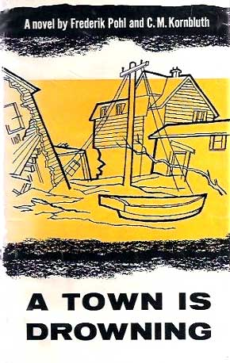

# The Way the Future Blogs

Frederik Pohl

## Fred’s Distilled Writing Wisdom, Part 3

What the Other Guy Does

I said [**earlier**](/fred-pohl/2010-04-27-fred-s-distilled-writing-wisdom-part-2-collaboration/) that there are many, many ways of collaborating, and there are.

There’s taking what somebody else knows all about but has no writing skills; you get him to talk about whatever it is or give you a rough draft of what he has to say and you make it good.  (I did something like that for [Ian Ballantine](https://web.archive.org/web/20131010100808/http://www.nndb.com/people/229/000174704)  with a couple of early novels that had originally been written by someone else, [Turn the Tigers Loose](https://web.archive.org/web/20131010100808/http://www.coverbrowser.com/image/ballantine-books/707-1.jpg) and [The God of Channel One](https://web.archive.org/web/20131010100808/http://www.leonardshoup.com/shop_image/product/138723.jpg).)

There’s the kind where one partner is thought to have the better ideas so he writes a sort of outline of the story and the other fellow fleshes it out.  (Which I did for a number of not very good stories with [**Cyril Kornbluth**](/fred-pohl/2009-04-20-cyril/)  and for two, not that much better, with [**Isaac Asimov**](/fred-pohl/2010-01-25-isaac-part-1-of-i-don-t-know-how-many/) — those two are still available for anyone who really, really wants to read them in Isaac’s book [**The Early Asimov**](/fred-pohl/2010-07-12-basement-and-empire-afterwords/).)

Actually, I rather like taking someone else’s draft and making it publishable.  The nine or so books that I wrote with [**Jack Williamson**](/fred-pohl/2010-08-12-jack-the-wonderful-williamson-part-1-of-many/)  were done more or less that way.  The first of them, [Undersea Fleet](https://web.archive.org/web/20131010100808/http://www.amazon.com/gp/product/B0007E3KBA?ie=UTF8&tag=twtfb-20&linkCode=as2&camp=1789&creative=390957&creativeASIN=B0007E3KBA), he gave to me as a jumble of notes and scenes.  He had worked over the material a dozen different ways without ever having it jell into a novel, so he turned it over to me to get a fresh view on it.

The other eight books we did were mostly written on purpose as collaborations,  bearing in mind that Jack lived in New Mexico and I in either New Jersey or Illinois.  Although we traveled together now and then, we rarely sat down to write together.  What we did was to exchange letters over a period of, usually, some months, talking about something we’d like to see in the book — perhaps a new scientific theory (we got a lot of mileage out of the [steady-state hypothesis](https://web.archive.org/web/20131010100808/http://abyss.uoregon.edu/~js/glossary/steady_state.html) until it was proved wrong).  And when we’d thought up all the complications and implications we could Jack, bless his soul, would sit down and write a complete first draft and mail it to me.  Then I would do a lot of work on it and we’d give it to the publisher.

The absolute best collaboration technique I’ve come across was the one I used when writing with Cyril Kornbluth, and we discovered it by accident.  The way it worked, Cyril would come out to our house on the river in Red Bank, New Jersey, where we kept a room for him on the third floor with his own bath, bed and typewriter.  Then he and I would have dinner, and he would have a drink or two while I had coffee, and we’d chat about what we’d like to see in the new book — characters, situations, settings, whatever interested one of us.  When we thought we had enough to start writing we’d flip a coin.  The loser would go upstairs to his typewriter and write the first four pages.  Then he’d come down and say,  “You’re on!”  And the other guy would go up and write the next four, and so on, turn and about, until we got to the page that said “The End.”

At this point we had a whole book, though not a truly finished product.  Somebody, usually me, had to go over that manuscript and fix errors, incongruities and infelicities, maybe add some explanations and transitions and stuff and do a little polish, and then we’d give it to the publisher.

There was only one thing wrong with this system.  It worked fine with Cyril, and not at all with any other writer in the world.  I know this because I tried with several, including several really good ones, and that sort of telepathy that kept the two of us on message without ever explicating exactly what the message was never materialized.

Except with one writer whom I had never thought of.

After we’d completed one of our books — I think it may have been [A Town is Drowning](https://web.archive.org/web/20131010100808/http://www.amazon.com/gp/product/B001AITVQU?ie=UTF8&tag=twtfb-20&linkCode=as2&camp=1789&creative=390957&creativeASIN=B001AITVQU), which isn’t science fiction and you’ve probably never seen it — Cyril went home, and I was working on some book of my own and having a tough time.

“Oh, hell,”  I complained to my typewriter,  “I’ve done four pages and I’m tired out.  If Cyril were here I’d tell him it was his shift and I’d go downstairs and watch the Mets game.”

And that seemed like such an attractive idea that I turned off the typewriter and the light and went downstairs and watched the game.  Then I had dinner and helped put the kids to bed and watched a little more TV.   Then I went to bed myself.  And when I woke up the next morning, I made myself some coffee and took it up to the third floor and turned the typewriter on again and reread those last four despairing  pages.

I noticed something I hadn’t expected.  I still had no good idea of exactly how I wanted to end the story or what I wanted to happen in the story in order to get there.  But I could see what the next page or two needed to be, and I even had some clues about what should come immediately after them.

So I wrote those pages, and then I sat back with my hands clasped over my abdomen, grinning in pleasure at the window and the trees in my back yard, because I could feel a wonderful new idea being born in my belly and spreading its warmth throughout my body.

I already possessed an always available collaborator!  It was me!

I would write four pages each and every day, and I would stop after the fourth page and do other things — write letters I owed or pay bills ditto or mow the lawn or pick a pail of mulberries or go into New York and bother editors or clean the swimming pool or whatever struck me as worth while.  And then the next day I would read those four pages and write four more, *und so weiter* to the end of time.

And basically that’s what I did, every day of my life, for the next thirty or forty years.

If you decide you’d like to try the four-pages-a-day, collaborate-with-yourself system for yourself, there are a couple of things I think you will want to watch out for.

First, if you decide to do it every day, then you have to do it every day.  Don’t let yourself off because you’ve got a toothache or you’re getting married that afternoon or your favorite cat died.  Do those four pages no matter what.

There is no rule that says that those pages have to be any good.  If you’re really pressed for time you’re allowed to type very rough draft as fast as your fingers will move.  (And you’ll be surprised to see how often that copy turns out not to be hopelessly bad after all.)

Second, if you really want to give yourself a vacation — say the first two weeks in June — I personally wouldn’t do it, but you may if you wish.  But you should decide on that ahead of time, say no later than maybe the middle of May.

These are of course my rules.  You can make up your own.  The important thing to do is, once they are made, stick to them

And good luck to you and your collaborator!

**Related posts:
Fred’s Distilled Writing Wisdom,** [**Part 1**](/fred-pohl/2009-08-25-fred-s-distilled-writing-wisdom-part-1/), [**Part 2**](/fred-pohl/2010-04-27-fred-s-distilled-writing-wisdom-part-2-collaboration/),  [**Part 4**](/fred-pohl/2010-11-12-fred-s-distilled-writing-wisdom-part-4/)

### 12 Comments

- [Stefan Jones](https://web.archive.org/web/20131010100808/http://home.comcast.net/~stefan_jones/tan_jacket_lo.jpg) says:
I recently re-listened to an old NPR interview with Bruce Sterling and William Gibson. They talked about their long-distance collaboration on *The Difference Engine* . . . swapping floppy disks mailed by Federal Express. I recall that seeming very cutting edge back when I first heard it.
Hey, you COULD rewrite “A Town is Drowning” as a global warming disaster story!
[**October 6, 2010, 6:15 pm**](/fred-pohl/2010-10-06-fred-s-distilled-writing-wisdom-part-3/)
- [Michelle Sagara](https://web.archive.org/web/20131010100808/http://msagarawest.wordpress.com/) says:
When I was in high school in the late 70s in Toronto, there was an SF reading series down at Queen’s Quay, at the Harborfront.  I went with friends from the same school to listen to:  Fred Pohl.
And during the question-and-answer part of that reading, you explained that you wrote four pages a day, not more and not less, every day, because while a novel at a distance seemed like a huge task, four pages a day was totally within reach.
When I started to write novels, that was the advice that I most remembered, although I’d collected an enormous amount of advice by that point, and that was what I did and I think by this point I’ve sold twenty-two novels.
So:  It was good solid advice then, it is good solid advice now, and thank you  
[**October 6, 2010, 8:51 pm**](/fred-pohl/2010-10-06-fred-s-distilled-writing-wisdom-part-3/)
- [Robert Nowall](https://web.archive.org/web/20131010100808/http://www.robertnowall.com/) says:
The idea of “four pages a day” worked for me, though I could never keep it up every day, and usually not that much when I did—and, to an extent, it died when word processing came into my life and it was the screen before me, and not a piece of paper.  Right now I try for a consistent five hundred words—but rarely manage that.
There are a lot of titles, in the works of Pohl and / or Kornbluth, that have come up here and there, that I would’ve loved to see but never have—”A Town is Drowning” among them.  I did turn up a few, like “Practical Politics” and the mentioned-awhile-ago “Tiberius”—but there were plenty of others.  All the SF turned up, at one time or another.
I regret to be the bearer of bad news, but the New York Mets started play in 1962, well after the regrettable end of the collaboration of Mr. Pohl and Mr. Kornbluth.  (You wouldn’t've wanted to watch that first Mets season anyway.  Stick with 1969 or 1986.)
[**October 7, 2010, 8:08 am**](/fred-pohl/2010-10-06-fred-s-distilled-writing-wisdom-part-3/)
- [Bill Higgins-- Beam Jockey](https://web.archive.org/web/20131010100808/http://beamjockey.livejournal.com/) says:
Do blog postings count?
[**October 7, 2010, 2:09 pm**](/fred-pohl/2010-10-06-fred-s-distilled-writing-wisdom-part-3/)
- Chuk says:
I loved those *Undersea…* books. I totally ripped off the setting for a creative writing exercise back in fifth grade.
[**October 7, 2010, 3:24 pm**](/fred-pohl/2010-10-06-fred-s-distilled-writing-wisdom-part-3/)
- [Bradley W. Schenck](https://web.archive.org/web/20131010100808/http://www.webomator.com/) says:
Raymond Chandler said that did something sort of like this, too:  he set aside a few hours in the day when he was to write.  He didn’t have to write – but he didn’t allow himself to do anything else.  So he could be stubborn and refuse to write, but then he’d just have to sit there and do nothing at all until the time was up.
When that time was over he was off till tomorrow, when he’d sit himself down again for the next round.
I’m not sure he was telling us the exact truth, of course  .  And since these days a writer’s writing machine also plays music and shows movies and offers a gazillion other distractions it might be harder than ever to keep to it.
[**October 7, 2010, 3:49 pm**](/fred-pohl/2010-10-06-fred-s-distilled-writing-wisdom-part-3/)
- [Shakatany](https://web.archive.org/web/20131010100808/http://shakatany.livejournal.com/) says:
How timely. Robert Silverberg just wrote a wonderful editorial on Cyril Kornbluth in the latest issue of Asimov’s. So sad he died so young like Weinbaum.
[**October 7, 2010, 11:14 pm**](/fred-pohl/2010-10-06-fred-s-distilled-writing-wisdom-part-3/)
- Neil in Chicago says:
George Bernard Shaw had a wonderful account of how he learned writing.  He\’d been apprenticed in a real estate office in Dublin, and after a year and a half he was in serious danger of being successful at it.  So he freaked out, and moved back in with his mother, who was in London living with her voice teacher.  

He decided that five pages a day was a reasonable output, so, bolstered in part by the habits from the office, he wrote five pages every single day for the next five years.  

At the end of four years, he’d written four bad novels, and decided to write a trilogy.  A year later, he’d finished the first volume, realized he’d already said everything he had to say, and went out and Got a Life, the one he’d notorious/famous for.
[**October 8, 2010, 6:28 am**](/fred-pohl/2010-10-06-fred-s-distilled-writing-wisdom-part-3/)
- [wishnevsky](https://web.archive.org/web/20131010100808/http://wishbass.com/) says:
I agree. I like to get a thousand words, and then quit, unless it is going real well. My job is non-verbal, so sometimes things come to me at work. 
When i worked for other people, and that happened, i would call my home phone and leave a note on the answering machine. 
It works.  These may be crappy novels, but i have fifteen or twenty of them, and they amuse me.. My 2,000,000 words of garbage.
[**October 9, 2010, 9:31 am**](/fred-pohl/2010-10-06-fred-s-distilled-writing-wisdom-part-3/)
- Mark says:
Can we double-space these pages?
[**October 13, 2010, 3:15 pm**](/fred-pohl/2010-10-06-fred-s-distilled-writing-wisdom-part-3/)
- Extollager says:
I had never heard of A Town is Drowning till seeing the eye-catching dust jacket here a few days ago.  Put in an interlibrary loan request for it; it arrived today and I’ve been stealing some time to read it.  Barring some profanity that this Christian reader wasn’t comfortable with, I’m finding it a “real good read”!   The lapse of 60 years or so just adds period-detail zest.  It’s like watching one of those good old black and white story-oriented movies with lots of local color, which have held up so well compared to some movies that got a lot more publicity and praise.  I’m in North Dakota and my ILL copy came all the way from Oklahoma.
[**November 3, 2010, 4:57 pm**](/fred-pohl/2010-10-06-fred-s-distilled-writing-wisdom-part-3/)
- Extollager says:
…But here’s a question (maybe it will become clearer as I read on).  On pages 42-43 there’s a government-funded “Filter Center” in which watchers keep an eye open for aircraft that don’t conform to recognized flight plans.  “Twice in five years the volunteers had beaten the radar [to spotting an unrecognized plane), and the lieutenant considered those two times well worth the cost of the center and the boredom of duty there.” 
What’s this all about?  It sounds like a very-near-future Cold War scenario.
[**November 3, 2010, 5:03 pm**](/fred-pohl/2010-10-06-fred-s-distilled-writing-wisdom-part-3/)

[WordPress](https://web.archive.org/web/20131010100808/http://wordpress.org/)
[TWTFB2](https://web.archive.org/web/20131010100808/http://dicksmithsoftware.com/)