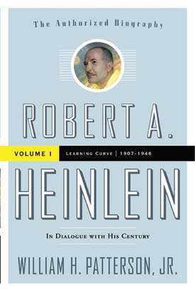

<!-- translated by DeepL -->

# Как будут вестись блоги в будущем

Фредерик Пол

## Роберт Хайнлайн, мы тебя и не знали

[Роберт Хайнлайн:
«В диалоге со своим веком: Том 1,
Кривая обучения, 1907–1948»](https://web.archive.org/web/20131011054235/http://www.amazon.com/gp/product/0765319608?ie=UTF8&tag=twtfb-20&linkCode=as2&camp=1789&creative=390957&creativeASIN=0765319608)  

**Автор: Уильям Х. Паттерсон**  

(Издательство Tor, твёрдый переплёт, 29,99 долларов).

Когда я читаю биографию человека, которого хорошо знал, сначала обращаю внимание на две вещи.  Во-первых, на фактические ошибки, и я рад отметить, что в подробном и тщательно проработанном исследовании Паттерсона их практически нет.  Второй момент — более личный.  Это открытие новых фактов о поведении героя, о которых ты и не догадывался, особенно когда они касаются тебя самого.  В книге *Learning Curve* я действительно нашел пару таких моментов.

Я был почти уверен, что [**Роберт Хайнлайн**](/fred-pohl/2010-05-03-working-with-robert-a-heinlein/) считал меня хорошим редактором — иначе он бы никогда не переписал некоторые свои рассказы в соответствии с моими требованиями, особенно за те жалкие гонорары, которые я мог ему заплатить.  Но я не знал, пока не прочитал об этом в книге, что Роберт был так расстроен, когда я  ушёл из компании, что попросил  своих нью-йоркских друзей выяснить, не уволили ли меня несправедливо, написав:  «Если он» — то есть я — «попал с ними в неприятную ситуацию и хочет, чтобы его друзья их бойкотировали, я не хочу с ними иметь дело».    Я и понятия не имел об этом, и должен признаться, что был тронут, когда прочитал это в книге Паттерсона.

Ещё я узнал там одну вещь, о которой даже не подозревал: в письмах к друзьям Хайнлайн называл меня «Фредди».  Это стало ещё большим сюрпризом.  Прошло уже около года с тех пор, как я впервые об этом узнал.  Я пока не решил, нравится мне это или нет.

*   *   *

Книга Паттерсона начинается с самого начала — а может, даже чуть раньше настоящего начала — жизни Роберта Хайнлайна, с рассказа о его родителях и дедушках с бабушками. Конечно, это интересно лишь в той мере, в какой это помогло сформировать самого Хайнлайна.  На самом деле, судя по рассказу Паттерсона, Роберт ничем особо не отличался от любого другого ребёнка из Среднего Запада, выросшего в семье с ограниченными доходами, и одна из вещей, которые я больше всего ценю в Паттерсоне, — это то, с какой лёгкостью он проносит нас через страницы генеалогии.  Именно когда сам Роберт успешно добивается зачисления в Военно-морскую академию США, его жизнь начинает отличаться от жизни других.

Даже тот, кто никогда не читал ни слова о Хайнлайне, оценит книгу Паттерсона за то, как он описывает жизнь курсанта.  Это был непростой период в жизни Роберта, ведь любой старшекурсник мог в любой момент потребовать от него внимания — и если он чем-то не устраивал старшекурсника или тому просто так вздумалось — наказанием была хорошая порка по заднице деревянной палкой.

Роберт хорошо учился в академии, но не прошел ожидаемый путь, чтобы стать настоящим офицером ВМФ. Сначала его подвели глаза, а потом и другие части тела (самыми известными из которых были те, о которых он шутил, называя их своими «астероидами»). Ему так и не довелось сражаться во Второй мировой войне, но военные годы он провёл, работая в эксцентричной исследовательской группе на [**Филадельфийской военно-морской верфи**](/fred-pohl/2010-01-31-isaac-part-2-of-many/) вместе с [**Айзеком Азимовым**](/fred-pohl/2010-01-25-isaac-part-1-of-i-don-t-know-how-many/), [Л. Спрэг де Камп](https://web.archive.org/web/20131011054235/http://www.lspraguedecamp.com/bio.html) и женщиной-офицером ВМФ по имени [**Вирджиния Герстенфельд**](/fred-pohl/2010-05-21-the-wives-and-drives-of-robert-heinlein-ginny/), которая, как всем хорошо известно, вскоре стала миссис Роберт Хайнлайн.

Один из вопросов, на который замечательная книга Паттерсона так и не дала мне ответа, заключался в том, как именно Роберт так решительно переключил свои чувства с [**Леслин**](/fred-pohl/2010-05-19-the-wives-and-drives-of-robert-heinlein-leslyn/), которая была женой № 2, на Джинни, ставшую в итоге женой № 3 и последней.  (Я не намеренно высмеиваю многобрачие Хайнлайна; как знают все, кто меня хоть немного знает, я не в том положении, чтобы так поступать.)

Признаюсь, я никогда особо не любила Джинни, да и она меня тоже, но поскольку мы обе любили Роберта, мы поддерживали вежливые отношения.  Но я хотела бы узнать больше о том, как Леслин заменила Джинни.  Конечно, нет сомнений, что Леслин была алкоголичкой и склонна к приступам плохого поведения.  Может, это и всё, что нужно знать.  Но практически всё, что мы знаем об этих событиях, — это то, что рассказывает нам Джинни.  Мне бы очень хотелось услышать версию Леслин, и я чувствую себя виноватым из-за этого, потому что Леслин действительно просила у меня сочувствия, а я, не желая ввязываться в личные дела, отговаривал её от писем, пока она не сдалась.

Ну, ладно.  В любом случае, прочитай книгу.  Уверен, тебе понравится.  Мне понравилась.

### 10 комментариев

- [Роберт Ноуолл](https://web.archive.org/web/20131011054235/http://www.robertnowall.com/) говорит:
Биография Хайнлайна оправдала все ожидания — я с нетерпением ждал её с тех пор, как узнал о её существовании прямо здесь, на этом сайте. Многие мифы и легенды были развенчаны. Тенденция брать фразы из более поздней эпохи в качестве названий глав раздражала, но с этим можно было смириться.
Мне очень понравилось, как в книге разобрались с ранней политической карьерой Хайнлайна.  Когда кто-то сначала выглядит ультралибералом, а потом — ультраконсерватором, без каких-либо объяснений — а Хайнлайн, конечно, всегда тщательно оберегал свою частную жизнь и не был из тех, кто даёт объяснения, — ну, тогда возникают вопросы.
Эта книга всё прояснила — разница между этими двумя позициями оказалась не такой уж большой, как предполагалось.  Если дать Хайнлайну право переосмыслить свои прежние взгляды, всё становится понятным.  Помню, как Вирджиния Хайнлайн где-то говорила, что дело не столько в том, что изменился сам Хайнлайн, сколько в том, что изменился мир вокруг него.
(Наверное, это высказывание будет во втором томе. С нетерпением жду, когда смогу *его* прочитать, когда бы он ни вышел.)
*****
Кстати, во всех книжных магазинах, где я побывал с момента выхода книги, за исключением одного, её выставили на полках с книгами НФ, а не в разделе биографий. Наверное, её читатели будут искать её именно там… но я не видел, чтобы другие литературные биографии выставляли рядом с книгами тех же авторов.  (Например, недавно вышедшая книга о Чарли Чане и Эрле Дер Биггерсе оказалась в разделе биографий.)  Скрытое предубеждение по отношению к жанру?  Или, может, издательство Tor Books просто так захотело?
[**21 октября 2010 г., 7:39 утра**](/fred-pohl/2010-10-20-robert-heinlein-we-never-knew-ye/)
- Джефф Билер говорит:
Роберт:
«Кстати, во всех книжных магазинах, где я был с момента выхода книги, за исключением одного, её выставили на полках с книгами НФ, а не в разделе биографий».
Это соответствует библиотечной практике, согласно которой биографии размещают в разделе, посвящённом профессиональной деятельности человека, о котором идёт речь.
[**21 октября 2010 г., 10:24 утра**](/fred-pohl/2010-10-20-robert-heinlein-we-never-knew-ye/)
- Р. Брюс пишет:
Издательство Tor вообще ничего не понимает, кроме НФ, так что неудивительно, что их представители и магазины размещают эту биографию в разделе НФ.
[**21 октября 2010 г., 12:07**](/fred-pohl/2010-10-20-robert-heinlein-we-never-knew-ye/)
- Тери пишет:
В Википедии сказано: «В 1929 году он женился на Элеоноре Карри из Канзас-Сити в Лос-Анджелесе, штат Калифорния»[8], но этот брак продлился всего около года[4]. Вскоре, в 1932 году, он женился на своей второй жене, Леслин Макдональд. 
Я ещё не читал биографию Хайнлайна, написанную Паттерсоном, но теперь, по твоей рекомендации, скоро её куплю.  
Спасибо за всё, что ты делаешь.
[**22 октября 2010 г., 8:43**](/fred-pohl/2010-10-20-robert-heinlein-we-never-knew-ye/)
- [Билл Паттерсон](https://web.archive.org/web/20131011054235/http://www.whpattersonjr.com/) пишет:
Так получилось, что на этой неделе я в Вашингтоне по поводу книги — чтобы поговорить с представителями Института Като и Управления по науке и технологиям Министерства внутренней безопасности (а также побывать на Capclave), и у меня была возможность заглянуть в книжный магазин Borders в центре Вашингтона — кажется, на углу 18-й улицы и L, или где-то рядом.  Книга стояла исключительно в разделе биографий, а в разделе НФ её не было.  В магазине B&N, который находится ближе всего к моему дому в Лос-Анджелесе, раздел биографий расположен прямо рядом с разделом НФ, так что можно было переходить от одного стола к другому.  А вот в Вашингтоне они находятся на совершенно разных уровнях книжного магазина.
[**22 октября 2010 г., 20:06**](/fred-pohl/2010-10-20-robert-heinlein-we-never-knew-ye/)
- [Роберт Ноуолл](https://web.archive.org/web/20131011054235/http://www.robertnowall.com/) говорит:
«Это соответствует библиотечной практике, согласно которой биографии размещают в тематическом разделе, посвящённом профессиональной деятельности человека, о котором они рассказывают».
К сожалению, я не припомню, чтобы так делали в какой-либо библиотеке, где я бывал.
К тому же, когда искал Хайнлайна в разделе биографий, не мог не заметить одну-две биографии Хемингуэя… их же не выставляют рядом с *его* художественными произведениями…
У некоторых было по два экземпляра… почему бы не разложить по одному в каждом разделе?
[**25 октября 2010 г., 5:15 утра**](/fred-pohl/2010-10-20-robert-heinlein-we-never-knew-ye/)
- Джонкил говорит:
Меня тоже беспокоило, насколько эта книга была привязана к точке зрения Р. А. Х. и Джинни.  Ещё один пример: Хайнлайну приписывают предсказание событий в Перл-Харборе в 1941 году — при этом ссылаются на разговор с ним, который состоялся *в 1973 году*. Было бы полезно, если бы в биографии упомянули о том, что люди часто с течением времени «украшают» свои воспоминания.
[**26 октября 2010 г., 12:47**](/fred-pohl/2010-10-20-robert-heinlein-we-never-knew-ye/)
- [Роберта X](https://web.archive.org/web/20131011054235/http://iworkonastarship.blogspot.com/) говорит:
Думаю, имеет смысл разместить биографию Р. А. Хайнлайна там, где её увидят читатели НФ.  Мой экземпляр появился в одном из тех списков «на основе книг, которые ты покупал раньше…» на сайте интернет-магазина, что, по сути, то же самое.  (А потом мой парень прислал мне экземпляр с автографом, ооооо).
     Мне очень интересно, как наш ведущий подходит к этой теме.  Даже самое тщательное исследование не сравнится с тем, чтобы просто оказаться там в тот момент.
[**27 октября 2010 г., 6:37 утра**](/fred-pohl/2010-10-20-robert-heinlein-we-never-knew-ye/)
- Дейл Дитцман говорит:
Не придавай слишком большого значения тому, что Роберт предсказал Перл-Харбор. Он был далеко не единственным. Профессиональные морские офицеры как в ВМС США, так и в японских ВМС считали войну неизбежной; Роберт был опытным, профессиональным морским офицером (хотя его и вынудили уйти в отставку); и когда они изучали карту Тихого океана в том виде, каким она была в 1941 году, Перл-Харбор был ОЧЕВИДНОЙ целью для удара. Если хочешь по-настоящему увлекательно взглянуть на войну с точки зрения Императорского флота Японии, прочитай книгу «Japanese Destroyer Captain» — биографию одного из лучших командиров, которые когда-либо были в Императорском флоте Японии. Вероятно, она уже не издаётся, но ты сможешь найти подержанный экземпляр.
[**8 июля 2011 г., 13:45**](/fred-pohl/2010-10-20-robert-heinlein-we-never-knew-ye/)
- Дейл Дитцман говорит:
Джонквил, как уже упоминалось выше, среди «осведомлённых» людей не считалось чем-то Astounding предсказать, что США вступят во Вторую мировую войну или что она начнётся с японского нападения на Перл-Харбор. Прочитай книгу «Шпион и контршпион», где человек, частично послуживший прототипом Джеймса Бонда, передал правительству США (а точнее, лично Дж. Эдгару Гуверу) список вопросов, по которым немцы хотели получить разведданные. Половина из них касалась безопасности в Перл-Харборе, а у немцев там не было никаких агентов. Это было за 6 месяцев до нападения.
[**30 января 2012 г., 7:11 утра**](/fred-pohl/2010-10-20-robert-heinlein-we-never-knew-ye/)

[WordPress](https://web.archive.org/web/20131011054235/http://wordpress.org/)
[TWTFB2](https://web.archive.org/web/20131011054235/http://dicksmithsoftware.com/)