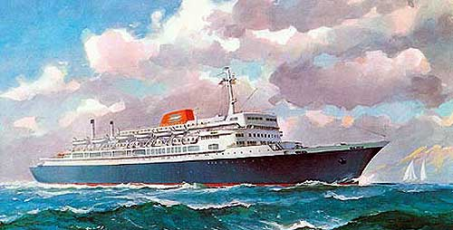

<!-- translated by Yandex Translate -->

# Путь к блогам будущего

Фредерик Пол

## Корабль глупости, часть 2

Чудесное, чудесное путешествие

Итак, мы, пара сотен человек, отправились в круиз.  Каждый день мы останавливались на другом потрясающе красивом острове.  Кто-нибудь из нас мог бы сойти на берег.  Большинство осталось на корабле, потому что именно там было веселее всего, особенно за обедом.

Мы быстро распределились по столам, из которых лучшим, по крайней мере, если судить по количеству исходящего от него смеха, был [** Айзека Азимова**](/posts/2010-01-25-isaac-part-1-of-i-don-t-know-how-many/).  Айзек проводил утро и вторую половину дня в своей каюте, занимаясь писательством. Всякий раз, проходя мимо его двери, вы слышали непрерывный стук мыслей, превращаемых на его портативной пишущей машинке в страницы для будущей книги.  Работа, которую Айзек писал на той неделе, была [сокровищницей юмора Айзека Азимова](https://web.archive.org/web/20150925212942/http://www.amazon.com/gp/product/0395572266?ie=UTF8&tag=twtfb-20&linkCode=as2&camp=1789&creative=390957&creativeASIN=0395572266), и у него вошло в привычку пробовать шутки за обеденным столом, прежде чем вставить их в свой текст.

Мне не разрешили присоединиться к столику Айзека, потому что в то время я все еще неисправимо курил, а больше никто за тем столом этого не делал.  Это не было суровым наказанием.  Было много других интересных людей, с которыми можно было пообедать, хотя, правда, одна или две знаменитости не появлялись.  [Норман Мейлер](https://web.archive.org/web/20150925212942/http://normanmailersociety.org/about/), насколько я знаю, никогда не покидал своей каюты, вероятно, ему приносили еду.  [Кэтрин Энн Портер](https://web.archive.org/web/20150925212942/http://www.lib.umd.edu/Guests/KAP/) мы тоже нечасто видели, но я предположил, что это просто потому, что в ее преклонном возрасте — ей было восемьдесят два - она, естественно, проводила большую часть своих дней в постели.  (Удивительно, как с течением времени меняются наши предположения.)

На самом деле в огромном обеденном зале корабля было так мало занятых столиков, что разговоры часто велись с участниками сразу за несколькими столиками.  Времени для разговоров было предостаточно, поскольку за один присест на официантов или посетителей не давили, требуя освободить помещение для следующей смены.

Затем, покончив с едой, мы разбрелись кто куда.  Кто-то отправился в бассейн или тренажерный зал, кто-то в казино, кто-то в свои домики или вообще на любую удобную плоскую поверхность, чтобы вздремнуть.  Поскольку мы все согласились выступить с докладами по поводу наших билетов, мы все-таки разместились, по одному или по двое за раз, в общественных залах корабля.  Для писателей среди нас это в основном заключалось в том, чтобы рассказывать каждому, кто приходил, над чем мы в данный момент работаем, и отвечать на вопросы.  Ученые и представители средств массовой информации, как правило, собирали больше людей и вели более интересные дискуссии.   Потом ужин, более или менее похожий на ланч, а потом были вечеринки в номере.

Каюты у всех были примерно одинакового размера, и ни одна из них не была большой.  Компания из более чем полудюжины человек неизбежно выплескивалась в коридоры (или, правильнее сказать, в переходы, поскольку мы, в конце концов, были на корабле.) [** Вечеринка Хайнлайна](/posts/2010-05-03-working-with-robert-a-heinlein/) всегда выходила за рамки.  У [Карла Сагана](https://web.archive.org/web/20150925212942/http://www.carlsagan.com/), хотя в нем участвовало примерно столько же людей, этого не произошло, потому что Карл настаивал на том, чтобы держать дверь закрытой.

Большинство вечеринок в номере включали в себя относительно небольшое количество выпивки, обычно в виде бутылочного пива BYOB из корабельного бара.   Однако несколько вечеринок в номерах имели другую тематику и рекламировали любому человеку в мире, у которого был нос, что они предлагают другой вид одурманивающего средства.  Для тех из вас, кто слишком молод, чтобы помнить, это был конец освободительных 1960-х, когда многое из того, что было аморальным, стало дозволенным.  Однако я не видел никаких признаков каких-либо более тяжелых наркотиков, чем марихуана, и было очень мало завсегдатаев вечеринок, которые позволяли себе значительно напиться..

Ближе всего к серьезной выпивке на корабле было в баре на верхней палубе.  Это давало гораздо больше места, позволяя проводить более крупные вечеринки или даже несколько отдельных вечеринок одновременно.  Был доступен значительно расширенный выбор предпочитаемых напитков, и иногда нам составлял компанию корабельный офицер, который заканчивал дежурство на соседнем мостике и был рад поболтать с нами.

Офицеры часто были голландского происхождения, и они познакомили нас с тем, о чем большинство из нас вряд ли когда-либо слышали, - с удовольствиями голландского джина, или [женевера](https://web.archive.org/web/20150925212942/http://www.starchefs.com/wine/starspirits/html/dutch_gin/index.shtml).  Почти всем нам было предложено попробовать этот новый напиток от производителей с такими именами, как Damrak и Boomsma, и его фруктовый вкус, и мы сделали это с таким энтузиазмом, что за два острова круиза выпили все запасы женевера на корабле досуха.

Ладно, хватит рассказывать тебе о том, чего у тебя не может быть.  Просто представьте, что вы на лучшем конвенте, который вы когда-либо посещали, только на нем меньше людей, чем обычно, и он длится в два раза дольше.  И происходит это не в отеле в каком-нибудь незнакомом городе, а на борту примерно двадцати тысяч тонн стали, которая, пыхтя, рассекает голубые воды под благоухающим небом.  Соедините их с множеством развлекательных компаньонов, доступных почти круглосуточно, и вы получите полную картину.

Жаль, что Джеку, Джо и Джиму пришлось это пропустить.

*Продолжение следует.*

**Связанные должности:**

- ** Корабль глупости,** [** Часть 1**](/posts/2010-11-22-the-ship-of-foolishness-part-1-the-foreplay/), [** Часть 3**](/posts/2010-11-24-the-ship-of-foolishness-part-3-apollo-17/)
- [** Жены (и движущие силы) Роберта Хайнлайна, часть 1**](/posts/2010-05-17-the-wives-and-drives-of-robert-heinlein-part-1/)
- [** Исаак, часть 7**](/posts/2010-11-15-isaac-part-7/)

### Один комментарий

- ману говорит:
Я подумал, Фреду понравилась бы эта статья – это как если бы реальность встречалась с вымыслом – казалось бы, Зигги Фон Шринк не так уж далек от будущего

[http://www.nytimes.com/2010/11/23/science/23avatar.html](https://web.archive.org/web/20150925212942/http://www.nytimes.com/2010/11/23/science/23avatar.html)
[**23 ноября 2010, 18:31 вечера**](/posts/2010-11-23-the-ship-of-foolishness-part-2/)

[WordPress](https://web.archive.org/web/20150925212942/http://wordpress.org/)
[TWTFB2](https://web.archive.org/web/20150925212942/http://dicksmithsoftware.com/)